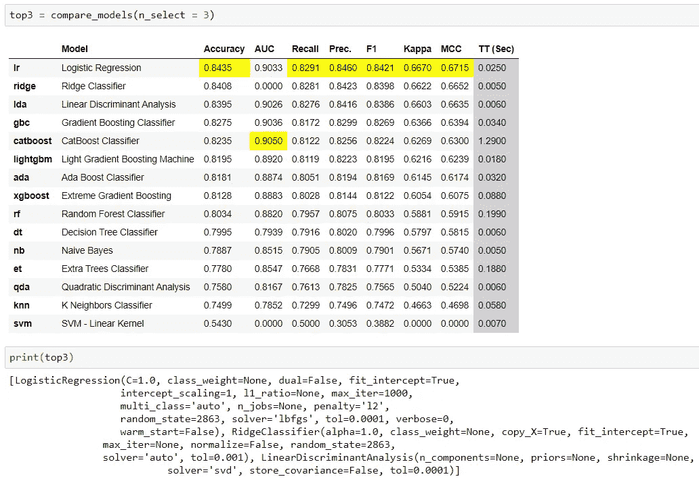
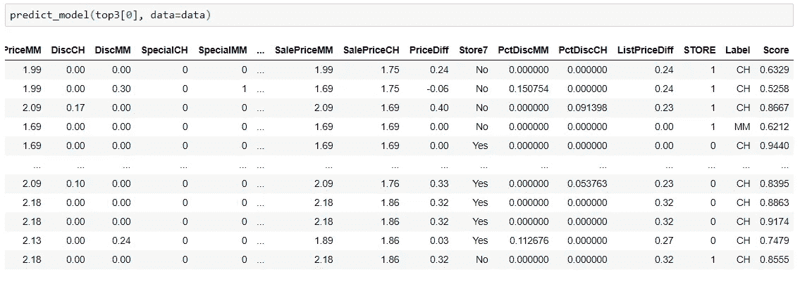
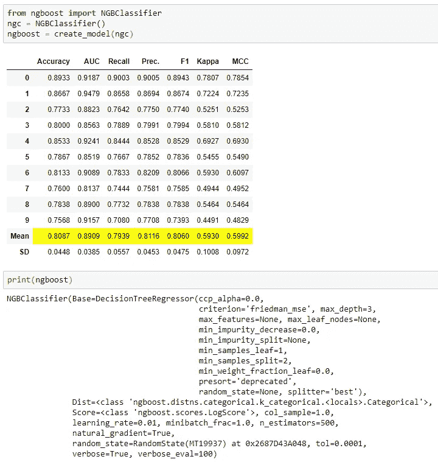
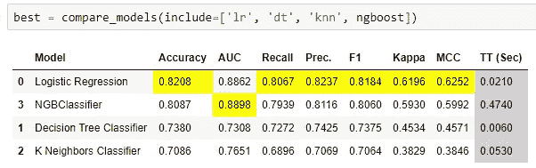
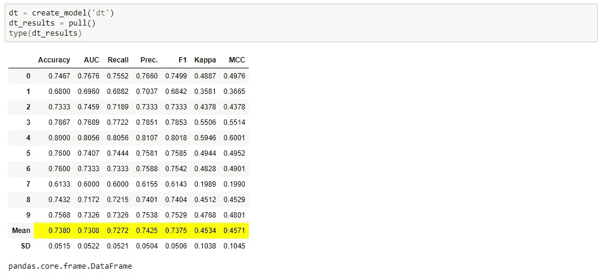
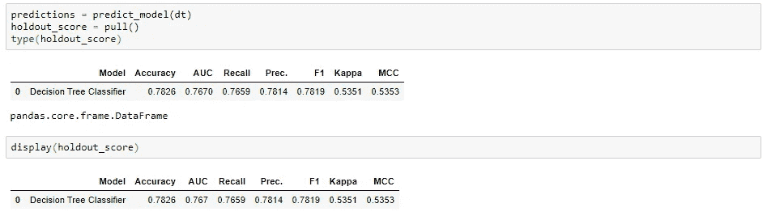
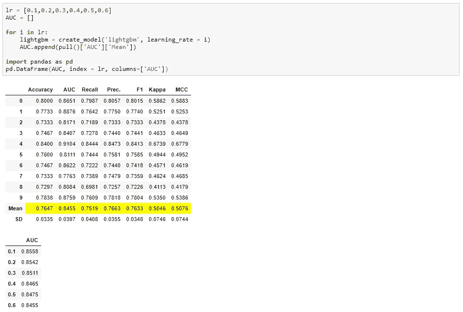
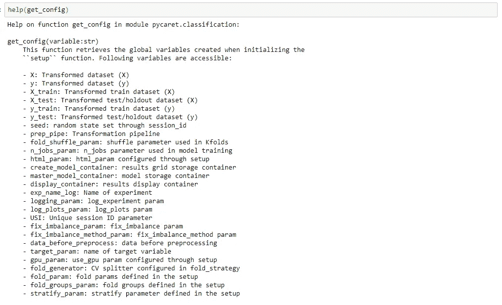
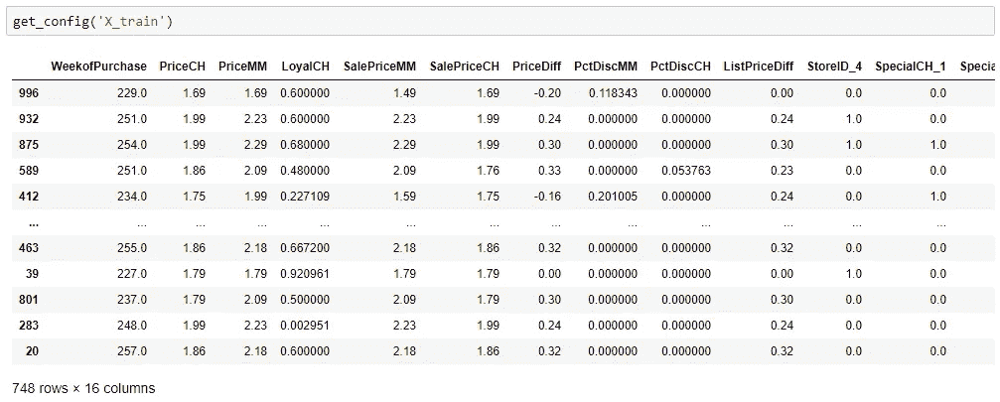
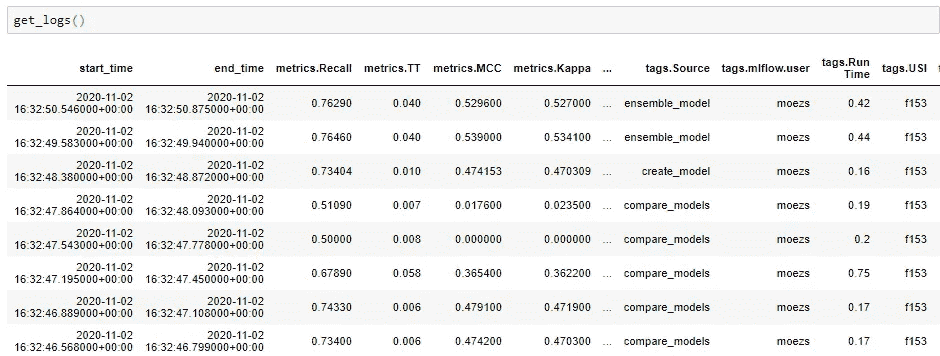

# PyCaret 中你做错的 5 件事

> 原文：<https://towardsdatascience.com/5-things-you-are-doing-wrong-in-pycaret-e01981575d2a?source=collection_archive---------6----------------------->

## 来自 PyCaret 的创造者


本·怀特在 [Unsplash](https://unsplash.com?utm_source=medium&utm_medium=referral) 上的照片

# PyCaret

PyCaret 是一个用 Python 编写的开源、低代码的机器学习库，可以自动化机器学习工作流。它是一个端到端的机器学习和模型管理工具，可以加快机器学习实验周期，让你更有效率。

与其他开源机器学习库相比，PyCaret 是一个替代的低代码库，可以用来替换数百行代码。这使得实验快速有效。

官方:【https://www.pycaret.org】T4

文件:[https://pycaret.readthedocs.io/en/latest/](https://pycaret.readthedocs.io/en/latest/)

https://www.github.com/pycaret/pycaret

# 👉compare_models 做的比你想的更多

当我们在 2020 年 4 月发布 py caret 1.0 版本时， **compare_models** 函数正在比较库中的所有模型，以返回平均的交叉验证性能指标。在此基础上，您可以使用 **create_model** 来训练性能最佳的模型，并获得可用于预测的训练模型输出。

这种行为后来在 2.0 版中有所改变。 **compare_models** 现在根据 **n_select** 参数返回最佳模型，该参数默认设置为 1，这意味着它将返回最佳模型(默认)。


比较模型(n_select = 1)

通过将默认的 **n_select** 参数更改为 3，您可以获得前 3 个模型的列表。例如:



比较模型(n_select = 3)

返回的对象是训练好的模型，你真的不需要再调用 **create_model** 来训练它们。如果愿意，您可以使用这些模型来生成诊断图，甚至将其用于预测。例如:



预测模型函数

# 👉你认为你仅限于 scikit-learn 模型

我们收到很多请求，要求将非 *scikit-learn* 模型包含在模型库中。很多人没有意识到，你并不仅限于默认的模式。 **create_model** 函数除了接受模型库中可用模型的 ID 外，还接受未训练的模型对象。只要你的对象与*scikit-learn*fit/predict API 兼容，它就能正常工作。例如，这里我们通过简单地导入未训练的 NGBClassifier，从 [ngboost](https://github.com/stanfordmlgroup/ngboost) 库中训练并评估了 ***NGBClassifier*** :



使用外部模型创建模型

也可以通过 **compare_models** 的 **include** 参数中的未训练模型，就可以正常工作了。



将模型与未训练的对象进行比较

请注意，包含参数包括来自模型库的三个未训练模型的 ID，即逻辑回归、决策树和 K 个邻居以及来自 ngboost 库的一个未训练对象。另外，请注意，索引表示在 include 参数中输入的模型的位置。

# 👉你不知道 pull()函数

所有训练功能(创建模型、调整模型、集合模型等。)显示一个乐谱网格，但它不返回乐谱网格。因此，你不能在一个像 pandas.DataFrame 这样的对象中存储分数网格。但是，有一个名为 **pull** 的函数允许你这样做。例如:



带 create_model 的拉函数

当您使用 **predict_model** 函数时，这也适用于维持分数网格。



带预测模型的拉函数

现在，您可以像熊猫一样访问指标。DataFrame，你可以创造奇迹。例如，您可以创建一个循环来训练具有不同参数的模型，并使用以下简单代码创建一个比较表:



创建 _ 模型和拉功能

# 👉你认为 PyCaret 是一个黑盒，它不是。

另一个常见的困惑是，所有的预处理都是在后台进行的，用户无法访问。因此，你不能审计当你运行**设置**功能时发生了什么。这不是真的。

PyCaret **get_config** 和 **set_config** 中有两个函数允许您在后台访问和更改一切，从您的训练集到您的模型的随机状态。您可以通过简单地调用 **help(get_config)** 来查看 **get_config** 函数的文档，以查看您可以访问哪些变量:



帮助(获取配置)

您可以通过在 **get_config** 函数中调用该变量来访问它。例如，要访问 **X_train** 转换的数据集，您将编写以下代码:



get_config('X_train ')

您可以使用 **set_config** 功能来更改环境变量。有了目前为止你所知道的关于 **pull、get_config、**和 **set_config** 函数、你可以创建一些非常复杂的工作流。例如，您可以对维持集 ***重新采样 N 次*** 来评估平均性能指标，而不是依赖于一个维持集:

```
import numpy as npXtest = get_config('X_test')
ytest = get_config('y_test')AUC = []for i in np.random.randint(0,1000,size=10):
    Xtest_sampled = Xtest.sample(n = 100, random_state = i)
    ytest_sampled = ytest[Xtest_sampled.index]
    set_config('X_test', Xtest_sampled)
    set_config('y_test', ytest_sampled)
    predict_model(dt);
    AUC.append(pull()['AUC'][0])>>> print(AUC)**[Output]:** [0.8182, 0.7483, 0.7812, 0.7887, 0.7799, 0.7967, 0.7812, 0.7209, 0.7958, 0.7404]>>> print(np.array(AUC).mean())**[Output]: 0.77513**
```

# 👉你没有记录你的实验

如果你没有记录你的实验，你应该现在就开始记录。不管你是否想使用 MLFlow 后端服务器，你仍然应该记录你所有的实验。当你执行任何实验时，你会产生大量的元数据，而这些元数据是不可能被手动跟踪的。

当您使用 **get_logs** 函数时，PyCaret 的日志功能将生成一个漂亮、轻量级、易于理解的 excel 电子表格。例如:

```
**# loading dataset**
from pycaret.datasets import get_data
data = get_data('juice')**# initializing setup**
from pycaret.classification import *s = setup(data, target = 'Purchase', silent = True, log_experiment = True, experiment_name = 'juice1')**# compare baseline models**
best = compare_models()**# generate logs**
get_logs()
```



获取日志()

在这个非常短的实验中，我们已经生成了 3，000 多个元数据点(指标、超参数、运行时间等。).想象一下，您会如何手动跟踪这些数据点？也许，这实际上不可能。幸运的是，PyCaret 提供了一种简单的方法。只需在**设置**功能**中将 **log_experiment** 设置为真。**

使用 Python 中的轻量级工作流自动化库，您可以实现的目标是无限的。如果你觉得这有用，请不要忘记给我们 GitHub repo 上的⭐️。

想了解更多关于 PyCaret 的信息，请关注我们的 LinkedIn 和 Youtube。

要了解 PyCaret 2.2 中所有更新的更多信息，请参见[发行说明](https://github.com/pycaret/pycaret/releases)或阅读此[公告](/pycaret-2-2-is-here-whats-new-ad7612ca63b)。

# 重要链接

[用户指南](https://www.pycaret.org/guide)
[文档](https://pycaret.readthedocs.io/en/latest/)
[官方教程](https://github.com/pycaret/pycaret/tree/master/tutorials) [示例笔记本](https://github.com/pycaret/pycaret/tree/master/examples)
[其他资源](https://github.com/pycaret/pycaret/tree/master/resources)

# 想了解某个特定模块？

单击下面的链接查看文档和工作示例。

[分类](https://pycaret.readthedocs.io/en/latest/api/classification.html)
[回归](https://pycaret.readthedocs.io/en/latest/api/regression.html)
[聚类](https://pycaret.readthedocs.io/en/latest/api/clustering.html)
[异常检测](https://pycaret.readthedocs.io/en/latest/api/anomaly.html)
[自然语言处理](https://pycaret.readthedocs.io/en/latest/api/nlp.html) 关联规则挖掘