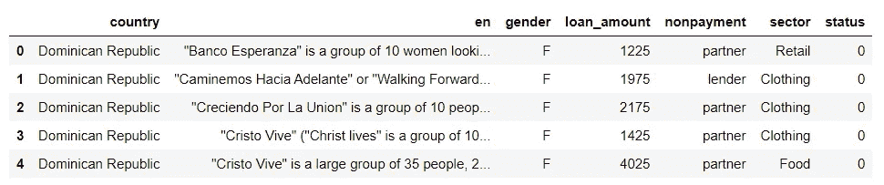
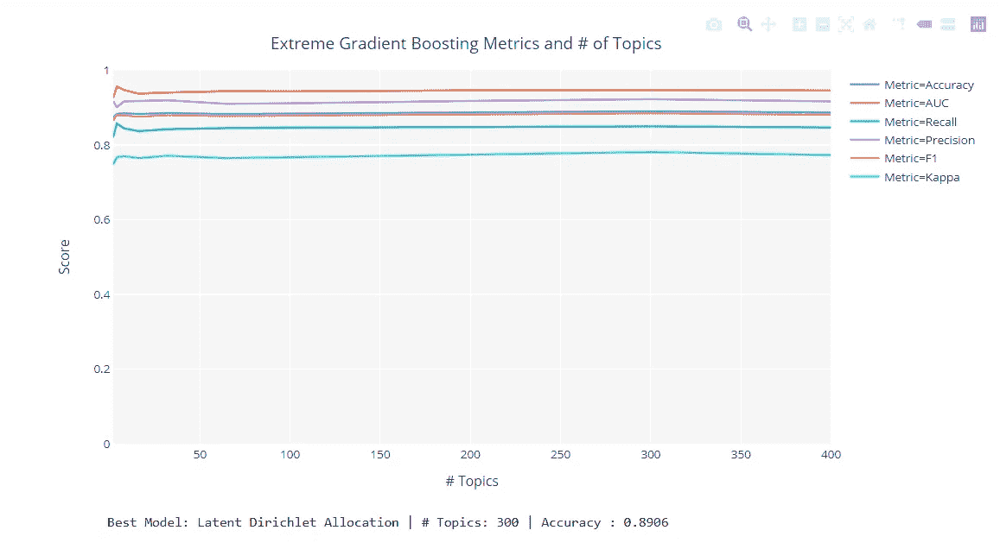
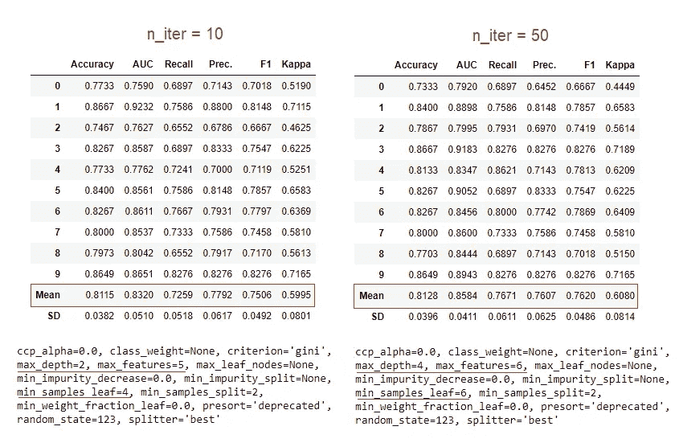
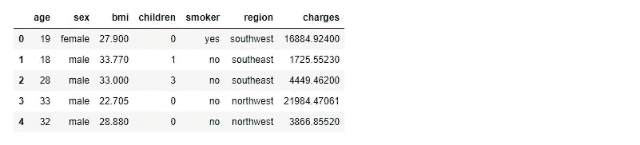
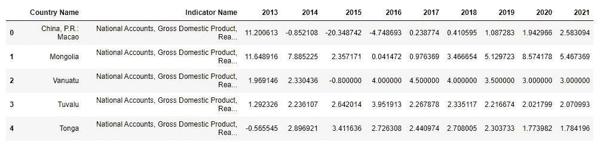
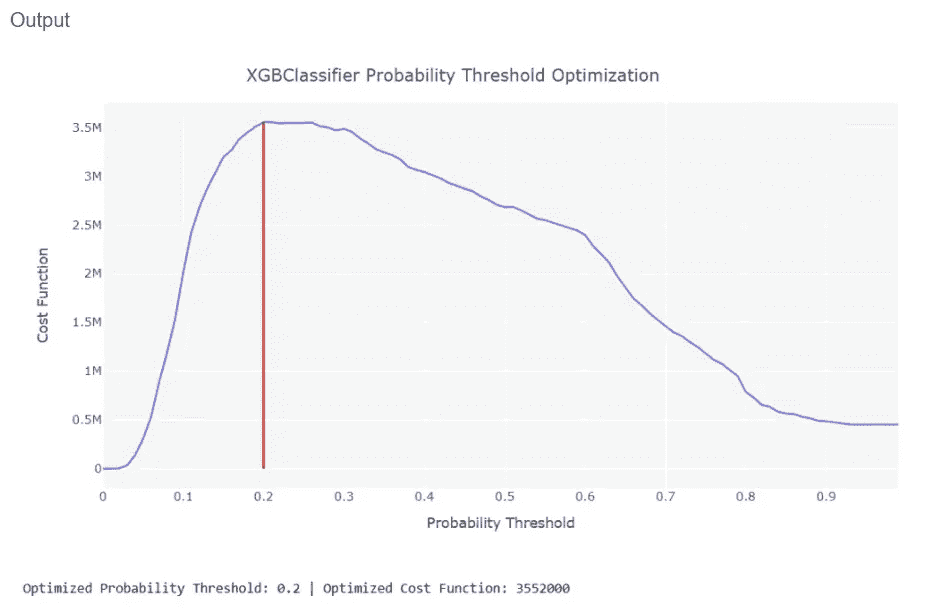

# 关于 PyCaret 你不知道的 5 件事

> 原文：<https://towardsdatascience.com/5-things-you-dont-know-about-pycaret-528db0436eec?source=collection_archive---------18----------------------->

来自 PyCaret 的作者

# PyCaret

PyCaret 是 Python 中的一个开源机器学习库，用于在**低代码**环境中训练和部署有监督和无监督的机器学习模型。它以易用和高效著称。

与其他开源机器学习库相比，PyCaret 是一个替代的低代码库，可以用来用几个单词替换数百行代码。

如果你以前没有使用过 PyCaret 或者想了解更多，这里的[是一个很好的起点。](/announcing-pycaret-an-open-source-low-code-machine-learning-library-in-python-4a1f1aad8d46)

> “在与许多日常使用 PyCaret 的数据科学家交谈后，我列出了 PyCaret 的 5 个鲜为人知但极其强大的功能。”Moez Ali

# 👉您可以在无监督实验中调整“n 参数”

在无监督的机器学习中,“n 参数”,即用于聚类实验的聚类数、异常检测中异常值的分数以及主题建模中的主题数，是非常重要的。

当实验的最终目标是使用无监督实验的结果预测结果(分类或回归)时，那么 **pycaret.clustering** 模块**、**py caret . anomaly 模块**、**和 **pycaret.nlp** 模块**、**中的 tune_model()函数就非常方便了。

为了理解这一点，让我们看一个使用" [Kiva](https://raw.githubusercontent.com/pycaret/pycaret/master/datasets/kiva.csv) "数据集的例子。

这是一个微型银行贷款数据集，其中每行代表一个借款人及其相关信息。列“en”捕获每个借款人的贷款申请文本，列“status”表示借款人是否违约(默认= 1 或无默认= 0)。

您可以使用 **pycaret.nlp** 中的 **tune_model** 函数，根据监督实验的目标变量优化 **num_topics** 参数(即预测提高最终目标变量预测所需的最佳主题数)。您可以使用**评估器**参数(本例中为“xgboost ”)定义训练模型。这个函数返回一个训练好的主题模型和一个显示每次迭代的监督指标的视图。

# 👉您可以通过增加“n_iter”来改善超参数调整的结果

**pycaret.classification** 模块中的 **tune_model** 函数和 **pycaret.regression** 模块在预定义网格搜索上采用随机网格搜索进行超参数调整。这里默认的迭代次数设置为 10。

来自 **tune_model** 的结果不一定是使用 **create_model 创建的基础模型的结果的改进。**由于网格搜索是随机的，您可以增加 **n_iter** 参数来提高性能。请参见下面的示例:

# 👉您可以在 setup 函数中以编程方式定义数据类型

当您初始化**设置**功能**、**时，您将被要求通过用户输入确认数据类型。更常见的是，当您将脚本作为工作流的一部分运行或作为远程内核执行时(例如 Kaggle 笔记本)，在这种情况下，需要以编程方式提供数据类型，而不是通过用户输入框。

参见下面使用“[保险](https://raw.githubusercontent.com/pycaret/pycaret/master/datasets/insurance.csv)数据集的示例。

将 **silent** 参数设置为 True 以避免输入，**category _ features**参数将分类列的名称作为字符串， **numeric_features** 参数将数值列的名称作为字符串。

# 👉对于模型构建，您可以忽略某些列

在许多情况下，您可能不希望移除数据集中的某些要素，但希望忽略这些要素来训练机器学习模型。一个很好的例子就是聚类问题，您希望在聚类创建期间忽略某些特征，但是稍后您需要这些列来分析聚类标签。在这种情况下，您可以使用**设置**中的 **ignore_features** 参数来忽略这些特性。

在下面的示例中，我们将执行一个聚类实验，我们希望忽略**‘国家名称’**和**‘指标名称’**。

# 👉您可以在二进制分类中优化概率阈值%

在分类问题中，**假阳性**的成本和**假阴性**的成本几乎从不相同。因此，如果您正在优化一个业务问题的解决方案，其中**类型 1** 和**类型 2** 错误具有不同的影响，您可以优化概率阈值的分类器，以优化自定义损失函数，只需分别定义真阳性、真阴性、假阳性和假阴性的成本。默认情况下，所有分类器的阈值都是 0.5。

参见下面使用“[信用](https://raw.githubusercontent.com/pycaret/pycaret/master/datasets/credit.csv)数据集的示例。

然后，您可以将 **0.2** 作为 **probability_threshold** 参数传递给 **predict_model** 函数，以使用 0.2 作为正类分类的阈值。请参见下面的示例:

# PyCaret 2.0.0 来了！

我们得到了数据科学界的大力支持和反馈。我们正在积极改进 PyCaret，并准备我们的下一个版本。 **PyCaret 2.0.0 会更大更好**。如果您想分享您的反馈并帮助我们进一步改进，您可以[在网站上填写此表格](https://www.pycaret.org/feedback)或者在我们的 [GitHub](https://www.github.com/pycaret/) 或 [LinkedIn](https://www.linkedin.com/company/pycaret/) 页面上发表评论。

关注我们的 [LinkedIn](https://www.linkedin.com/company/pycaret/) 并订阅我们的 [YouTube](https://www.youtube.com/channel/UCxA1YTYJ9BEeo50lxyI_B3g) 频道，了解更多关于 PyCaret 的信息。

# 想了解某个特定模块？

从第一个版本 1.0.0 开始，PyCaret 有以下模块可供使用。点击下面的链接，查看 Python 中的文档和工作示例。

[分类](https://www.pycaret.org/classification)
回归
聚类
[异常检测](https://www.pycaret.org/anomaly-detection) [自然语言处理](https://www.pycaret.org/nlp)
[关联规则挖掘](https://www.pycaret.org/association-rules)

# 另请参见:

笔记本中的 PyCaret 入门教程:

[分类](https://www.pycaret.org/clf101)
[回归](https://www.pycaret.org/reg101)
[聚类](https://www.pycaret.org/clu101)
异常检测
[自然语言处理](https://www.pycaret.org/nlp101)
[关联规则挖掘](https://www.pycaret.org/arul101)

# 你愿意投稿吗？

PyCaret 是一个开源项目。欢迎每个人都来投稿。如果您愿意投稿，请随时关注[未决问题](https://github.com/pycaret/pycaret/issues)。dev-1.0.1 分支上的单元测试接受拉请求。

如果你喜欢 PyCaret，请给我们 GitHub 回购的⭐️。

中:[https://medium.com/@moez_62905/](https://medium.com/@moez_62905/machine-learning-in-power-bi-using-pycaret-34307f09394a)

领英:[https://www.linkedin.com/in/profile-moez/](https://www.linkedin.com/in/profile-moez/)

推特:【https://twitter.com/moezpycaretorg1 T43