# 熊猫数据汇总的 5 个技巧

> 原文：<https://towardsdatascience.com/5-tips-for-data-aggregation-in-pandas-7eaa8476dc75?source=collection_archive---------34----------------------->

## 提高数据处理技能的实用技巧

在做数据分析的时候，能够熟练的聚合数据起到了很重要的作用。Pandas 提供了许多有用的方法，其中一些可能没有其他方法受欢迎。此外，即使对于众所周知的方法，我们也可以通过进一步调整它的参数或用其他方法补充它来增加它的效用。考虑到这些因素，如果你以前没有遇到过，这里有 5 个关于熊猫数据聚合的技巧:

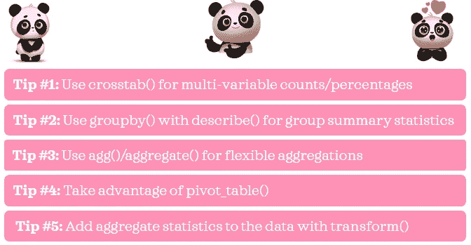

作者图片

在这篇文章中，我将通过例子展示它们是如何有用的。我也希望这些技巧能帮助你写出清晰、简洁、易读的代码。

# 0.Python 设置🔧

我假设读者(👀是的，你！)拥有:
◼️访问并熟悉 Python，包括安装包、定义函数和其他基本任务
◼️使用 pandas 的工作知识，包括基本的数据操作。

如果你还没有安装的话，确保你已经安装了[熊猫](https://pandas.pydata.org/pandas-docs/stable/getting_started/install.html)和[海龟](https://seaborn.pydata.org/installing.html)。

如果你是 Python 新手，[这个](https://www.python.org/about/gettingstarted/)是一个入门的好地方。如果你以前没有用过熊猫，[这个](https://pandas.pydata.org/pandas-docs/stable/user_guide/10min.html)是一个很好的参考资料。

*我在 Jupyter Notebook 中使用并测试了 Python 3.7.1 中的脚本。*

# 1.数据📦

我们将使用 *seaborn 的提示*数据集来说明我的提示。

```
# Import packages
import pandas as pd
from seaborn import load_dataset# Import data 
df = load_dataset('tips').rename(columns={'sex': 'gender'})
df
```

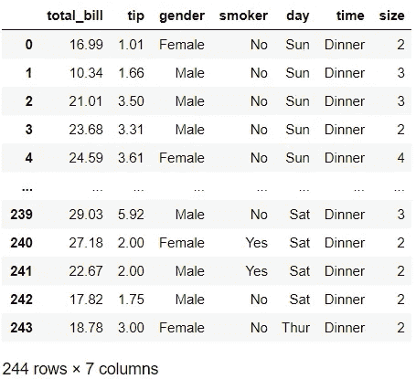

关于这个数据集(包括数据字典)的细节可以在这里[找到](https://vincentarelbundock.github.io/Rdatasets/doc/reshape2/tips.html)(这个源实际上是针对 R 的，但是它看起来是指同一个底层数据集)。为了便于快速查阅，我在下面引用了他们的数据描述:

> [“一名服务员记录了他在一家餐馆工作几个月期间收到的每一笔小费的信息。”](https://vincentarelbundock.github.io/Rdatasets/doc/reshape2/tips.html)

# 2.技巧🌟

## 📍技巧 1:对多变量计数/百分比使用 crosstab()

你可能已经熟悉这个系列函数:`value_counts()`。运行`df['day'].value_counts()`将给出*日*变量中唯一值的计数。如果我们在方法中指定`normalize=True`，它将给出百分比。这对于单个变量很有用，但有时我们需要查看多个变量的计数。例如，如果我们想通过*日*和*时间*获得计数，一种方法是使用`groupby()` + `size()` + `unstack()`:

```
df.groupby(['time', 'day']).size().unstack()
```

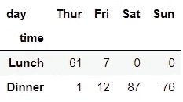

另一种更灵活的方式是使用`crosstab()`:

```
pd.crosstab(df['time'], df['day'])
```

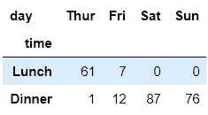

使用`crosstab()`有一些好处。首先，很容易得到行和列的小计——我们只需加上`margins=True`:

```
pd.crosstab(df['time'], df['day'], margins=True)
```

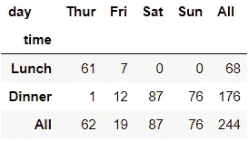

是不是很牛逼？其次，通过调整`normalize`参数，我们可以很容易地得到百分比而不是计数:

```
pd.crosstab(df['time'], df['day'], margins=True, normalize=True)
```


在本例中，我们通过设置`normalize=True`获得了表格百分比。这相当于将其设置为`normalize='all'`。对于行百分比，我们使用`normalize='index'`和`normalize='columns'`表示列百分比。我们还可以进一步扩展列和行的变量集:

```
pd.crosstab([df['time'], df['gender']], [df['day'], df['smoker']], 
            margins=True)
```

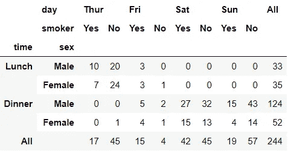

发现`crosstab()`后，我现在用熊猫的时候也经常用。

## 📍技巧 2:使用 groupby()和 describe()进行分组汇总统计

你可能已经知道了`groupby()`和`describe()`。但是你们一起用过吗？通过结合使用这两种方法，我们可以通过分类列中的唯一值来检查数值变量的汇总统计信息，只需一行代码，如下所示:

```
df.groupby('day')['tip'].describe()
```

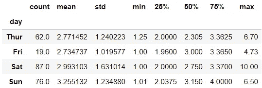

我们可以看到*提示*的汇总统计如何在*天*进行比较。

## 📍技巧 3:使用 agg()/aggregate()进行灵活的聚合

*在本帖中，我们将使用* `*agg()*` *，* `*aggregate()*` *的别名。然而，两者可以互换使用。*

您可能知道基本的聚合语法，如下所示:

```
df.groupby('day')[['tip']].mean()
```

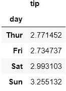

以下是用`agg()`获得相同输出的一些替代方法:

```
df.groupby('day')[['tip']].agg('mean')
df.groupby('day').agg({'tip': 'mean'})
```

在这个简单的例子中，没有明显的优势说明为什么应该使用`agg()`而不是第一种选择。然而，当我们想要查看多个聚合函数的输出时，使用`agg()`给了我们更多的灵活性。例如，通过向`agg()`传递一个列表或一个字典，我们可以一次得到均值和标准差。

```
df.groupby('day')[['tip']].agg(['mean', 'std']) # list
df.groupby(['day']).agg({'tip': ['mean', 'std']}) # dictionary
```

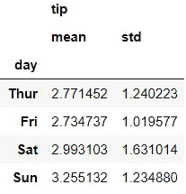

如果我们必须重命名输出列，而不是这样做:

```
df.groupby('day')[['tip']].agg(['mean', 'std']).rename(columns={'mean': 'avg', 'std': 'sd'})
```

我们可以更简洁地做到这两点:

```
df.groupby(['day'])[['tip']].agg([('avg', 'mean'), ('sd', 'std')])
df.groupby(['day']).agg({'tip': [('avg', 'mean'), ('sd', 'std')]})
```

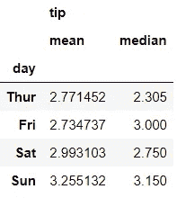

到目前为止，使用列表或字典都同样有效。但是，如果我们想要检查多个变量的同一组汇总统计信息，使用 list 会更简洁。

```
df.groupby('day')[['tip', 'size']].agg(['mean', 'std'])
```

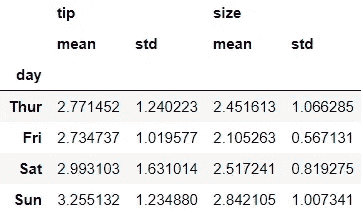

另一方面，有时使用字典是可行的方法。使用 dictionary，我们可以为每个变量指定不同的集合函数:

```
df.groupby(['day']).agg({'tip': ['mean', 'std'], 
                         'size': ['median']})
```

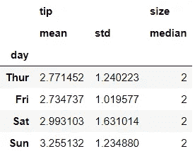

有许多聚合函数可供使用:

◼️频率/计数:`size()`，`count()`
◼️中央倾向:`mean()`，`median()`
◼️方差:`std()`，`var()`
◼️其他:`min()`，`max()`，️ `sum()`，`prod()`，`quantile()`等等。

除此之外，我们可以在`agg()`中使用任何 Series 或 DataFrame 方法。例如，要查看*日*前最高的两个*提示*，我们使用:

```
df.groupby('day')['tip'].nlargest(2)
```

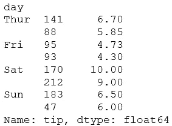

我们可以看到一些最大的提示是在周六。💰

此外，我们也可以使用 lambda 函数:

```
df.groupby(['day']).agg({'tip': [('range', lambda x: x.max() - x.min()), 
                                 ('IQR', lambda x: x.quantile(.75) - x.quantile(.25))]})
```

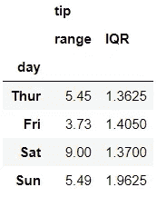

这扩展了我们可以做什么的可能性！😎

## 📍技巧 4:利用 pivot_table()

假设我们需要得到两个变量的平均值*提示*。一种常见的方法是使用`groupby()`:

```
df.groupby(['time', 'day'])['tip'].mean().unstack()
```

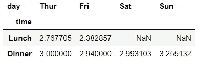

但是更好的方法是使用`pivot_table()`:

```
df.pivot_table('tip', 'time', 'day')
```

这里，我们没有指定参数，因为我们已经按照正确的顺序为方法提供了值。下面是相同代码的另一个版本，其中所有参数都被显式指定:

```
df.pivot_table(values='tip', index='time', columns='day')
```

这个版本可能可读性更强。我认为，如果我们省略第一个参数名称，使其稍微简洁一些，可读性不会受到影响:

```
df.pivot_table('tip', index='time', columns='day')
```

我们将保持这种形式向前发展。

默认情况下，`pivot_table()`给出平均值。然而，我们可以通过将它指定为`aggfunc`参数来轻松地更改为我们喜欢的函数，例如`sum()`:

```
df.pivot_table('tip', index='time', columns='day', aggfunc='sum')
```

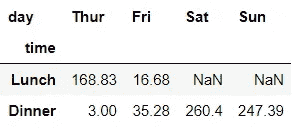

类似于`crosstab()`，用`pivot_table()`也很容易得到小计。

```
df.pivot_table('tip', index='time', columns='day', aggfunc='sum', 
               margins=True)
```

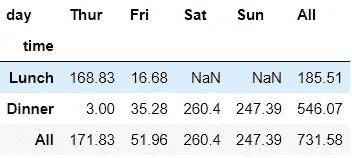

我们还可以将字典传递给`aggfunc`，为传递给`values`参数的每个变量定制聚合函数。另一个有用的参数是`fill_value`,在这里我们指定如果输出丢失，我们希望看到什么值。让我们看一个例子来说明这些观点:

```
df.pivot_table(['tip', 'size'], index=['time', 'smoker'], 
               columns='day', fill_value=0, margins=True,
               aggfunc={'tip': 'sum', 'size': 'max'})
```


使用`pivot_table()`，您可以准确地知道哪些变量将出现在行和列中，并且不需要对数据进行整形。

## 📍技巧 5:使用 transform()向数据添加聚合统计信息

当我们希望将分组聚合度量值追加回未分组的数据时，这个技巧很有用。这里有一个例子来说明这一点:

```
df['avg_tip_by_gender'] = df.groupby('gender')['tip'].transform('mean')df.head()
```

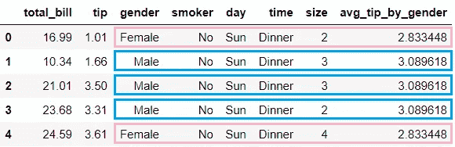

在本例中，新创建的变量 *avg_tip_by_gender* 显示了按*性别*分类的平均 *tip* 。换句话说，来自下方的平均*提示*由*性别*添加回未分组数据。

```
df.groupby('gender')['tip'].agg(['mean', 'std'])
```

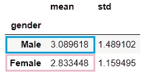

现在，让我们举一个稍微高级一点的例子:

```
df['n_sd_from_gender_avg_tip'] = df.groupby('gender')['tip'].transform(lambda x: (x-x.mean())/x.std())df.head()
```

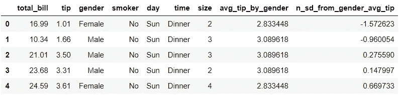

这里，使用`lambda`函数，我们为变量*提示*做了 3 件事:

`x.mean():`按*性别*找均值。
`x-x.mean():`通过*性别*求距离平均值。
`(x-x.mean())/x.std():`以标准差为单位求距离。

让我们以第一条记录(index=0)为例，为了简单起见，将数字四舍五入到小数点后两位:`x=1.01`、`x.mean()=2.83`、`x.std()= 1.16`

然后，*n _ SD _ from _ gender _ avg _ tip*=(1.01-2.83)/1.16 =-1.57

这就是我们在 *n_sd_from_gender_avg_tip 第一行找到的。*对于此记录，*小费*金额比女性顾客的平均*小费*低约 1.57 个标准差。

Voila❕:这些是我目前关于熊猫的顶级数据汇总技巧！


照片由[宝琳娜·剃刀洛娃](https://unsplash.com/@bolotohodova?utm_source=medium&utm_medium=referral)在 [Unsplash](https://unsplash.com?utm_source=medium&utm_medium=referral) 上拍摄

*您想访问更多这样的内容吗？媒体会员可以无限制地访问媒体上的任何文章。如果您使用* [*我的推荐链接*](https://zluvsand.medium.com/membership)*成为会员，您的一部分会费将直接用于支持我。*

谢谢你看我的帖子。希望我的建议对你有用，✂️.如果你有兴趣了解更多关于熊猫的信息，这里有我其他帖子的链接:
◼️️ [在熊猫中编写 5 个常见的 SQL 查询](/writing-5-common-sql-queries-in-pandas-90b52f17ad76)
◼️️ [给熊猫用户的 5 个提示](/5-tips-for-pandas-users-e73681d16d17)
◼️️ [如何在熊猫数据框架中转换变量](/transforming-variables-in-a-pandas-dataframe-bce2c6ef91a1)

再见🏃💨