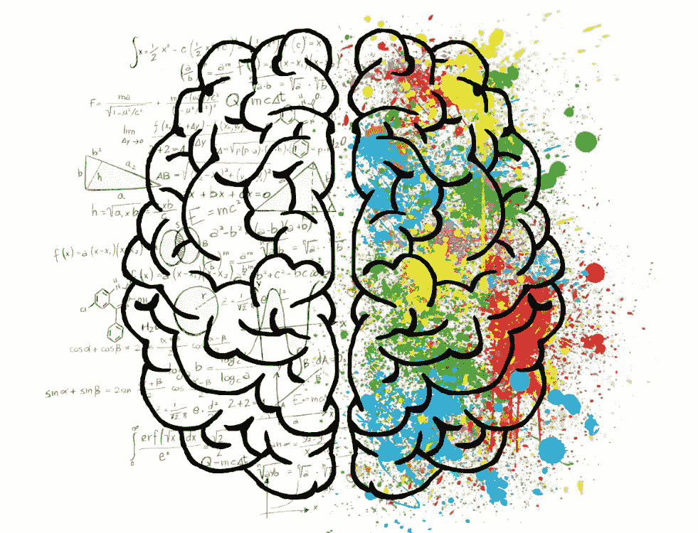
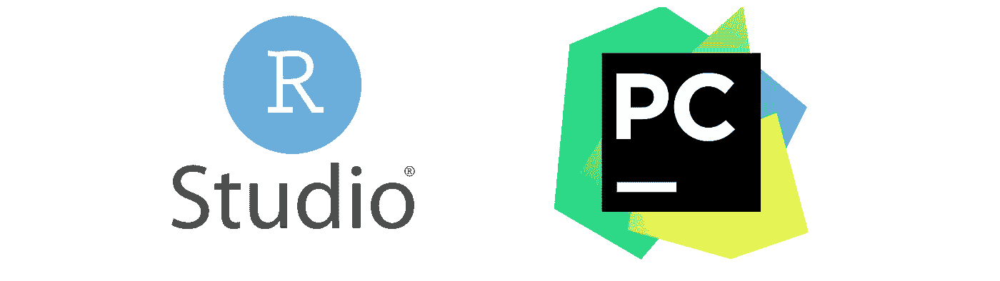
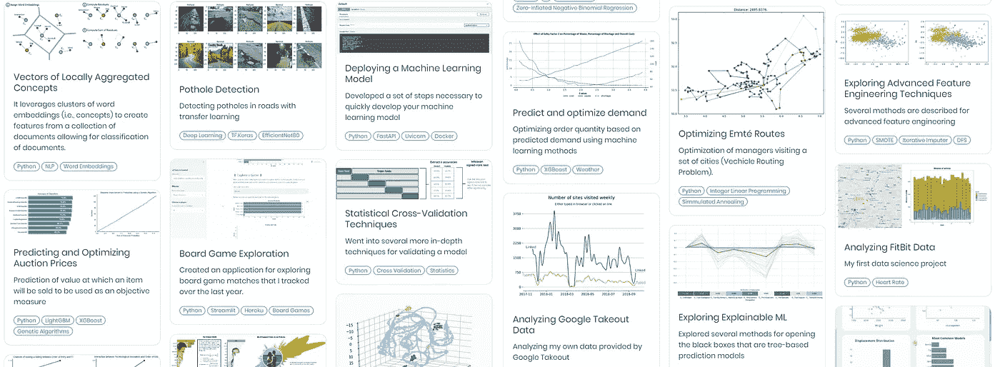
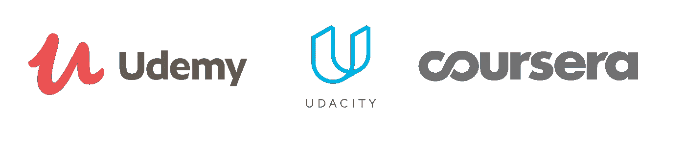

# 从心理学过渡到数据科学的 5 个技巧

> 原文：<https://towardsdatascience.com/5-tips-for-making-the-transition-from-psychologist-to-data-scientist-8198fbbbb19e?source=collection_archive---------4----------------------->

## 数据科学

## 以及如何做到这两点。

在这里检索到[。](https://pxhere.com/en/photo/1370218)

目前，进入数据科学和人工智能的惊人世界变得越来越困难。对于那些没有技术背景的人来说尤其如此。

在这篇文章中，我想讨论心理学家或那些具有社会导向背景的人找到数据科学家工作的可能性。

作为一名心理学家，你比那些纯技术背景的人有几个**优势**:

*   你接受过深入的沟通训练
*   你是各自领域的领域专家(例如，经济心理学或临床心理学)
*   你熟悉统计学，也许比你的技术同行更熟悉
*   你有处理小数据集的经验

然而，你可能有同样多的**缺点**:

*   您不熟悉计算机科学领域(例如，创建生产管道、单元测试、git 等。)
*   你不熟悉必要的数学技能(例如，微积分、线性代数等。)
*   您对数据科学相关算法(例如，机器学习、NLP、流程挖掘、信息检索等)几乎没有经验。)

在这篇文章中，我将解释你如何利用这些优势，以及如何弥补这些劣势。

因此，本文中的**主要信息**很简单:

> 发挥你的长处，改进你的短处。

注意:这里的许多技巧可以推广到其他背景。然而，他们首先是针对那些有社会背景的人。如果考虑另一个背景，我会改变一些提示。

# 1.学习一门编程语言

这可能有点太明显了，但是学习一门编程语言可能比你想象的更重要，尤其是从长远来看！

## 应该选择哪种编程语言？

这是一个备受争议的问题，取决于你想从事的行业。总的来说，Python 和 R 目前主要用于机器学习和统计应用。

如果你想找一份技术含量不高，但更具分析性的工作，我会强烈推荐 R。r 在公司中已经存在了很长时间，用于进行数据分析，仍然有公司还没有转换到 Python。这种语言擅长做快速和相对深入的统计分析。

此外，由于 R 最初是由统计学家使用的，很有可能你以前用过它，因为社会科学是典型的重统计的。

另一方面，如果你真的想专注于复杂的算法或生产流水线，那么我会**推荐**选择 **Python** 。Python 是想要将他们的人工智能模型投入生产的数据科学家的首选语言。它非常灵活，与 R 相比，有更广泛的使用范围。

虽然从技术上讲，SQL 不是一种编程语言，但在访问和分析数据时，SQL 是不可或缺的。它通常用于查询存储在关系数据库中的信息。特别是对于非技术背景的心理学家，你可以很快学会如何做基本的分析。

## 我应该知道如何编程到什么程度？

这取决于你想成为什么类型的数据科学家。如果你想帮助企业做出决策，那么我建议你了解 SQL 和 r 的基础知识。然而，如果你正在寻找一份将模型投入生产的算法繁重的工作，那么关键是你要接近软件工程师的知识和效率。

## 我还应该关注哪些技能？

不过，为了让你的生活更轻松，我还是建议你学习一些东西:

Git 是一个版本控制系统，帮助你跟踪代码的变化。我见过许多数据科学家创建他们的笔记本/文件的副本，并将它们称为 V2，以向他们的解决方案添加功能。这不仅效率低下，而且很难对应用程序进行适当的版本控制和跟踪不一致性。

创建数据驱动的解决方案时，使用合适的 **IDE** 。例如，使用 **Pycharm** 而不是 Jupyter 笔记本将帮助您编写更好的代码，因为有许多选项可以帮助您跟踪问题。

如果你想更进一步，你可以看看下面的:

*   单元测试
*   分析运行时间
*   API 开发
*   Docker 集成

# 2.得到经验

有许多方法可以让你获得这方面的经验。以下是我认为在转变过程中最大的好处。

## 实习

可以说，简历上有一次或多次实习经历是让你获得数据科学家工作的最重要因素。以我的经验来看，雇主在寻找那些见过商业领域混乱数据，而不是你在学术界看到的相对原始数据的员工。

实习也将帮助你理解数据科学领域的语言。人们在决策中大量使用**试探法**和**偏见**。因此，当你像数据科学家一样说话时，他们更倾向于认为你是数据科学家。

此外，利用你的统计技能为你造福。许多初创企业和较小的组织都希望他们的团队中有人能够分析他们的小型数据集，同时清楚地传达这些结果。

## **创建投资组合**

作品集可以帮助你交流与潜在雇主相关的各种技能和项目。不仅如此，它还可以用来学习如何正确地向对该领域了解不多的人解释技术原理。一个**重要技能**要有！

我的投资组合作为你可以做的项目的例子:【https://maartengr.github.io/projects/或[https://github.com/MaartenGr/projects](https://github.com/MaartenGr/projects)

我建议你在你的投资组合里放两件东西中的一件:

*   一个**专业**内的几个项目(例如深度学习)
*   或者跨越广泛专业领域的几个项目来展示广泛的能力

# 3.利用你的背景为自己谋利

在我从心理学家转到数据科学家后，我希望我的技能得到认可。我努力学习必要的技能，称自己为数据科学家。雇主经常会说，在将数据科学/人工智能解决方案翻译给非技术利益相关者时，我的心理学背景会很有帮助。然而，我想自己解决这些问题！甚至有几次，我把心理学背景从简历中去掉，只被认为是一名数据科学家。

此处检索到。

事后看来，这显然不是正确的做法。真正有帮助的其实很简单:

> 专注于心理学知识主要被视为**领域知识**的领域，而不是很好地沟通技术问题的能力。

对我来说，这导致了一个数据科学家的职位，在那里我将专注于分析和预测人类行为。

**注**:如果你喜欢成为数据科学家和利益相关者之间的桥梁，那么你的社会背景加上基本的数据科学知识应该足以胜任这样的角色。

# 4.了解商务智能工具

当您考虑数据科学解决方案时，可能不会首先想到使用 BI 工具。实际上，学习这些工具比你可能意识到的更重要。

如果你在非研究环境中工作，那么你的解决方案很有可能会被非技术利益相关者使用。这些利益相关者通常已经利用 BI 工具来驱动他们的决策过程。

为了让这些风险承担者使用您的预测模型，最好将它们集成到现有的工作流程中。了解正在使用的 BI 工具将有助于将您的模型的输出集成到它们的工作流中。

上面列出了一些最流行的工具(即 Qlik、Tableau 和 PowerBI)。我建议至少制作一个包含所有工具的仪表板，以了解这些工具的基本工作原理。然后，选择您喜欢的方法，深入了解这些应用程序的数据架构。

# 5.自学

拥有面向社会的背景的缺点和优点是，雇主更倾向于认为你的技能最适合一个需要大量沟通的职位。为了让他们认可你的技能，一个学位，无论是硕士课程还是在线课程，都可能是有益的。

## 硕士学位

在完成面向社会的项目后，继续攻读数据科学硕士学位可能会非常困难。与那些有技术背景的人相比，你很可能缺乏必要的技术技能，比如编程、线性代数、微积分、数据结构等。

因此，寻找能帮助你在更短的时间内获得这些必要技能的项目是很重要的。一些项目在技术和社会课程之间有很好的平衡，适合有社会背景的人。

我建议看一看**研究硕士项目**或者**数据科学硕士项目**。前者通常在你的领域内，并允许你将它与高级分析技能相结合。尤其是你硕士论文重点是预测建模的话。后者将向您介绍常见的数据科学算法和方法，同时保持数据科学和商业课程之间的良好平衡。

虽然许多人建议从事计算机科学或数学密集型项目，但我觉得这对心理学家来说是一个太多不同的方向。

## MOOC

对于许多人来说，由于经济困难或者他们已经全职工作，很难注册一个新的硕士项目。一个很好的解决方案是效仿 MOOC，即**大规模开放在线课程。换句话说，你可以在网上学习简单的课程。**

MOOCs 对于学习一门新专业如此完美的原因在于，只要你觉得合适，你就可以在业余时间学习这些课程。他们往往比正规的硕士学位还要便宜！

这些课程的问题是需要一些研究来确定哪些课程值得你花时间。有些被认为是很棒的课程，比如吴恩达在 Coursera 上开设的[机器学习](https://www.coursera.org/learn/machine-learning)和[深度学习](https://www.coursera.org/specializations/deep-learning)课程。

我个人对**平台**的偏好是:

*   [Coursera](https://www.coursera.org/)
*   [Udacity](https://www.udacity.com/) (纳米度)
*   [Udemy](https://www.udemy.com/)

**注意**:Udemy 上的课程经常打折，可以为你节省数百欧元/美元！

对我来说，这种转变需要几年的努力。这是一段艰难的旅程，但是相信我，这绝对是值得的！

如果你和我一样，对人工智能、数据科学或心理学充满热情，请随时在 [LinkedIn](https://www.linkedin.com/in/mgrootendorst/) 上添加我。