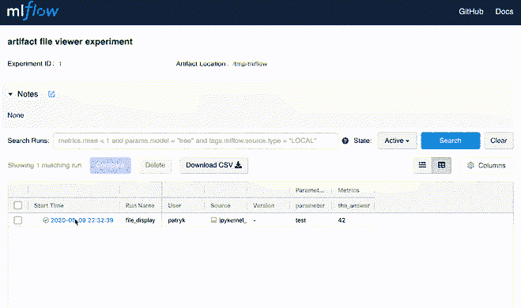
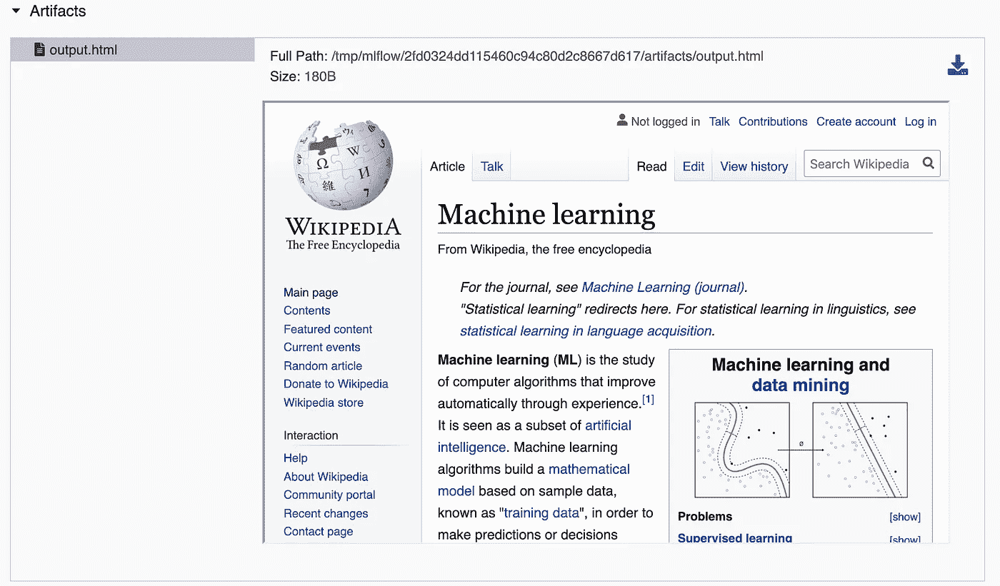
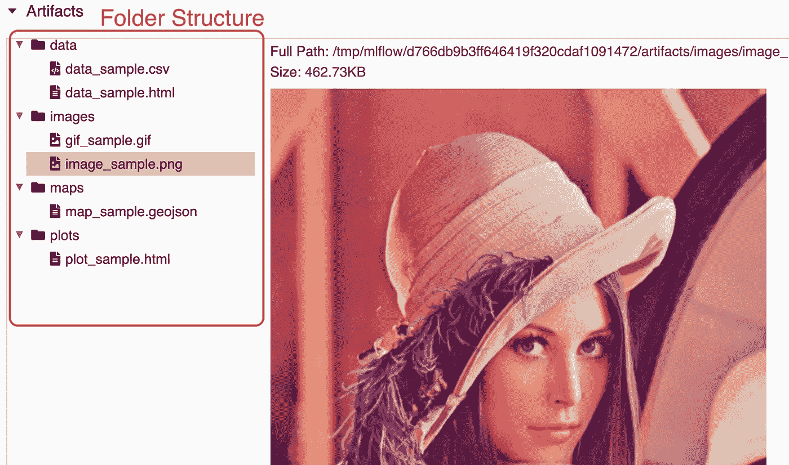
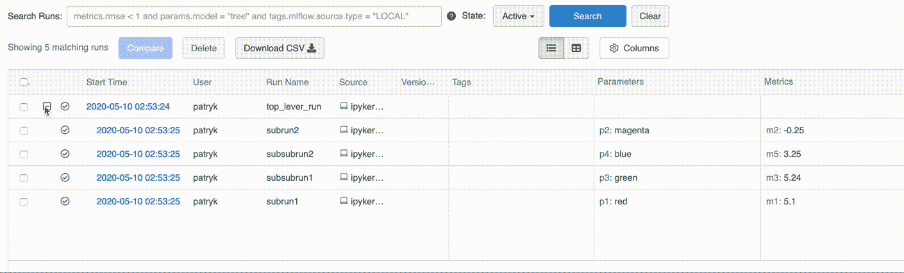
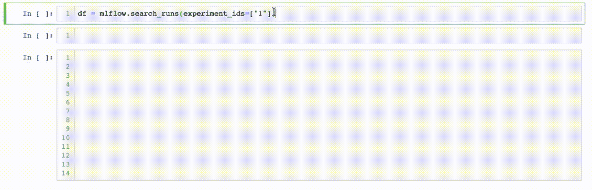

# MLflow 实验跟踪的 5 个技巧

> 原文：<https://towardsdatascience.com/5-tips-for-mlflow-experiment-tracking-c70ae117b03f?source=collection_archive---------10----------------------->

## 将 MLflow 推向极限:可视化、组织、更改和纠正您的 mlflow 运行

这篇文章是关于 [MLflow](https://github.com/mlflow/mlflow) 的——一个开源 [MLOps](https://en.wikipedia.org/wiki/MLOps) 工具。如果你从未听说过，[这里有一个教程](https://www.mlflow.org/docs/latest/tutorials-and-examples/tutorial.html)。

我关注的是*ml flow Tracking*——允许记录和查看您的每个模型/实验的参数、度量和工件(文件)的功能。

当您记录您试验的模型时，您可以在 MLflow UI(以及其他)中总结和分析您的运行。您可以了解它们中哪一个性能最好，排除故障，并选择部署的最佳候选。我每天都在使用这个工具，并且发现了许多让我的生活变得更加轻松的特性。尽情享受吧！


由 [Sebastian Staines](https://unsplash.com/@seabas?utm_source=medium&utm_medium=referral) 在 [Unsplash](https://unsplash.com?utm_source=medium&utm_medium=referral) 上拍摄的照片

# 1.交互式工件— HTML、GeoJSON 和其他

工件查看器是一个很棒的特性，它被设计用来深入到您记录的模型中。您可以用任何格式保存文件，并且可以下载这些文件，但是只有部分文件可以在工件查看器窗口中预览或呈现。目前分别是(来源: [FileUtils.js](https://raw.githubusercontent.com/mlflow/mlflow/master/mlflow/server/js/src/common/utils/FileUtils.js) ):

> **正文**:。txt，。日志，。py，。js，。yaml，。yml，。json，。csv，。tsv，。md，。rst，。jsonnet
> 图片:。jpg，。bmp，。jpeg，。png，。gif，。svg
> **互动**:。html，。杰奥森

下面是保存其中一些文件的示例片段:

测试 MLflow 工件查看器的全部功能—代码

下面是这次运行的 UI 外观，在工件查看器窗口中呈现得非常好:



测试 MLflow 工件查看器的全部功能—演示

最重要的是，因为它可以在 HTML 中呈现 iframe，你实际上可以使用这个片段嵌入一个网站(比如一个仪表板)。如果你的仪表板通过 URI 参数化，这可以很好地利用。



嵌入在工件查看器中的维基百科页面(作为一个例子)。

限制:如果您的嵌入式网站需要外部环境或一些认证，它可能不会工作。你可以在本期中了解更多信息。

这个用例真的将工具推到了极限，看起来有点不靠谱，但这是可能的。我无法想象会有很多用户嵌入这样的网站。

# 2.用文件夹组织的工件

当您在运行中有许多工件时，您可能想要将它们组织在文件夹中。方法如下:

在文件夹中记录工件—代码

结果是:



在文件夹中记录工件—演示

# 3.使用 nested=True 按部分组织的运行

有时，您的跑步有许多部分，每个部分都有自己的一套参数和指标。您可以使用嵌套管路来分隔它们。

嵌套运行—代码

看看这个分离得很好的运行树:



嵌套运行—演示

限制:正如您在上面看到的，UI 只显示了第一级嵌套的树结构，但是,“父运行”属性对于任何嵌套运行都是正确的。我希望在 MLflow 的下一个版本中，UI 能够反映一个完整的嵌套树。

# 4.使用 pandas 以编程方式运行查询

因此，您运行了您的实验，进行了您的批量分析，MLflow 自动图很棒，但您可能想要更多。您可以将您的运行和实验以及所有参数、指标和工件导出到 pandas df 中！

```
mlflow.search_runs(experiment_ids=["your_exprmnt_id"])
```

这会给你一个漂亮的熊猫数据框，里面有你需要的所有信息！



作为熊猫 DF 获得所有跑步记录

# 5.纠正运行

假设您前段时间运行了您的实验，但是您在代码中发现了一个乏味的 bug。例如，你忘了用秒除以 3600 得到小时。以下是纠正的方法:

更正 MLflow 运行

完成后，您可以随时更正、添加或删除任何 MLflow 运行。从 UI 或者通过使用上面解释的 [search_runs](https://www.mlflow.org/docs/latest/python_api/mlflow.html#mlflow.search_runs) API 获得 run_id。

# 6.MLflow 不仅仅是为了 ML

(与其说是提示，不如说是观察)

> 我们所有的程序员都在做实验:调整输入参数以优化输出指标。

我发现*ML flow Tracking*&*UI*在许多非 ML 实验中非常有用，例如剖析算法或更通用的 AI。由于自动化绘图和总结，它的用途超出了机器学习。这主要归功于 API 的易用性和简单但实用的 UI。MLflow 的日志记录功能几乎是无限的，自动绘图简单但信息量大！