# 给熊猫用户的 5 个建议

> 原文：<https://towardsdatascience.com/5-tips-for-pandas-users-e73681d16d17?source=collection_archive---------13----------------------->

数据处理人员使用的一个流行的 Python 库是 *pandas* ，这是一个简单灵活的数据操作和分析库。在*熊猫*中有无数令人敬畏的方法和函数，其中一些可能不太为人所知。考虑到这一点，我有 5 个技巧来告诉你这些不常用的(至少在我看来)方法和函数在你还不知道的情况下是如何有用的🐼：

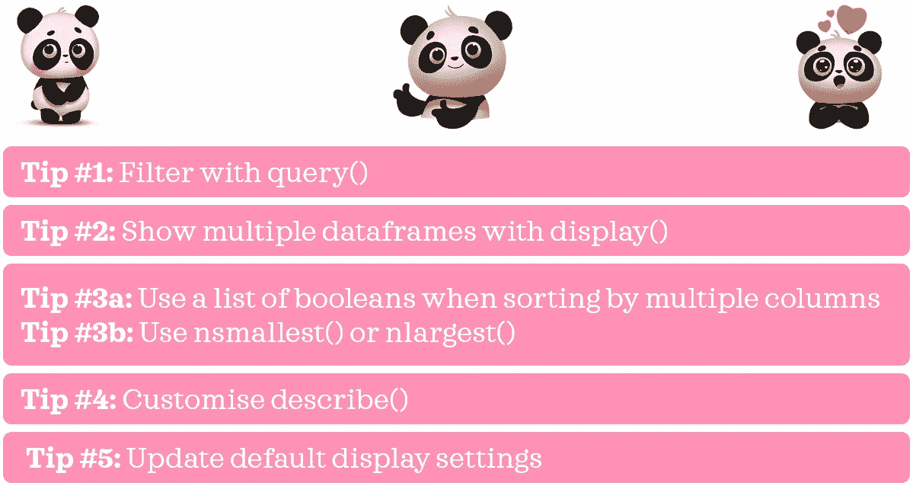

作者图片

这些对你来说有什么有趣或不熟悉的吗？💭我希望答案是“是”或者至少是“可能”。在这篇文章中，我将逐一介绍它们，解释我的意思，并举例说明它们是如何有用的。

# 0.Python 设置🔧

我假设读者(👀是的，你！)拥有:
◼️访问并熟悉 Python 包括安装包、定义函数和其他基本任务
◼️使用 pandas 的工作知识包括基本的数据操作。

如果你还没有安装熊猫和海洋[的话，确保你已经安装了它们。](https://seaborn.pydata.org/installing.html)

如果你是 Python 的新手，[这个](https://www.python.org/about/gettingstarted/)是一个很好的入门地方。如果你以前没有用过熊猫，[这个](https://pandas.pydata.org/pandas-docs/stable/user_guide/10min.html)是一个很好的参考资料。

*我在 Jupyter Notebook 中使用并测试了 Python 3.7.1 中的脚本。*

# 1.数据📦

我们将使用 *seaborn 的*技巧数据集来举例说明我的技巧。看到我做了什么吗？🙊

```
# Import packages
import pandas as pd
import seaborn as sns# Import data 
df = sns.load_dataset('tips')
print(f"{df.shape[0]} rows and {df.shape[1]} columns")
df.head()
```


关于这个数据集(包括数据字典)的细节可以在这里找到[(这个源实际上是针对 R 的，但是它看起来是指同一个底层数据集)。为了便于快速查阅，我在下面引用了他们的数据描述:](https://vincentarelbundock.github.io/Rdatasets/doc/reshape2/tips.html)

> 一名服务员记录了他在一家餐馆工作几个月期间收到的每一笔小费的信息

# 2.技巧🌟

## 📍技巧 1:用查询()过滤

让我们从我最喜欢的提示开始吧！比方说，我们想过滤那些总账单超过 30 美元，小费超过 6 美元的人的数据。实现这一点的一种常见方法是使用:

```
df.loc[(df['tip']>6) & (df['total_bill']>=30)]
```

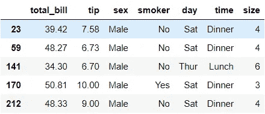

这就完成了工作，但是你不觉得有点太冗长吗:每个条件都需要引用数据帧，如果有多个条件，还需要一个括号。现在，让我向您展示我们如何用更优雅的代码通过 *query()* 实现同样的结果:

```
df.query("tip>6 & total_bill>=30")
```

你看这看起来有多干净、简单和易读？我们不再重复输入 *df* 或者过多使用括号和圆括号。击键次数越少，编写代码就越快，代码也不容易出错。关于 *query()* 的一些额外提示:

```
# reference global variable name with @
median_tip = df['tip'].median()
display(df.query("tip>[@median_tip](http://twitter.com/median_tip)").head())

# wrap column name containing . with backtick: `
df.rename(columns={'total_bill':'total.bill'}, inplace=True)
display(df.query("`total.bill`<20").head())
df.rename(columns={'total.bill':'total_bill'}, inplace=True)

# wrap string condition with single quotes (this is what I like)
display(df.query("day=='Sat'").head())
# could also do it the other way around (i.e. 'day=="Sat"')
```

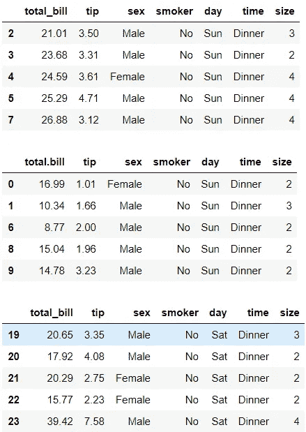

## 📍技巧 2:用 display()显示多个数据帧

我已经在前面的代码中给出了这个，所以你可能会猜到这个是关于什么的。假设我们想在 Jupyter 笔记本的一个单元格中检查 *df* 的头部和尾部。如果我们运行下面的代码，它只会显示尾巴:

```
df.head()
df.tail()
```

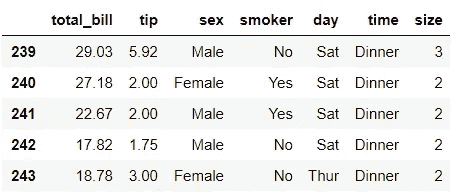

我们可以用 *display()* 来解决这个问题:

```
display(df.head())
display(df.tail())
```

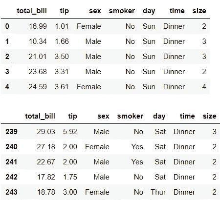

在最后一行中， *display()* 是多余的，但它是为了保持一致性。如果我们从最后一行中去掉 *display()* ，其工作方式是相同的:

```
display(df.head())
df.tail()
```

## 📍技巧#3a:当按多列排序时，使用布尔列表

关于分类，我有两个建议。第一个用于对多列进行排序。

您是否曾经不得不对不同方向的多列数据进行排序？这里有一个例子来说明我的意思:按总账单升序排列数据，按小费金额降序排列。

在我知道 tip #3a 之前，我会创建一个临时列来翻转总账单或小费的比例，以使所有相关列具有相同的方向，并在之后进行排序(在本例中，我翻转了小费):

```
df['rev_tip'] = -df['tip']
df.sort_values(by=['total_bill', 'rev_tip'], ascending=True).head()
```

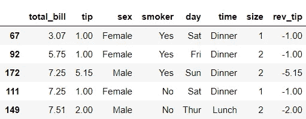

这是一种解决方法，但不是解决任务的好方法。我们用`del df['rev_tip']`删除 rev_tip 吧。相反，我们可以传递一个布尔值列表来指示每个变量的排序顺序:

```
df.sort_values(by=[‘total_bill’, ‘tip’], ascending=[True, False]).head()
```

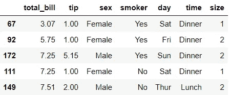

我们不仅不需要创建额外的列，最后的代码看起来也更干净，可读性更好。

也可以使用布尔的数字表示。也就是说，如果我们换成`ascending =[1,0]`，它也会给我们同样的输出。

## 📍技巧#3b:使用 nsmallest()或 nlargest()

如果您曾经必须快速检查在特定列中具有最小或最大值的记录的数据提取，这第二个技巧将会派上用场。使用 nsmallest()，我们可以用最小的总账单检查出 5 条记录，如下所示:

```
df.nsmallest(5, 'total_bill')
```

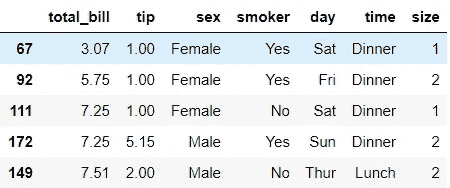

这是以下内容的简称:

```
df.sort_values(by='total_bill').head()
```

类似地，这两条线的输出是相同的:

```
display(df.nlargest(5, 'total_bill'))
display(df.sort_values(by='total_bill', ascending=False).head())
```

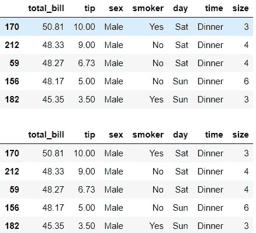

## 📍秘诀 4。自定义描述()

任何熊猫用户都可能熟悉`df.describe()`。这显示了数字列的汇总统计信息。但是通过指定它的参数，我们可以得到更多。

首先，让我们检查一下列类型:

```
df.info()
```

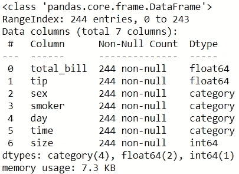

在我们的数据框架中，我们有数字列和分类列。让我们通过添加`include='all'`来查看所有列的汇总统计信息:

```
df.describe(include='all')
```

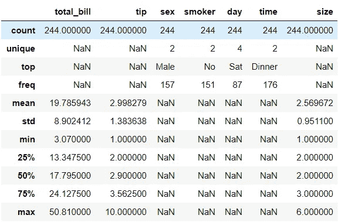

这很酷，但有点乱。让我们使用以下脚本分别按列类型显示汇总统计信息:

```
display(df.describe(include=['category'])) # categorical types
display(df.describe(include=['number'])) # numerical types
```

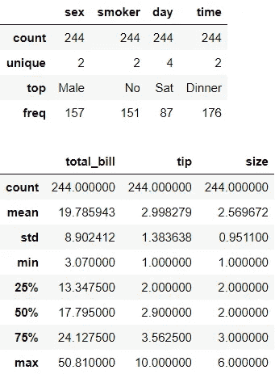

你更喜欢这个吗？如果我们既有字符串又有分类列，并且希望在一个表中显示两者的汇总统计数据，我们可以使用:`include=['category', 'object']`或`exclude=['number'].`如果您想了解更多，请查看[文档](https://pandas.pydata.org/pandas-docs/stable/reference/api/pandas.DataFrame.describe.html)。

## 📍技巧 5:更新默认显示设置

最后一个技巧可能比其他技巧更广为人知。让我们看看一些有用的显示设置的例子。

首先，我们可以使用下面的代码检查当前默认的最大行数和列数限制:

```
print(f"{pd.options.display.max_columns} columns")
print(f"{pd.options.display.max_rows} rows")
```

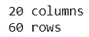

当前熊猫版本:1.0.3

这意味着，如果我们试图显示一个超过 20 列的数据帧，我们只能看到前 10 列和后 10 列(总共显示 20 列)，而其余的将被截断为三个点。同样的逻辑也适用于行。通常，我们可能想看到比这些最大值更多的东西。如果我们想改变这种行为，我们可以这样做:

```
pd.options.display.max_columns = None
pd.options.display.max_rows = None
```

在这里，我们要求熊猫无限制地显示每一行和每一列。这可能是也可能不是一个好主意，取决于您的数据框架有多大。我们也可以将这些选项设置为我们选择的数量:

```
pd.options.display.max_columns = 50
pd.options.display.max_rows = 100
```

其次，根据你正在处理的数值变量的规模，当你处理熊猫时，你有时可能会遇到非常大或非常小的数字的科学符号。如果您发现 1200 和 0.012 比 1.2e3 和 1.2e-2 更容易阅读，您可能会发现这行代码很方便:

```
pd.options.display.float_format = ‘{:.4f}’.format # 4 decimal places
```

这可以确保你看到的是实数，而不是科学符号。

如果你想了解更多关于其他定制选项的信息，请查看[文档](https://pandas.pydata.org/pandas-docs/stable/user_guide/options.html)。

Voila❕:这些是我目前给熊猫用户的最佳建议！


Zoe Nicolaou 在 [Unsplash](https://unsplash.com?utm_source=medium&utm_medium=referral) 上的照片

*您想访问更多这样的内容吗？媒体会员可以无限制地访问媒体上的任何文章。如果您使用* [*我的推荐链接*](https://zluvsand.medium.com/membership)*成为会员，您的一部分会费将直接用于支持我。*

谢谢你看我的帖子。希望我的建议对你有用，✂️.如果你有兴趣了解更多关于熊猫的知识，这里有我另一篇文章的链接:
◼️️ [如何在熊猫数据框架中转换变量](/transforming-variables-in-a-pandas-dataframe-bce2c6ef91a1)

再见🏃💨