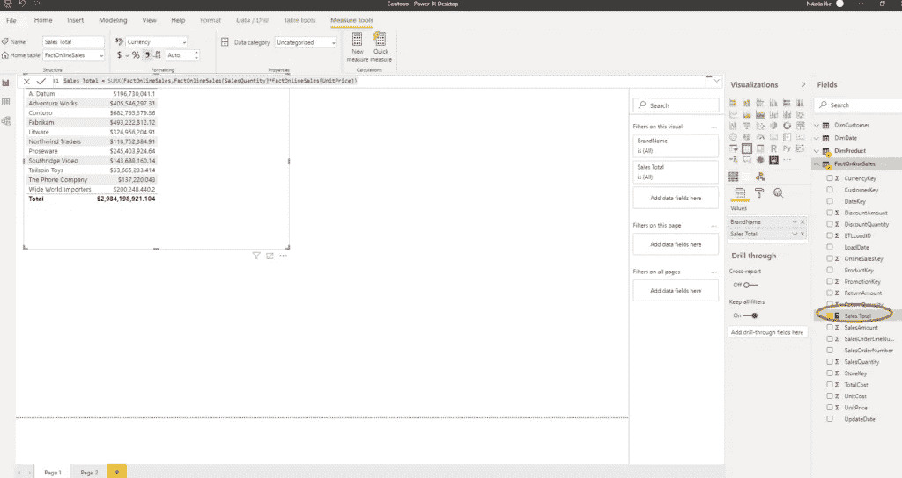

# 促进您的 Power BI 开发的 5 个技巧

> 原文：<https://towardsdatascience.com/5-tips-to-boost-your-power-bi-development-a44d7e782037?source=collection_archive---------36----------------------->

## *这些简单的技巧可以帮助你在日常工作中使用 Power BI*


凯文·Ku @ pexels . com 摄影

我最喜欢 Power BI 的一点是快速报告开发。只需点击几下鼠标，就可以看到结果并准备进行分析。当然，复杂性是后来才出现的，但第一视觉印象可以在几分钟内轻松实现。

我相信大多数人都有自己的技巧和诀窍来促进 Power BI 开发。然而，我想分享我的 5 个技巧，这是我在报告开发过程中经常用到的。

## 技巧#1 度量文件夹

创建衡量标准是每个 Power BI 报告的必备内容。当你的报告只有几项措施时，这就不是问题了。但是，当您需要操作数十甚至数百个度量时，事情会变得更加复杂。

为了防止这种情况，我总是使用以下技巧来更好地组织我的度量。默认情况下，该度量将位于您创建它的表中。

我使用示例 Contoso 数据库，并创建了一个简单的度量来计算 FactOnlineSales 表中的销售总额:

```
Sales Total = SUMX(FactOnlineSales,
           FactOnlineSales[SalesQuantity]*FactOnlineSales[UnitPrice]
)
```



如您所见，measure 驻留在最初创建它的 FactOnlineSales 表中。为了改变这一点，我需要创建一个全新的表来保存我的度量。

在“主页”选项卡下，选择“输入数据”并创建一个名为“销售度量”的普通空表。


单击 Load，您将在模型中看到一个新表。之后，单击您的测量销售总额，并在主页表下，选择销售措施。


然后，只需简单地删除第 1 列，就可以了。这样，您可以对您的度量进行分离和分组。相信我，这会让你的生活轻松很多。

## 提示#2 禁用自动日期/时间

直到最新的 Power BI 桌面更新，有一件事让我非常恼火。当您打开“文件”选项卡下的“选项和设置”,然后在“选项和数据加载”下，有一个“时间智能”部分。默认情况下，复选框处于选中状态。


那是什么意思？

Power BI 自动为模型中的每个数据类型字段创建隐藏的日期表！


这“本身”并不坏，因为 Power BI 可以防止您在没有适当的日期维度的情况下遭受痛苦。但是，由于正确的日期维度是您在构建报告时需要的关键因素之一，因此请禁用此功能，因为它会增加您的数据模型大小。

很高兴看到 Power BI 团队最终默认禁用了这个。

## 提示#3 Shift + Enter

对你们中的许多人来说，这可能看起来简单而愚蠢，但是在编写我的度量时，我经常努力正确格式化 DAX 代码。我正在使用一个叫做 [DAX Studio](https://daxstudio.org/) 的神奇工具进行我的 Power BI 开发，里面有一个叫做 DAX Formatter 的小东西。

但是，当您直接在 Power BI Desktop 中编写您的度量时，如果您按 Enter 键，而不是移动到新行，您将确认您的度量以进行评估。

解决方法是按 Shift+Enter，您的光标将移动到新的一行，使您的 DAX 代码按照它应该的格式格式化:)

## 提示#4 列分析器

当我将数据导入 Power BI Desktop 时，在进一步进行数据建模和可视化之前，我喜欢快速浏览一下我的数据。我想检查数据质量、分布，并可能在开发的早期阶段识别一些异常值。

因此，我经常在 Power Query editor 的 View 选项卡下打开列分析。


通过这种方式，我对我的数据有了一种感觉，这样我就可以在深入研究之前做出正确的决定。

## 技巧 5 扩展维度属性

在大多数情况下，数据模型中的维度包含了理解事实表中数字所需的所有属性。但是，在某些情况下，您可能希望扩展维度属性，以使最终用户能够更加灵活地进行分析。

想象以下情况:在 dimProduct 表中，我们有一大堆不同的属性，比如类别、子类别、颜色等。

但是，假设我想根据销售数据对我的产品进行分类。因此，销售额大于 X 值的产品将为“高”，中等销售额的产品将标记为“中”，销售额小于 Y 值的产品将属于“低”组。

由于我已经在前面的一个示例中创建了我的 Sales Total 度量，我将使用这个值来确定产品应该属于哪个组。

现在，我将使用计算列来存储每个产品的总销售额。就像这样简单:

```
Sales Amt Product = [Sales Total]
```

根据这个值，我将确定产品属于高、中还是低组。为了实现这一点，开关功能就派上了用场:

```
Product Sales Grouping = SWITCH(TRUE()
                 ,DimProduct[Sales Amt Product] > 100000,"High"
                 ,DimProduct[Sales Amt Product] > 20000,"Medium"
                 ,DimProduct[Sales Amt Product] <=20000,"Low"
)
```

基本上，这里发生的事情是，已经对每一行进行了评估，并根据值进行了相应的分类。这样，我们根据产品的销售价值，为产品创造了一个全新的属性。现在，我们可以简单地使用这个属性进行过滤，就像任何其他常规属性一样:


我们还可以使用我们的新属性作为切片器:


## 结论

也许其中一些技巧看起来微不足道，也不那么高级，但我发现它们在使用 Power BI 的日常工作中非常有用。

你最喜欢的小贴士是什么？欢迎在评论中分享它们，并查看更多关于如何从你的数据中制作音乐的技巧。

[成为会员，阅读媒体上的每一个故事！](https://datamozart.medium.com/membership)

订阅[这里](http://eepurl.com/gOH8iP)获取更多有见地的数据文章！