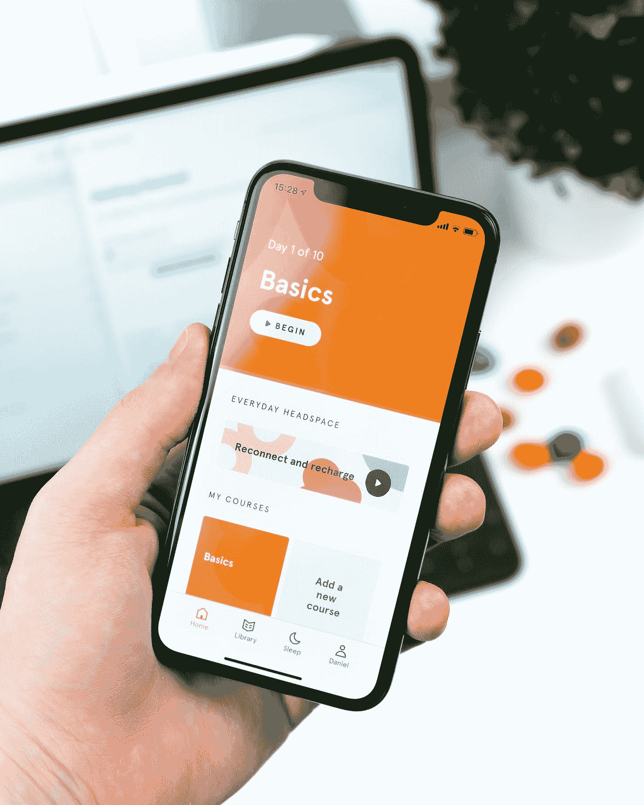

# 准备黑客马拉松的 5 个技巧

> 原文：<https://towardsdatascience.com/5-tips-to-prepare-for-a-hackathon-8917b75d9bed?source=collection_archive---------21----------------------->

参加黑客马拉松是你人生中必不可少的经历。你可以在那里找到很多乐趣，学习新东西，与不同领域的人建立关系网。我会推荐每个人都尝试一个。这里有 5 个技巧可以帮助你准备你的第一次黑客马拉松。

**1。找队友**

第一件必不可少的事情当然是寻找队友，一些黑客马拉松需要团队申请或者优先考虑团队。这可以节省组织者将参与者分组的时间，通常，预先形成的团队具有更高的工作效率和更好的协同作用。虽然可能会有例外情况，有时组织者希望自己安排团队，这样每个团队都可以有不同背景的专业知识，如果比赛前允许团队组建，你应该聪明点，先找到你的合作伙伴。要想组建一个加入黑客马拉松的完美团队，你应该找到不同领域的人，这样大家可以互相弥补不足，集中你的力量。还有[另一篇文章告诉你你应该为你的团队找到什么样的人，以及为什么你需要他们](/3-essential-persons-needed-to-win-a-hackathon-71391a084df0?source=friends_link&sk=5c4faa2f5eb2a5f05694cd02e0e801ba)。

在 [Unsplash](https://unsplash.com?utm_source=medium&utm_medium=referral) 上由[杜凡](https://unsplash.com/@miinyuii?utm_source=medium&utm_medium=referral)拍摄的照片

**2。集思广益**

黑客马拉松组织者可能会在黑客日之前发布竞赛主题，他们提前发布问题陈述的原因是为了让参与者有更多的时间研究主题。有时候，这些话题真的是公司的挣扎，所以这就是为什么他们举办黑客马拉松来帮助他们寻找解决方案。因此，他们希望给参与者更多的时间来思考想法。早点开始准备想法，你也可以计划一些问题在黑客日问导师。

帕特里克·帕金斯在 [Unsplash](https://unsplash.com?utm_source=medium&utm_medium=referral) 上拍摄的照片

**3。查找参考文献**

网上有很多源代码和模板，如 PowerPoint 和 mockup，因为黑客马拉松的时间有限，拥有现成的模板或源代码可以节省你很多时间。通常，对于在线源代码，您需要花一些时间来研究它们，以调试或确保与您的编程语言版本没有兼容性问题。对于演示板和模型，有许多有用的网站提供免费资源。不同的线框和原型开发软件有画廊来展示其他创作者的作品。你可以找到许多类似 Instagram 或 Carousel 的简单应用程序设计的线框。这些都是非常好的资源，可以帮助你快速启动你的项目。会有另一篇文章介绍一些方便的网站供你寻找漂亮的模板。

丹尼尔·科尔派在 [Unsplash](https://unsplash.com?utm_source=medium&utm_medium=referral) 上拍摄的照片

**4。公司背景研究**

基于公司的背景，你可以在你的演讲中加入一些元素，比如配色方案，他们的使命，以及他们最近的项目。这些都是能引起评委注意的细节。除此之外，如果你的项目想法能够与公司的使命相一致，你的项目将更容易引起评审团的兴趣，因此有更高的机会赢得黑客马拉松。此外，你也可以搜索一下，看看这些公司为什么组织黑客马拉松。一些共同的目的，包括促进创业文化，培养创新的品牌形象，招募人才。如果这些公司在过去的黑客马拉松中对获胜团队采取了任何后续行动，你可以根据列出的奖励或谷歌来判断。根据目的，你可以猜测哪些想法更能引起评委的兴趣。如果公司想鼓励年轻人创办自己的公司，你可以做一些你更感兴趣的事情，因为这个项目想法可能最终会成为一个创业公司。

照片由[本·怀特](https://unsplash.com/@benwhitephotography?utm_source=medium&utm_medium=referral)在 [Unsplash](https://unsplash.com?utm_source=medium&utm_medium=referral) 上拍摄

**5。想想加入的目的**

参加黑客马拉松有很多原因，他们可以结识新朋友，学习该领域的新技术，获得工作机会。在参加黑客马拉松之前，仔细想想你想要达到什么目标，以及为了达到目标你应该做些什么。例如，如果你想与领域专家交流，你可以稍微打扮一下，早点到达会场，抓住任何机会在舞台上或其他人面前展示自己。想获得工作机会怎么办？通常，黑客马拉松会有辅导环节。组织公司的高层将来到每个团队，听取他们的想法。准备好提出想法，这是给他们留下好印象的恰当时机。如果黑客马拉松的目标是学生，大多数都会为潜在参与者提供实习机会。

[Denys Nevozhai](https://unsplash.com/@dnevozhai?utm_source=medium&utm_medium=referral) 在 [Unsplash](https://unsplash.com?utm_source=medium&utm_medium=referral) 上的照片

希望这篇文章能帮助你更好地准备你的下一次黑客马拉松=)

如果你觉得我的文章有用，请在我的 linkedIn 页面上为我的技能背书，鼓励我写更多的文章。

最初发表于[cydalytics.blogspot.com](https://cydalytics.blogspot.com)