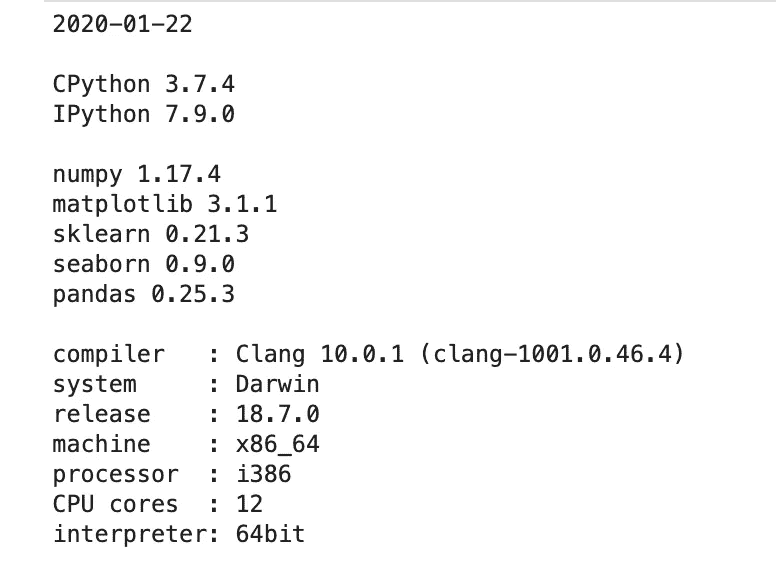
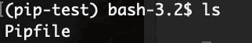
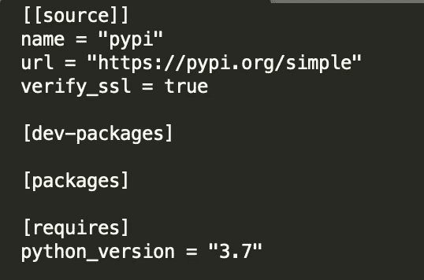
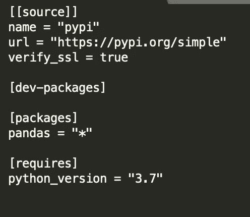
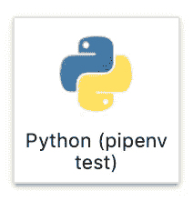
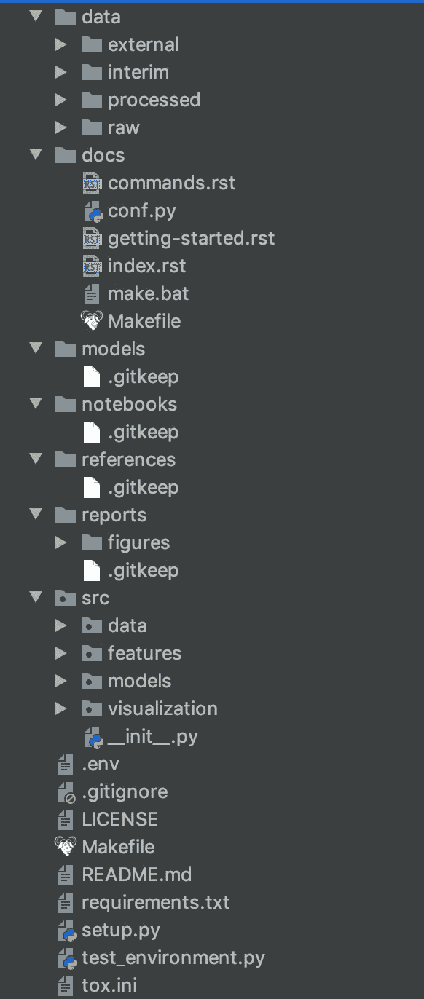
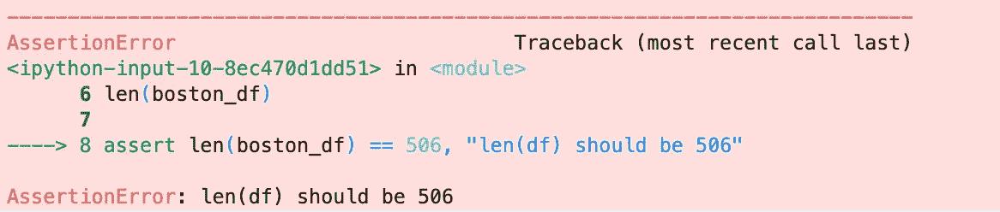

# 可再现数据科学的 5 个工具

> 原文：<https://towardsdatascience.com/5-tools-for-reproducible-data-science-c099c6b881e5?source=collection_archive---------16----------------------->


在 [Unsplash](https://unsplash.com/s/photos/experiment?utm_source=unsplash&utm_medium=referral&utm_content=creditCopyText) 上由[路易斯·里德](https://unsplash.com/@_louisreed?utm_source=unsplash&utm_medium=referral&utm_content=creditCopyText)拍摄的照片

## 使用这些工具开发协作、可信和高效的数据科学项目

科学上对再现性的定义是[“重复实验时获得一致结果的程度”](https://en.wikipedia.org/wiki/Reproducibility)。数据，尤其是保存在数据库中的数据，可能会发生变化。此外，数据科学在很大程度上基于随机抽样、概率和实验。因此，在这一领域，进行分析和构建模型，让同事或您在未来某个时间点重现结果和成果，是一项颇具挑战性的工作。

尽管获得数据可能具有挑战性，但有许多原因表明再现性对于良好的数据科学至关重要。

1.  **再现性支持协作。**数据科学项目很少是孤立发生的。在大多数情况下，数据科学家与其他数据科学家和其他团队一起工作，将项目集成到业务流程中。为了有效地协作，其他人可以重复、继续和维护您的工作是很重要的。
2.  **再现性也支持效率。为了能够最有效地工作，你和你的同事必须在你的工作基础上继续努力。如果结果或过程不能准确地重复，那么在现有工作的基础上发展是非常困难的，相反，你会发现你不得不从头开始一个项目。**
3.  **再现性建立信任。**如前所述，数据科学是一门建立在概率和实验基础上的学科。在这个领域中，对结果的信任是非常重要的，这样才能发展对项目的认同，并与其他团队有效地合作。

在接下来的文章中，我将分享 5 个有助于数据科学重现性的工具。这些工具中的每一个都提供了解决围绕创建可再现数据科学项目的特定挑战的功能，包括:

*   记录项目中使用的工具、库和版本。
*   为数据科学项目创建独立、一致的环境。
*   开发一致的、易于阅读的文件结构。
*   为您的代码编写测试。
*   使用版本控制。

## 水印

[Watermark](https://github.com/rasbt/watermark) 是一个 IPython magic extension，可以打印任何 IPython shell 或 Jupyter 笔记本会话中的软件版本、硬件以及日期和时间信息。

Watermark 提供了一种非常快速简单的方法来跟踪项目中涉及的工具、库、版本、作者和日期。这对于仅在笔记本上进行的临时或一次性工作，而不是较大的项目特别有用。这意味着，如果一位同事想要重复一项工作，他们对需要安装的工具和库有一个很好的想法，谁创建了这项工作，以及它是什么时候被放在一起的。

要安装 watermark，请在您的终端上运行以下命令。

```
pip install watermark
```

要在 Jupyter 笔记本或 IPython shell 中使用该扩展，请运行以下命令。

```
%load_ext watermark
```

您可以通过指定多个标志来选择要打印的信息。可用标志的完整列表在[文档](https://github.com/rasbt/watermark#installation-and-updating)中列出。但是作为示例，下面的代码打印了当前日期、我正在使用的 python 和 IPython 的版本、我已经安装和导入的库的版本，以及关于我正在使用的硬件的信息。输出显示在代码下方。

```
%watermark -d -m -v -p numpy,matplotlib,sklearn,seaborn,pandas 
```



## Pipenv

在数据科学中，创建项目的环境，即安装的工具、库和版本，对复制相同的结果有很大的影响，并且在许多情况下能够在另一台计算机上运行代码。

虚拟环境是为单个项目提供封闭环境的工具。这些环境包含一个通常称为需求文件的文件，该文件列出了项目的依赖项(工具、库和版本)。当您创建一个虚拟环境时，您可以选择安装该文件中的所有依赖项，从而重现最初创建该项目的环境。

创建虚拟环境的工具有很多，但是如果你使用 python，那么 [pipenv](https://github.com/pypa/pipenv) 是最好的工具之一。

要安装 pipenv，请运行以下命令。

```
$ brew install pipenv
```

使用特定版本的 python 创建新环境。创建一个新目录，然后从新目录运行以下命令。

```
mkdir pip-test
cd pip-test
pipenv --python 3.7
```

要激活环境运行`pipenv-shell`，您现在将进入一个名为“pip-test”的新环境。


如果我们检查目录的内容，我们会看到 pipenv 已经创建了一个名为`Pipfile`的新文件。这是需求文件的 pipenv 等价物。

```
ls
```



让我们检查一下这个文件的内容。如有必要，将“Sublime Text”替换为您首选的文本编辑器的名称。

```
open -a "Sublime Text" Pipfile
```

新文件包含以下内容。



我们目前没有在环境中安装任何软件包，但是如果我们安装了，我们会在这个文件中看到它们。让我们安装熊猫来测试这个。

```
pipenv install pandas
```

如果我们再次打开文件，我们可以看到 pandas 现在已经被添加到 Pipfile 中。



现在，让我们假设一位同事想在另一台计算机上处理您的项目。如果他们要从 Github 克隆你的回购协议，Pipfile 将包含在这个文件中。然后，他们可以通过运行以下命令，简单地重新创建您一直在使用的确切环境。

```
pipenv install --dev
pipenv shell
```

这将在您工作的目录中创建一个 pipenv 环境，并安装 pip 文件中的所有依赖项。

如果您想在 Jupyter 笔记本会话中使用这个环境，那么您需要运行这个代码。您可以将名称和显示名称更改为对您的环境有意义的名称。当您启动 Jupyter 笔记本会话时，这将显示为一个图标，可从启动程序屏幕中选择(显示在代码下方)。使用这个内核创建的任何新笔记本都将包含 pipenv 环境中的所有依赖项。

```
python -m ipykernel install --user --name myenv --display-name "Python (pipenv test)"
```



## 烹饪刀具

拥有一个定义明确、一致的数据科学项目结构可以让协作、共享和构建项目变得更加容易。Cookie-cutter-data-science 是一个工具，它用一行代码创建了一个标准的项目框架结构。

要安装，请运行以下命令。

```
pip install cookiecutter
```

要创建一个新项目，您只需运行。

```
cookiecutter https://github.com/drivendata/cookiecutter-data-science
```

该工具将提示您输入许多详细信息，其中许多是可选的。


现在已经创建了以下项目结构，这对于大多数数据科学项目来说已经足够了。



## Pytest

[Pytest](https://docs.pytest.org/en/latest/) 是一个对你的 python 代码进行单元测试的工具。单元测试是一个可重复的操作，您可以将它添加到代码中，检查各个代码单元是否按预期工作。单元测试是为您编写的代码添加信任的良好实践。

Pytest 可以安装并导入使用，如下所示。

```
pipenv install pytestimport pytest
```

一个简单的测试可能是检查您正在导入的数据是否已经更改。

```
import pandas as pd
from sklearn.datasets import load_bostonboston = load_boston()
boston_df = pd.DataFrame(boston.data, columns=boston.feature_names)
len(boston_df)assert len(boston_df) == 506
```

您可以向语句中添加一条有用的错误信息，以便更容易地调试代码。

```
assert len(boston_df) == 506, "Len(df) should be 506"
```

如果我们随后更改数据，将会显示错误消息。

```
import pandas as pd
from sklearn.datasets import load_wineboston = load_wine()
boston_df = pd.DataFrame(boston.data, columns=boston.feature_names)
len(boston_df)assert len(boston_df) == 506, "len(df) should be 506"
```



## 开源代码库

版本控制是开发可重复项目、共享工作和促进协作的重要工具。维护项目的远程和本地版本允许其他人访问和开发他们自己的本地版本，回滚和监控代码更改，并安全地合并更改和新功能。

Github 是版本控制最知名和最广泛使用的平台之一。Github 使用一个名为 Git 的应用程序对代码进行版本控制。项目文件存储在一个称为存储库的中央远程位置。每次你在你的机器上做了一个本地的修改，然后推送到 Github，你的远程版本就会被更新，提交的内容会被记录下来。如果您想在提交之前回滚到项目的前一个版本，该记录允许您这样做。

此外，由于项目文件存储在远程位置，任何其他人都可以下载回购协议并对项目进行更改。分支的概念，本质上意味着你制作一个完全独立的项目的临时副本，意味着你可以首先在那里进行修改，而不用担心破坏任何东西。

关于使用指南，我在这里为数据科学家[写了一份 Github 指南。](/introduction-to-github-for-data-scientists-2cf8b9b25fba)

与传统的软件开发不同，目前在数据科学项目中有最低限度的标准实践。然而，上面描述的工具对创建标准实践大有帮助，这反过来将导致更多可重复的数据科学项目。

感谢阅读！