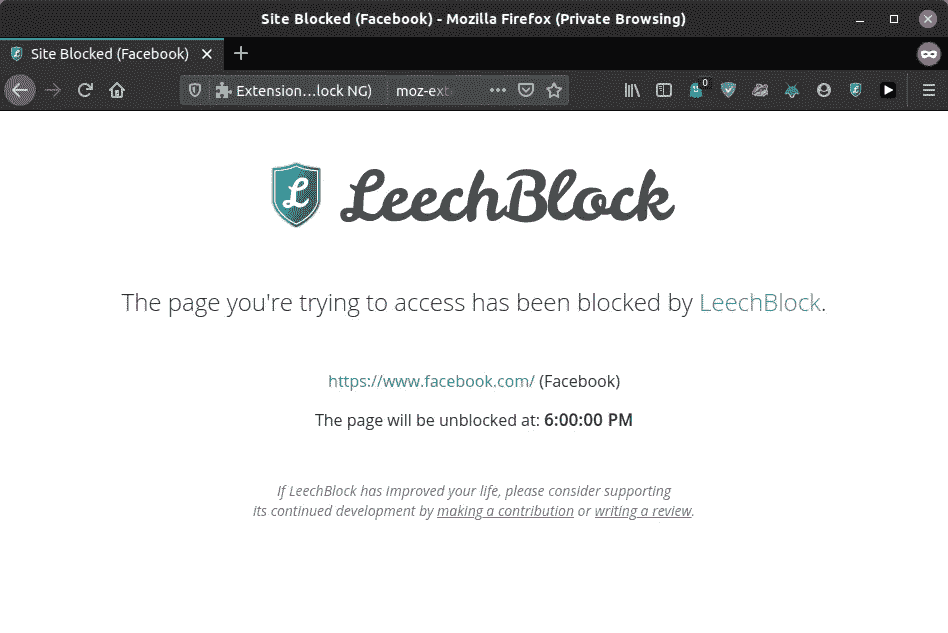
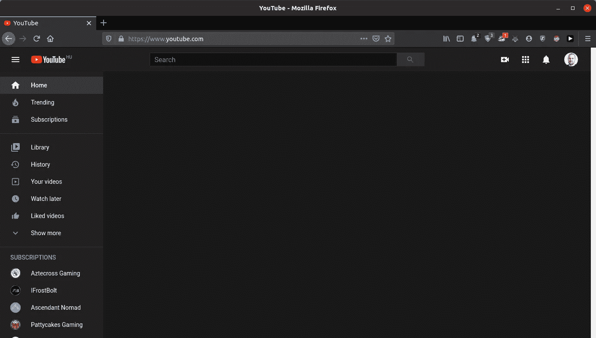
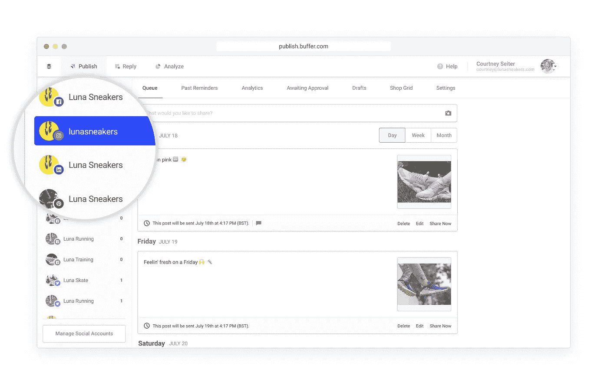
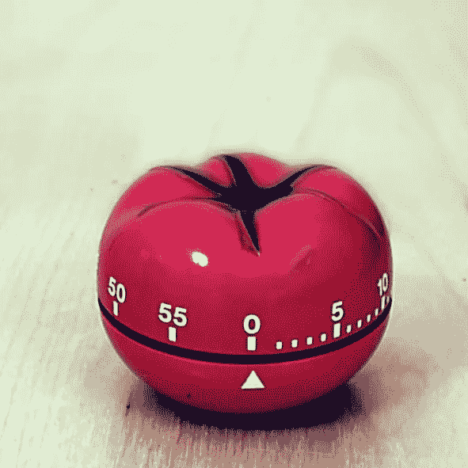

# 5 个工具保护你的注意力不被工作中的数字干扰

> 原文：<https://towardsdatascience.com/5-tools-to-protect-your-attention-from-digital-distractions-at-work-a7024adfec1a?source=collection_archive---------49----------------------->

贝基尔·登梅兹在 [Unsplash](https://unsplash.com?utm_source=medium&utm_medium=referral) 上拍摄的照片

## 控制你的思维，通过消除干扰来增强你的表现

我刚刚查看了时间。又浪费了半个小时，在 YouTube-Twitter-脸书三角的黑洞中度过。它开始是快速检查任何新消息，但后来我点击了我的新闻订阅中的一个视频，导致推荐和自动播放的兔子洞。

因为我在电脑前工作，这种事过去经常发生在我身上。分心总是在几个点击之外。我曾经去过肌肉记忆的脸书*。Alt + Tab 打开浏览器，Ctrl + T 打开一个新的选项卡，只需在导航栏上放一个 *f* ，浏览器就知道我想要什么。无意识地做到这一点是如此容易。*

斯蒂芬·科斯马在 [Unsplash](https://unsplash.com?utm_source=medium&utm_medium=referral) 上拍摄的照片

很快，我意识到这需要停止。这种感觉你大概很熟悉。

> 社交媒体和其他数字工具是双刃剑。

它们在某些场合是有用的，但在其他方面是为了让你尽可能长时间参与，即使你并不真的想参与。为了与他们保持健康的关系，必须建立最佳实践，并划定界限。否则，你的表现会受到影响。(最终，你的心理健康。)

在这篇文章中，我将帮助你保护你的两个最宝贵的资源:你的时间和注意力。

# 1.网站拦截器

处理分心是很累的。如果一个源头出现了，你不得不花费精力去避开它。

> 处理注意力分散的首要方法是消除它的来源。

最明显的方法是根本不使用浏览器。然而，这在实践中是不可能的。(有时生产率与每小时堆栈溢出页面数成正比。)

一个可行的选择是提前屏蔽掉所有让人分心的网站。为此我使用了[LeechBlock](https://www.proginosko.com/leechblock/)([Firefox](https://addons.mozilla.org/en-US/firefox/addon/leechblock-ng/)、 [Chrome](https://chrome.google.com/webstore/detail/leechblock-ng/blaaajhemilngeeffpbfkdjjoefldkok) )，但是还有很多其他选项，比如 [BlockSite](https://blocksite.co/) 和[stay focused](https://chrome.google.com/webstore/detail/stayfocusd/laankejkbhbdhmipfmgcngdelahlfoji)。

脸书，被李奇布洛克挡住了。

如果你习惯了令人分心的网站被屏蔽，本能地打开它们的冲动也会消失。屏蔽是保护你注意力的绝对必备工具。

# 2.推荐/新闻订阅阻止程序

完全屏蔽网站可能并不适用于所有情况。你可能会在 YouTube 上听音乐，或者在 Twitter 上发帖。在这些情况下，有一些工具可以通过隐藏新闻提要和推荐来减少这些网站的干扰。

例如，DF YouTube 浏览器扩展( [Firefox](https://addons.mozilla.org/en-US/firefox/addon/df-youtube/) ， [Chrome](https://chrome.google.com/webstore/detail/df-tube-distraction-free/mjdepdfccjgcndkmemponafgioodelna) )将使所有推荐从网站中消失，甚至从侧边栏中消失。

DF YouTube for Firefox。(是的，我知道，我关注了太多的游戏频道。)

通过这种方式，你必须对 YouTube 的使用有明确的认识。不再迷失在推荐的视频中。

对于脸书，你可以使用 News Feed Eradicator 扩展( [Firefox](https://addons.mozilla.org/en-US/firefox/addon/news-feed-eradicator/) ， [Chrome](https://chrome.google.com/webstore/detail/news-feed-eradicator-for/fjcldmjmjhkklehbacihaiopjklihlgg) )，它用励志名言取代了无限滚动的 Feed。

如果你是 iOS 用户， [FeedZen](https://feedzen.app) 可能对你有用，它会屏蔽所有的社交媒体信息。由于安全特性，它只有在你从内置的 Safari 浏览器访问网站时才有效，但如果你真的想消除干扰，你就不应该在手机上安装任何社交媒体应用程序。(除非你的工作涉及到他们。)

# 3.社交媒体管理工具

如果你意识到个人品牌，你会持续使用社交媒体与人交流并推广你的工作。(或者处理社交媒体是你的工作。)这会让人分心。在我看来，管理这些的最好工具是第三方应用程序，让你不用真正使用 Twitter、Instagram 或其他工具就可以整合账户和创建帖子。

这有几个应用。我使用 [Buffer](https://buffer.com/publish) (它有一个免费的计划)，但有几个替代方案，如 [Sprout Social](https://sproutsocial.com/) 或 [Hootsuite](https://hootsuite.com/) ，它们提供类似的功能。

缓冲发布来处理社交媒体帐户。来源:[缓冲](https://buffer.com/business)

这样，你可以在不访问网站本身的情况下发表文章，避免被拖入无限滚动的提要中。

# 4.适应音乐聆听习惯

工作时听音乐的习惯当然取决于个人喜好，但是有一些最佳实践可以帮助你集中注意力。

关于这一点，最重要的是音乐的选择。为了避免花费过多的时间挑选完美的音乐来听，你应该

1.  关闭推荐，
2.  提前创建播放列表。

> 选择下一张专辑来听会导致长时间的浏览，这是浪费时间。

不仅如此，从切换曲目等干扰中恢复甚至需要几分钟。你不会想把这些加起来的。

我不会推荐任何关于特定音乐的东西，这完全取决于你。有些人只喜欢器乐，有些人不喜欢，这完全没问题。你听你想听的，只是不要把时间和精力花在*决定听什么*上。提前做好这项工作。

# 5.番茄工作法:管理工作和休息时间

焦点不能无限期地保持。深度工作会话的平均时间因人而异，但一段时间后，每个人都会失去注意力并降低绩效。这不仅适用于整个工作日，也适用于你一天中的单个工作时段。

> 如果你在一项任务上花了很长时间而没有休息，你会失去注意力。

弗朗切斯科·西里洛发明的[番茄工作法](https://en.wikipedia.org/wiki/Pomodoro_Technique)给你一个框架来调节你的工作时间并集中你的注意力。( *Pomodoro* 在意大利语中代表*番茄*，名字来源于作者使用的番茄形状的厨房定时器。)

番茄定时器。来源:[维基百科](https://en.wikipedia.org/wiki/Pomodoro_Technique#/media/File:Il_pomodoro.jpg)

这个方法尽可能简单。本质上，这就是工作流程。

1.  决定一项工作任务。
2.  将计时器设置为 25 分钟。只关注手头的任务。
3.  定时器到时，设为 5 分钟，休息一下。
4.  重复 2。-3.(如果你做了 4 次，你可以有更长的 15 分钟休息时间。)

这个技巧的主要优点是它让你意识到工作和休息。在会话过程中识别注意力分散变得很容易，这是防止注意力分散的第一步。

事实上，我现在正在使用这种方法。没有必要为此购买任何厨房定时器，像 [TomatoTimer](https://tomato-timer.com/) 这样简单的网络应用程序就可以完美地工作。

照片由[丹尼尔·奥伯格](https://unsplash.com/@artic_studios?utm_source=medium&utm_medium=referral)在 [Unsplash](https://unsplash.com?utm_source=medium&utm_medium=referral) 上拍摄

# 结论

你的注意力是你最宝贵的资源之一。无论你专注于什么，都会成长。另一方面，为了廉价的多巴胺刺激而放弃它，比如经常检查脸书，会阻碍你的进步。

学会管理注意力是成功的基本技能。如果你在电脑前工作，你尤其危险。分心总是在几个点击之外。要处理它，您必须消除其根源并建立最佳实践。

> 你没有时间浪费时间。

[***如果你喜欢把机器学习概念拆开，理解是什么让它们运转，我们有很多共同点。看看我的博客，我经常在那里发表这样的技术文章！***](https://www.tivadardanka.com/blog)