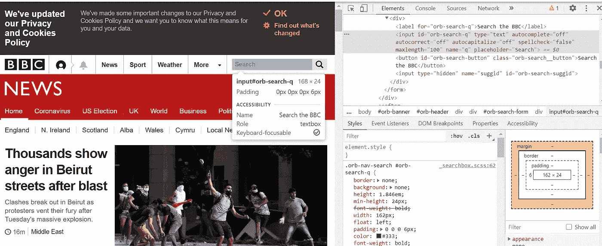
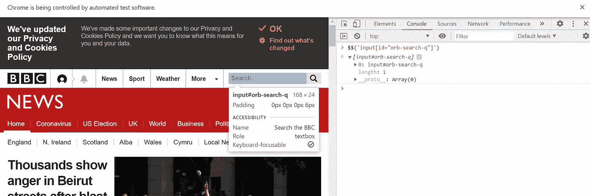
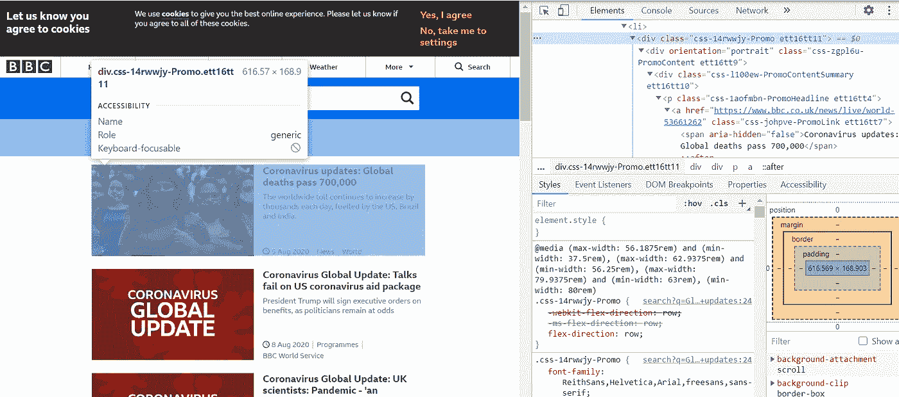
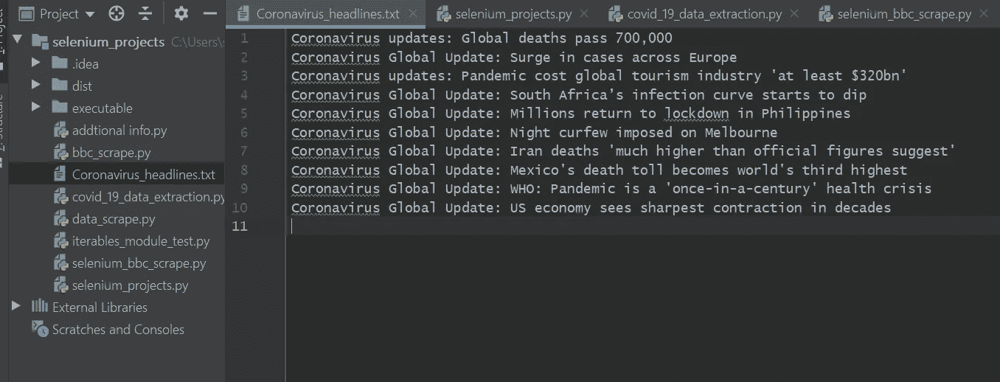

# 在 Python 中使用 Selenium 进行数据搜集的 5 个技巧

> 原文：<https://towardsdatascience.com/5-top-tips-for-data-scraping-using-selenium-d8b83804681c?source=collection_archive---------23----------------------->

## 在 Python 中使用 selenium 的最佳数据搜集实践

图片由 istock 通过 [Ada Yokota](https://www.istockphoto.com/portfolio/AdaYokota?mediatype=illustration) 提供

## 用于网刮的硒

Selenium 是一个浏览器自动化库。Selenium 最常用于测试 web 应用程序，可以用于任何需要与浏览器自动交互的任务。这可以包括网络抓取。

下面的教程将是一个用户引导的使用 selenium 进行 web 抓取的最佳实践指南。我列出了我的 5 个顶级技巧，它们将帮助用户使用 Python 尽可能高效地抓取他们请求的任何数据，并使用尽可能少的代码。

## 目标:

从 BBC 新闻中提取冠状病毒全球头条。

## 先决条件

要学习本教程，您需要:

1.  下载 selenium 驱动程序。chrome 驱动程序可用于与 chrome 交互，此处[提供。](https://chromedriver.storage.googleapis.com/index.html?path=85.0.4183.38/)
2.  `pip install selenium`

## 5 个硒最佳实践技巧

## 技巧 1:将 webdriver 可执行文件放在 PATH 中

要开始我们的网页抓取任务，我们必须首先导航到下面的页面，[https://www.bbc.co.uk/news](https://www.bbc.co.uk/news)。这一步只用三行代码就可以完成。首先我们从 selenium 导入 webdriver，创建 chrome webdriver 的一个实例，最后在名为 driver 的 webdriver 对象上调用 get 方法。

为了使代码简短易读，chromedriver 可执行文件可以放在用户选择的文件夹中。然后，可以将该目的地添加到环境变量下的 PATH 中。简单地使用 webdriver，webdriver 就准备好了。括号中没有传递给 Chrome 的参数。

## 技巧二。使用控制台查找任何 webelement

当我们导航到网页时，我们希望找到搜索框，点击它并开始键入“冠状病毒全球更新”。

要找到这个 webelement，我们只需右键单击 chrome 并选择 inspect。在我们检查时打开的页面的左上角，我们可以使用光标悬停并选择感兴趣的 web 元素。如图所示，搜索框有一个输入标签，id 值为‘orb-search-q’。

我们如何确保这是我们唯一感兴趣的搜索元素？

我们可以简单地选择控制台选项卡窗口，然后键入两个美元符号，后面跟着括号和引号。在引号内，我们写标记输入，后跟方括号。在那些方括号中，我们可以添加 id 及其值。

`Format to find CSS selectors`

`$$('tag[attribute="attribute value"]')`

如图所示，只返回一个元素的数组。我们可以确信我们现在有正确的搜索框可以点击，并开始输入我们的搜索查询。

控制台中引号的内容是一个**有效的 CSS 选择器**，我们可以在脚本中使用它来查找 webelement。

这就引出了下一个技巧。

## 技巧 3:强大的数据搜集一行程序:动作链和键

我们现在可以调用 webdriver 对象驱动程序上的`find_element_by_css_selector`方法。

我们希望我们的 webdriver 移动到这个 webelement，单击它，键入我们的搜索查询“全球冠状病毒更新”，然后按 enter 键。

这可以使用 selenium 的 ActionChains 和 Keys 类轻松完成。我们简单地将驱动程序传递给 ActionChains，方法链使用方法，`move_to_element`，`click`，`send_keys`来输入类型，`key_down`使用传递的`Keys.ENTER`来模拟输入。要运行这个命令，请在 ActionChain 的末尾添加`perform`方法。

运行 ActionChain 将我们带到这里:

## 技巧 4:捕获数据

所示的 webelement 返回图像、标题、副标题和一些附件信息，如出版日期。

我们如何从每个故事中捕捉到标题？

如果我们在控制台中键入如下所示的 webelement，它将返回 10 个 web 元素的列表。我们想从这些故事中提取标题。

为此，我们可以简单地迭代这 10 个故事。为此，我们调用传递了 web 元素的`find_elements_by_css_selector`。这个方法返回一个我们可以迭代的类似列表的对象。

我们可以将它赋给变量名 top_titles，并使用 for 循环遍历它们。在 for 循环中，我们可以使用 2 号提示找到与每个标题相关的元素，并通过调用 webelement 上的`.text`提取文本。

除了打印到终端控制台，我们还可以写入一个. txt 文件，这样无论何时运行脚本，我们都有一个标题的永久副本。

## 技巧 5:无头 webdriver

当我们运行脚本来提取标题时，会弹出一个浏览器窗口，如下面的视频所示。

虽然这看起来很有趣，但在很大程度上，这可能不是我们想要的。

要删除浏览器，从 selenium 模块导入 Options 类，创建该类的一个实例，并使用传递的字符串参数'— headless '调用该实例上的`add_argument`方法。最后，在 webdriver 中，在 options 参数下，添加指向 headless 浏览器的变量。

## 额外提示:在慢速连接的情况下，添加等待来查找元素

Webdriver 等待、等待和预期条件

为了确保网络抓取成功，我们可以在脚本中引入一个等待。这个特性在网页加载缓慢的情况下特别有用。为此，我们导入所示的三个类。

引入等待的好处在于，当它们被构造时，几乎可以写成一个句子。此外，只要我们愿意，他们就可以搜索 webelement。如果 web 元素发现得更早，脚本也会执行得更早。

这里，我们传递我们的驱动程序对象 WebDriverWait 类，告诉它最多等待 10 秒钟，直到找到元素。在`until`方法中，我们传递别名为 EC 的`ExpectedConditons`类，并在其上调用定位元素的方法。然后，我们向这个方法传递一个定位器元组，详细说明我们正在搜索什么元素(通过。CSS_SELECTOR)和 webelement。

等待将使您的脚本更健壮，更不容易出现超时异常。

这里显示了这些示例的脚本。

## 将自动化脚本转换成类

## 冠状病毒标题类

当我们确信 web 自动化工作正常时，我们现在可以将代码转换成一个类。为了让这个类的潜在用户简单明了，我决定把这个类叫做`CoronaVirusHeadlines`。

在`init`构造函数中，我在指向 Chrome webdriver 的对象中设置了一个驱动属性。

该代码与前面几节中展示的过程代码完全相同(除了我已经删除了 headless 选项)。唯一的例外是驱动程序已被设置为对象中的一个属性。驱动程序在 init 方法中被初始化，并在`get_headlines`方法中被用来检索标题。

为了获得标题，我简单地创建了这个类的一个实例，名为`virus_data`。然后我调用这个类上的`get_headlines`方法来检索. txt 文件中的标题。

在我的本地目录中，我现在可以检查名为“冠状病毒 _ 头条新闻. txt”的文件。

如下图，标题已经被刮成了一个. txt 文件。请记住，如果你自己运行代码，标题当然会有所不同，因为冠状病毒疫情不断演变，每天都有新的故事发布到 BBC。

## 摘要和扩展

这些是我使用硒来刮痧的一些最好的技巧。一些技巧，包括 actionchain 和 wait 技巧，可读性很强，也很容易被其他阅读你的代码的人理解。

该脚本很容易扩展。您也可以导航到第二页来检索接下来的 10 个标题。或者，您可能希望将标题通过电子邮件发送或转换成可执行文件，这样标题就可以与您和您感兴趣的同事/朋友共享，他们可能不一定使用 Python。这可以分别使用`smtplib`或`PyInstaller` 模块来实现。

感谢阅读。