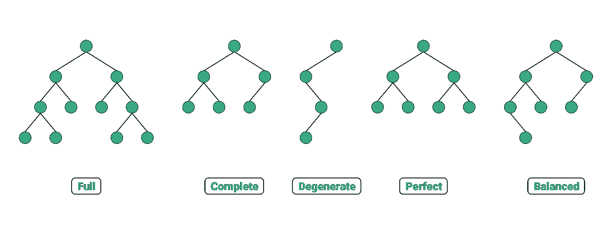
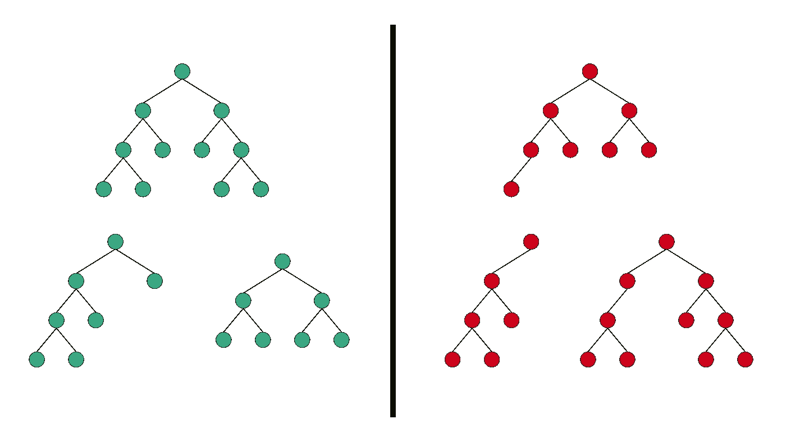
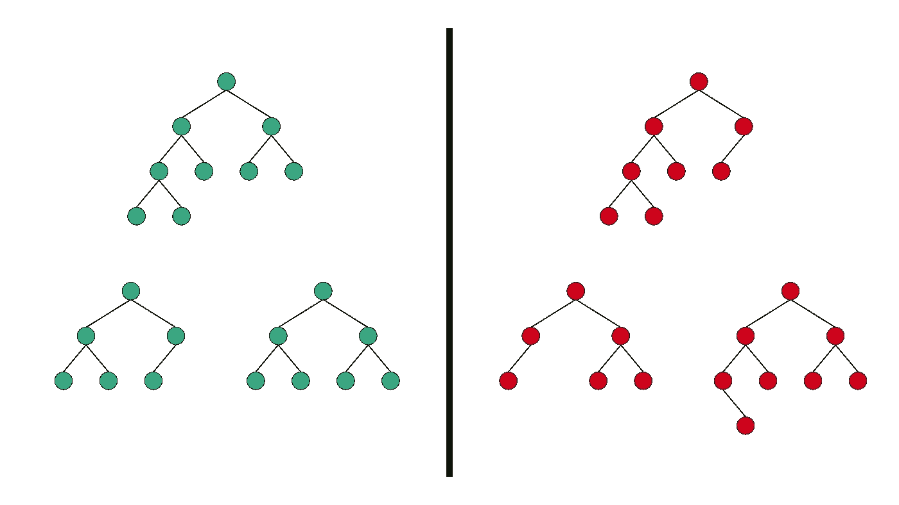
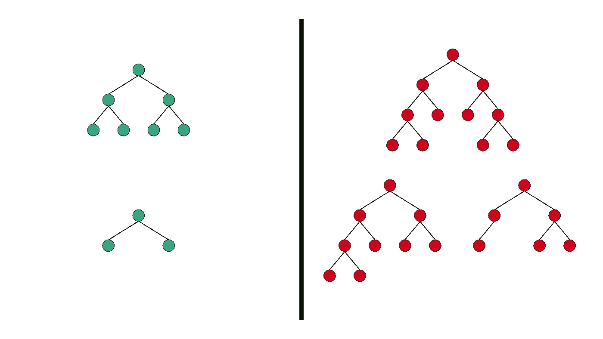
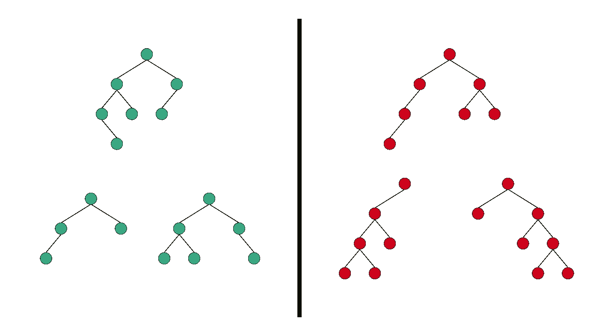
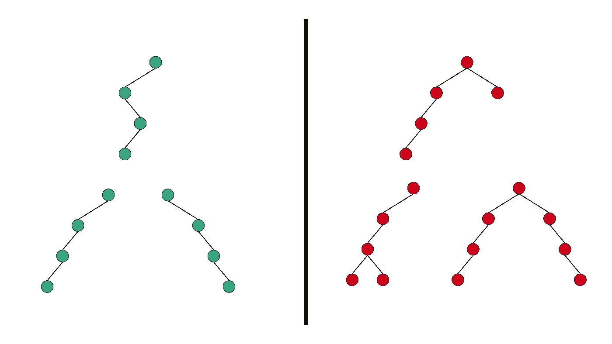

# 不同类型的二叉树与彩色插图

> 原文：<https://towardsdatascience.com/5-types-of-binary-tree-with-cool-illustrations-9b335c430254?source=collection_archive---------2----------------------->

## 一个有助于识别那些令人困惑的二叉树类型的指南

二叉树的类型||由 [Anand K Parmar](https://medium.com/u/bafde9c53431?source=post_page-----9b335c430254--------------------------------) 设计

B **二进制树**是一种树形数据结构，其中每个节点最多有 2 个子节点。二叉树有几种类型，它们的名字很难记住。

我写这篇文章是为了了解 5 种常用的二叉树类型。除了编写定义，我还为任何特定类型的有效和无效树结构添加了很酷的插图。

# **1。完全二叉树**

**全二叉树**是每一个节点都有 0 或 2 个子节点的二叉树。

全二叉树的有效和无效结构||由 [Anand K Parmar](https://medium.com/u/bafde9c53431?source=post_page-----9b335c430254--------------------------------) 设计

> **有趣的事实:**对于全二叉树，下面的等式永远成立。
> 
> 叶节点数=内部节点数+ 1

# 2.完全二叉树

**完全二叉树**除了最后一层，所有层都被节点完全填充，在最后一层，所有节点尽可能在左侧。

完全二叉树的有效和无效结构||由 [Anand K Parmar](https://medium.com/u/bafde9c53431?source=post_page-----9b335c430254--------------------------------) 设计

> **有趣的事实:**二叉堆是完全二叉树的一个重要用例。

# 3.完美二叉树

**完美二叉树**是所有内部节点都有 2 个子节点且所有叶节点都在同一深度或同一级别的二叉树。

完美二叉树的有效和无效结构||由 [Anand K Parmar](https://medium.com/u/bafde9c53431?source=post_page-----9b335c430254--------------------------------) 设计

> **有趣的事实:**一棵高度为 **H** 的完美二叉树的节点总数是 **2^H — 1** 。

# 4.平衡二叉树

**平衡二叉树**是每个节点的左右子树的高度最多相差 1 的二叉树。

平衡二叉树的有效和无效结构||由 [Anand K Parmar](https://medium.com/u/bafde9c53431?source=post_page-----9b335c430254--------------------------------) 设计

> **有趣的事实:** AVL 树和红黑树是众所周知的生成/维护平衡二叉查找树的数据结构。搜索、插入和删除操作花费 O(log n)时间。

# 5.退化(或病态)二叉树

**退化二叉树**是每个父节点只有一个子节点的二叉树。

退化二叉树的有效和无效结构||由 [Anand K Parmar](https://medium.com/u/bafde9c53431?source=post_page-----9b335c430254--------------------------------) 设计

> **有趣的事实:**退化二叉树的高度等于该树中节点的总数。

# 您的机会…

加入我的部落后，获得我的个人 Java 收藏清单作为免费的欢迎礼物。 [*马上获取！*](https://mailchi.mp/809aa58bc248/anandkparmar)

# 关于作者

Anand K Parmar 是一名软件工程师，热爱设计和开发移动应用程序。他是一名作家，发表关于计算机科学、编程和个人理财的文章。在 [LinkedIn](https://www.linkedin.com/in/anandkparmar/) 或 [Twitter](https://twitter.com/anandkparmar_) 上与他联系。下面是他的最新文章。

 [## 4 种类型的树遍历算法

### 在 7 分钟内你需要知道的关于树遍历的一切(带动画)

towardsdatascience.com](/4-types-of-tree-traversal-algorithms-d56328450846)  [## 每个初学者都应该知道数据结构和算法之间的区别

### 理解计算机科学基础的简单指南

medium.com](https://medium.com/swlh/differences-between-data-structures-and-algorithms-eed2c1872cfc)