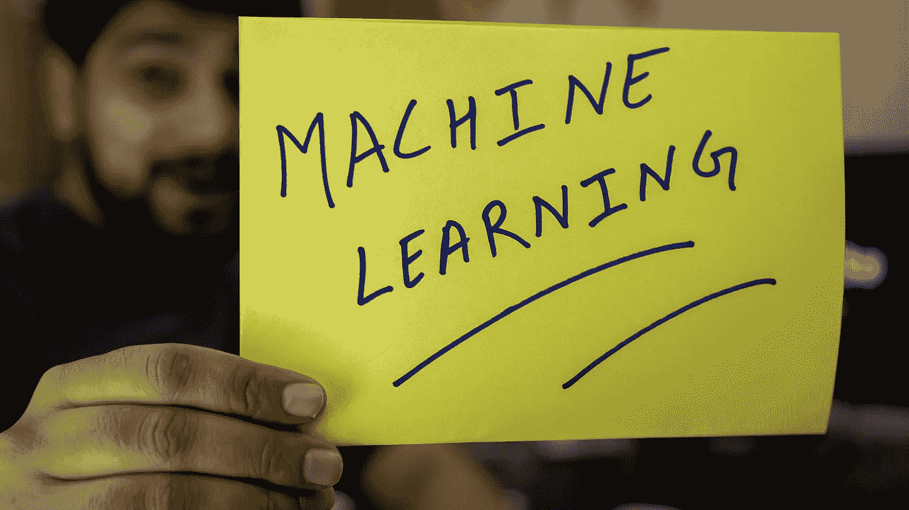

# 5 种数据科学工作

> 原文：<https://towardsdatascience.com/5-types-of-data-science-jobs-b5b3364acf73?source=collection_archive---------17----------------------->

## 意见

## 哪个适合你？


由 [Alex](https://unsplash.com/@brizmaker?utm_source=unsplash&utm_medium=referral&utm_content=creditCopyText) 在[Unsplash](https://unsplash.com/s/photos/different-colors?utm_source=unsplash&utm_medium=referral&utm_content=creditCopyText)【1】上拍摄的照片。

# 目录

1.  介绍
2.  数据科学建模师
3.  机器学习—平台工程
4.  机器学习—软件工程
5.  数据工程师
6.  分析师和见解
7.  摘要
8.  参考

# 介绍

虽然与其他角色相比，数据科学角色的正式头衔、数量和百分比有无数来源，但我想更多地关注角色本身的个人经历。数据科学工作描述是一回事，实际的日常角色是另一回事。几年来，在与其他人共事的过程中，我意识到有不同类型的数据科学角色，并且，我将讨论的任何角色有时都可以有相同的职位头衔，即数据科学家。根据公司的不同，你会看到这些更具体的角色被逐字突出显示。哪些角色适合你，哪些你已经从事过？您是否发现了数据科学职位之间的差异，或者您通常将所有职位都视为一个角色的一部分？此外，请记住，这篇文章是一篇观点文章，所以它是我在这个行业工作时收集的各种经验。当然，一些公司要求您了解所有这些职位的所有技能，但是随着您的团队在公司的发展，您可能会发现某些人会专注于他们的优势，以最终解决数据科学的大多数问题，因此成为以下某个角色的专家。

# 数据科学建模师



照片由 [Hitesh Choudhary](https://unsplash.com/@hiteshchoudhary?utm_source=unsplash&utm_medium=referral&utm_content=creditCopyText) 在[Unsplash](https://unsplash.com/s/photos/artificial-intelligence?utm_source=unsplash&utm_medium=referral&utm_content=creditCopyText)【2】拍摄。

这个角色是最传统的数据科学焦点，这意味着这个角色需要业务陈述和问题、利益相关者讨论、数据清理以及最重要的建模。您可以将该角色视为软技能和数据科学建模技能的结合。这个职位通常不需要太多的软件工程(*它仍然需要——只是相对于*下面的一些其他角色来说不需要那么多。我这句话的意思是，你很可能会在你的 Jupyter 笔记本上创建不同的模型，测试和研究不同的交互——而不是太关注面向对象编程( *OOP* )。对于一些公司来说，这个角色可能只是在你的本地，而不是在你公司的生产环境中。您可以期待与不同类型的机器学习工程师合作，最终部署并自动化这一模型。

*以下是你在这种特定类型的角色中可以期待的一些关键技能:*

*   与利益攸关方的会议
*   制定业务问题陈述
*   数据科学将如何解决这个问题？
*   获取数据(*自己或从数据工程师那里获取*
*   -此数据收集可能需要数周时间，从各种来源查找要素
*   清理和准备数据
*   开发和测试不同的算法
*   最终确定最佳算法，然后交付生产
*   Jupyter Notebook ( *请记住，许多工作可以在这个不涉及生产的地方进行*

# 机器学习—平台工程


照片由[克里斯蒂安·威迪格](https://unsplash.com/@christianw?utm_source=unsplash&utm_medium=referral&utm_content=creditCopyText)在[Unsplash](https://unsplash.com/s/photos/amazon?utm_source=unsplash&utm_medium=referral&utm_content=creditCopyText)【3】上拍摄。

该角色专注于最终选择用于生产的数据科学模型。另一种看待这个角色的方式是部署模型的人。无论是在 Google Cloud Composer 还是 Amazon SageMaker 中，这个人都将是这些工具细节的专家(*和其他类似工具*)。

*关键工具和经验包括:*

*   谷歌云作曲家
*   气流
*   码头工人
*   熟练的技艺
*   亚马逊 SageMaker

# 机器学习—软件工程


照片由 [ThisisEngineering RAEng](https://unsplash.com/@thisisengineering?utm_source=unsplash&utm_medium=referral&utm_content=creditCopyText) 在[Unsplash](https://unsplash.com/s/photos/coding?utm_source=unsplash&utm_medium=referral&utm_content=creditCopyText)【4】上拍摄。

这个角色主要负责模型和部署的编码。此人通常首先是软件工程师，然后在数据科学团队工作，通常会确认 GitHub pull 请求的代码、文件和整体结构是否正确或最有效。这个人也与部署这些模型的平台一起工作。该角色将与上述角色重叠。

这里有一些你可以从这个职位中获得的技能和经验:

*   Python 编程
*   r 编程
*   面向对象的编程风格
*   敏捷方法
*   版本控制
*   节省时间和内存—效率

# 数据工程师


由[托拜厄斯·费希尔](https://unsplash.com/@tofi?utm_source=unsplash&utm_medium=referral&utm_content=creditCopyText)在[Unsplash](https://unsplash.com/s/photos/database?utm_source=unsplash&utm_medium=referral&utm_content=creditCopyText)【5】上拍摄的照片。

该角色通常由在执行数据科学模型之前收集的数据组成。您可能需要引用和调用各种来源的 API 来创建或更新数据库表。您还将与主要数据科学家合作，以确定您需要接收哪些要素或列，并为导出做好准备。

*以下是与该角色相关的一些要点:*

*   结构化查询语言
*   数据库
*   API 调用
*   数据仓库
*   JSON
*   非结构化数据

# 分析师和见解


照片由 [Myriam Jessier](https://unsplash.com/@mjessier?utm_source=unsplash&utm_medium=referral&utm_content=creditCopyText) 在[Unsplash](https://unsplash.com/s/photos/insights?utm_source=unsplash&utm_medium=referral&utm_content=creditCopyText)【6】上拍摄。

这个角色非常类似于数据分析师。你可能会发现自己在研究企业的关键指标。您将通过数据库表中的 SQL 查询来访问这些数据。您还将关注演示以及与利益相关者(或非技术利益相关者)的合作。你也可以期望做一些 AB 测试和显著性测试。您将分析模型的输出，并确定是否有足够的影响来继续当前的模型流程，或者使用新的功能或指标来增强它，同时设置实验。该角色的目标是为公司节省资金和时间，并使业务更具竞争力。

*以下是你在这个职位上会遇到的一些重要技能和要点:*

*   结构化查询语言
*   呈现
*   tableau/谷歌数据工作室/可视化工具
*   韵律学
*   AB 测试
*   显著性检定

# 摘要

如您所见，这一职业领域有几种不同类型的数据科学职位或方面。你可以期望在这些职位上有重叠，但是这篇文章的主要观点是强调你可以朝着某些专业方向努力。这要看公司而更重要的是， ***你*** 。你想和 GCP 一起工作还是主要和 SQL 一起工作？你最喜欢清理数据，还是迭代算法？当你努力争取一个特定的角色或转换角色时，你可能会问自己这些问题。

> 例如，有一些受欢迎的公司(*，你可能听说过*)，那里的数据科学家职位几乎完全是数据分析师职位，所以你可能会感到惊讶。

仅仅因为一个公司或一个朋友在他们的公司表现出某些技能，并不意味着你也会。

*以下是出于总结目的而概述的专业角色:*

```
Data Science ModelerMachine Learning — Platform EngineeringMachine Learning — Software EngineeringData EngineerAnalyst and Insights
```

我希望你觉得这篇文章既有趣又有帮助。如果你在这些更专业的职位上有任何经验，请随时在下面评论。

*同样，这些角色是我遇到和经历过的一些角色，因此这些角色不是一成不变的，您可能会遇到一些不同的东西，但了解和听到数据科学职业领域的不同经历是很有趣的，希望有所帮助。*

# 参考

[1]照片由[亚历克斯](https://unsplash.com/@brizmaker?utm_source=unsplash&utm_medium=referral&utm_content=creditCopyText)在[Unsplash](https://unsplash.com/s/photos/different-colors?utm_source=unsplash&utm_medium=referral&utm_content=creditCopyText)(2019)上拍摄

[2]照片由 [Hitesh Choudhary](https://unsplash.com/@hiteshchoudhary?utm_source=unsplash&utm_medium=referral&utm_content=creditCopyText) 在 [Unsplash](https://unsplash.com/s/photos/artificial-intelligence?utm_source=unsplash&utm_medium=referral&utm_content=creditCopyText) 上拍摄，(2018)

[3]照片由[克里斯蒂安·威迪格](https://unsplash.com/@christianw?utm_source=unsplash&utm_medium=referral&utm_content=creditCopyText)在 [Unsplash](https://unsplash.com/s/photos/amazon?utm_source=unsplash&utm_medium=referral&utm_content=creditCopyText) 上拍摄，(2018)

[4]照片由[this engineering RAEng](https://unsplash.com/@thisisengineering?utm_source=unsplash&utm_medium=referral&utm_content=creditCopyText)在[Unsplash](https://unsplash.com/s/photos/coding?utm_source=unsplash&utm_medium=referral&utm_content=creditCopyText)(2020)上拍摄

[5]照片由[托比亚斯·菲舍尔](https://unsplash.com/@tofi?utm_source=unsplash&utm_medium=referral&utm_content=creditCopyText)在[Unsplash](https://unsplash.com/s/photos/database?utm_source=unsplash&utm_medium=referral&utm_content=creditCopyText)(2017)拍摄

[6]照片由 [Myriam Jessier](https://unsplash.com/@mjessier?utm_source=unsplash&utm_medium=referral&utm_content=creditCopyText) 在[Unsplash](https://unsplash.com/s/photos/insights?utm_source=unsplash&utm_medium=referral&utm_content=creditCopyText)(2020)上拍摄