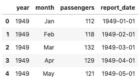
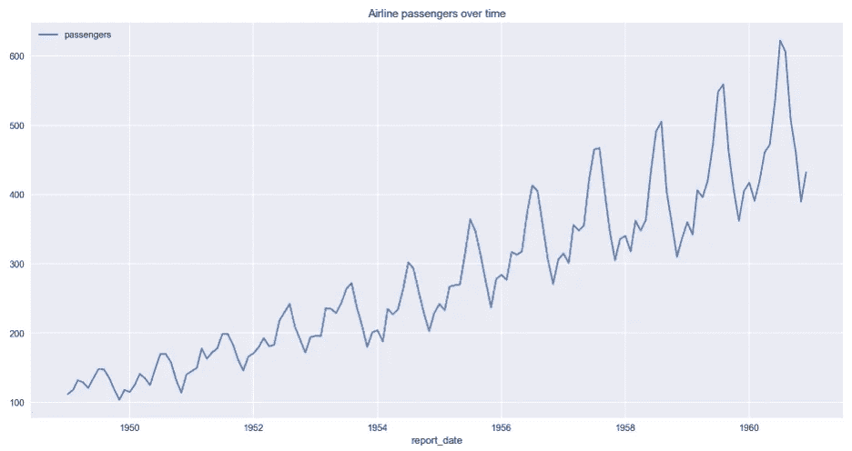
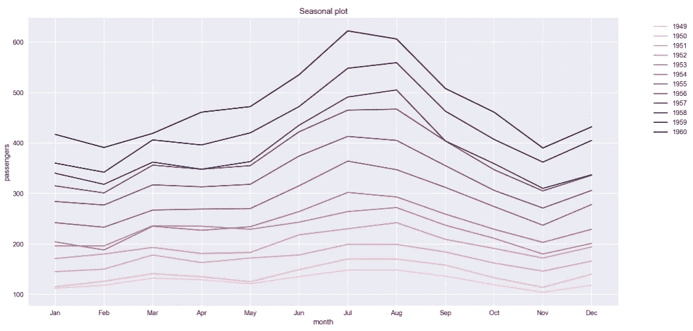
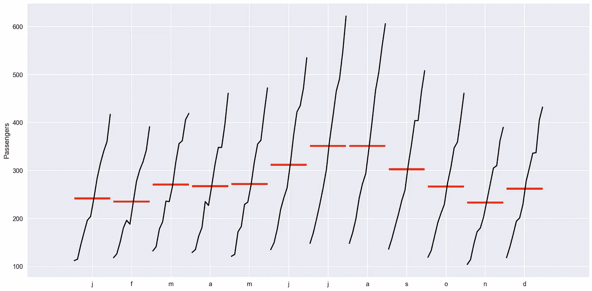
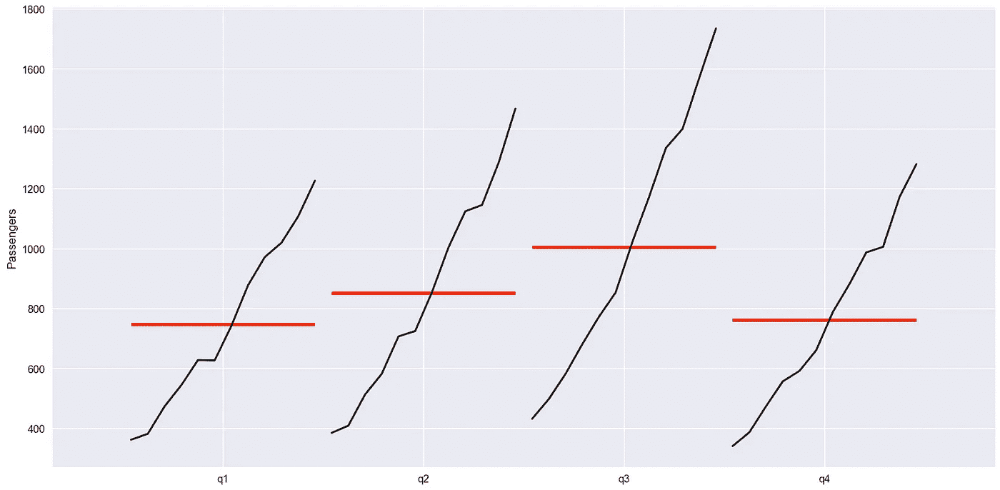
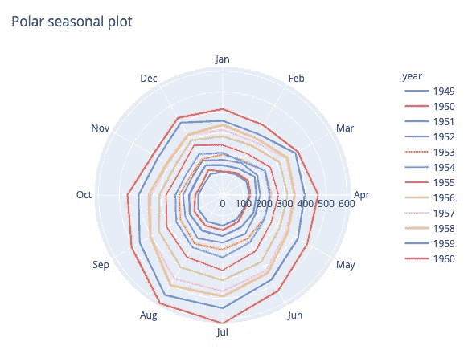
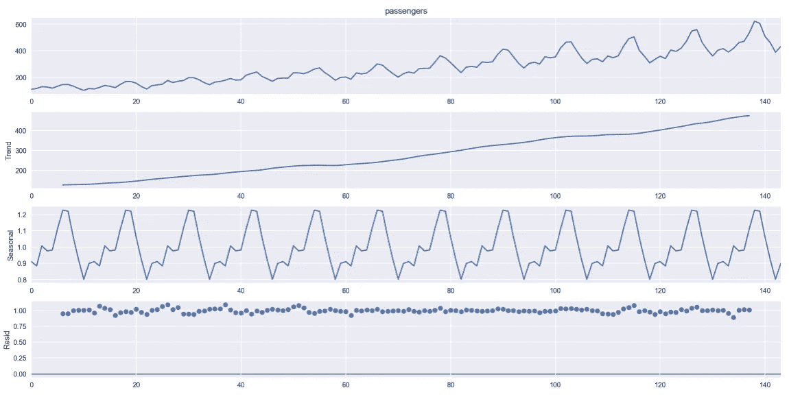
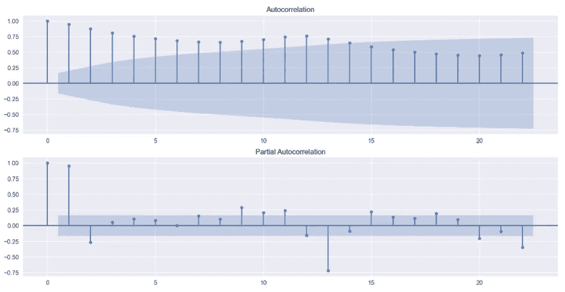

# 有助于时间序列分析的 5 种绘图类型

> 原文：<https://towardsdatascience.com/5-types-of-plots-that-will-help-you-with-time-series-analysis-b63747818705?source=collection_archive---------4----------------------->


照片由[艾萨克·史密斯](https://unsplash.com/@isaacmsmith?utm_source=unsplash&utm_medium=referral&utm_content=creditCopyText)在 [Unsplash](https://unsplash.com/s/photos/graph?utm_source=unsplash&utm_medium=referral&utm_content=creditCopyText) 拍摄

## 以及如何使用 Python 快速创建它们

在开始任何与时间序列相关的项目时(不仅如此)，首先要做的一件事就是可视化数据。我们这样做是为了检查我们正在处理的数据，并从中了解一些信息，例如:

*   数据中有什么规律吗？
*   有什么不寻常的观察结果(异常值)吗？
*   观测值序列的性质是否随时间变化(非平稳性)？
*   变量之间有什么关系吗？

这仅仅是开始。我们从回答这些问题中学到的数据特征应该被整合到我们想要遵循的建模方法中。否则，我们可能会有一个糟糕的模型，无法捕捉我们所拥有的数据的特殊特征。正如我们一次又一次学到的那样——垃圾进，垃圾出。

在本文中，我展示了几种在处理时间序列时非常有用的图表，并简要描述了我们如何解释这些结果。

# 安装

传统上，我们需要加载所有需要的 Python 库。我们在下面的代码片段中做到了这一点。

# 数据

在本文中，我们将看看著名的航空乘客数据集，你可能已经在其他文章或统计手册/课程中看过几次了。它非常受欢迎，因为其中的可观察模式非常简单。这也是为什么它将很好地服务于其目的，以说明不同类型的图用于时间序列分析。

数据集也包含在我们今天将使用的绘图库中— `seaborn`。我们通过运行下面几行来加载数据。此外，我们组合年和月列来创建一个`report_date`字段，它是一个`datatime.date`对象。



# 用于时间序列分析的图表示例

准备好数据后，我们将看看用于时间序列分析的不同类型的图。

## 时间图

时间图基本上是显示时间序列随时间演变的线形图。我们可以将其作为分析的起点，以获得对数据的一些基本了解，例如，趋势/季节性/异常值等。

最简单的方法是直接使用`pd.DataFrame`的`plot`方法。



在该图中，我们可以观察到多年来的增长趋势和明显的季节性，表现为假期导致的夏季峰值。

通过指定`DataFrame` 的索引，可以进一步简化代码，这样就不需要指定 x 轴了。**提示**:您也可以通过运行下面一行来更改`plot`方法的默认(`matplotlib`)后端:

```
pd.options.plotting.backend = "plotly"
```

通过这样做，你将生成与上图完全相同的图，然而，它将使用`plotly`使图具有交互性。当您想要检查特定的观察结果或想要放大某个时间段时，这绝对有帮助。

为了完整起见，您也可以很容易地使用`seaborn`来生成时间图:

过去，有一个专用的`sns.tsplot`功能，但是，它被弃用，取而代之的是`lineplot`。

## 季节性地块

季节图与时间图非常相似，只是数据是根据各个季节绘制的。选择季节的定义取决于分析师，在我们的特殊情况下，季节只是一个月。我们可以通过运行以下代码来生成季节性绘图。



我们可以看到，我们没有将所有 11 年绘制成一个长系列，而是每月绘制相同的数据。通过这样做，我们可以清楚地看到以下内容:

*   前面提到的夏季高峰的季节性模式，
*   趋势是，随着乘客数量的逐年增加。

此外，季节图对于识别模式变化的年份特别有用。

或者，我们可以使用`statsmodels`库中的一个方便的函数来创建一个`month_plot`。



这个剧情上传达的信息和上一个很像，只是分组不同。除了这些年的模式，我们还可以方便地看到每月的平均值。

最后，我们还可以得出一个非常相似的图，但这次是每季度一次。我们只需要先将数据重新采样到季度频率，然后使用`quarter_plot`功能。



## 极地季节图

这是季节图的一个变体，不同之处在于它使用极坐标。就我个人而言，我更喜欢传统的季节图，但是，我相信它对一些特定的情况也是有用的。



使用`matplotlib` + `seaborn`可以生成完全相同的图，但是，我试图遵循实用主义的方法。如果有可能用一个专门的和完善的库，如`plotly`(或`plotly_express`)更快地生成情节，那么我强烈支持这样的解决方案。作为额外的奖励，我们可以免费获得互动！

## 时间序列分解图

在实际展示剧情之前，我相信简单介绍一下**时间序列分解是有意义的。**总的来说，它为思考时间序列提供了一个有用的模型，有助于更好地理解数据。分解假设时间序列可以分解为以下部分的组合:

*   级别—系列的平均值，
*   趋势——系列中的上升/下降模式，
*   季节性——系列中重复的短期周期，
*   噪音——随机的、无法解释的变化。

其中所有时间序列都具有水平和噪声分量，而趋势和季节性是可选的。

剩下要补充的是，有两种主要类型的分解模型:

*   可加性—它假设上述成分相加在一起(线性模型)。随着时间的变化或多或少是恒定的。
*   乘法-它假设组件彼此相乘。因此，随时间的变化是非线性的并且不是恒定的，因此它们可以随时间增加/减少。指数增长就是一个例子。

有了这么多介绍，我们可以尝试一种自动分解方法。为此，我们使用`statsmodels` 库中的`seasonal_decompose` 函数。对于我们的例子，当查看时间图时，我们可以看到存在月度季节性(12 个周期，但可以自动确定，因为数据帧中有时间戳索引)，并且随时间的变化不是恒定的(递增)，因此我们将使用乘法模型。



在图中，我们在第一部分看到实际序列，然后是趋势分量、季节分量，最后是残差(误差项)。乘法模型中接近 1 的残差表明拟合良好。请记住，对于加法运算，它们应该接近 0。

和自动方法一样，我们应该做一个简单的健全检查，不要盲目相信结果。对于这个简单的例子，我们可以看到我们最初对时间序列的怀疑得到了证实。

## 自相关图

当测量时间序列和它的滞后值(来自以前的时间点)之间的相关性时，我们谈论的是自相关。我们可以使用两种类型的自相关图。

**自相关函数** (ACF)显示序列与其滞后值之间的相关系数值。在寻找相关性时，ACF 考虑时间序列的所有组成部分(在分解部分提到)。这就是为什么它被称为完全自相关图。

相比之下，**偏自相关函数** (PACF)着眼于残差(去除之前滞后解释的影响后的余数)和后续滞后值之间的相关性。这样，在我们找到下一个相关性之前，我们有效地去除了已经发现的变化。实际上，较高的偏相关表明残差中有一些信息可以被下一个滞后模型化。所以我们可以考虑在我们的模型中保留这种滞后。

我们使用下面的代码片段绘制 ACF 和 PACF。



在 ACF 图中，我们可以看到有显著的自相关性(高于 95%置信区间，对应于默认的 5%显著性水平)。在 PACF 图中也有一些重要的自相关。

通常，自相关图通常用于确定时间序列的平稳性或选择 ARIMA 类模型的超参数，但这些是另一篇文章的主题。

# 结论

在本文中，我展示了在处理时间序列时最有可能派上用场的 5 种类型的图。这个列表并不详尽，通常情况下，图的选择取决于我们正在解决的问题。例如，对于股票价格数据，我们可能希望可视化蜡烛图，而不是常规的时间图。

你可以在我的 [GitHub](https://github.com/erykml/medium_articles/blob/master/Time%20Series/time_series_plots.ipynb) 上找到本文使用的代码。一如既往，我们欢迎任何建设性的反馈。你可以在推特上或者评论里联系我。

2020 年初，我出版了一本关于使用 Python 解决金融领域实际任务的书。如果你有兴趣，我贴了[一篇文章](/introducing-my-book-python-for-finance-cookbook-de219ca0d612)介绍这本书的内容。你可以在亚马逊或者 Packt 的网站上买到这本书。

# 参考

*   Hyndman，R.J .，& Athanasopoulos，G. (2018) *预测:原则与实践*，第二版，OTexts:澳大利亚墨尔本。OTexts.com/fpp2.