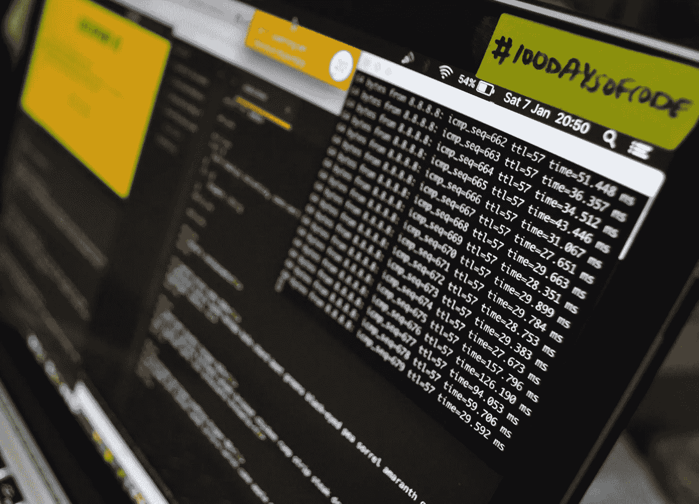
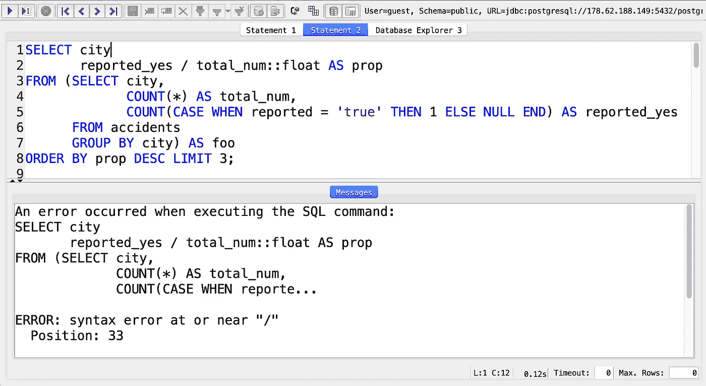
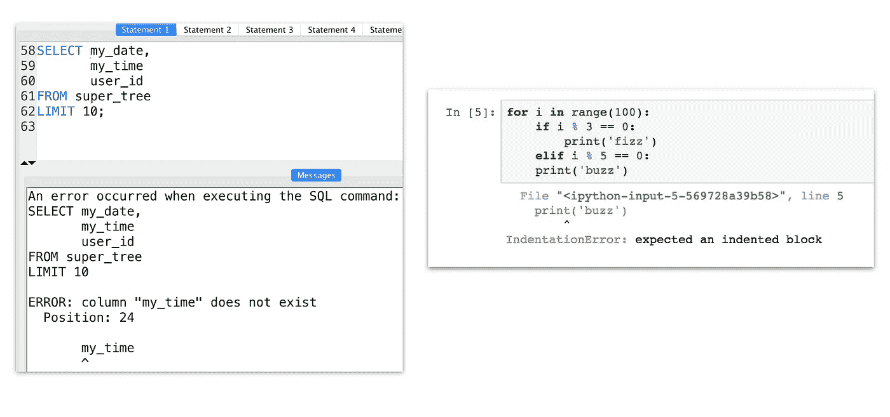
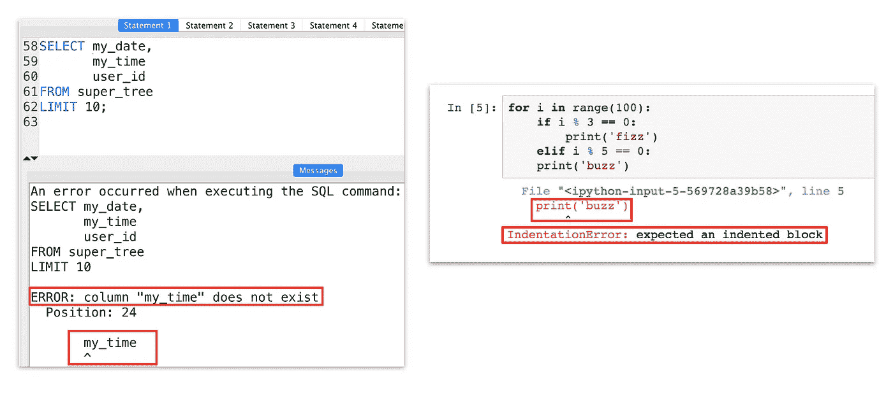
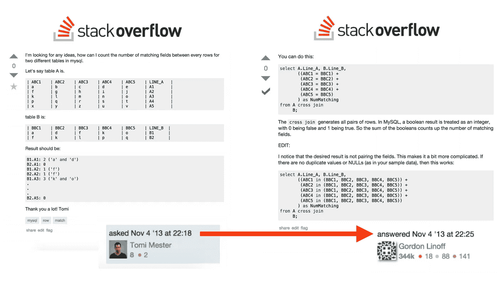

# 有抱负的数据科学家的 5 个典型思维错误

> 原文：<https://towardsdatascience.com/5-typical-mindset-mistakes-of-aspiring-data-scientists-32eca8e9e0c4?source=collection_archive---------30----------------------->

## 在过去的几年里，我和 500 多名有抱负的数据科学家一起工作过，我看到了他们容易犯的一些典型的思维错误。在这篇文章中，我想分享其中的五个。

路易斯·恩古吉在 [Unsplash](https://unsplash.com/s/photos/coding?utm_source=unsplash&utm_medium=referral&utm_content=creditCopyText) 上拍摄的照片

# 由于语法问题而卡住

要做数据科学，你迟早需要学习如何编码(主要是用 Python、[、SQL、bash 和/或 R](https://www.kdnuggets.com/2017/02/how-get-first-job-data-science.html) )。对于每个初学编码的人来说，最大的困难是语法。

我知道如果你从来没有编码过，它可能看起来很吓人。

但是你必须明白一件非常重要的事情:

电脑是一种强大的工具。它做自动化和繁重的计算，这是我们人类永远做不到的。但是电脑并不聪明。所以你必须非常细致地告诉它你想做什么。

在编程中，一个输入错误的字符、一个换行符或一个丢失的逗号都会引起问题。你漏了一个空格？你的剧本会崩溃的。事情就是这样！

但是如果你准确地输入了所有的内容，你的脚本就可以工作了。

因此，当你编码时，要特别强调确保避免任何打字错误。如果你跟随一个教程，确保你非常彻底地跟随它。如果你自己写代码，要知道语法！

SQL 查询中缺少 coma 错误！(*图片作者)*

# 害怕错误信息

这是数据科学和编码中另一个让初学者害怕的概念:错误消息！

**如果你的脚本或者查询失败了，你会得到难看的错误信息返回到你的屏幕上，对吗？乍一看，它们真的没有任何意义。但是不要被他们吓倒！他们是来帮助你的！**

(*图片作者)*

好吧，我承认它们又长又丑，而且你将看到的大部分文字甚至没有用。但是仔细阅读你的错误信息，你会发现它们确实很好地描述了你代码中的问题。

他们肯定会向你展示两件事:

1.  **问题在哪里。**
    在 Python 和 SQL 中，都有一个 **^** 字符来显示你写的脚本中的错误所在。(见图片。)
2.  **问题是什么。**
    而且在大多数情况下你也得到了问题的一行摘要。(如*“预期缩进块”*、*、【列不存在】、*等)。)

(*图片作者)*

如果您知道在哪里以及您在寻找什么，调试将变得容易得多！

# 只学习令人兴奋的东西

嘿，我知道！

机器学习令人兴奋。深度学习令人兴奋。预测未来是令人兴奋的！

但是事情是这样的:

上面那些“令人兴奋”的事情，只是工作的 5%。或者更少，如果你是大三的话。

我们来玩个游戏吧！

猜猜数据科学家工作最耗时的部分是什么！

...

准备好了吗？

好吧，答案是…

**…数据清洗！**

在实践数据科学家中有一个笑话说:*“80%的数据科学是数据清洗。20%的人抱怨数据清理。”*

是的，这是一个笑话，但它给你的想法。

在真实的工作中，你不会全天候做机器学习和预测分析。因为为了能够运行适当的 ML 算法，您必须首先完成许多其他步骤:

*   数据收集
*   格式化您的数据
*   清理您的数据
*   数据探索
*   进行各种描述性分析
*   数据可视化
*   设置自动化
*   诸如此类…

[学习数据科学](https://data36.com/learning-data-science/)应该是关于这些，主要是！而且你绝对不能只专注于机器学习，仅仅因为它很刺激。

**现实一点，多了解一下上述的东西(尤其是如何用 Python 和 SQL 搞定)……现在专注于基础，以后可以玩 AI！当你得到第一个初级职位时，你会感谢自己的。**

*注:反正别信我那一套。这里还有 Vicki Boykis(另一位执业数据科学家)的一篇* [*优秀文章*](http://veekaybee.github.io/2019/02/13/data-science-is-different/) *！*

# 谷歌搜索不够多(谷歌搜索太多)

我看到了有抱负的数据科学家的两个极端:

一个面对第一个问题就僵住的人。另一个在谷歌上搜索每个细节。

一个伟大的数据科学家可以自己解决问题。事实上，那是她最重要的技能之一！

但这并不意味着每次遇到问题都要重新发明轮子。在你大三的时候，很有可能其他人已经有了和你一样的问题。幸运的是，在数据科学中，几乎所有的东西都在互联网上有记录。因此，作为一名数据科学家，你必须具备的主动、积极的态度可以简单地表现为谷歌搜索你的问题。

99.9%的时候，你会找到解决办法！

如果没有，你仍然可以问其他人……有一些很棒的论坛，但是让我在这里只提到最受欢迎的一个: [StackOverflow](https://stackoverflow.com/) 。这是一个很棒的地方，有很多好人。您可以随时将您的数据科学(以及其他与编码相关的)问题放在那里——他们将在几小时内得到解答，如果不是在几分钟内的话！

Stackoverflow 问题在约 7 分钟内回答(*图片由作者提供)*

另一方面，你不能只依靠谷歌搜索。

我看到人们自豪地说:*“我是一名数据科学家，我不学 Python 语法。我只是用谷歌搜索所有的东西……"*这太愚蠢了。如果你想高效地完成你的工作，你必须学习基础知识。你不能谷歌一切，因为:

a)这会拖慢你的速度
b)你不会知道你能通过编码做什么。

所以试着在完全不搜索和搜索一切之间找到中庸之道吧！

# 过早放弃

我把最重要的留到了最后。

许多有抱负的数据科学家只是在他们的旅程中过早放弃了。

我知道:**数据科学很难。**如果很容易，每个人都会成为数据科学家——那么它就不再是 21 世纪最性感的工作了，对吗？；-)

**反正数据科学很难！
每一部分都很辛苦。编码很难。统计很难。甚至连思考数据将如何支持您的业务都很困难。**

无论你在网上读到什么:学习数据科学没有快速简单的方法。没有捷径可走。但是有坚持，有奉献，有努力工作的意愿。

是的，当然，许多开始学习数据科学的人会放弃。

但是这让你处于一个独特的位置！如果你是一个不放弃的人，如果你坚持下去，如果你接受你必须以艰难的方式学习数据科学-与大多数人不同，你实际上可以成为一名数据科学家！

# 结论

这是我认为有抱负的数据科学家容易犯的五个典型错误。我希望你能利用这里写的东西。总结我所说的一切，如果你才刚刚开始这段美丽的旅程，我想给你五个建议:

1.  当你写代码的时候，一定要注意语法，并且要非常精确！
2.  **不要害怕错误信息！使用它们！**
3.  关注你需要的东西(Python、SQL、数据清理、数据可视化、自动化),而不是令人兴奋的东西(人工智能、机器学习等)。)
4.  **谷歌是你的朋友；但是要对自己的基础知识有信心。**
5.  不要太早放弃！把辛苦放进去！从长远来看，这是值得的。

*Data36.com*T3[数据科学家孙铁麟·梅斯特](https://data36.com/)