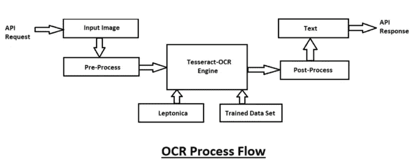

# 5 个以上独特的 Python 模块，用于创建脱颖而出的机器学习和数据科学项目

> 原文：<https://towardsdatascience.com/5-unique-python-modules-for-creating-machine-learning-and-data-science-projects-that-stand-out-a890519de3ae?source=collection_archive---------37----------------------->

## 超过 5 个酷 Python 库模块的指南，用于创建出色的机器学习和数据科学项目


照片由[🇸🇮·扬科·菲利](https://unsplash.com/@itfeelslikefilm?utm_source=medium&utm_medium=referral)在 [Unsplash](https://unsplash.com?utm_source=medium&utm_medium=referral) 上拍摄

P ython 提供了广泛的库模块和框架，使其成为构建机器学习模型和从事数据科学项目最兼容的语言之一。

除了所使用的标准库之外，本文旨在为您的机器学习和数据科学项目提供一些很酷的模块。

最常用的 python 模块包括用于数值运算的 numpy、用于处理稀疏矩阵等科学运算的 scipy、用于以有组织的方式查看数据集的 pandas、用于可视化所构建模型的数据、分析和图表的 matplotlib 和 seaborn。

您还可以利用 python 中的 scikit-learn 模块，通过 sklearn 库中可用的各种算法选项来开发机器学习模型。此外，您可以利用 TensorFlow 和 Pytorch 等框架来构建深度学习模型。

您可以查看下面的文章，以获得对矩阵稀疏性和 scipy 模块的更好的直觉和理解。

[](/lost-in-a-dense-forest-intuition-on-sparsity-in-machine-learning-with-simple-code-2b44ea7b07b0) [## 迷失在密林中:用简单的代码对机器学习中稀疏性的直觉！

### 为什么 ML 需要稀疏性？理解稀疏性的核心概念。

towardsdatascience.com](/lost-in-a-dense-forest-intuition-on-sparsity-in-machine-learning-with-simple-code-2b44ea7b07b0) 

然而，今天在本文中，我们将讨论您可以在数据科学项目中充分利用的五个模块。你可能知道其中的一些甚至全部，但利用这些模块将使你的机器学习项目独特而突出，或者它们可以帮助你更好地理解手头的问题或任务。

让我们更详细地讨论、查看和理解这些库模块。


蒙朱尔·哈桑在 [Unsplash](https://unsplash.com?utm_source=medium&utm_medium=referral) 上拍摄的照片

## 1.交响乐

数学是机器学习的一个重要方面。虽然有些人可能绝对崇拜数学，但有些人可能不喜欢它。然而，掌握数学知识并理解概率、统计和微积分的概念是至关重要的。

积分学和微分学也被认为是理解像反向传播这样的机器学习概念的先决条件。幸运的是，python 还提供了一个免费的、轻量级的、基于 python 的库，名为 **sympy** 。这是一个符号数学的 python 库。您可以使用以下命令安装该库。

```
pip install sympy
```

在安装了这个库之后，您可以继续用几行代码执行数学演算操作，比如积分和微分。

你可以在这里查阅来自[的官方文档，了解如何使用这个模块的更多细节。但是，如果你感到困惑，想让我对这个模块的教程文章做一个快速的指导，那么请随时告诉我。](https://docs.sympy.org/latest/index.html)

## 2.美丽的声音和斗志

任何数据科学或机器学习项目的一个非常重要的方面是数据收集过程。数据挖掘这个术语也可以用来从互联网上收集有用的数据。您可以从网上下载预先可用的数据集，或者利用上面提到的两个模块来抓取 web 数据以提取必要的信息。

BeautifulSoup 是一个非常棒的 python 库，设计用于快速周转项目和处理互联网上的可用数据。这是一个有用的网页抓取和数据抓取库。BeautifulSoup 和 Scrapy 都是在线提取网络数据的绝佳选择。

根据 [BeautifulSoup](https://www.crummy.com/software/BeautifulSoup/) 的官方文档，这三个特性使其功能强大:

1.  Beautiful Soup 为导航、搜索和修改解析树提供了一些简单的方法和 Pythonic 式的习惯用法:一个用于解析文档和提取所需内容的工具包。编写应用程序不需要太多代码。
2.  Beautiful Soup 自动将传入文档转换为 Unicode，将传出文档转换为 UTF-8。你不必考虑编码，除非文档没有指定编码，而 Beautiful Soup 检测不到编码。然后，您只需指定原始编码。
3.  Beautiful Soup 位于 lxml 和 html5lib 等流行的 Python 解析器之上，允许您尝试不同的解析策略或以速度换取灵活性。

Scrapy 是另一个用于大规模 web 抓取的 Python 框架。它为您提供了高效地从网站中提取数据、按照您的意愿处理数据以及以您喜欢的结构和格式存储数据所需的所有工具。Scrapy 库可以通过使用下面提到的命令来快速建立，并且您可以使用它来提取数据的各种目的。

```
pip install Scrapy
```

既然您已经成功地收集了数据并完成了项目所需的数据挖掘，那么您现在可能想要清理剩余的字符串数据。这个过程只需要四个基本的正则表达式操作就可以完成。数据清理是下一个重要步骤。所以，如果你想了解更多关于这个过程的知识，可以看看下面的文章。

[](/natural-language-processing-made-simpler-with-4-basic-regular-expression-operators-5002342cbac1) [## 4 个基本正则表达式操作符使自然语言处理变得更简单！

### 了解四种基本的常规操作，以清理几乎任何类型的可用数据。

towardsdatascience.com](/natural-language-processing-made-simpler-with-4-basic-regular-expression-operators-5002342cbac1) 

## 3.熊猫简介


作者截图

一旦您准备好了所有的数据和数据集，就该可视化和查看您收集的数据了。探索性数据分析是任何机器学习和数据科学项目的一个重要方面。

探索性数据分析在数据科学和机器学习项目领域的作用是能够详细了解手头的数据。探索性数据分析提供了许多图表和种类来可视化和分析可用的数据。它提供了对如何进一步发展的简要理解和想法。

然而，开发每个单独的情节并开始处理步骤有时会是一个忙乱的过程。某些问题甚至可能需要几个小时。幸运的是，python 也提供了这个问题的解决方案。

Pandas profiling 是一个开源的 Python 模块，使用它我们只需几行代码就可以快速地进行探索性的数据分析。此外，如果这还不足以说服我们使用这个工具，它还可以生成 web 格式的交互式报告，可以呈现给任何人，即使他们不知道如何编程。安装过程可以通过简单的 pip 命令完成，如下所示:

```
pip install pandas-profiling
```

安装了这个库之后，您可以利用它在几分钟内为您的机器学习和数据科学项目执行探索性数据分析。既省时又大有裨益。但是，您不能在每个数据集上使用它，而且在较大的数据集上生成报告需要更长的时间。


我的第一个项目的作者过时的 GIF

## 4.Pygame 和 Tkinter

Pygame 和 Tkinter 模块是一些最好的模块，用于使您的机器学习和数据科学项目脱颖而出，并给它们一个整体上更具视觉吸引力的外观。

想象一下，你必须开发一个强化学习游戏或基于人工智能的深度学习算法，以提高游戏中模型的性能。如果您考虑上面 GIF 中的蛇的例子，或者类似于 flappy birds 游戏的东西，其中有几代鸟在一个过程中学习和进化，用 python 开发这些图形用户界面的最佳方式是使用 Pygame 模块。

在你的机器学习项目中使用 pygame 这样的模块还有很多应用。然而，另一种选择是通过使用类似 Tkinter 的 GUI 开发库来开发更有趣、更具交互性、更令人惊叹的图形用户界面。还有其他选择来开发独特的和令人敬畏的 GUI 界面。我对 Tkinter 更有经验，这也是我对大多数新手程序员的建议。

我强烈推荐读者阅读下面的文章，这篇文章用实际的项目实现思想解释了更多关于 Tkinter 和 Pygame 等模块的应用。我还介绍了一个理解 Pygame 基础知识的小指南以及 Tkinter 模块的简介。

[](/5-best-python-project-ideas-with-full-code-snippets-and-useful-links-d9dc2846a0c5) [## 带有完整代码片段和有用链接的 5 个最佳 Python 项目创意！

### 为 Python 和机器学习创建一份令人敬畏的简历的 5 个最佳项目想法的代码片段和示例！

towardsdatascience.com](/5-best-python-project-ideas-with-full-code-snippets-and-useful-links-d9dc2846a0c5) 

作者提供的图片— 1。GTTS 语音合成| 2。OCR 流程

## 5.GTTS 和 OCR

谷歌文本到语音和光学字符识别是两个非常酷的模块，你可以利用它们来构建更独特的机器学习和数据科学项目。我做的[人脸识别](/smart-face-lock-system-6c5a77aa5d30)和[情感&手势检测](/human-emotion-and-gesture-detector-using-deep-learning-part-1-d0023008d0eb)项目是利用这些模块和构建的模型的两个最佳方式。

文本到语音(TTS)是将单词转换成有声音频形式的过程。程序、工具或软件从用户处获取输入文本，并使用自然语言处理方法理解所使用语言的语言学，并对文本执行逻辑推理。该处理后的文本被传递到下一个块，在该块中对处理后的文本执行数字信号处理。使用许多算法和变换，这个处理过的文本最终被转换成语音格式。这整个过程包括语音合成。下面是一个简单的框图，以了解相同的。

光学字符识别是通过使用电子或机械设备将二维文本数据转换成机器编码的文本形式。你使用计算机视觉来阅读图像或文本文件。读取图像后，使用 python 的 pytesseract 模块读取图像或 PDF 中的文本数据，然后将它们转换为可以在 python 中显示的数据字符串。

这里有两个链接可以帮助你开始使用谷歌文本到语音和光学字符识别。查看下面提供的参考资料以了解 Google 文本到语音转换和光学字符识别模块，从而了解更多概念并以更详细的方式了解它们。

[](/how-to-get-started-with-google-text-to-speech-using-python-485e43d1d544) [## 如何使用 Python 开始使用 Google 文本到语音转换

### 从零开始的文本到语音转换简介

towardsdatascience.com](/how-to-get-started-with-google-text-to-speech-using-python-485e43d1d544) [](/getting-started-with-optical-character-recognition-using-python-e4a9851ddfab) [## 使用 Python 开始光学字符识别

### 对光学字符识别从无到有的直观理解和简要介绍

towardsdatascience.com](/getting-started-with-optical-character-recognition-using-python-e4a9851ddfab) 

照片由[克莱门特·H](https://unsplash.com/@clemhlrdt?utm_source=medium&utm_medium=referral)在 [Unsplash](https://unsplash.com?utm_source=medium&utm_medium=referral) 上拍摄

# 结论:

根据我的经验，这些库有助于让你的项目脱颖而出。在创建独特的、更具互动性和吸引力的机器学习、深度学习或数据科学项目时，可以考虑本文中建议的模块。

您不必为您的每个项目都使用本文中提到的模块。但值得考虑的是，它们是否对解决手头的问题有用，或者是否适合各自的任务。

强烈建议使用这些库模块来简化任务，使任务更加方便，同时提高项目的质量和整体吸引力。

如果你对建议的模块有任何疑问，请在下面的评论中告诉我。我会尽快回复你。

看看我的其他一些文章，你可能会喜欢读！

[](/understanding-advanced-functions-in-python-with-codes-and-examples-2e68bbb04094) [## 用代码和例子理解 Python 中的高级函数！

### 详细了解 python 中的匿名函数和高级函数及其实际应用…

towardsdatascience.com](/understanding-advanced-functions-in-python-with-codes-and-examples-2e68bbb04094) [](/do-you-really-need-a-gpu-for-deep-learning-d37c05023226) [## 深度学习真的需要 GPU 吗？

### 获得一个 GPU 是深度学习的必备条件吗？了解 GPU 及其优势，并探索…

towardsdatascience.com](/do-you-really-need-a-gpu-for-deep-learning-d37c05023226) [](/10-step-ultimate-guide-for-machine-learning-and-data-science-projects-ed61ae9aa301) [## 机器学习和数据科学项目的 10 步终极指南！

### 详细讨论构建您的机器学习和数据科学项目的最佳方法…

towardsdatascience.com](/10-step-ultimate-guide-for-machine-learning-and-data-science-projects-ed61ae9aa301) 

谢谢你们坚持到最后。我希望你们都喜欢这篇文章。祝大家有美好的一天！