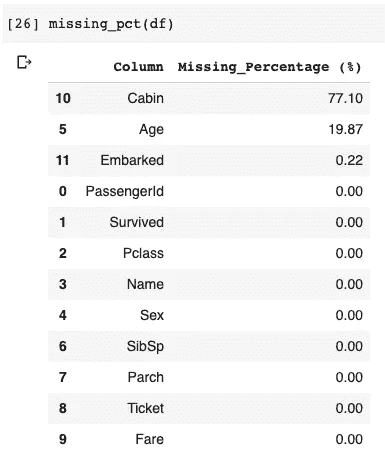
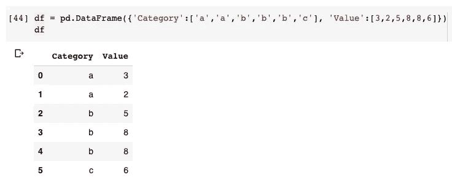
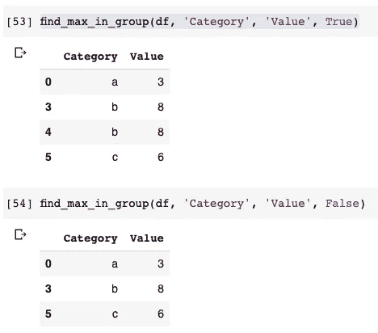
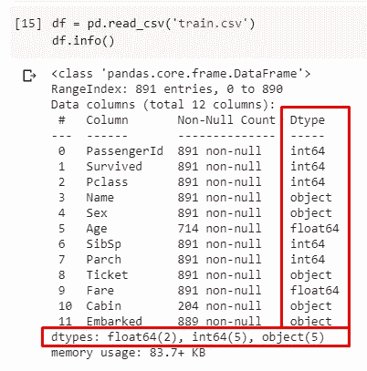
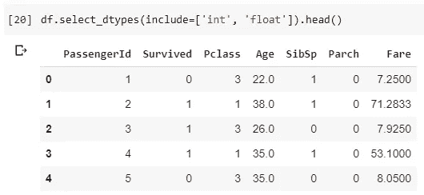
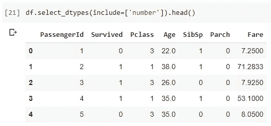
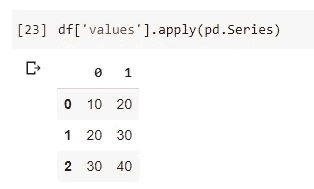
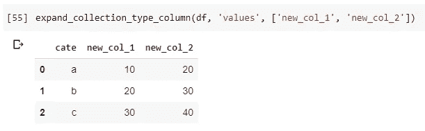
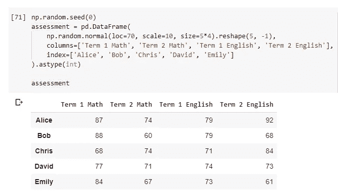
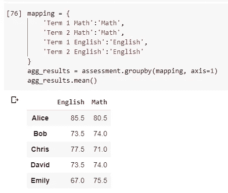

# 使用 Python 中的 Pandas 进行探索性数据分析的 5 个有用技巧

> 原文：<https://towardsdatascience.com/5-useful-tips-for-exploratory-data-analysis-using-pandas-in-python-7c05808c9408?source=collection_archive---------31----------------------->


由[派克斯](https://pixabay.com/users/Pexels-2286921/)在 [Pixabay](https://pixabay.com/photos/camping-constellation-cosmos-dark-1845906/) 拍摄的照片

## 测量缺失数据、要素选择、展平数据框和聚合的提示

当我们开始一项新的数据分析、数据挖掘、数据科学或机器学习工作时，通常会从 EDA(探索性数据分析)开始分析数据。这通常是因为

*   我们还不知道数据集(它看起来怎么样)
*   需要衡量数据质量
*   需要知道我们应该如何清理数据
*   需要一些关于数据的见解。有时，我们可能没有明确的目标来处理数据集。

如果你是 Python 用户，我打赌你会用熊猫来完成大部分工作。在本文中，我将分享一些有用的代码片段，这些代码片段是我在 EDA 阶段留给自己使用的。通过保存这些有用的代码片段，我节省了大量时间，因为我将通过这些“模板”运行我获得的每个新数据集，以便找到一些关于数据的有用见解。所以，我不需要每次都去想该怎么做。

# 1.计算数据缺失百分比


照片由 [Alexas_Fotos](https://pixabay.com/users/Alexas_Fotos-686414/) 在 [Pixabay](https://pixabay.com/photos/bear-teddy-lonely-love-longing-5121560/) 上拍摄

关于数据集，我们需要知道的最重要的事情之一是是否有一些缺失的数据。如果有，他们错过了多少。请看下面的函数。

该函数将常规数据框作为参数，并将返回包含两列的数据框:

*   列名(原始数据框)
*   缺失百分比

想法是这样的

1.  `df.isnull()`将生成一个与原始数据框形状相同的数据框，但所有像元的值将为布尔类型，其中 True 表示像元值缺失。
2.  `df.sum()`将垂直求和数据帧，其中“真”将被视为 1，“假”将被视为 0。因此，我们将有一个 Pandas 系列，其中列名作为索引，缺失值的数量作为值。
3.  将缺失值除以数据帧的行数`df.shape[0]`将得出缺失百分比。
4.  为了更好地展示，将系列转换回熊猫数据框。
5.  将结果四舍五入到两位小数。
6.  重命名缺失百分比数据框的列。
7.  分类并输出



上面的例子使用了著名的泰坦尼克号数据集，它可以来自这里:

[](https://www.kaggle.com/c/titanic/data?select=train.csv) [## 泰坦尼克号:机器从灾难中学习

### 从这里开始！预测泰坦尼克号上的生存并熟悉 ML 基础知识

www.kaggle.com](https://www.kaggle.com/c/titanic/data?select=train.csv) 

# 2.获取每组中具有最大值的行


照片由 [aL3x92](https://pixabay.com/users/aL3x92-2790876/) 在 [Pixabay](https://pixabay.com/photos/darts-dart-board-arrows-target-3895861/) 上拍摄

有时，我们可能希望获得数据框的每组中具有最大值的行。这里有一个函数可以帮忙。

它有 4 个参数，分别是数据框、需要分组的列名、值的列名以及是否有“tie for the first”。

让我们按如下方式查看数据框:

```
df = pd.DataFrame({'Category':['a','a','b','b','b','c'], 'Value':[3,2,5,8,8,6]})
```



可以看到，我们这里有 3 组“a”、“b”和“c”。对于组“b ”,有两行具有相同的值“8”并且都是最大值。在这种情况下，如果`tie_for_first`是`False`，只有值为“8”的第一行将被保留，而如果是`True`，这两行都将被保留，因为有一个“平局”。

步骤如下:

1.  决定我们应该使用哪种排名方法。即“min”或“first”。请参考下面的官方文档，了解更多关于`rank()`方法的信息。
2.  使用给定的列对数据框进行分组，并根据值列对组进行排名。
3.  仅用`rank == 1`过滤数据帧。
4.  删除临时使用的“rank”列，然后返回数据帧。

 [## 熊猫。DataFrame.rank — pandas 1.1.2 文档

### 编辑描述

pandas.pydata.org](https://pandas.pydata.org/pandas-docs/stable/reference/api/pandas.DataFrame.rank.html) 

以下是对前一个数据框运行的示例。



# 3.基于数据类型选择数据框列


[UliSchu](https://pixabay.com/users/UliSchu-1993560/) 在 [Pixabay](https://pixabay.com/photos/organization-register-folder-files-1205171/) 上拍摄的照片

当我们的数据框中有许多列时，选择列(要素)就成了一项棘手的任务。根据我的经验，这经常发生在我身上。例如，有一次我在为一个有数百台发电机的电网数据集做 EDA。我想做的是选择这些生成器数据并旋转表格。然而，也有许多其他列。在这种情况下，`select_dtypes()`功能帮助很大。

让我们再次使用第一节中已经使用过的 Titanic 数据集。我们可以使用`df.info()`来获得数据集的图片。注意`Dtype`栏。

```
df = pd.read_csv('train.csv')
df.info()
```



如截图所示，有 2 个浮点数列，5 个整数列和 5 个字符串列。当然，对于这样的数据集，我们不必使用`select_detypes()`，因为它们并不太多，但是仅仅作为一个例子使用也是很好的。

比方说，我们想要所有的字符串列(对象类型):

```
df.select_dtypes(include=['object'])
```


请注意，我们正在使用`select_dtypes()`函数的`include`参数。在某些情况下，我们可能希望使用`exclude`参数来删除某些类型的列，而保留所有其他类型的列。

```
df.select_dtypes(exclude=['object'])
```


在上面的例子中，我们选择了所有非字符串类型的列。

事实上，您可能已经注意到，`include`和`exclude`参数都采用了列表参数。是的，我们可以包含或排除多种类型的列。

```
df.select_dtypes(include=['int', 'float'])
```



在上面的例子中，我们已经选择了整数和浮点数类型的列，这对于只选择数据集的数字特征是非常方便的。

然而，事实上，有一种更简单的方法。

```
df.select_dtypes(include=['number'])
```



是的，这两种类型都是数字，所以我们可以说我们想要“数字”。如果您对支持的其他类型感兴趣，请查看官方文档。

 [## 熊猫。data frame . select _ dtypes—pandas 1 . 1 . 2 文档

### 编辑描述

pandas.pydata.org](https://pandas.pydata.org/pandas-docs/stable/reference/api/pandas.DataFrame.select_dtypes.html) 

# 4.水平分解数据框中的数组


照片由 [adymyabya](https://pixabay.com/users/adymyabya-2066528/) 在 [Pixabay](https://pixabay.com/photos/magnifying-glass-map-geography-1277578/) 上拍摄

有时，我们拥有的数据集可能并不平坦。换句话说，可能有一些列具有列表/数组类型。通常，使用`explode()`函数很容易分解数据框中的列表或数组列。但是，有时我们不想将它们分解成多行。相反，我们希望将它们扩展到更多的列中。

让我们看看下面的例子。

```
df = pd.DataFrame({'cate':['a','b','c'],'values':[[10,20], [20,30], [30,40]]})
```


如果我们想要扩展“values”列的每个数组中的两个值，我们可以简单地如下操作。

```
df['values'].apply(pd.Series)
```



当然，大多数时候我们可能希望将其合并回原始数据框。这是给你的全部功能。

该函数有 3 个参数:数据框、要展开的列的名称以及展开的新列的列名列表(可选)。

这些步骤是:

1.  使用目标列分割数据框，并通过 Pandas 系列扩展列表/数组。
2.  将扩展列的新数据框与原始数据框连接起来。
3.  删除已展开的原始列。
4.  如果传入了新列名的列表，请重命名这些列。

如果我们对上面显示的样本数据框应用该函数，结果如下。



# 5.跨列聚合


由[康格设计](https://pixabay.com/users/congerdesign-509903/)在[皮克斯贝](https://pixabay.com/photos/cinnamon-stars-cinnamon-sticks-2991174/)拍摄的照片

聚合熊猫数据帧以获得某项数据的总和或平均值是很常见的。但是，有时我们可能希望跨列进行聚合。让我通过制作如下示例数据框来演示这个问题。

```
np.random.seed(0)
assessment = pd.DataFrame(
    np.random.normal(loc=70, scale=10, size=5*4).reshape(5, -1),
    columns=['Term 1 Math', 'Term 2 Math', 'Term 1 English', 'Term 2 English'],
    index=['Alice', 'Bob', 'Chris', 'David', 'Emily']
).astype(int)
```



在这个数据框架中，我们有两个学期的学生考试成绩。假设我们想要平均每个学生每门学科的成绩。换句话说，我们想分别得到数学科目和英语科目的平均分。

我知道，用第一列加第二列再除以 2，然后对第三列和第四列做同样的事情，并不是太难。最后，重命名这些列。肯定有更简洁的方法可以做到这一点。参见下面的代码。

```
mapping = {
    'Term 1 Math':'Math', 
    'Term 2 Math':'Math', 
    'Term 1 English':'English',
    'Term 2 English':'English'
}
agg_results = assessment.groupby(mapping, axis=1)
agg_results.mean()
```

你知道`groupby()`方法也需要字典吗？字典将帮助函数将列分组到不同的类别中。然后，我们可以合计每个类别(数学和英语)的值。



# 摘要


由 [Shutterbug75](https://pixabay.com/users/Shutterbug75-2077322/) 在 [Pixabay](https://pixabay.com/photos/artistic-arts-blue-business-1238606/) 上拍摄的照片

在这篇文章中，我分享了一些我在 EDA 活动中经常使用的技巧。我想说你可能不需要使用它们来实现大部分的功能或实现。然而，如果你以前从未这样使用过熊猫，我建议你理解它们。有时，它们可以在我们的数据分析工作中节省大量时间。

[](https://medium.com/@qiuyujx/membership) [## 通过我的推荐链接加入 Medium 克里斯托弗·陶

### 作为一个媒体会员，你的会员费的一部分会给你阅读的作家，你可以完全接触到每一个故事…

medium.com](https://medium.com/@qiuyujx/membership) 

如果你觉得我的文章有帮助，请考虑加入 Medium 会员来支持我和成千上万的其他作者！(点击上面的链接)