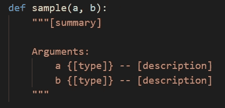
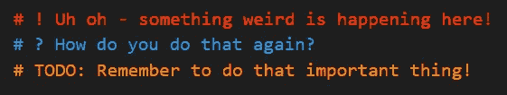
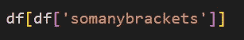

# 将改进您的编程的 5 个 Visual Studio 代码提示！

> 原文：<https://towardsdatascience.com/5-visual-studio-code-tips-that-will-improve-your-programming-58a835bed4e7?source=collection_archive---------32----------------------->

## 让 VSCode 变得更好！

让我们把 VSCode 做得更好！来源:Nik Piepenbreier via Canva.com

当我一头扎进编程的世界时，Visual Studio 代码(VSCode)成了我最喜欢的完成工作的工具之一。从那以后，我学会了几种真正改善自己编程体验的方法。本文主要关注 Python，但也可能适用于其他语言。

# Python 文档字符串生成器

第一个要覆盖的扩展是 [Python Docstring 生成器](https://marketplace.visualstudio.com/items?itemName=njpwerner.autodocstring)！由 Nils Werner 开发的这个扩展使得生成文档字符串变得更加容易。一旦创建了一个类或函数，只需输入`"""`就会生成一个模板。该扩展会自动提取任何参数，并允许您在想要填充的所有字段中切换。

让我们看看这个是什么样子的:

自动添加格式化的文档字符串！资料来源:Nik Piepenbreier

# 更好的评论

接下来，我们将覆盖[更好的评论](https://marketplace.visualstudio.com/items?itemName=aaron-bond.better-comments)，它允许你给你的评论添加标签，使它们更容易被识别。该扩展预装了五种默认的注释样式，涵盖了重要信息、问题、待办事项等等。您可以修改现有的，改变他们的颜色，或创建自己的！

在我的数据科学之旅中，它帮助我创建了不断增长的脚本。

为你的评论提供视觉提示！资料来源:Nik Piepenbreier

# 学习有用的键盘快捷键

提高我工作效率的真正动力是花一些时间记住一些重要的键盘快捷键！我会在这里列出一些我最喜欢的:

*   **CTRL/Command + Enter** :直接在下方插入新的一行，不考虑当前行的位置
*   **ALT/Option +Shift + Up/Down** :上下复制当前行
*   **ALT/Option + Up/Down** :上下移动当前行
*   **ALT/Option + Shift + Right** :点击两次选择当前括号内的所有内容(如果需要重新映射，该选项称为 *smartSelect.grow*
*   **CTRL/Command + /** :注释掉当前行
*   **CTRL/Command+【or】**:向内或向外缩进行

# 使用多光标减少编辑的痛苦

多光标可以让你在编辑文本时变得更强大。有几个用例可能会发生这种情况，VSCode 为这些情况提供了惊人的内置快捷方式:

*   **CTRL/Command+ALT/Option+Up/Down**:在上方或下方插入另一个光标
*   **CTRL/Command + D** :在下一次出现时插入另一个光标
*   **CTRL/Command + Shift + L** :为所有事件添加多光标
*   **CTRL/Command + U** :如果添加过多，撤消上一次光标操作

# 括号对着色程序 2

最后，最后一个扩展:[括号对上色器 2](https://marketplace.visualstudio.com/items?itemName=CoenraadS.bracket-pair-colorizer-2) 。这个扩展为您的括号添加了颜色，以便更好地识别匹配对。虽然 VSCode 很好地突出了您当前所在的 brack，但是这个扩展为您提供了文件中括号的完整概述。

给你的支架上色，让它们更容易被发现！资料来源:Nik Piepenbreier

# 感谢阅读！

非常感谢你阅读这篇文章！我希望您觉得它很有用，至少列表中的一些内容让您的编程体验更加顺畅。

如果你有其他建议让我尝试，请在评论中告诉我！