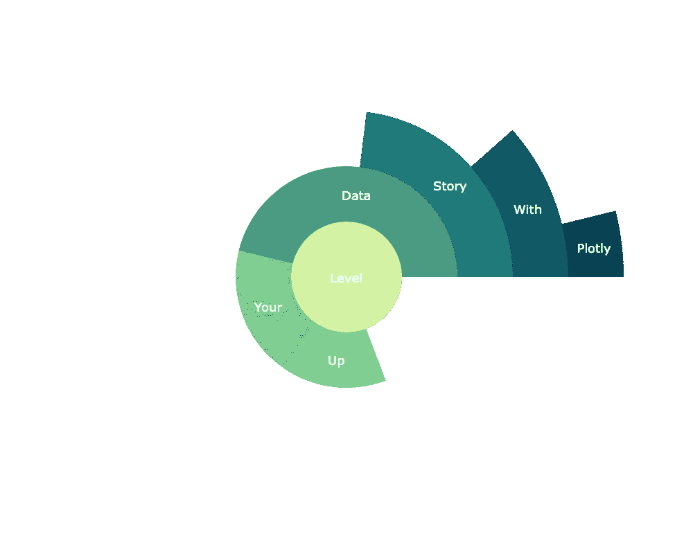
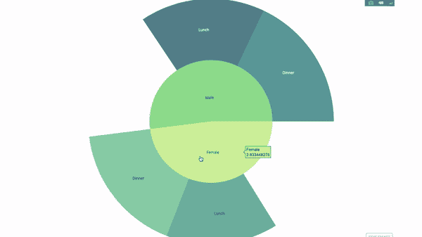
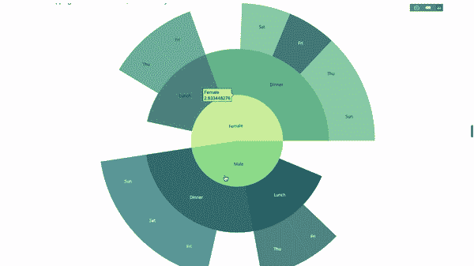
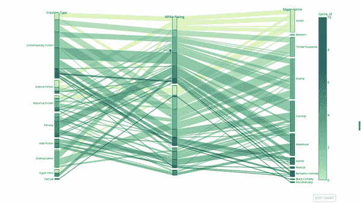
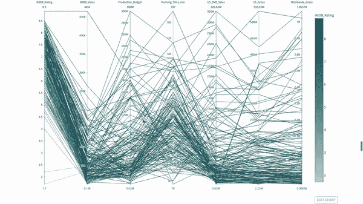
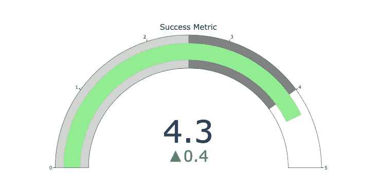
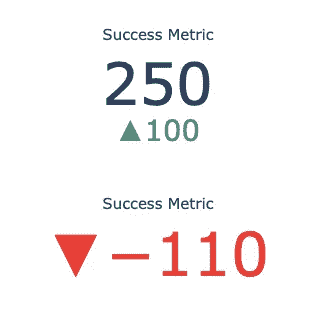

# 提升数据故事的 5 个可视化

> 原文：<https://towardsdatascience.com/5-visualisations-to-level-up-your-data-story-e131759c2f41?source=collection_archive---------5----------------------->

## 用 Plotly 超越直方图和箱线图。



对我们数据科学家来说，讲故事是一项基本技能。为了传达我们的想法并具有说服力，我们需要有效的沟通。审美视觉化是一个很好的工具。在本帖中，我们将介绍 5 种经典之外的可视化技术，它们可以让你的数据故事更加美观和有效。我们将使用 python 中的 [Plotly](https://plotly.com/python/) 图形库(在 R 中也可用)，它以最小的努力提供了动画和交互式的图形。

## Plotly 有什么好的

Plotly 图表是高度可集成的:它们可以与 jupyter 笔记本一起工作，它们可以嵌入到网站中，并与 [Dash](https://plotly.com/dash/) 完全集成——这是一个用于构建仪表板和分析应用程序的伟大工具。

# 入门指南

如果您没有安装 plotly，只需在终端中运行以下命令:

```
pip install plotly
```

现在你可以走了，让我们开始吧！

## 1.动画片

我们的工作经常涉及时态数据，在这些数据中我们研究这个或那个度量的演变。Plotly 动画是一个很好的工具，只需一行代码就可以观察数据如何随时间变化。


几乎任何情节都可以被动画化，只要你有一个时间变量来过滤。制作散点图动画的示例:

## 2.旭日图

旭日图是通过 语句来形象化你的 ***组的好方法。如果你想通过一个或多个分类变量来分解一个给定的数量，就去做一个旭日图。***

比方说，我们想分解一天中每个性别和时间的平均小费金额。这是一个双 ***group by*** 语句，可以通过可视化而不是表格输出来有效地传递:



该图是交互式的，使您能够单击并探索每个类别本身。你所需要做的就是定义你的所有类别，声明它们之间的层次结构(参见代码中的*父类*参数)并分配相应的值，在我们的例子中，这将是我们的 ***组通过*** 语句的输出。

现在，让我们向我们的层次结构添加另一层:



为此，我们通过涉及三个分类变量的 语句添加另一个 ***组的值。***

## 3.平行类别

探索分类变量之间关系的另一个好方法是这个流程图。您可以随时拖放、突出显示和浏览值，这非常适合演示。



## 4.平行坐标

平行坐标图是上述图的连续版本。这里，每个和弦代表一个单独的观察。这是发现异常值(从其余数据中分离出来的单个线程)、聚类、趋势和冗余变量(例如，如果两个变量对于每个观察值具有相似的值，它们将位于一条水平线上并表示冗余)的一个很好的工具。



## 5.仪表图和指示器



仪表图只是为了美观。它们是报告一些成功指标或 KPI 并将它们与您的目标联系起来的好方法。



指标在商业和咨询领域非常有用。他们用文字标记来补充你的视觉效果，抓住你的观众的注意力，并传达你的成长指标。

## 差不多就是这样！

希望这对你有用。呆在家里，保持安全，保持高效。


凯利·西克玛在 [Unsplash](https://unsplash.com?utm_source=medium&utm_medium=referral) 上的照片

*——继续探索*