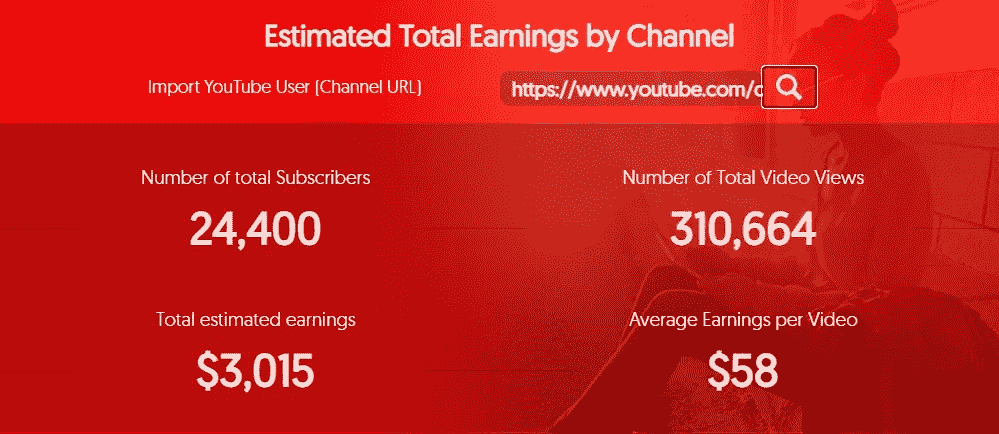

# 2020 年(及以后)机器学习从业者创收的 5 种方式

> 原文：<https://towardsdatascience.com/5-ways-a-machine-learning-practioner-can-generate-income-in-2020-and-beyond-2f541db5f25f?source=collection_archive---------17----------------------->

米歇尔·汉德森在 [Unsplash](https://unsplash.com/s/photos/money?utm_source=unsplash&utm_medium=referral&utm_content=creditCopyText) 上的照片

## 经验和建议

## 了解如何利用机器学习技能增加收入或创造新的收入来源

由于越来越多的专业人士被那些无法应对疫情冠状病毒带来的困难的公司解雇，新一代成为一个比以往任何时候都更加相关的话题。

即使没有疫情，“创收”曾经是(*并且仍然是*)学生、专业人士、企业家……基本上每个人的热门话题。

照片由[你好我是尼克🎞](https://unsplash.com/@helloimnik?utm_source=unsplash&utm_medium=referral&utm_content=creditCopyText) on [Unsplash](https://unsplash.com/s/photos/machine-money?utm_source=unsplash&utm_medium=referral&utm_content=creditCopyText)

## 我在本文中特别关注的是经过验证的方法，作为一名机器学习从业者，您可以使用这些方法来产生主收入流或副收入流。

别担心，我不会用励志名言来烦你，也不会向你兜售六位数收入的梦想。

个人帐户和经验被证明更有影响力和相关性，所以在这篇文章中，你会发现我用目前为我提供收入流的方法来分享我的个人经验。

以下是我将要介绍的获取收入的方法:职业、媒介、咨询、电子邮件列表、YouTube 等。

# 1.中等📑

照片由 [Grzegorz Walczak](https://unsplash.com/@grzegorzwalczak?utm_source=unsplash&utm_medium=referral&utm_content=creditCopyText) 在 [Unsplash](https://unsplash.com/s/photos/coder?utm_source=unsplash&utm_medium=referral&utm_content=creditCopyText) 上拍摄

先说一个显而易见的创收方法。

我在 Medium 上写的第一篇文章是在 2017 年。当时，我忘记了一个事实，即你可以通过媒体获得某种形式的收入。

快进到 2020 年。

现在，在媒体上写作为我提供了少量收入，以补充我职业生涯的收入。

你可能知道也可能不知道，我写的文章都是人工智能和机器学习相关的。我的一些文章是建议性的，比如这篇文章，但是大部分我写技术文章，这里有一个[例子](/understanding-and-implementing-lenet-5-cnn-architecture-deep-learning-a2d531ebc342)。

我在媒体上写作的最初原因是:

*   创造一种投资组合
*   通过教学强化我的学习

现在，我在媒体上写作的理由已经扩展到包括:

*   创建个人品牌
*   对个人进行机器学习和计算机视觉主题的教育
*   **建筑侧收入**

## 我们来谈谈数字。💲 💲 💲

我提到在媒介上写作不会在第一个月甚至第一年创造大量的收入，这可能很重要。

为了让你更清楚地了解情况，6 月份只有 5.7%的作家收入超过 100 美元。

六月中等收入作家工资

一些作家从 Medium 中赚取足够的收入，使其成为一份全职工作，你可以成为这些作家中的一员，或者至少成为收入超过 100 美元的一小部分人的一部分。

**就我个人而言，到目前为止，2020 年我已经从我的媒体文章中赚了 3374.19 美元。在过去的七个月里，我每周至少写 2-3 篇文章。**

我在 Medium 上投入的时间和精力可能会让你在其他职业或创收方式上多赚 3 倍。

在媒体上写作可以说是一项长期投资。更重要的是，你必须把金钱利益和其他激励结合起来，否则你可能很早就放弃了。

## 行动🔥🔥🔥

1.  **注册中等合作伙伴计划**
2.  **就你在**中了解的人工智能或人工智能相关主题撰写高质量的文章
3.  **向顶级媒体刊物投稿**
4.  **重复步骤 2 和 3**

# 2.职业💼

[真实机构](https://unsplash.com/@trueagency?utm_source=unsplash&utm_medium=referral&utm_content=creditCopyText)在 [Unsplash](https://unsplash.com/s/photos/coder?utm_source=unsplash&utm_medium=referral&utm_content=creditCopyText) 上拍摄的照片

作为一名机器学习从业者，获得收入流的最佳且被证实的方法之一是**找一份需要你特定技能的工作**。

以下是机器学习从业者通常承担的常见工作角色列表:

*   *数据科学家*
*   *机器学习工程师*
*   *自然语言处理工程师*
*   *计算机视觉工程师(→我)*
*   *机器学习研究员*

## 我们来谈谈数字。💲 💲 💲

我的工作地点在英国，从 2020 年 4 月 3 日算起的 6 个月内，一名机器学习研究员 的平均 [**工资为**57500 英镑。****](https://www.itjobswatch.co.uk/jobs/uk/machine%20learning%20researcher.do)

同期机器学习工程师 的平均 [**工资为**68750。****](https://www.itjobswatch.co.uk/jobs/uk/machine%20learning%20engineer.do)

在美国， [**ML 工程师**](https://www.linkedin.com/salary/machine-learning-engineer-salaries-in-united-states) 的平均工资约为**12.5 万美元。**

根据 payscale 的调查结果，在印度，普通的 ML 工程师的工资是普通的₹691,892 人的工资。我最近还看到一篇足智多谋的媒体文章，其中包含了印度数据科学就业市场的统计信息。

## 行动🔥🔥🔥

对机器学习从业者的需求逐年增加，即使是最近的疫情公司仍然渴望雇佣熟练的数据科学家和机器学习工程师。

为了最大限度地利用 2020 年的这个机会，并在机器学习领域获得一份工作，我建议将你目前的技能与招聘信息中要求的技能相匹配。

去求职网站看看你最适合的职位。如果你缺乏一些技能，找出这些技能并制定一个策略来获得所需技能范围内的经验。

一些雇主不介意你缺乏一些想要的技能，只要你表现出渴望学习，并且拥有他们需要的核心技能和专业知识。

# 3.咨询公司👥

由[奥斯汀·迪斯特尔](https://unsplash.com/@austindistel?utm_source=unsplash&utm_medium=referral&utm_content=creditCopyText)在 [Unsplash](https://unsplash.com/s/photos/consultant?utm_source=unsplash&utm_medium=referral&utm_content=creditCopyText) 上拍摄的照片

一些机器学习从业者拥有备受追捧的专业知识和技能。有一些个人、公司和组织正在寻求机器学习顾问或承包商，他们可以在以下活动中提供帮助:

*   *定义公司的人工智能战略*
*   *在公司产品中实施人工智能战略*
*   *打造 AI/ML 团队*
*   *提供关于人工智能发展的建议*
*   *…还有更多*

承包商和顾问是作为独立的运营实体的个人，独立于他们目前受雇的公司。

顾问/承包商通常有自己的有限公司，并根据小时费率或日费率获得报酬。

咨询公司的主要告诫是工作的期限是固定的。一些机器学习工程师被雇来在一个组织内推动一项人工智能计划，为期六个月至一年。他们中的很多人都获得了丰厚的报酬。

其他咨询或基于合同的角色可能持续数天、周末甚至数小时。

**就我个人而言，我在一些场合担任过顾问:**

*   *为独特问题提供深度学习和计算机视觉技术的指导*
*   *一本“尚未发行”的计算机视觉书籍的技术作者。*

## 我们来谈谈数字。💲 💲 💲

我从咨询工作中获得的收入并不是一笔能改变生活的钱。然而，成为专家机器学习顾问或承包商的财务优势和潜力仍然很有吸引力。

[ITJobsWatch 的数据显示，](https://www.itjobswatch.co.uk/contracts/uk/machine%20learning.do?p=3)一个合同机器学习工程师的日工资中位数是 525，前 90%的人每天挣 700+。

对于一般的机器学习顾问/承包商来说，这相当于每年大约 126，000 英镑。

这是一笔相当可观的年收入。

## 行动🔥🔥🔥

成为一名顾问或承包商绝非易事。

你必须在你各自的领域里成为最优秀的，也许你必须比一般人有更好的人脉。

大多数机器学习顾问和承包商的技能和专业知识都在他们职业的前 5%之内。客户希望承包商和顾问通常至少有 8-10 年的经验。

就像我说的，不容易。

但是成为顾问/承包商的步骤相当简单。

**你要采取的行动很简单:**

1.  ***成为顶级机器学习实践者***
2.  ***有多年相关专业经验***

获得咨询客户的一种方法是利用你的网络，获得咨询/签约客户的另一种方法是注册平台，如 [Fiverr](https://www.fiverr.com/) 和 [Upwork](https://www.upwork.com/) 。这些是自由职业者为公司或个人提供服务的市场。

> **到目前为止，我向你展示的作为机器学习实践者的创收方法是我自己尝试过的方法，目前正在利用这些方法谋生。**
> 
> 下面列出的方法被其他成功的收入者所采用。
> 
> **我目前正在制定一个通过以下方法创收的策略。**

# 4.建立电子邮件列表📪

照片由[在线打印机](https://unsplash.com/@onlineprinters?utm_source=unsplash&utm_medium=referral&utm_content=creditCopyText)在 [Unsplash](https://unsplash.com/s/photos/email?utm_source=unsplash&utm_medium=referral&utm_content=creditCopyText) 上拍摄

我知道电子邮件列表已经有一段时间了，我订阅了一些个人电子邮件列表。

把你的电子邮件放在一个电子邮件列表中意味着你提供了一个你和你订阅的任何人之间频繁交流的通道。

订阅内容往往是经常发出的时事通讯。你可以每天或每月收到一份时事通讯。

虽然我知道电子邮件列表已经有一段时间了，但我并不总是意识到它们的货币化潜力。

在花了一些时间研究将电子邮件列表货币化的方法后，我总结了一些关键发现，并将其归纳如下:

*   **销售产品:**你可以向你的受众销售机器学习课程或技术设备。
*   **附属链接**:很多机器学习从业者在亚马逊等平台上购买书籍。亚马逊有一个很好的会员计划，很容易建立。实际上，你可以从推荐的图书销售中获得一部分。
*   **出售广告空间**:如果你建立了一个拥有 6000+个人的电子邮件列表，那么你就有可能拥有一个有价值的社交网络。你可以在你的简讯中利用广告空间赚钱。
*   对优质内容收费:以合理的价格提供独家内容一直是一种创收的方法。通过建立一个电子邮件列表，你有一个直接的受众来推广优质内容。优质内容有多种形式和大小；它可以是独家信息或深入的课程。

## 我们来谈谈数字。💲 💲 💲

我还没有将我的[电子邮件列表](https://richmond-alake.ck.page/c8e63294ee)货币化，所以我不能给你提供收入潜力的第一个账户细节。

电子邮件列表的成功取决于几个主观因素。

尽管如此，在互联网上还是有一些成功的故事，有些人每月收入达到四位数，有些甚至达到六位数。一些潜力和优势，创造一个高收入的电子邮件名单是基于利基和行业的目标。

我想在这里提供一些官方统计数据，但不幸的是，通过电子邮件列表获得收入的世界充满了个人销售营销和销售课程，并提供不一定可以核实的收入数字。

## 行动🔥🔥🔥

从邮件列表和时事通讯中获得收入的第一步是拥有人们愿意订阅的内容。

例如，在我的[简讯](https://richmond-alake.ck.page/c8e63294ee)中，我向订户提供了以下内容:

*   *链接到我的媒体文章，其中包括文章朋友链接，这样非媒体成员可以在媒体付费墙后访问我的文章*
*   *提供人工智能和机器学习行业当前相关信息的其他文章的链接*
*   *我认为值得分享的有趣 AI/ML YouTube 内容的链接。*
*   *链接到新的机器学习研究论文等。*

内容为王。

一旦你确定你有个人非常乐意订阅的内容，那么你就可以通过 [MailChimp](https://mailchimp.com/) 、 [ConvertKit](https://app.convertkit.com/) 等服务建立你的电子邮件列表订阅表格。

# 5.油管（国外视频网站）📺

照片由[克里斯蒂安·威迪格](https://unsplash.com/@christianw?utm_source=unsplash&utm_medium=referral&utm_content=creditCopyText)在 [Unsplash](https://unsplash.com/s/photos/youtube?utm_source=unsplash&utm_medium=referral&utm_content=creditCopyText) 上拍摄

这是我将在本文中介绍的机器学习从业者的最后一种创收方法。

在 YouTube 上制作视频内容为成千上万的人提供了额外的收入来源，许多人将 YouTube 内容制作作为他们的全职工作。

以科技为基础的 YouYube 频道相当受欢迎，尤其是专注于教育和教程的频道。

我个人订阅的频道有[两分钟纸](https://www.youtube.com/channel/UCbfYPyITQ-7l4upoX8nvctg)、[丹尼尔·伯克](https://www.youtube.com/channel/UCr8O8l5cCX85Oem1d18EezQ)、[森德克斯](https://www.youtube.com/user/sentdex)、[深蜥蜴](https://www.youtube.com/channel/UC4UJ26WkceqONNF5S26OiVw)、 [3Blue1Brown](https://www.youtube.com/channel/UCYO_jab_esuFRV4b17AJtAw) 、[扬尼克·基尔彻](https://www.youtube.com/channel/UCZHmQk67mSJgfCCTn7xBfew)、[阿布舍克·塔库尔](https://www.youtube.com/channel/UCBPRJjIWfyNG4X-CRbnv78A)等。

我不知道上面列出的渠道有多赚钱。

不过，有一点我可以说的是，上面的频道所有者并不是以创收或某种形式的收入为唯一目的开始 YouTube 的。

在 YouTube 上创收类似于媒体，因为你必须创造高质量和稳定的内容来获得某种形式的收入。在大多数情况下，YouTube 频道暂时没有任何稳定的收入形式。

## 我们谈谈吧💲 💲 💲

YouTube 频道通过 YouTube 与频道所有者分享的那部分广告收入来创收。在视频获得货币化资格之前，频道必须满足严格的标准。

但是一旦他们这样做了，天空就是极限。

现在，为了提供一些任意的潜在收入数字，我使用了来自 [Influencermarketingbub](https://influencermarketinghub.com/youtube-money-calculator/) 的“YouTube 金钱计算器”来估计一些机器学习从业者渠道的总收入。

> 请注意，这些数字只是一个工具提供的估计，与 YouTube 平台没有直接联系。

让我们开始可以说是最受欢迎的专注于人工智能话题的 YouTube 频道之一。

Lex Fridman 的 YouTube 频道是一座金矿，他的大部分视频都是对人工智能或相关领域知名人士的采访。

根据计算器显示，他的频道每段视频的收入是 229 美元，总共赚了 106，677 美元。这些估计的收入数字令人印象深刻。

[Lex Fridman YouTube 频道预计收入](https://www.youtube.com/channel/UCSHZKyawb77ixDdsGog4iWA)。

接下来的两个估计是 YouTubers Yannic Kilcher 和 Abhishek Thakur。这是两位机器学习的实践者，他们同样受到尊重。

[扬尼克·基尔彻 YouTube 频道预计收入](https://www.youtube.com/channel/UCZHmQk67mSJgfCCTn7xBfew)

[Abhishek Thakur YouTube 频道预计收入](https://www.youtube.com/channel/UCBPRJjIWfyNG4X-CRbnv78A)

## 行动🔥🔥🔥

1.  创建一个 YouTube 频道
2.  上传高质量的基于机器学习的内容
3.  重复第 2 步，直到网络成名。

# 你坚持到了最后

本文中介绍的大多数创收策略甚至需要花费大量的时间去注意最小的收入潜力。

你可能只需要挑选一两个来确保你给一个方法足够的能量来实现它的盈利潜力。

为了能够长期坚持任何一代人的收入，我强烈建议**找到除了金钱收益之外的激励。在上述创收方法的前百分位数中，一些人多年来没有注意到任何实质性的收入。**

**说白了就是做好长期博弈的准备。**

以下是机器学习从业者在 2020 年(及以后)创收的方式总结:

1.  职业
2.  中等
3.  咨询/承包
4.  电子邮件列表
5.  油管（国外视频网站）

还有其他值得注意的创收方法，如:发布和销售视频课程，写作和自助出版书籍，甚至销售机器学习应用程序。

谈到创收，我可能收到的最好的建议是选择一种方法，然后***开始*** 。

# 更多来自我

## 当我的文章发表时，你可以得到通知的一个方法是通过媒体跟踪我。

## 另一种方法是通过[注册我的每周简讯](https://richmond-alake.ck.page/c8e63294ee)，其中将包含文章和机器学习相关内容。

 [## 根据吴恩达的观点，如何在机器学习的职业生涯中导航

### 了解如何在机器学习领域取得成功

towardsdatascience.com](/how-to-navigate-a-career-in-machine-learning-according-to-andrew-ng-stanford-lectures-9e10f09047f0)  [## AlexNet 给深度学习世界带来了什么

### 花一分钟来了解琐碎的技术和神经网络架构，革命性的如何深入…

towardsdatascience.com](/what-alexnet-brought-to-the-world-of-deep-learning-46c7974b46fc)