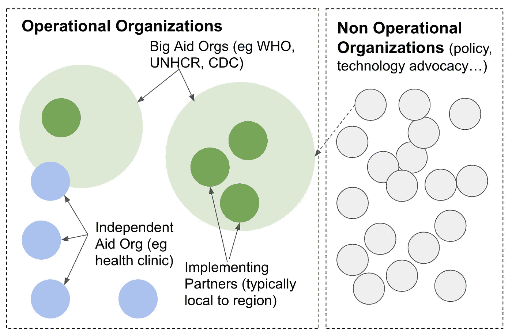

# 数据科学家可以帮助应对新冠肺炎的 5 种方式和应避免的 5 种行动

> 原文：<https://towardsdatascience.com/5-ways-data-scientists-can-help-respond-to-covid-19-and-5-actions-to-avoid-d2accab283d1?source=collection_archive---------18----------------------->

许多数据科学家正在思考如何帮助应对新型冠状病毒病毒及其引发的疾病“新冠肺炎”。本文是针对当前的灾难而写的，但旨在为希望帮助应对灾难的数据科学家提供一般性建议。

在来硅谷完成博士学位之前，我在西非为联合国从事冲突后发展工作，重点是在卫生和灾难应对背景下使机器学习适应低资源语言。我帮助应对了世界各地的许多灾难，包括最近在西非爆发的埃博拉病毒、10 年前爆发的 MERS 冠状病毒，以及作为一个全球流行病跟踪组织的首席技术官。

然而，我认为我通过帮助大型科技公司支持更多语言产生了最大的影响，而不是在实际的灾难响应中。如果你不会说像英语这样的特权语言，那么你更有可能成为灾难的受害者，并且获得的信息更少，无法对自己的恢复做出正确的决定。因此，确保更好的语言覆盖率至关重要。当我领导 AWS 的第一个自然语言处理(NLP)和机器翻译解决方案时，当我拥有两家最大的电话制造商作为 NLP 和语音识别数据的客户时，我利用我的影响力确保这些公司内更多样化的语言支持。虽然很难量化，但我认为这可能最终比我作为灾难响应者的所有时间都更能帮助灾难中的人们。

因此，如果你是一名数据科学家，在一家制造广泛使用的技术的公司工作，你能做的最好的事情可能是确保你的语言技术有更多样的语言支持。这将在未来的灾难中继续发挥作用。

像大多数组织一样，病原体以语言多样性聚集在一起。来源:“人工智能对社会有益”，Robert Munro，斯坦福讲座，从*语言到信息，2015 年。*

内容适度在灾难中也很重要。犯罪分子在金融诈骗中以灾民为猎物，特别是老年人，并以儿童为虐待对象。如果你的公司有内容审核系统来跟踪和报告潜在的金融诈骗和虐待未成年人，那么这是非常重要的工作。

如果你不认为你能在公司的语言多样性或跟踪诈骗/虐待方面有所帮助，但你仍然想为回应新型冠状病毒做出贡献，那么这里有 5 种方法可以帮助你:

1.帮助你周围的人解读信息

2.将专家提供的信息翻译成更多语言

3.准备可能与回答直接相关的数据

4.分析与响应不直接相关的数据

5.利用现有灾害应对数据集进行研究

不幸的是，在很多情况下，你可能会弊大于利。作为一名数据科学家，你 90%以上的想法在付诸实践时实际上都无法实现，而且你不应该期望在灾难响应中有更高的成功率，尤其是当你没有该领域的经验时。所以剩下的 5 种你可以帮助的方式是 5 件应该避免的事情:

6.不要分享你自己关于如何回应的结论

7.不要与不响应的组织合作

8.只要有需要，就不要开始任何你不能支持的工作

9.不要放大任何假媒体

10.不要泄露别人的个人信息

# 1.帮助你周围的人解读信息

作为一名数据科学家，你会定期客观地评估信息，即使你可能没有该领域的经验，你也可能对医疗保健中真正的科学报告有很好的感觉。你的很多家人和周围的人可能比你经验少。现在是时候教他们如何解释图表上的对数标度，以及为什么他们应该怀疑任何没有标度的图表。

目前在社交媒体上分享的误导性图片

这是一个很好的例子，说明了目前在社交媒体上分享的误导性信息。除了需要解释对数标度之外，在此示例图中还有一些需要注意的事项:

1.  此图表的 y 轴显示了每个国家的病例总数。然而，垫底的两个国家，新加坡和香港，人口只有美国的 2%。这将使新加坡和香港的曲线更加平坦。
2.  图表的 x 轴从每个国家的 100 个案例开始。对于较小的国家来说，这往往会在反应的后期出现，并且会偏向那些国家的较平坦曲线。
3.  “戴口罩/不戴口罩”的圆圈看起来像是后来由一个人添加的，他是自动驾驶汽车的[专家](https://gumroad.com/l/KBBhm)，但之前没有冠状病毒医疗保健方面的专业知识。这可能不是每个看到这个图形的人都能看得出来的，即使添加圆圈的人可能试图使它在图形上与众不同。因此，这个图表可能会使人们相信它是由在医疗保健界很有名的“约翰·霍普金斯”认可的，而事实并非如此。
4.  “面具”和“无面具”之间的二元区别几乎肯定是错误的。不同国家的口罩使用水平不同，都在 0%到 100%之间，但不在任何一个极端。
5.  你不能仅仅从这样的图表中推断出口罩和病例数之间的直接因果关系。也许病例较少的国家会同时引入许多保护措施，包括口罩。其他任何一种保护措施都可能造成这种差异，或者根本没有影响:这可能是一些其他因素，或者是伴随这些保护措施的社交距离方面的额外谨慎。
6.  不同的国家将有不同的报告病例数的方法。例如，有些人只报告有症状的人，有些人只检测有症状的人。这并不总是可能的。
7.  不同的国家会有或多或少对病毒敏感的人群，因此或多或少有可能接受检测。在这种情况下，年龄是一个重要因素。
8.  美国的病例是日本、新加坡和香港的 100 多倍(注意对数刻度)。请人们评价这意味着什么。一些例题:你真的认为任何一种自制的解决方案都可以预防 99%以上的病例吗？怎么会有一个涉及数百万担心自己亲人的医护人员的阴谋？

作为一名数据科学家，打击像这样在互联网上传播的错误信息可能是你能做的最重要的事情。如果你亲近的人带着这样的信息来找你，向他们指出所有这些问题，然后问他们为什么一个*不*知道真相的人可能试图误导他们。像这样一个明显伪造的图形可能会导致某人对*口罩产生不信任。这也是错误的。这不应该影响某人的决定，唯一的建议应该是:*

> 只接受你信任的医疗服务提供者的建议

你可能还想谈谈*为什么*医疗保健组织不谈论这样的问题，这是因为他们没有看到数据告诉他们这在此刻是重要的。如果人们分享得太多，它可能会变成政治，迫使像疾病预防控制中心和世卫组织这样的组织做出政治驱动而不是健康驱动的反应。所以，你应该提醒人们不要分享这类信息，不管他们是否同意。

# 2.将专家提供的信息翻译成更多语言

除了英语，你还会说其他语言吗？尤其是一种不太广泛使用的语言？很有可能很多有价值的信息没有被翻译成这些语言，或者更糟糕的是，很多错误的信息在没有正确信息的情况下传播。

以机器翻译和语音识别模型可以使用的方式翻译和/或转录的任何相关数据都将是有用的。例如，两年前我领导了一个项目，用斯瓦希里语制作了 10 多个小时的与灾难和健康相关的红十字会信息录音，并配有转录和英语翻译。这些数据是开源的，现在每一个使用这些数据的机器翻译和语音识别服务对于与新冠肺炎有关的交流都更加准确。如果你能创建类似的数据集并将其开源，这将有助于新冠肺炎和未来用这些语言做出的任何反应。

如果你没有任何现有的数据集，那么我建议帮助像[翻译无国界](https://translatorswithoutborders.org/)这样的组织。他们是帮助上述斯瓦希里语数据集的组织之一，并与应对灾害的组织密切合作。

如果你不是专业翻译，那么不要翻译关于预防或治疗新冠肺炎的建议。教学材料和医学术语是最难翻译对的。我在灾难中运行了[最大的众包翻译应用](https://www.mission4636.org/report/)，所以在这一点上请接受我的建议。

# 3.准备可能与回答直接相关的数据

流行病学家是数据科学家，像我们其他人一样，他们花大部分时间准备数据。如果您能够获取可能与响应直接相关的数据，并将其转换为更有用的格式，那么您就可以直接帮助响应。

这方面的一个例子可能是获取包含模糊或非标准位置名称的匿名运输路线数据集，并将这些位置转换为明确的地理位置。另一个例子是使过去关于冠状病毒的研究论文更容易搜索，这样病毒学家就可以尽可能高效地了解过去的研究。

流行病学家通常来自社会科学，因此与专注于机器学习的数据科学家相比，在对数据进行正确的统计分析时，他们会更加严格。

# 4.分析和共享与响应不直接相关的数据

如果你不是流行病学家、病毒学家或其他在应对灾难方面经验丰富的科学家，那么你不可能在短短几个月内熟悉整个领域。你能做的大多数干预最终会伤害人们，而不是帮助他们(见下文)。

然而，你*可以*分析数据，告诉我们关于疫情的一些重要信息，但是*与应对措施本身没有直接关系。由于新冠肺炎，人们的行为在许多方面都发生了变化。大多数灾难响应专业人员将关注直接响应，而可能不会回头处理其他相关数据。*

例如，当几年前西非爆发埃博拉疫情时，我为许多组织提供建议，因为除了更广泛的救灾经验之外，我还在塞拉利昂和利比里亚生活和工作过。我计算出的与疫情没有直接关系的一件事是，估计死于埃博拉以外原因的人数，因为他们避开了医疗诊所。我计算过，每有一个人死于埃博拉，就会有十个人死于可治疗的疾病:

 [## 埃博拉的沉默受害者

medium.com](https://medium.com/@robert.munro/the-silent-victims-of-ebola-e1a8f83185a9) 

这间接地帮助了回应，因为我们用它来减少这些国家误导性新闻的数量。太多的媒体决定在该地区开展宣传活动，除了减少埃博拉死亡人数之外，没有考虑其他任何事情。因此，我能够将这一分析提供给国际卫生组织，他们用它来帮助媒体尽可能地传递信息。

对新冠肺炎来说，你能找到并分析哪些关于人类行为的数据可能会间接有所帮助？例如，你能看到减少驾驶和车祸会释放出更多的病床吗？这可能是一个重要的数字，但是没有人在全国范围内研究过这个问题。同样，由于污染减少，死亡人数减少了多少？或者，既然我们可以实际测量减少污染的结果，那么全球碳足迹的净收益是什么？气候变化最终导致的死亡人数将超过新冠肺炎，这可能是我们获得全球人类行为变化准确数据的最佳机会之一。

数据科学家现在可以教给我们很多东西*而不需要*直接做出反应的风险，他们最终可能会对世界产生更大的影响。

# 5.利用现有灾害应对数据集进行研究

如果你真的想专注于灾难应对，那么有许多数据集与灾难应对相关，对这些过去数据集的任何洞察都将有助于我们今天为新冠肺炎和未来的其他灾难建立模型。

我帮助创建的一个 NLP 数据集包含 30，000 条来自事件的消息，包括 2010 年海地地震、2010 年智利地震、2010 年巴基斯坦洪水和 2012 年美国超级风暴桑迪。这些都是我帮助应对的灾难，这个数据集还包括跨越多年的新闻文章和数百起其他灾难:

 [## 获取数据

### 一些数据被评估为非敏感数据，我们公开与世界分享。该数据由…发布

www.mission4636.org](https://www.mission4636.org/access-to-data/) 

重要的是，这些数据中有一些是英语以外的语言。例如，Haitian Kreyol 数据被用作 2011 年机器翻译研讨会的共享任务。这个数据集也用于 AI4All、Udacity 和包括斯坦福大学在内的大学开设的课程。对灾难相关数据有经验的人越多，我们对未来的准备就越充分。

如果你从事计算机视觉领域的工作，那么我建议你研究能够支持医疗专业人员解读图像的系统。医疗保健公司将从计算机视觉系统中获得很少或没有价值，该系统只能检测一种类型的感染，并且只能提供预测，而不是帮助医疗保健专业人员进行诊断的界面。

避免只因为数据容易收集或者问题容易建模而在学术界流行的研究。其中包括 NLP 中的纯英文社交媒体分析和计算机视觉中医学图像中单一疾病的自动诊断。这类研究的结果并不能帮助我们决定在实际的灾难中什么方法能帮助我们。

# 6.不要分享你自己关于如何回应的结论

如果你不是医护人员或灾难应对专家，那么你不应该给出关于人们应该如何保护自己的医学意见。尽管我在灾难应对领域工作了十年，但我只是把人们引向更权威的来源。你不会在这篇文章或社交媒体上看到我给你如何保护或对待自己的建议。请也这样做。

此外，如果你引用专家个人或组织的话，最好是让人们去参考这些来源，而不是把它们复制到你的网站上。除非你准备好持续监控医疗专家的建议变化，并立即更新你的材料以反映最新的建议，否则你将在某些时候印刷错误信息，并对谁是权威来源造成混淆。

克制住参加讨论的冲动。你绝对不可能在短时间内学到足够有用的信息。例如，想想如果有人阅读了最近几年最受欢迎的机器学习研究论文，但没有其他经验，会发生什么。这会让他们准备好将有用的机器学习模型用于实际应用吗？绝对不行。这些论文没有任何关于让机器学习在现实世界中工作的内容，我们知道每篇论文都有 100 或 1000 个显示负面结果的实验。

对于直接应对灾难的任何科学来说也是如此，无论是关于流行病学、病毒学还是像口罩这样的设备。阅读 100 篇最相关的论文会让你做出有用的贡献。你会对那些发表在早期研究论文中的特殊问题产生偏见，并且只发表积极的结果。你可能会害死人。

# 7.不要与不响应的组织合作

大多数向数据科学家寻求帮助应对新冠肺炎的组织并没有直接帮助应对新冠肺炎。为了给援助行业一个非常高层次的介绍，这里有一个图表显示了许多援助组织如何在灾难响应中工作:

援助组织结构的高级概述。少数在国家或国际一级提供援助的大型组织被称为“业务组织”，但大多数组织在实际救灾工作中使用当地的“执行伙伴”。一些地方援助组织可能是完全独立或联合独立的，并帮助更大的组织。“非运营型组织”是最小的，但可能会让人误以为它们很大，而且在运营。

如果有人请你帮忙，你怎么知道他们是否真的在回应？最好的帮助组织是在当地运作的组织。你当地的医院或难民食品配送中心需要帮助吗？从他们开始。你可以与疾病预防控制中心和世卫组织这样的大组织合作，但这是开始试图引起大组织注意的*最糟糕的*时间，因为任何花在让你了解最新情况的时间都是他们没有对疫情做出反应的时间。在任何情况下，这些大型组织中的大多数都会将您引向当地的实施伙伴。

非运营组织通常规模较小，利用灾难作为筹资和宣传的机会。请注意，他们谈论的是与像世卫组织这样的大组织的“伙伴关系”，但没有一个地方说他们是“执行伙伴”。这通常是“实际上不是响应的一部分”的代码。如果他们联系你，很有可能*你*就是产品，他们告诉潜在的投资者*“看，我们有来自 X 公司的志愿数据科学家，我们将用创新击败 COVID。”*

根据经验，如果它不是一个你已经知道的全国性组织(如你所在国家的疾病预防控制中心或类似机构)，并且它不是他们的[基金、方案、专门机构和其他](https://www.un.org/en/sections/about-un/funds-programmes-specialized-agencies-and-others/index.html)列表中的前 30 个联合国机构之一，那么寻找你知道在你所在地区运作的组织。

# 8.只要有需要，就不要开始任何你不能支持的工作

在灾难开始的时候，我从来没有在招募人员方面遇到过困难，但是我总是很难招募到能够在一段有意义的时间内提供帮助的人。如果您现在正在编写代码、构建模型或编写文档，您能确保在 3 个月或 6 个月内能够支持这些吗？

请记住，你自己可能会生病，或者不得不照顾别人。如果你或你护理的人更有可能患上更严重的新冠肺炎病，那么你应该*而不是*让自己处于应对危机的关键路径上，如果你还不是一名必要的工作人员。此外，你需要高度同理心，但冷静，成为一个有效的灾难应变者。如果你陷入对自己和你所爱的人的担忧，那么你可能来自一个充满个人激情的地方，并且很难做到客观的同情。在这种情况下，我不能相信任何人，所以我总是让这样的人在灾难中执行非关键任务。

# 9.不要放大任何假媒体

每次灾难中都会出现大量虚假的媒体报道。最具破坏性的是那些针对响应组织没有做正确的事情。甚至受欢迎的媒体机构也这样做:他们发现响应的一小部分，其中一个组织最近没有做任何工作，或者存在与其他组织不一致的政策。无论问题有多小，媒体机构都很容易将其描述为“潜在危及数百万人的生命”，并让争论双方的人发表评论。本质上，他们在不应该存在争议的时候制造争议。

最喜欢被引用的目标是在一个国家不掌权的*政客，因为这些政客会指责执政党，以及在数据科学等领域的技术特立独行者，因为这是信心经常超过能力的地方。*

记者知道这类文章非常不道德，他们避免署名。因此，寻找没有作者的新闻文章，或者是来自数据科学或反对派政党的特邀作者。

这种叙述最糟糕的部分是诸如“不要相信世卫组织”或“不要相信疾病控制中心”等信息。即使这个关于*的争论是正确的，关于不信任这些组织的更广泛的故事将比解决这个问题造成更大的伤害。*

# 10.不要泄露别人的个人信息

世界上大多数政府至少会有一些人试图实施剥夺公民自由的措施。具体到冠状病毒，我去年在 KDD 谈到了这一点，分享了我在 MERS 冠状病毒爆发期间管理的公司如何决定*而不是*帮助进行社交媒体分析，因为这对人们的隐私有影响:

从 1:13([https://www.youtube.com/watch?v=4ll77xuYszc&feature = youtu . be&t = 4380](https://www.youtube.com/watch?v=4ll77xuYszc&feature=youtu.be&t=4380))开始，在 2019 年的 KDD，我谈到了沙特阿拉伯政府如何利用冠状病毒爆发( [MERS-CoV](https://www.cdc.gov/coronavirus/mers/about/symptoms.html) )为借口，在社交媒体上识别异见人士。

许多罪犯也是如此。虽然在灾难期间犯罪率往往会下降，但因为人们都非常善良，所以有些人会在混乱中茁壮成长以剥削他人。

因此，与本文的第一点相关的是，照顾好你的家人。在灾害期间，老年人是诈骗的专门目标，通过泄露他们的个人身份来骗取钱财。儿童经常成为性侵犯者的目标，所以要特别小心任何数据来源，即使它看起来是公开的。例如，[国家地理杂志在 2010 年海地地震后发布了海地儿童的电话号码。](https://www.mission4636.org/access-to-data/#cease_and_desist)

总的来说，没有必要将任何数据公之于众，你甚至应该小心报道你是如何应对灾难的。如果对你的贡献的认可是重要的，那么我建议私下里或者在回应结束后得到它。

# 如果我什么也帮不上呢？

如果你现在无能为力，那么我建议你采取长期行动:

1.  准备支持你周围的人。在大多数国家，死亡人数将在未来几周内迅速上升。如果你没有失去你认识的人，你的一个朋友几乎肯定会。陪在他们身边。他们不会得到通常从医护人员那里得到的情感支持，因为他们工作过度。你可以填补这个空白。
2.  做好疲劳的准备。灾难疲劳(也被称为[同情疲劳](https://en.wikipedia.org/wiki/Compassion_fatigue))是大多数人在因新冠肺炎而改变生活方式几周或几个月后会经历的精神和情绪疲惫。我不太担心美国死亡高峰时的人类行为，而是担心接下来 2-3 周人们会变得疲劳。我见过经验丰富的灾难应对专家在这一时期比任何时候都更容易崩溃。这时，你需要找到额外的储备，让自己和周围的人变得强大。
3.  有助于未来的灾难应对研究。灾难总是在发生，大多数很少或根本没有媒体关注。在 ImageNet 建立的同时，我在斯坦福建立了第一个灾难响应数据集，可以肯定地说，我的数据集只有 ImageNet 的 1%,这令人失望。像任何其他技术或科学一样，我们需要几个月甚至几年的时间来改进我们的方法，所以当*不*也对灾难做出反应时，这是最好的。

感谢大家帮忙回复！

罗伯特·芒罗

2020 年 4 月

***编者注:*** [*走向数据科学*](http://towardsdatascience.com/) *是一份以研究数据科学和机器学习为主的中型刊物。我们不是健康专家或流行病学家，本文的观点不应被解释为专业建议。想了解更多关于疫情冠状病毒的信息，可以点击* [*这里*](https://www.who.int/emergencies/diseases/novel-coronavirus-2019/situation-reports) *。*