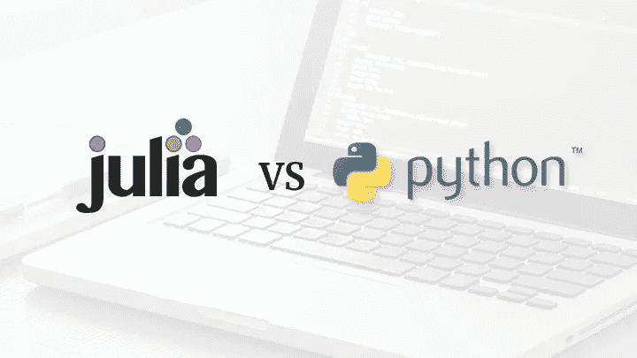
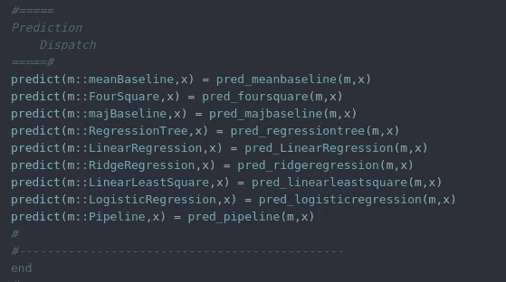

# Julia 优于 Python 的 5 个方面

> 原文：<https://towardsdatascience.com/5-ways-julia-is-better-than-python-334cc66d64ae?source=collection_archive---------1----------------------->

## 为什么 Julia 比 Python 更适合 DS/ML



Julia 是一种多范例、主要为机器学习和统计编程而创建的函数式编程语言。Python 是另一种用于机器学习的多范例编程语言，尽管通常 Python 被认为是面向对象的。另一方面，Julia 更基于功能范式。虽然 Julia 肯定没有 Python 流行，但是使用 Julia 进行数据科学有一些巨大的好处，这使它在许多情况下是 Python 的更好选择。

# №1:速度


不谈速度，很难谈朱莉娅。朱莉娅以速度非常快而自豪。Julia 不像 Python 是解释型的，它是一种编译型语言，主要是在自己的基础上编写的。然而，与 C 等其他编译语言不同，Julia 是在运行时编译的，而传统语言是在执行前编译的。Julia，尤其是写得好的，可以和 C 一样快，有时甚至比 C 更快。Just In Time (JIT)编译器的编译速度快得令人难以置信，尽管它的编译更像一种解释语言，而不是传统的低级编译语言，如 C 或 Fortran。

# 第二:多功能性

你可能已经注意到，我说过 Python 是多才多艺的，这是 Julia 的一个优势，这是真的——有很多事情 Python 可以做，而 Julia 却做不到。当然，这只是从本质上来说，因为我们现在谈论的多功能性是语言的多功能性。Julia 代码在 R、Latex、Python 和 c 中是通用的可执行代码。这意味着典型的数据科学项目有可能只需编写一次，就可以在包装器中从另一种语言编译成 Julia，或者只需发送字符串。

PyCall 和 RCall 也是相当大的交易。考虑到 Julia 的一个严重缺点实际上是包，在需要的时候调用 Python 和 R 真的很方便。PyCall 在 Julia 中得到了很好的实现，确实做得很好，非常有用。

# №3:多重派遣



Julia 是一种类型非常独特的语言，有自己的特点和特性，但其中最酷的特性之一是 Julia 的多重调度。首先也是最重要的，茱莉亚的多次派遣速度很快。最重要的是，使用 Julia 的多态分派允许将函数定义作为结构的属性来应用。当然，这使得遗传在朱莉娅体内变得可行。

不仅如此，使用 Julia 的多重分派使函数具有可扩展性。这对于包扩展来说是一个很大的好处，因为无论何时显式导入一个方法，用户都可以更改它。显式导入您的方法并扩展它以将结构路由到新函数会很容易。

# №4:专为 ML 打造

与 Python 不同，Julia 的设计初衷是用于统计学和机器学习。Python 是在 90 年代早期作为一种简单的面向对象语言创建的，尽管从那时起它已经发生了很大的变化。鉴于 Python 的历史，以及 Python 如此流行以来的广泛用途，使用一种专门为高级统计工作而设计的语言可能会带来很多好处。

我认为这比 Python 更有利于 Julia 的一个方面是线性代数。香草 Python 可以突突地完成线性代数，但是香草 Julia 可以飞快地完成线性代数。这当然是因为 Python 从来就不支持机器学习中的所有矩阵和方程。Python 一点也不差，尤其是对于 NumPy，但是就无软件包体验而言，Julia 更倾向于这类数学。Julia 的操作系统比 Python 的更接近 R，这是一个很大的好处。大多数线性代数更快更容易做。让我们展示一个点积等式，以进一步说明这一点:

```
Python -> y = np.dot(array1,array2)
R -> y <- array1 * array2
Julia -> y = array1 .* array2
```

# №5:包管理器

我要第一个说，Julia 的 Pkg 包管理器比 Python 的 Pip 包管理器高出一个世界。Pkg 自带 REPL 和茱莉亚包，你可以从中构建、添加、删除和实例化包。由于 Pkg 与 Git 的结合，这尤其方便。更新很容易，添加包总是很容易，并且总的来说，任何时候使用 Pkg 超过 Python 的 Pip 都是一件愉快的事情。

# 结论

使用哪种语言并不重要，不管是 R、Julia、Python 还是 Scala。然而，需要注意的是，每种语言都有它的缺点，没有一种语言会是“完美的语言”如果你在编程方面是多才多艺的，从机器学习到图形用户界面再到 API，这一点尤其正确。也就是说，Julia 当然是我最喜欢的库之一，还有 Python。Python 有更好的包，通常如果项目足够小，我会转向 Python，但是对于有数百万观察值的数据集，甚至很难用 Python 读取这种数据。

总的来说，我期待朱莉娅的未来。Julia 写起来很有趣，将来可能会更适合数据科学。