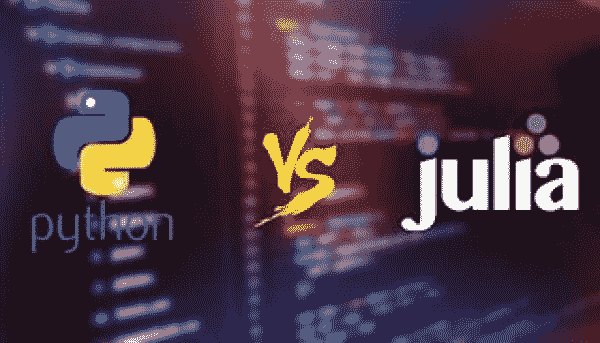
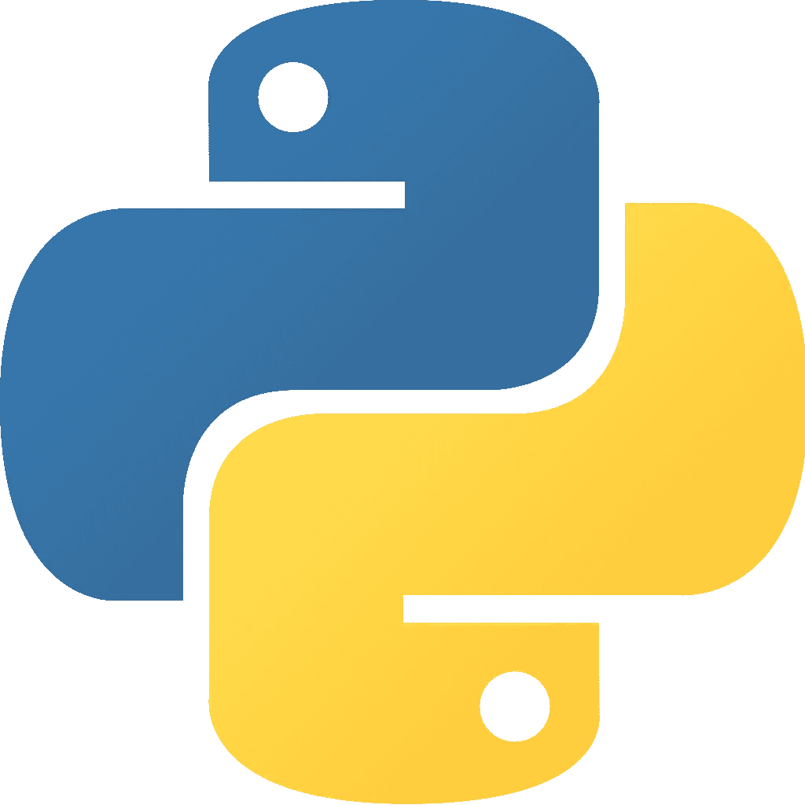
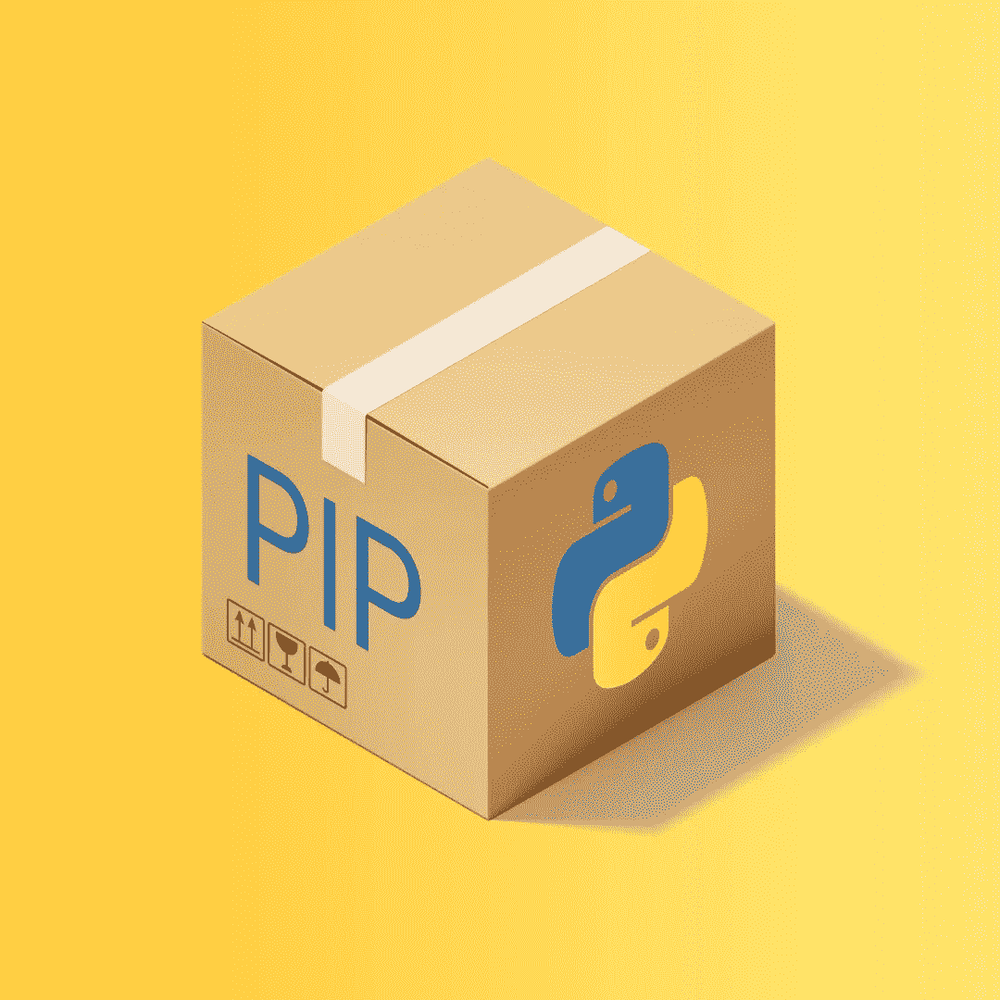

# Python 优于 Julia 的 5 个方面

> 原文：<https://towardsdatascience.com/5-ways-python-is-better-than-julia-89267cbf5b9f?source=collection_archive---------21----------------------->

## 为什么 Python 比 Julia 更适合 DS/ML

Python 是世界上最流行的高级编程语言。这是有充分理由的，因为许多代码库实际上是在 Python 内部编写的。另一方面，Python 是用 C. Julia 编写的解释型高级编程语言。在 Julia 出现之前，Python 近年来在数据科学家中更受欢迎。

Julia 是一种高级的、多范例的统计编程语言。与 Python 不同，Julia 主要是为统计计算(像 r)而创建的。Julia 是一种使用自己的编译器的编译语言，被称为“实时”编译器。尽管 Julia 是一种很好的机器学习语言，但相比之下 Python 仍然非常流行。

# №1:人气

基于 Python 的项目的最大好处是 Python 是一种通用语言，尤其是在 2020 年的今天。许多语言被用来翻译 Python 代码，这些代码经常被用于许多不同的行业，包括但不限于:

*   开发运营
*   网络安全
*   数据科学家
*   软件工程师
*   Web 开发人员

Python 受欢迎的另一个巨大好处是文档，因为如果有人在互联网上问过你的问题，通常会更容易找到答案。Julia 的一个大问题是缺乏信息，你经常会发现自己在阅读可怕的 Github-README 文档。不用说，过一段时间后会变得很老。

# №2:简单

众所周知，Python 很容易，这是一个很大的优势。让我们面对现实吧，损失函数和相关系数被抛来抛去的复杂算法已经够复杂了，不用担心底层语法。例如，即使将相同的代码写入 Lisp，也要花费两倍以上的时间。这带来了快速教育、快速理解以及最重要的快速故障排除的好处。

# №3:包装

与 Python 的大量用户相应的是 Python 的大量包。我真正喜欢使用 Python 的地方是能够使用两年前有人在 Github 上制作的 Python 包装器中未记录的端点。诸如此类的事情在 Julia 中并不存在，这使得获取数据更加困难。

包是语言中非常重要的一部分。如果没有合适的代码库来支持机器学习，你会遇到很多问题，你不得不从非常非常低的层次解决问题。这当然是乏味的，并且在进行的过程中消耗更多的时间。Python 的有趣之处在于能够随时从工具箱中取出任何工具——而不必为自己使用该工具编写程序。

# №4: Linux

Python 和 Linux 携手并进已经不是什么秘密了。事实上，只要认识到 Python 最初是在 GPL 许可下发布的，并且直到今天仍然是开源的，这些信息就可以得到验证。这太棒了，因为这意味着我们所有的服务器、基于 Linux 的计算机、甚至苹果设备现在都预装了 Python，并且默认文件夹已经准备就绪。

这适用于定制和修复的另一种情况。不喜欢你的 Gnome 应用程序栏在不用的时候不会消失？好吧，把它编进去！任何你不喜欢的东西都可以用最简单的语言编程。

# №5:多功能性

Julia 是一种非常通用的语言，但是也就是说，Python 是以完全不同的方式通用的。Python 是为面向对象和通用编程而创建的(尽管在这些范例中没有特别发现)。)这意味着，虽然 Python 已经证明了它在统计和机器学习方面的能力，但 Python 还能够运行 API、移动文件、提供 GUI、托管 web 服务器、控制微处理器，几乎任何你想做的事情，都是 Python 能够做到的。这当然让 Python 变得非常通用。

将 Python 的多功能性与 Julia 的多功能性进行比较，Julia 的有用性在较低层次上当然会恶化。这没什么大不了的，因为低级编程在未来不会有什么发展，再增加一门语言也是白费力气，但是特别的是，Julia 不会做 GUI(至少现在不会)，并且有一个 arduino 包，但是很难注册总线输入。然而，部署 web 服务器、统计数据和低级文件系统工作(如编写文本文件)当然仍然是可行的。

# 最后

Julia 和 Python 都是我非常喜欢的伟大语言。当谈到两种语言在数据科学方面孰优孰劣时，这两种语言肯定会互相攻击。如果你想从 Julia 的角度阅读一篇类似的文章，这里是我对这篇文章的反驳，我描述了我认为 Julia 优于 Python 的 5 个方面。我迫不及待地想看到 Julia 之路的未来，以及 10 年后数据科学语言的发展方向。