# 在 PySpark 数据框架中添加新列的 5 种方法

> 原文：<https://towardsdatascience.com/5-ways-to-add-a-new-column-in-a-pyspark-dataframe-4e75c2fd8c08?source=collection_archive---------0----------------------->


图片由来自 [Pixabay](https://pixabay.com/?utm_source=link-attribution&utm_medium=referral&utm_campaign=image&utm_content=1953253) 的 [nickgesell](https://pixabay.com/users/nickgesell-3554748/?utm_source=link-attribution&utm_medium=referral&utm_campaign=image&utm_content=1953253) 提供

## 并且，它们都是有用的

***每天都在生成太多的数据。***

***虽然有时我们可以使用类似于***[***Rapids***](/minimal-pandas-subset-for-data-scientist-on-gpu-d9a6c7759c7f?source=---------5------------------)***或*** [***并行化***](/add-this-single-word-to-make-your-pandas-apply-faster-90ee2fffe9e8?source=---------11------------------) ***，*** Spark 这样的工具来管理我们的大数据，但如果您正在处理数 TB 的数据，这是一款非常棒的工具。

在我关于 Spark 的上一篇文章中，我解释了如何使用 PySpark RDDs 和 Dataframes。

虽然这篇文章解释了很多关于如何使用 rdd 和基本数据帧操作的内容，但是我错过了很多关于使用 PySpark 数据帧的内容。

只有当我需要更多的功能时，我才会仔细阅读，想出多种解决方案来做一件事情。

***如何在 spark 中创建新栏目？***

现在，这可能听起来微不足道，但相信我，它不是。由于您可能想对数据做这么多事情，我很确定您最终会在工作流中使用这些列创建过程中的大部分。有时利用 Pandas 的功能，有时使用基于 RDDs 的分区，有时利用成熟的 python 生态系统。

**这篇文章的主题是“在 Pyspark 数据框架中创建新列的多种方法”**

如果您安装了 PySpark，可以跳过下面的入门部分。

# Spark 入门

我知道你们很多人不会在系统中安装 spark 来尝试和学习。但是安装 Spark 本身就很头疼。

既然我们想了解它是如何工作的，我建议你在社区版中使用 Spark on data bricks[**here**](https://databricks.com/try-databricks?utm_source=databricks&utm_medium=homev2tiletest)。别担心，它是免费的，尽管资源更少，但对于我们现在的学习目的来说是有用的。

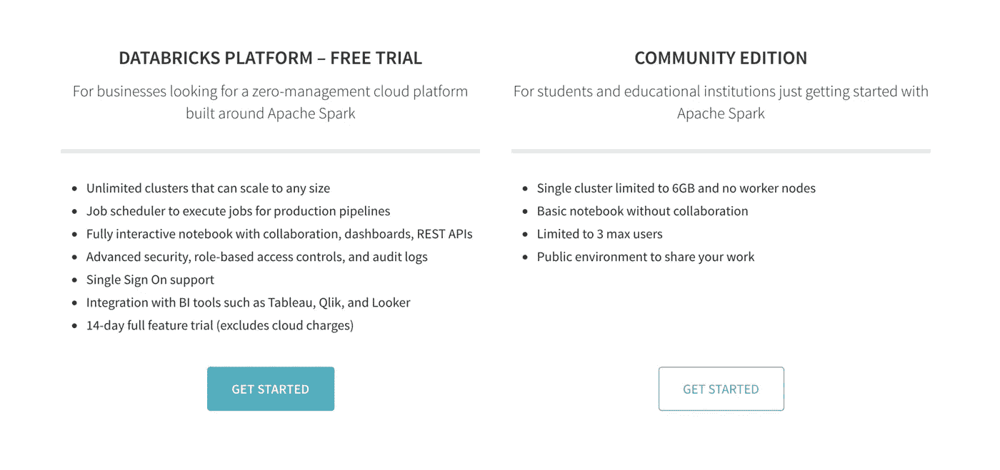

一旦您注册并登录，将出现以下屏幕。

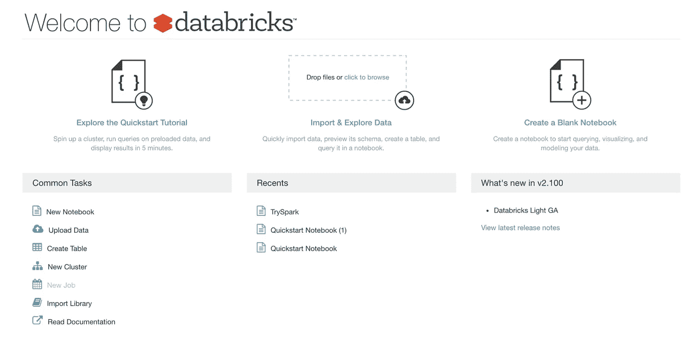

你可以在这里开始一个新的笔记本。

选择 Python 笔记本，并为其命名。

一旦您启动一个新的笔记本并尝试执行任何命令，笔记本会询问您是否要启动一个新的集群。动手吧。

下一步将检查 sparkcontext 是否存在。要检查 sparkcontext 是否存在，您必须运行以下命令:

```
sc
```

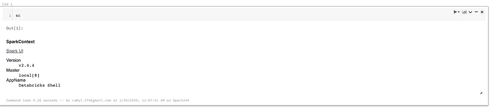

这意味着我们可以在笔记本上运行 Spark。

# 数据

在这里，我将处理 movie lens[**ml-100k . zip**](https://github.com/MLWhiz/data_science_blogs/tree/master/spark_post)数据集。1000 个用户对 1700 部电影的 100，000 次评分。在这个压缩文件夹中，我们将专门处理的文件是分级文件。该文件名保存为“u.data”

如果您想要上传此数据或任何数据，您可以单击左侧的 data 选项卡，然后使用提供的 GUI 添加数据。

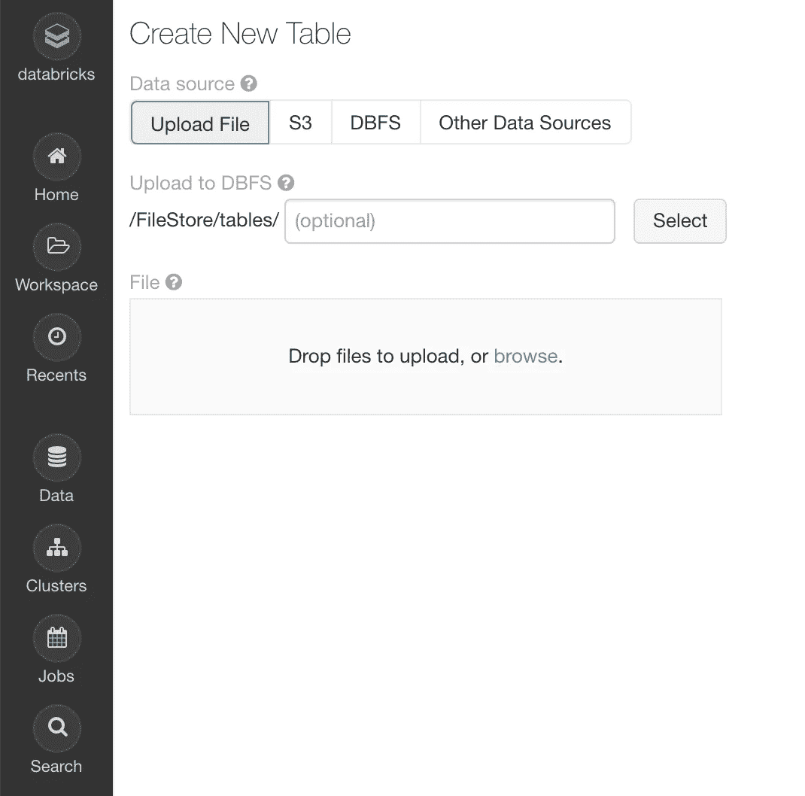

然后，我们可以使用以下命令加载数据:

```
ratings = spark.read.load("/FileStore/tables/u.data",format="csv", sep="\t", inferSchema="true", header="false")ratings = ratings.toDF(*['user_id', 'movie_id', 'rating', 'unix_timestamp'])
```

这是它的样子:

```
ratings.show()
```

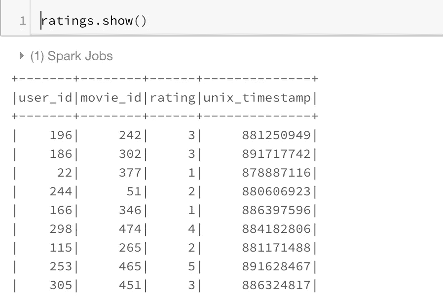

好了，现在我们终于可以开始我们感兴趣的部分了。如何在 PySpark Dataframe 中创建新列？

# 1.使用 Spark 本地函数


安德鲁·詹姆斯在 [Unsplash](https://unsplash.com?utm_source=medium&utm_medium=referral) 上拍摄的照片

在 PySpark 数据帧中创建新列的最简单的方法是使用内置函数。这是创建新列的最有效的编程方式，所以每当我想做一些列操作时，这是我第一个去的地方。

我们可以使用`.withcolumn`和 PySpark SQL 函数来创建一个新列。本质上，您可以找到已经使用 Spark 函数实现的字符串函数、日期函数和数学函数。我们可以将 spark 函数导入为:

```
import pyspark.sql.functions as F
```

我们的第一个函数是`F.col`函数，它让我们可以访问列。因此，如果我们想将一列乘以 2，我们可以使用`F.col`作为:

```
ratings_with_scale10 = ratings.withColumn("ScaledRating", 2*F.col("rating"))ratings_with_scale10.show()
```

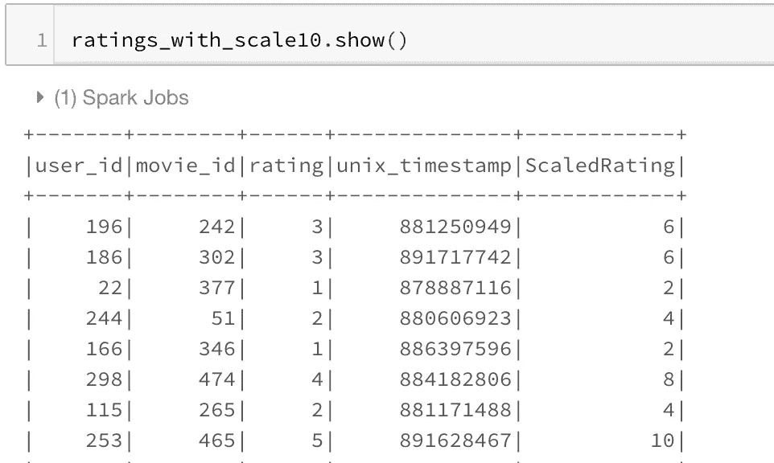

我们也可以使用数学函数，如`F.exp`函数:

```
ratings_with_exp = ratings.withColumn("expRating", 2*F.exp("rating"))ratings_with_exp.show()
```

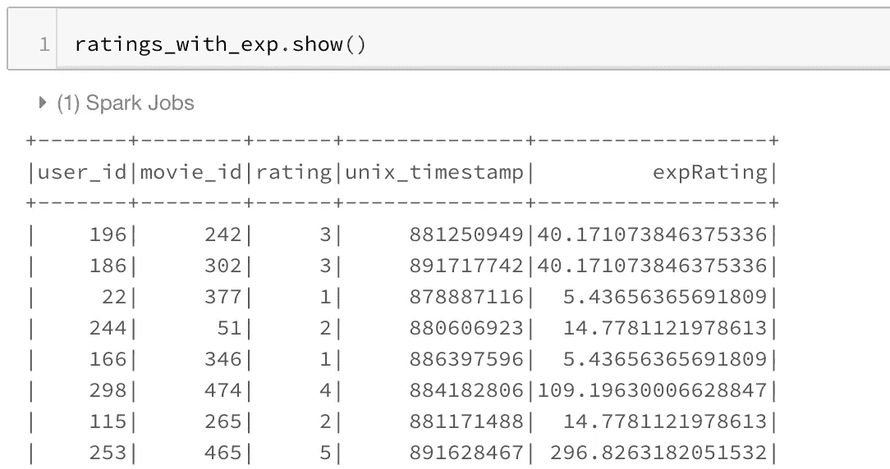

这个模块还提供了很多其他的功能，对于大多数简单的用例来说已经足够了。你可以点击查看功能列表[。](https://spark.apache.org/docs/latest/api/python/pyspark.sql.html#module-pyspark.sql.functions)

# 2.Spark UDFs


照片由 [Unsplash](https://unsplash.com?utm_source=medium&utm_medium=referral) 上的[除以零](https://unsplash.com/@divide_by_zero?utm_source=medium&utm_medium=referral)

有时我们想对一列或多列做复杂的事情。这可以被认为是将 PySpark 数据帧映射到一列或多列的操作。虽然 Spark SQL 函数确实解决了许多列创建的用例，但每当我想使用更成熟的 Python 功能时，我都会使用 Spark UDF。

要使用 Spark UDF，我们需要使用`F.udf`函数将常规 python 函数转换成 Spark UDF。我们还需要指定函数的返回类型。在这个例子中，返回类型是`StringType()`

```
import pyspark.sql.functions as F
from pyspark.sql.types import *def somefunc(value):
  if   value < 3: 
      return 'low'
  else:
      return 'high'#convert to a UDF Function by passing in the function and return type of functionudfsomefunc = F.udf(somefunc, StringType())ratings_with_high_low = ratings.withColumn("high_low", udfsomefunc("rating"))ratings_with_high_low.show()
```

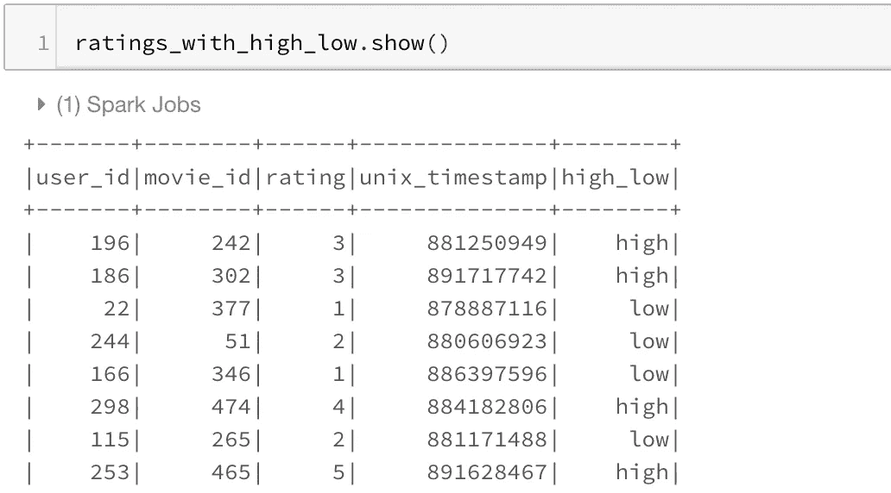

# 3.使用 rdd


瑞安·昆塔尔在 [Unsplash](https://unsplash.com?utm_source=medium&utm_medium=referral) 上拍摄的照片

有时，spark UDFs 和 SQL 函数对于特定的用例来说是不够的。您可能希望利用 spark RDDs 带来的更好的分区。或者您可能想在 Spark RDDs 中使用组函数。您可以使用这个，主要是当您需要访问 python 函数内 spark 数据框中的所有列时。

不管是哪种情况，我发现这种使用 RDD 创建新列的方式对于有使用 rdd 经验的人来说非常有用，rdd 是 Spark 生态系统中的基本构建块。

下面的过程利用了在`Row`和`pythondict`对象之间转换的功能。我们将一个行对象转换成一个字典。像我们习惯的那样使用字典，并将字典转换回 row。

```
import math
from pyspark.sql import Rowdef rowwise_function(row):
  # convert row to dict:
  row_dict = row.asDict()
  # Add a new key in the dictionary with the new column name and value. 
  row_dict['Newcol'] = math.exp(row_dict['rating'])
  # convert dict to row:
  newrow = Row(**row_dict)
  # return new row
  return newrow# convert ratings dataframe to RDD
ratings_rdd = ratings.rdd
# apply our function to RDD
ratings_rdd_new = ratings_rdd.map(lambda row: rowwise_function(row))
# Convert RDD Back to DataFrame
ratings_new_df = sqlContext.createDataFrame(ratings_rdd_new)ratings_new_df.show()
```

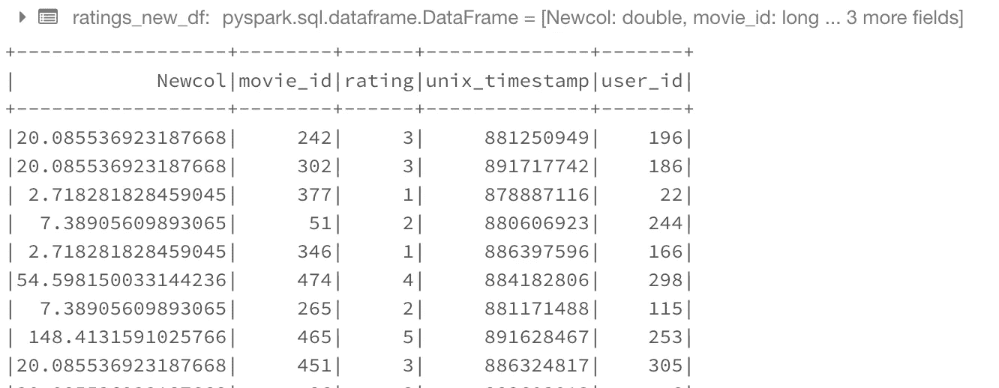

# 4.熊猫 UDF


帕斯卡尔·贝纳登在 [Unsplash](https://unsplash.com?utm_source=medium&utm_medium=referral) 上的照片

Spark 版本 2.3.1 中引入了这一功能。这就允许你在 Spark 上使用 pandas 的功能。当我必须在 Spark 数据帧上运行 groupby 操作时，或者当我需要创建滚动特征并希望使用 Pandas 滚动函数/窗口函数时，我通常会使用它。

我们使用它的方式是通过使用`F.pandas_udf`装饰器。这里我们假设函数的输入是一个熊猫数据帧。我们需要从这个函数中依次返回一个熊猫数据帧。

这里唯一的复杂性是我们必须为输出数据帧提供一个模式。我们可以使用下面的格式。

```
# Declare the schema for the output of our function
outSchema = StructType([StructField('user_id',IntegerType(),True),StructField('movie_id',IntegerType(),True),StructField('rating',IntegerType(),True),StructField('unix_timestamp',IntegerType(),True),StructField('normalized_rating',DoubleType(),True)])# decorate our function with pandas_udf decorator
[@F](http://twitter.com/F).pandas_udf(outSchema, F.PandasUDFType.GROUPED_MAP)
def subtract_mean(pdf):
    # pdf is a pandas.DataFrame
    v = pdf.rating
    v = v - v.mean()
    pdf['normalized_rating'] =v
    return pdfrating_groupwise_normalization = ratings.groupby("movie_id").apply(subtract_mean)rating_groupwise_normalization.show()
```

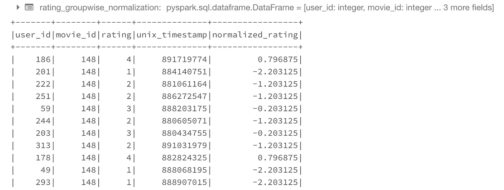

我们也可以利用这个来 ***在每个 spark 节点上训练多个单独的模型。*** 为此，我们复制我们的数据，并给每个副本一个键和一些训练参数，如 max_depth 等。然后，我们的函数获取 pandas 数据帧，运行所需的模型，并返回结果。该结构如下所示。

```
# 0\. Declare the schema for the output of our function
outSchema = StructType([StructField('replication_id',IntegerType(),True),StructField('RMSE',DoubleType(),True)])# decorate our function with pandas_udf decorator
[@F](http://twitter.com/F).pandas_udf(outSchema, F.PandasUDFType.GROUPED_MAP)
def run_model(pdf):
    # 1\. Get hyperparam values
    num_trees = pdf.num_trees.values[0]
    depth = pdf.depth.values[0]
    replication_id = pdf.replication_id.values[0]
    # 2\. Train test split
    Xtrain,Xcv,ytrain,ycv = train_test_split.....
    # 3\. Create model using the pandas dataframe
    clf = RandomForestRegressor(max_depth = depth, num_trees=num_trees,....)
    clf.fit(Xtrain,ytrain)
    # 4\. Evaluate the model
    rmse = RMSE(clf.predict(Xcv,ycv)
    # 5\. return results as pandas DF
    res =pd.DataFrame({'replication_id':replication_id,'RMSE':rmse})
    return res

results = replicated_data.groupby("replication_id").apply(run_model)
```

以上只是一个想法，而不是工作代码。尽管稍加修改就能工作。

# 5.使用 SQL

对于喜欢 SQL 的人来说，甚至有一种方法可以使用 SQL 创建列。为此，我们需要注册一个临时 SQL 表，然后使用带有附加列的简单选择查询。人们也可以用它来连接。

```
ratings.registerTempTable('ratings_table')
newDF = sqlContext.sql('select *, 2*rating as newCol from ratings_table')
newDF.show()
```

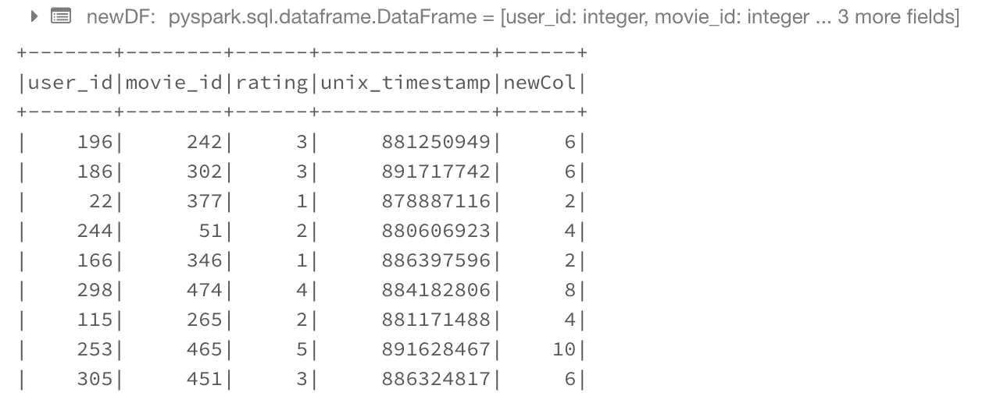

# 结论


由[凯利·西克玛](https://unsplash.com/@kellysikkema?utm_source=medium&utm_medium=referral)在 [Unsplash](https://unsplash.com?utm_source=medium&utm_medium=referral) 上拍摄的照片

这就是本专栏的结尾(双关语)

希望我已经很好地介绍了专栏创建过程，可以帮助您解决 Spark 问题。如果您需要了解更多 spark 基础知识，请查看:

[](/the-hitchhikers-guide-to-handle-big-data-using-spark-90b9be0fe89a) [## 使用 Spark 处理大数据的指南

### 不仅仅是介绍

towardsdatascience.com](/the-hitchhikers-guide-to-handle-big-data-using-spark-90b9be0fe89a) 

***你可以在 databricks 上的*** [***GitHub 资源库***](https://github.com/MLWhiz/data_science_blogs/blob/master/spark_columns/Columns.ipynb) ***或*** [***发布的笔记本***](https://databricks-prod-cloudfront.cloud.databricks.com/public/4027ec902e239c93eaaa8714f173bcfc/7664398068420572/312750581110937/3797400441762013/latest.html) ***中找到这篇文章的所有代码。***

还有，如果你想了解更多关于 Spark 和 Spark DataFrames 的知识，我想调出 Yandex 提供的[](https://coursera.pxf.io/coursera)****大数据精要 [**大数据专业化**](https://coursera.pxf.io/coursera) 的一个精品课程。****

****谢谢你的阅读。将来我也会写更多初学者友好的帖子。在 [**媒体**](https://medium.com/@rahul_agarwal?source=post_page---------------------------) 关注我或者订阅我的 [**博客**](https://mlwhiz.ck.page/a9b8bda70c) 了解他们。一如既往，我欢迎反馈和建设性的批评，可以通过 Twitter[**@ mlwhiz**](https://twitter.com/MLWhiz?source=post_page---------------------------)联系****

****此外，一个小小的免责声明——这篇文章中可能会有一些相关资源的附属链接，因为分享知识从来都不是一个坏主意。****