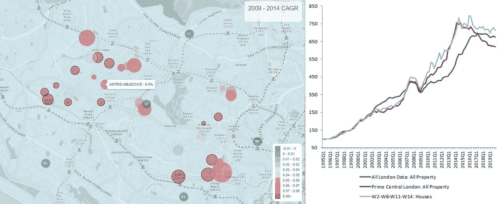
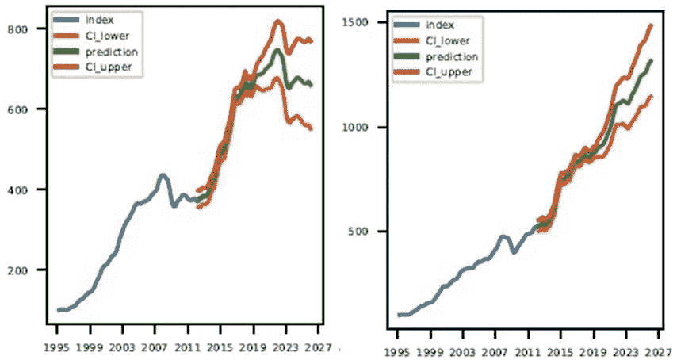

# 将数据科学应用于房地产的 5 种方式

> 原文：<https://towardsdatascience.com/5-ways-to-apply-data-science-to-real-estate-e18cdcd0c1a6?source=collection_archive---------3----------------------->

## 有哪些实实在在的好处，我们在哪里可以学到这些技巧？

数据科学是可能对房地产行业产生最大长期影响的技术。(照片由[詹尼斯·格拉斯](https://unsplash.com/@jannesglas?utm_source=medium&utm_medium=referral)在 [Unsplash](https://unsplash.com?utm_source=medium&utm_medium=referral) 上拍摄)

房地产行业面临着巨大的压力，需要释放大数据的潜力，并将机器学习和基于证据的方法纳入其工作流程。在[毕马威全球 PropTech 调查 2018](https://home.kpmg/uk/en/home/insights/2018/05/kpmg-global-proptech-survey-2018.html) 中，49%的参与者认为人工智能、大数据和数据分析是可能对房地产行业产生长期影响的技术。

因此，一些具有长期经营历史的房地产机构的高瞻远瞩的高管正在推动他们的公司释放他们几十年的交易、估值、资产管理、上市和其他数据记录的潜力。与此同时，随着成功的初创公司如 [HouseCanary](https://www.housecanary.com/) 和 [Reonomy](https://www.reonomy.com/) 加入老牌公司如 [CoStar](https://www.costar.com/) 和 [Real Capital Analytics](https://www.rcanalytics.com/) ，数据提供空间正在走向成熟(甚至可能[过度拥挤](https://therealdeal.com/2020/02/05/intel-is-now-investing-in-real-estate-tech-startups/)，使得任何对房地产感兴趣的公司都有可能快速获得大量相关数据。

然而，正如 NAIOP 最近的一篇文章所指出的，房地产专业人士正面临着如何实际利用数据的挑战。[毕马威全球 PropTech 调查 2019](https://home.kpmg/uk/en/home/insights/2019/11/kpmg-global-prop-tech-survey-2019.html) 证实，80%的公司仍然没有“大部分或全部”由数据引导决策。同一份报告还暗示了“技能差距”——只有 5%的房地产公司由具有数据分析知识的人领导转型工作。

那么，我们到底该如何将数据科学应用于房地产呢？有哪些实实在在的好处？此外，我们可以从哪里学习技能和技术，从而利用大数据在房地产领域的潜力？

**[1]房地产价格指数**

房地产价格指数是一种统计方法，可以分析数百万行嘈杂的交易数据，并获得对次级市场历史表现的详细了解。(图片由作者提供)

正如[新闻文章](https://www.cnbc.com/2018/12/05/sell-offs-could-be-down-to-machines-that-control-80percent-of-us-stocks-fund-manager-says.html)和[专家评论](https://www.experfy.com/blog/the-future-of-algorithmic-trading)所报道的，数据科学在投资中的应用已经在金融领域激增，如今数据驱动的计算机模型占交易的 80%。然而，与公开上市的股票不同，每一笔报道的房地产交易都代表着一种独特资产的交换——没有哪两种房地产是完全相同的。即使是在同一栋建筑中的两个单位进行交易，它们也可能大相径庭，价格也可能大相径庭。

这给房地产带来了一个特殊的问题——我们如何利用大型数据集来了解各个子市场的表现？如果每个时期交易的房地产类型不同，对历史交易进行简单的平均可能会有偏差，并且在确定平均中包括或排除哪些房地产时存在主观性，以至于不同的研究人员最终可能会得出不同的历史表现。

数据科学方法提出了该问题的几种解决方案。享乐回归技术(在像新加坡这样的国家使用)的运作原则是，每项资产的个别特征可以单独定价，以控制资产之间的差异。

或者，分析可以仅限于比较不止一次出售的房产的价格变化。这就是所谓的重复销售法，即跟踪同一资产在一段时间内的价格变化。美国 [Case-Shiller 指数](https://us.spindices.com/documents/methodologies/methodology-sp-corelogic-cs-home-price-indices.pdf)就是这种技术的一个众所周知的例子。

从根本上说，这些方法允许用户超越人类的能力，处理比任何一个人都无法人工理解的更多数据，以产生准确的房地产市场表现信号。数百万行嘈杂的交易数据可以与关于地点、房产特征、人口统计等信息结合起来，产生精细的子市场指数。例如，指数可以精确定位特定邮政区的物业回报，如伦敦的 WC1 指数或 E1 指数，或特定物业类型，如两床公寓指数与三床公寓指数，同时考虑完整数据集中所有交易的影响。指数化有助于确定历史趋势，进而有助于当前定价和未来回报估计。

**[2]自动估价模型**

自动化估价模型通过利用大型数据集评估公平的当前交易价格，帮助我们了解当前的房地产市场。(图片由作者提供)

统计估值方法在全球范围内越来越受欢迎，例如美国的 [Zillow Zestimate](https://www.zillow.com/how-much-is-my-home-worth/) ，新加坡的 [UrbanZoom](https://www.urbanzoom.com/zoom-value) ，以及芬兰的 [SkenarioLabs](https://skenariolabs.com/) 。任何自动估价模型的目标都是利用数据来产生对房产市场价值的估计——在这种情况下，自愿的买方和卖方可以公平交易，而无需强制。

采用了类似于指数化的方法，部署了潜在的更先进的数据科学技术，以利用在线学习和集成方法。但是，最后的输出是不一样的。目标不是指数，而是资产价值的点(或范围)估计。直接的好处是更精确地确定一项财产的公平市场价值，这种价值是瞬间产生的，而且成本很低。这些估价不仅对房产定价有用，而且对评估抵押贷款和支持这些资产的贷款组合也有用。

这项技术的一个有趣应用是在像 [Opendoor](https://www.opendoor.com/) 和[proper](https://www.properly.ca/get-an-offer/)这样的公司，它们自动对房屋进行投标，为业主的资产提供现成的流动性。

自动化估价模型通过帮助评估当前交易的公平交易价格，帮助我们了解当前的房地产市场。

**[3]时间序列预测**

时间序列方法有助于我们理解房地产市场的未来走向。(图片由作者提供)

时间序列方法有助于我们理解房地产市场的未来走向。更好的预测有明显的好处——更好的投资和开发交易，以及更高的财务回报。

如果我们只有一组数据，例如，一个单一市场的房地产价格指数，我们可以使用自回归综合移动平均(ARIMA)模型进行短期预测。这种类型的模型可以评估季节变化，并确定数据中的趋势和模式，以估计未来的表现。

更常见的是，我们会有一组数据，如几个不同(但相关)市场的房地产价格指数，宏观经济系列，如 GDP、失业、通胀等。、金融指标，如利率和抵押贷款利率、股市指数、外汇利率等。这些变量相互之间都有因果影响，在这种情况下，可以使用向量自回归(VAR)和向量误差修正模型(VECM)进行预测。通过这样做，我们在预测房地产价格的未来时，考虑了一系列因素的演变。

许多分析提供商，如 [HouseCanary](https://www.housecanary.com/) 和 [Real Estate Foresight](http://realestateforesight.com/) 使用数据科学方法来预测未来的房地产表现。在宏观经济数据领域， [Capital Economics](https://www.capitaleconomics.com/) 和 [Oxford Economics](https://www.oxfordeconomics.com/) 等使用其中一些统计方法来预测 GDP、通胀、利率等的走势，所有这些都是房地产交易评估流程的关键输入。

**【4】聚类分析**

聚类分析识别可能表现更相似的属性组。(照片由 [Patrick Schreiber](https://unsplash.com/@patschrei?utm_source=medium&utm_medium=referral) 在 [Unsplash](https://unsplash.com?utm_source=medium&utm_medium=referral) 上拍摄)

不同地区的房地产表现可能会有很大差异。由于不同的宏观经济形势，不同的国家可能会有所不同。同一国家内的城市可能会因当地因素(如经济活动或供应)而有所不同。在一个城市中，一些社区或子行业(如豪华公寓与大众市场住宅)的表现也可能大相径庭。

聚类分析严格识别数据中的模式，有助于确定哪些属性组的表现可能更相似，哪些属性组的表现更可能不同。

聚类分析的另一个应用是确定房地产市场表现或多或少相似的时间段。许多房地产市场受到政府干预的严重影响。立法可能会有许多重大变化，导致定价和投资行为随时间而变化。聚类分析可以帮助识别定价性能可能更相似的时间段。

聚类分析有助于我们为每个群体(或时间段)建立有针对性的模型，从而提高准确性。它还可以用于指导业务战略——通过确定不同团队应该瞄准哪个细分市场，或者市场可能处于什么投资体制，领导者可以在数据的支持下做出更有利可图的决策。

**【5】地理信息系统**

GIS 有助于可视化、理解和分析空间和位置情报。(图片由作者提供)

位置是房地产分析中最重要的因素之一，GIS 工具如 [Quantum GIS](https://www.qgis.org/en/site/) 或 [ESRI 的 ArcGIS](https://www.arcgis.com/index.html) 帮助我们可视化、理解和分析位置情报。随着政府开放数据源的兴起，可以获得比以往任何时候都多的信息，从邻里的人口迁移到公共设施的位置，等等。

使用 GIS 可解决的任务的一个示例是加载给定年份内的所有房产交易，还加载所有火车站的位置，然后自动确定哪些房产在火车站的指定半径内，并统计测试这些房产的每平方英尺价格是否高于远离火车站的房产。

GIS 还可以用来计算通勤时间，或者找到符合特定标准的房产。地理信息系统支持选址，例如，根据人口特征、交通、甚至竞争对手的位置来寻找好的零售点。

**行业影响**

将数据科学应用到房地产中，可以带来广泛的商业机会。(照片由[塞缪尔·佩雷拉](https://unsplash.com/@samuelpereira?utm_source=medium&utm_medium=referral)在 [Unsplash](https://unsplash.com?utm_source=medium&utm_medium=referral) 上拍摄)

英国房地产投资信托基金的一句话总结得很好:“如果你不能高效地使用数据，那么你将错过你的业务/市场的大量价值。别人不会犯这个错误，你会越来越没有竞争力。最终，世界只会朝着一个方向发展。”([毕马威全球 PropTech 调查 2019](https://home.kpmg/uk/en/home/insights/2019/11/kpmg-global-prop-tech-survey-2019.html) )

这场革命也发生在其他行业。在金融领域，Bridgewater 和 Renaissance Technologies 是系统投资的早期参与者，几十年来取得了巨大的成功。如今，数据驱动的公开市场量化投资已成为常态，而非例外。甚至[体育](https://www.forbes.com/sites/leighsteinberg/2015/08/18/changing-the-game-the-rise-of-sports-analytics/)也变得极其统计驱动，团队草案决策通常由复杂的分析和建模驱动。在某种程度上，房地产行业更加依赖数据驱动的决策是不可避免的。

对于房地产来说，有许多商业机会和趋势值得注意。

数据本身是有价值的这一假设是明确的，并且得到了像 [Teranet](https://www.teranet.ca/) 或 [Compstak](https://compstak.com/) 这样的公司的成功支持。但是，即使是整理、清理和组织数据——公开的或不公开的——也是重要价值的来源，正如像 [Cherre](https://cherre.com/) 和 [Realyse](https://www.realyse.com/) 这样的公司的崛起所证明的那样。将原始数据转化为可用的分析是另一个价值来源，像 [Walk Score](https://www.walkscore.com/) 或 [Local Logic](https://www.locallogic.co/) 这样的公司就是这样做的。

自动估价的兴起给估价工作带来了机遇和挑战。在某些行业，基本估值可能开始转向更依赖统计模型，因为统计模型执行起来更便宜、更快。但与此同时，新的商业模式正在出现，如即时房地产买家。反过来，这可能会对那些依靠中介这些传统上不透明、流动性差的市场为生的人产生影响。

预测和分析为房地产投资带来了新的机遇。Skyline.ai 是使用数据驱动方法进行投资的一个领先但新生的例子，但仍有很大的发展空间。在金融领域，价值 3 万亿美元的对冲基金行业的⅓运用量化策略进行运作。与此同时，前 100 家房地产基金管理着超过 3 万亿美元的资产，但迄今为止，基本上还没有一家进行量化投资。

**学习选项**

现在可以参加教授房地产数据科学的在线课程。(作者视频)

那么，我们在哪里可以学习这些方法，并利用房地产大数据的潜力呢？

大多数选项都是针对一般的数据科学学习，没有特别关注房地产和上面列出的技术。但是，它们确实提供了一个很好的起点，从中可以继续构建，并尝试自学所需的其他方法。

在这一领域， [General Assembly](https://generalassemb.ly/) 在全球多个地点提供校园课程(以及在线选项)，开展全日制和非全日制通才数据科学课程。Coursera 提供关于 [GIS](https://www.coursera.org/specializations/gis) 以及数据科学的预录自学视频。大学也有正式的 1 到 2 年的 T4 项目。

另外， [PropertyQuants](https://propertyquants.com/training/) 提供了一个快速的 11 周实时互动在线课程，专门讲述“将数据科学和机器学习应用于房地产”它包括一个 [bootcamp](https://www.youtube.com/watch?v=eUFVNDWhRAA&feature=youtu.be) 模块，帮助参与者开始了解编程和数据科学，随后是[房地产数据科学和 GIS 模块](https://www.youtube.com/watch?v=yzr_BXKLLo8&feature=youtu.be)，因此涵盖了上面列出的所有主要技术。

参与者还可以参与他们选择的顶点项目，使用课程中教授的方法进行真实世界的分析。课堂辅以一对一的会议和分级作业，以确保参与者完全理解课程材料。这可能是当今唯一一门专门关注数据科学在房地产中的应用的课程。

**结论**

房地产行业可能刚刚开始向更多使用数据和数据驱动的决策转变。各种创业公司和前瞻性机构现在开始释放巨大的机会。如上所述，有一系列具体的方法将数据科学应用于房地产，以帮助从数百万行数据转变为对过去、现在和未来房地产子市场表现的精细理解，并做出卓越的投资和业务决策。

然而，在这个行业中，很大一部分人可能经常缺乏所需的技能。现在有机会学习这些技术和方法——特别是针对房地产——投资时间进行升级可以使一系列参与者受益。房地产研究人员可以开始使用数据和机器学习来产生改变游戏规则的见解，并释放大数据集的价值。那些在 Proptech 行业的人(甚至是投资 Proptech 的人)可以更好地理解这些方法，并建立(或投资)颠覆性的活动。最后，学习这些方法的房地产投资者可以使用数据驱动的方法来寻找特殊的机会，战胜市场。