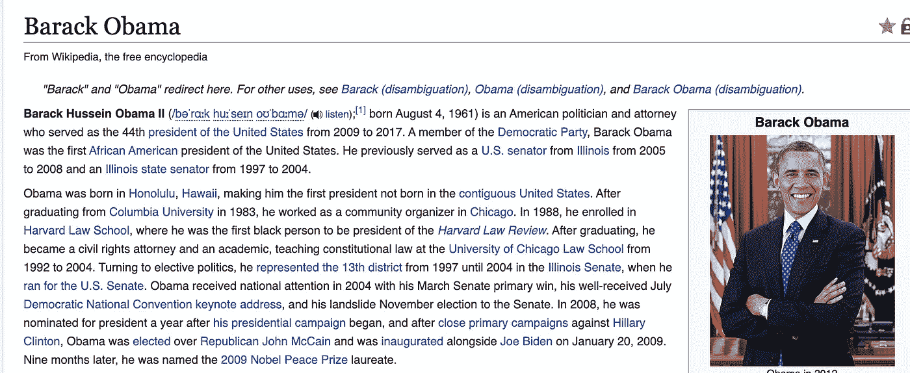
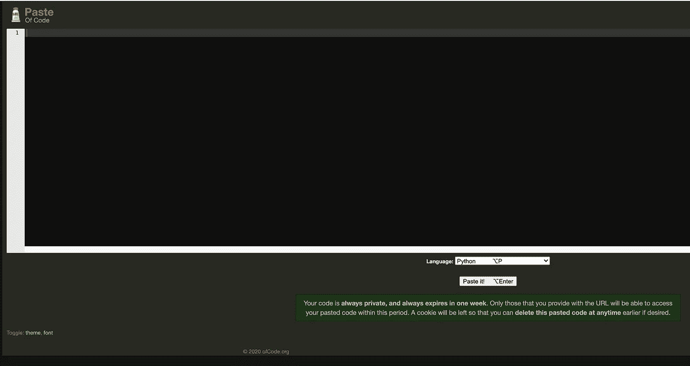

# COVID 之后更有效地交流数据的 5 种方法

> 原文：<https://towardsdatascience.com/5-ways-to-communicate-data-more-effectively-post-covid-c773d3ecd9df?source=collection_archive---------65----------------------->

沃洛季米尔·赫里先科在 [Unsplash](https://unsplash.com?utm_source=medium&utm_medium=referral) 上的照片

## 远程时如何更有效

D 数据科学是一项协作性很强的工作——你不断地与来自各种不同角色和背景的同事互动。在一天之内，您可以与工程师、产品经理、其他数据科学家、运营人员、设计师等会面。面对如此多样化的团队成员，交流数据是一件很难做好的事情。现在协作是虚拟的，交流变得有点困难。

由于我们大多数人现在都在家工作，我们应该采取一些额外的措施来与他人交流数据。这篇文章介绍了一些快速实用的技巧，这些技巧在任何情况下都会对所有的队友和同事有所帮助。其中一些提示可能看起来很明显，所以如果你已经在做了，那就太好了——然而，阅读这篇文章的其他人很可能会发现这些提示真的很有帮助。

**通过在你的日常工作流程中实施这些技巧，你能够在几个关键方面使每个人受益:**

*   **释放您的时间:**如果您积极投入时间使数据更容易访问/理解，您就能够节省未来回答临时问题或在问题最终出现时撰写问题的时间。
*   **了解你 3 个月前做了什么:**有多少次你不得不翻出几个月前做的一份分析？我个人发现自己一周要做好几次。这些建议应该有助于与未来的自己沟通，因为你可以很容易地从过去寻找一些东西，了解你做了什么，你做了什么假设，这样你就可以做类似的分析，或者用当前的评论分享过去的结果。
*   **授权给你的同事:** *这是最重要的一条，因为这是你被团队聘为分析人员的原因。*帮助您的团队成员以他们熟悉的方式访问数据(SQL 代码、Excel 中的汇总/采样数据、仪表板等)。)，这使他们能够更多地接触数据，从而提高工作效率。内部数据是公司拥有的最有价值的东西之一，如果你能够帮助你的同事有效地使用这些数据，那将是一个巨大的胜利。

# 1.简单的仪表板非常有用

了解如何创建仪表板是数据科学家可能拥有的最重要的技能之一。如果数据科学家工作的两个主要方面是分析和交流数据，仪表板是两者结合的完美媒介。

由[卢克·切瑟](https://unsplash.com/@lukechesser?utm_source=medium&utm_medium=referral)在 [Unsplash](https://unsplash.com?utm_source=medium&utm_medium=referral) 上拍摄的照片

由于现在一切都很遥远，拥有一个简单的仪表板应该可以回答你的队友可能会有的问题，并且应该可以显著减少随机收件箱，以便你可以专注于你的工作。

对于较小的项目和功能来说，创建一个仪表板在一开始看起来似乎有点大材小用。但是，如果您已经精通公司的仪表板工具，那么创建一个只有几个图形和表格的仪表板将会比您本来要编写的查询多花几分钟的时间。不仅如此，为更小的计划指定一个仪表板会给那些想利用自己的时间跟踪和查看数据的同事留下深刻印象。

一旦您创建了仪表板，它就可以很容易地与公司中的任何人共享，并且可以帮助团队在一组集中的指标和统计数据上保持一致。出于更自私的原因，从长远来看，您的仪表板将最终节省您的时间，因为它将有助于避免误解，并减少未来的入站数据请求。

# 2.慷慨地超链接

照片由 [Fré Sonneveld](https://unsplash.com/@fresonneveld?utm_source=medium&utm_medium=referral) 在 [Unsplash](https://unsplash.com?utm_source=medium&utm_medium=referral) 上拍摄

无论你是在 Google Sheets 中做分析，写一条松散的信息，写一封电子邮件，还是使用 markdown——有更多的链接几乎总是更好。**好的分析应该做两件事:**

1.  引发更多问题
2.  基于之前的分析/研究

在上述两种情况下，都有相关的东西可以联系起来。拥有可访问的链接更有可能让你的队友理解你的分析。话虽如此，我还是想做一个明确的区分:**避免直接粘贴链接，因为这样不美观，会占用很多空间，有时还不可点击——使用超链接！**

想象一下，如果维基百科有一堆直接粘贴在文章中的 url，那将是一种可怕的体验！此外，使用维基百科作为灵感，养成超链接的习惯。这些链接不会分散你对文章的注意力，还会激发你的好奇心，因为你可能会因为点击一个超级链接的兔子洞而迷失几个小时。

看看这些链接！

**了解你用来分享数据和分析的所有不同平台的热键和语法，并经常链接。**

*   **大多数情况下:** `ctrl/cmd + k`会允许你创建一个超链接
*   **降价:** `[hyperlink text](url)`
*   **懈怠:** `ctrl/cmd + shift + u`

# 3.总是分享相关的查询/代码

扩展上面的超链接主题，我们想让我们的分析尽可能容易理解。即使你认为没有人会看你的代码，链接它仍然是有用的，以防你回头看它。如果您的同事能够在他们自己的工作中利用您的代码/查询，那么他们会非常感谢这种姿态。

我与我的队友分享我的查询/代码的一些方式:

*   **粘贴:**最简单的方法是，将文档本身的代码粘贴到附录部分的底部。这对于较短的查询来说已经足够了。你也可以看看插件或工具，如[代码块](https://gsuite.google.com/marketplace/app/code_blocks/100740430168)(用于谷歌文档)来帮助你。在 slack 和 markdown 中，可以使用``来创建代码块。
*   **链接:**使用剪贴板或粘贴工具，你可以粘贴你的代码并生成一个超链接来共享代码。例如，你有[粘贴代码](https://paste.ofcode.org/)，但是很可能有内部工具可以做到这一点(更安全)。如果你在 Github 上有你的代码，这只是一个 Github 链接。

截图来自[https://paste.ofcode.org/](https://paste.ofcode.org/)

*   **附件:**将代码文件直接作为附件共享。一般来说，你希望避免这种情况，因为这确实需要另一方采取一些额外的步骤。
*   **数据:**如果你的队友不知道如何使用 SQL，或者如果查询需要很长时间才能运行，那么以 csv 格式导出数据集或样本可能会有所帮助，将它们发送过来，以便他们可以直接进入数据。

# 4.语境！

这更适合 Slack、微软团队或其他用于协作的消息平台。如果你在一个频道上分享一个快速更新，预计会有一些人不太参与其中。尤其是在较大的频道上，或者如果你的信息被分享到不同的频道/群组。

思考这些案例，你要养成添加一两个引导句的习惯，以设置**的背景，为什么你要分享某个更新，为什么它很重要，以及自从上次更新以来它有什么变化。**这个手势让分享你的作品变得更加容易。你想让你的团队更加知情而不是困惑。

# 5.四舍五入你的数字

这是一个更通用的提示，但是这是**你能做的最省力的事情来减少误解，让对方明白你的意思。**

这是一个非常简单的提示:**你想让你的数据尽可能容易阅读。**如果你的图表/表格有一堆很长的数字，你的队友会很难读懂。花几秒钟时间想想你应该用多少有效数字来表达这个观点。这看起来像是一个小调整，但它是帮助你的队友理解关键指标的最有效的方法之一，因为它将你的队友锁定在正确的关注点上。舍入对于小数字和非常大的数字都很重要。

小数字:右易于阅读。

大数:右易读。

# 结束想法

希望这些提示对你有所帮助，或者已经在你的日常工作中使用了。它们不应该花太多时间去实现，一旦你养成了这样做的习惯，你的队友会更加欣赏你。