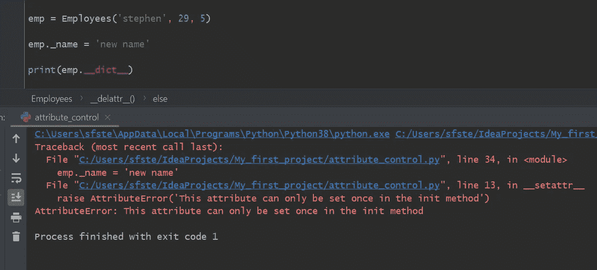

# Python 中控制属性的 5 种方法。Led 指南示例

> 原文：<https://towardsdatascience.com/5-ways-to-control-attributes-in-python-an-example-led-guide-2f5c9b8b1fb0?source=collection_archive---------13----------------------->

## 在点上发生了什么。

图片由 [Unsplash](https://unsplash.com/s/photos/learning) 通过 [@joannakosinska](https://unsplash.com/@joannakosinska) 提供

## 介绍

可以通过控制属性值及其访问来保护数据完整性。当创建一个类时，我们可能希望确保所有将来的对象都具有正确数据类型的属性，和/或合理/适当的值。我们可能还希望确保一旦设置了属性，就不能更改或删除它们的值。为此，必须创建只读和删除证明属性。

接受姓名、年龄和服务年限作为参数的 Employee 类可能希望确保姓名是一个字符串，年龄和服务年限是整数，然后在创建的对象中将它们设置为属性。这个类可能还希望确保像名称这样的属性不能被修改或删除。

属性验证可以帮助确保有效的数据输入，即使在类的用户可能输入不太理想的用户信息的情况下，例如，小写的姓名。这篇教程文章将探索 5 种不同的方法来确保属性验证，即通过 magic/dunder 方法和 decorators。当在类中定义的方法中使用属性本身时，属性完整性非常重要。这就是为什么在对象中设置属性之前，应该检查它的值。

## 示例 1: dunder __setattr_，__delattr__

Python 中的 magic 或 dunder __setattr_ 和 __delattr__ 方法代表了程序员控制属性的一种方式。为了说明，让我们初始化一个名为 Employees 的类。这个类将接受 3 个参数，并将它们设置为对象中的属性。

为了展示我们如何对属性施加控制，让我们建立我们希望为 Employees 对象实现的行为。

1.  _name 属性值应该是大写的，不管用户是否选择以大写格式输入 name 属性。
2.  _name 属性应该只允许设置一次。一旦设置好，名称属性将变成只读的*。*
3.  *_age 和 _service_length 属性应该是整数。如果它们不是 TypeError，将引发异常。*
4.  *不能删除 _name 属性*

## **dunder __setattr__**

**dunder setattr 方法将对象、键以及我们希望在对象中设置的值作为参数。我们首先检查具有属性' _name '的对象是否已经具有属性 name。如果是这样，我们将引发一个 AttributeError，因为我们不希望 name 属性被*重置*。在下面的 elif 语句中，如果对象没有 name 属性，我们将设置它，并使用 string title 方法将其大写。**

**在第一个 if 语句中，我们首先检查是否已经设置了属性' _name '。如果已经在 __init__ 方法中设置了它，用户将无法重新设置它，然后它将成为一个只读属性。**

**setattr 方法的第一个 if 和 elif 块中的逻辑解决了上面的第 1 点和第 2 点。现在，让我们检查第 3 点的年龄和服务年限属性的数据类型。**

**对于' _age '和' _service_length '属性，我们使用内置的 Python isinstance 函数检查它们的类型是否为 int。如果它们是除 int 之外的任何类型，将引发 TypeError 异常。**

**最后，让我们解决第 4 点，并实现代码来防止名称属性的删除。为了便于讨论，让我们假设，名字一旦被设定，就不能被删除并永久存在。**

**因此，当我们试图从对象中删除 name 属性时，会引发一个 AttributeError 异常，通知用户不能删除该属性。在幕后，del 关键字调用 __delattr__ 方法。由于我们在类中定义了它，所以它会调用我们的自定义版本 __delattr__。但是，我们仍然允许删除任何其他属性的行为。**

**注意，在所示的代码片段中，我们如下所示设置和删除属性，以避免递归错误。**

**下面通过 GitHub gist 显示了我们的 Employee 类的代码，可以通过这个[链接](https://gist.github.com/StephenFordham/74f27d99e6b414fb7bbdebeb415d350a)获得。**

**为了测试我们已经实现的自定义行为，让我们创建一个 Employees 类的实例，并检查 name 属性是否可以设置、不能重置和不能删除。此外，我们可以检查年龄和服务年限属性的类型。**

**重置 name 属性失败，并通知用户程序终止的原因。**

****

**当我们遍历属性字典并打印它们的类型时，我们可以看到年龄和服务年限是 int 类型。**

****

**最后，当我们试图删除属性名时，会引发一个 AttributeError 异常，用字符串消息通知用户不能删除该属性。**

****

**我们现在已经成功地制定了我们想要的习俗行为。虽然这些例子是虚构的，但它们确实说明了我们如何使用 Python 中的 setattr 和 delattr 方法来控制属性。如果你想尝试所示的例子，完整的代码可以通过这个[链接](https://gist.github.com/StephenFordham/0181e32f4c857f3cf533e48bd5fb5ade)获得。**

## **控制对象属性的替代方法**

**以下示例展示了在 Python 中控制属性的替代方法。附带说一句，我并不认为它们是控制属性的最佳方式，相反，替代方式意味着可以增加您在 Python 中使用的工具库。**

**下一节将介绍使用 decorators 管理属性的示例指南。**

## **使用装饰者**

## **示例 2:使用@staticmethod 装饰器**

**为了保持连续性，在前面的示例中将初始化相同的雇员类。这里，staticmethod decorator 可以用来检查对象中的属性值。具体来说，我们希望 age 和 service_length 属性值都是 int 类型。**

**为此，我们可以在我们的类中定义一个 data_type_check 方法，并用 staticmethod decorator 来修饰它。当在 init 构造函数中设置属性时，我们调用对象上的 data_type_check 方法，并传入 age 或 service_length 作为参数。如果年龄和服务年限是 int 类型，它们将被返回并设置为我们的对象中的属性。如果它们不是 int 类型，将引发类型错误异常。**

**使用 staticmethod 装饰器的一个好处是它的可重用性。例如，如果我们在 init 方法中添加了一个 annual bonus 参数，我们可以简单地再次调用 staticmethod decorator 并将 bonus 作为参数传递。**

## **示例 3:使用自定义装饰器**

**另一种控制属性值的方法是通过一个*自定义*装饰器。为了与我们的主题保持一致，让我们创建同一个类，但是这次用一个名为 attr_check 的函数来修饰 init 构造函数方法。**

**当我们创建 Employee 类的实例时，init 方法将被自动调用。当 attr_check 函数修饰 init 方法时，将调用这个函数。attr_check 将 init 方法作为参数，并返回 inner。当我们用我们的对象 ref、age 和 service 调用 inner 时，我们可以对 age 和 service 执行类型检查。如果年龄和服务的类型是 int，我们将返回带有对象、名称、年龄和服务以及参数的原始 init 方法。**

**这个实现是用 Python 控制属性值的好方法，因为我们可以选择什么进入 inner 的主体。在这种情况下，我们没有对姓名执行任何类型检查，也没有对年龄执行任何范围限制，但是我们可以通过扩展内部函数中定义的代码来简单地添加这些检查。**

## **示例 4:使用@property/setter/deleter 装饰器**

**Python 中控制属性值的另一种方法是使用属性装饰器及其相应的 setter 和 deleter 方法。**

**让我们再次创建我们的雇员类。当用户试图通过 object.attribute 语法访问 name 属性时，将用@property 修饰的 name 方法将被调用，名称将以大写形式返回。**

**这一次，如果用户想要更改 name 属性，让我们确保他们输入的任何字符串都是大写的。我们可以通过定义一个简单的 name 方法以及相应的 setter 和 deleter 方法来实现这一点。**

**我们定义了 name 方法，并用@name.setter 修饰它。当用户想要使用 object.attribute 语法设置一个新名称时，对象中设置的新名称现在将被大写。**

**注意，名称属性' _name '的基础名称不同于方法的名称，以避免递归错误。我们不能在 setter 方法的主体中包含 self.name = new_name.title()。**

## **示例 init 构造函数中的条件检查**

**结束这篇关于属性控制的文章，实现属性完整性的最简单的方法实际上可能是在类本身的 init 构造函数中包含条件检查。这里，我们允许员工的年龄大于或等于 18 岁，小于或等于 100 岁。如果满足条件，我们可以将 init 方法中作为参数提供的年龄设置为对象中的属性值。当创建的实例不满足此条件时，将引发 AttributeError 异常，并通过一条有用的字符串消息通知用户所需的条件。**

## **摘要**

**感谢您的阅读，我希望您喜欢控制属性访问及其值的不同方式。虽然我主要关注的是数据类型检查和范围允许，但是任何可以想象到的条件都可以施加在属性值上。电子邮件地址在设置前可能会使用 regex 进行验证，以符合数据完整性。**

**我在这里特意使用了一些基本的例子来帮助传达控制属性值和访问的多种方法是如何工作的。此外，描述符是 Python 中管理属性的另一种方式，我希望能写一篇关于如何使用它们的教程。如果你有任何问题，或者想要更多关于这个主题的文章，请通过 LinkedIn 告诉我。**