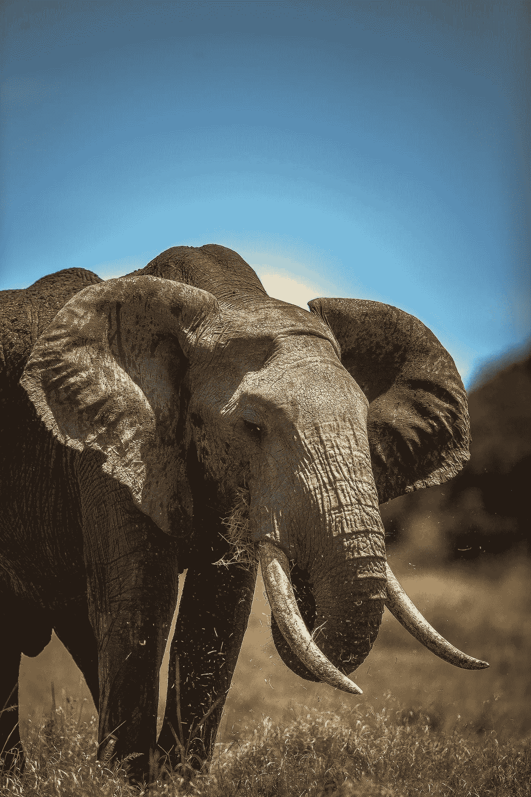

# 让你的百万美元实验失败的 5 种方法

> 原文：<https://towardsdatascience.com/5-ways-to-fail-your-million-dollar-experiments-da7647e5ba30?source=collection_archive---------35----------------------->

## 实验和因果推理

## A/B 测试方式正确

在 [Unsplash](https://unsplash.com/?utm_source=unsplash&utm_medium=referral&utm_content=creditCopyText) 上由 [Keyur Nandaniya](https://unsplash.com/@keyursphotography?utm_source=unsplash&utm_medium=referral&utm_content=creditCopyText) 拍摄的照片

产品发布前的实验已经成为大型科技公司的一个固有部分(例如，和 [Airbnb](https://medium.com/airbnb-engineering/selection-bias-in-online-experimentation-c3d67795cceb) )。俗话说，没有对你的客户进行 A/B 测试，就不能做出任何商业决策。

真的！

业务实验提供了丰富的客户行为信息，帮助我们更好地理解客户思维和行为之间的差距。

人们的想法和行为不同。通常，他们告诉你一件事，却做了相反的事情。

不做实验，就无法知道顾客对新产品的反应。这就像盲人测量大象的大小:我们没有得到完整的画面。

像任何研究方法一样，实验方法也有缺点和假设，但即使假设被违反，行业人士也经常使用它。如果这种情况发生(不幸的是)，我们可能会面临最不可取的情况:用虚假证据做出决策。

> 虚假信息比没有证据更糟糕。

如果没有信息，我们不会做出决定，但是错误的信息会导致错误的决定。在今天的帖子中，我详细阐述了可能会毁掉你价值数百万美元的实验的五个常见错误，以及每种情况下的应对策略

我已经写了几篇关于商业实验的文章。来看看吧: [*为什么实验*](https://medium.com/swlh/what-harvard-business-review-didnt-tell-you-about-experiment-9c7d983aa86a)*[*自然实验*](/research-note-what-are-natural-experiments-methods-approaches-and-applications-ad84e0365c75)*[*其*](/what-is-the-strongest-quasi-experimental-method-interrupted-time-series-period-f59fe5b00b31)***，还有* [*做了*](/does-minimum-wage-decrease-employment-a-difference-in-differences-approach-cb208ed07327) *)。*****

## **因果推理和实验**

**在这里，我会试着给你一个关于**因果推断&实验**的概述，以及为什么它很重要。在日常工作中，我们会问自己这样的问题:“新的用户界面增加了 DAU 吗？”“是什么因素导致了下一个百万注册？”**

> ****因果推理是追溯根本原因并评估其对相关结果的影响的过程**。**

**通过保持其他因素不变，同时每次只改变一个变量，实验可以帮助我们找到因果关系。如果不能随机赋值，数据科学家可以选择准实验([五招](https://medium.com/teconomics-blog/5-tricks-when-ab-testing-is-off-the-table-f2637e9f15a5))和观察方法(如配对、倾向评分匹配)做因果推断。**

**简单来说，因果推断始于可比的实验组，止于差异化的结果。首先，如果实验组(治疗组和对照组)不相等，那么研究设计就是有缺陷的。**

**让我们深入研究主菜。**

## **1.仔细选择你的度量标准**

**数据科学家需要建立一个度量标准来衡量我们实验的性能，一个糟糕的度量标准可能会扼杀实验。**

**例如，一家零售公司的季度销售数据滞后，但管理团队仍然希望通过大规模促销来实现既定目标。**

**数据团队提出了一个实验设计，表明 50%的折扣可以达到目的。你应该按计划推出促销活动吗？**

**大概，不是！**

**促销可能会增加短期指标，但会降低长期利润，因为客户会购买他们现在需要的所有东西，并且不会很快再次购买。**

**选择有效的指标和你的研究设计本身一样重要。最不希望看到的就是各个板块之间的自相残杀。**

****该怎么办？****

*   ***与主要的商业利益相关者合作，提出主要和次要的利益衡量标准***
*   ***了解选择的权衡***
*   ***如有必要，在实验之前、之中和之后，回到指标上来***
*   ***根据经验，实验讲述了一个关于短期指标的好故事，但是在长期性能方面有所欠缺***

## ****2。有问题的实验设计****

**如上所述，数据科学家需要检查实验组在关键协变量方面是否具有可比性(“同类比较”)。否则，结果可能不成立。**

**某些设计在业内广受欢迎，但不适用于因果推理。其中，**一组前后对比设计**和**治疗组和非治疗组设计**脱颖而出！**

**下面分别是这两种设计的两个例子。在推出新的用户界面后，我们看到一些指标(如 DAU)有所提高，所以更新版本是正确的选择。与对照组相比，治疗组带来了更多的收入，因此治疗有效。**

**这些设计不提供“苹果对苹果”的比较！治疗组可能与对照组根本不同，这使得任何直接的比较都成问题。这是因果推理中的一个典型问题，叫做*选择偏差*。**

**此外，没有办法排除其他解释的可能性。例如，除了 UI 更新之外，还有其他重大变化。**

****该怎么办？****

*   **与工程团队一起检查数据的可用性。**
*   ***治疗组与对照组相似吗？如果没有，你采取了什么措施？***

****

**乔治·贝尔在 [Unsplash](https://unsplash.com/?utm_source=unsplash&utm_medium=referral&utm_content=creditCopyText) 上的照片**

## ****3。过早结束你的实验****

**我们仔细选择了反映商业利益的指标，并有意使实验组具有可比性。令人惊喜的是，指标出现了正增长。我们现在可以结束实验了吗？**

**当有积极的发现时，这样做是很有诱惑力的。顺便说一句，这是一个常见的认知谬误——人类倾向于确认我们所期待的。**

**不过，我的建议是等一等，看看结果“ ***是否回归均值。*** “指标的正跳可能只是一个小故障，稍过一会儿就会消失。**

****做什么？****

*   ***获得初步结果后继续运行***
*   ***这里有一个窍门:在数据有限的情况下，我们可以通过分配和取消来创造更多的数据点。多次重复该过程***
*   ***检查治疗组和对照组如何随时间变化***

## ****4。溢出效应和污染****

**这里，关键问题是:治疗组是否与对照组接触？如果是这样，结果可能会被溢出效应所污染。**

**假设，实验随机分配治疗给住在附近的个人用户。治疗组和对照组可能会互相交谈，而对照组会无意中接受治疗。**

**第四个错误和最后一个密切相关，后面可以看出来。**

****该怎么办？****

*   ***与您的工程团队交流:您可以在什么级别上随机化您的处理(例如，用户级别、城市范围、URL)？***
*   **你的实验小组互相合作吗？如果是这样，改变随机分配的级别。**

## **5.随机化不那么随机**

**对于 A/B 测试和任何其他采用随机化的实验设计，数据科学家应该问的首要问题是:这真的是随机分配吗？**

> **这听起来很矛盾，但是一个随机的过程并不能保证一个随机的赋值！**

**有一些外部因素导致一些群体比其他群体更有可能参与治疗组。**

**与前一点相关，在个体 URL 的随机化过程可能是不可行的交叉污染 b/c。那么，我们将选择市级随机化。**

**仔细想想最低级的随机分配。**

****该怎么办？****

*   ***这是一个具有挑战性的问题！它涉及到对实验平台的透彻理解，并能够区分细微的差别。***
*   ***单位层面随机化？网址？市级？***
*   **你的工程团队更了解什么是可能的，什么是不可能的。**

## **结论**

**这篇文章涵盖了实验失败的五种主要方式:度量、研究设计、时机、溢出和随机化。古语有云:细节是魔鬼！数据科学家应该在推出实验时检查这五个常见错误。**

# **喜欢读这本书吗？**

> **请在 [LinkedIn](https://www.linkedin.com/in/leihuaye/) 和 [Youtube](https://www.youtube.com/channel/UCBBu2nqs6iZPyNSgMjXUGPg) 上找到我。**
> 
> **还有，看看我其他关于人工智能和机器学习的帖子。**