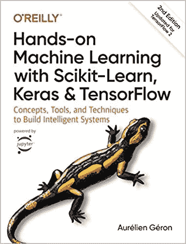
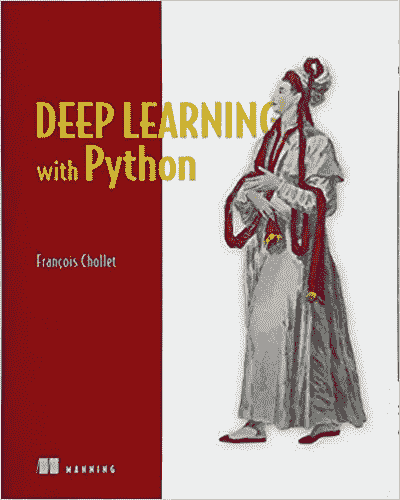
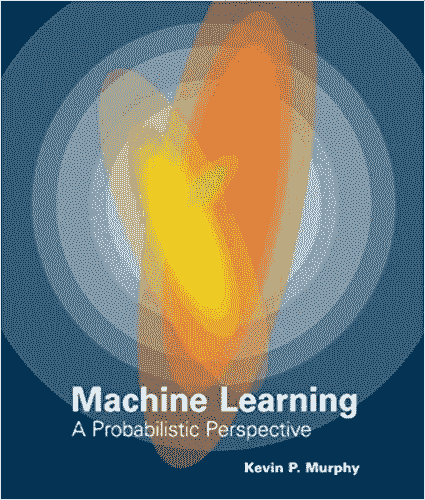

# 学习计算机视觉的 5 种方法

> 原文：<https://towardsdatascience.com/5-ways-you-can-learn-computer-vision-6dae3f312686?source=collection_archive---------16----------------------->

## 本文列出了一些可以用来学习计算机视觉的方法，这是一个机器学习相关领域。

Alec Favale 在 [Unsplash](https://unsplash.com/s/photos/robot-eyes?utm_source=unsplash&utm_medium=referral&utm_content=creditCopyText) 上的照片

## 计算机视觉很酷。

别让任何人告诉你不是这样。

我这么说不仅仅是因为我目前是一名计算机视觉工程师，或者因为我获得了计算机视觉硕士学位(*显然，我有偏见*)。

想象一下你和一些朋友一起吃饭，你的一个朋友说:嘿***在这里插入你的名字*** ，你在你的工作岗位上做什么。

你回复

“面部识别、身体跟踪、物体探测……詹姆斯·邦德的东西……”。

你的朋友带着纯粹的惊讶和敬畏盯着你。

> 免责声明:上面的场景很可能不会发生。

但说真的，机器学习(ML)相关领域，如计算机视觉(CV)、数据科学和自然语言处理(NLP)，在过去十年中变得相当流行和时尚。

> 这篇文章将向你展示学习计算机视觉的方法。所以你也可以加入酷俱乐部。

我将强调的方法是我个人用来获得 ML 和 CV 知识的方法。

1.  **获得硕士学位**
2.  **YouTube 视频**
3.  **书籍**
4.  **个人项目**
5.  **网站**
6.  **奖金**

如果你熟悉列出的任何一种方法，可以直接跳到不熟悉的部分。

# 1.硕士学位

获得高级资格证书的价格每年都在上涨，但是在一个新兴领域获得高级学位证书的价值几乎是无价的。

照片由 [Honey Yanibel Minaya Cruz](https://unsplash.com/@honeyyanibel?utm_source=unsplash&utm_medium=referral&utm_content=creditCopyText) 在 [Unsplash](https://unsplash.com/s/photos/graduate?utm_source=unsplash&utm_medium=referral&utm_content=creditCopyText) 上拍摄

我在 2019 年完成了计算机视觉，机器学习和机器人学的硕士学位。如果没有我课程中的机器人部分，我也能完成。然而，事实证明，在三维空间中计算机器人手臂运动学所涉及的数学可以转移到增强现实环境中物体运动的计算。这与我有关，因为我现在在一家专门从事增强现实的公司工作。

我的硕士学位使我能够理解用于物体检测的流行计算机视觉技术背后的理论，如 [YOLO](https://arxiv.org/abs/1506.02640) 或 [RCNNs](https://arxiv.org/abs/1311.2524) 。

更重要的是，我发展了一种学术意识和思维方式，这在我目前作为计算机视觉工程师的角色中被证明是有用的。在我的研究中，我阅读了大量关于机器学习和计算机视觉的研究论文。我仍然需要阅读研究论文，理解并运用最先进的方法来解决日常工作中常见的简历问题。

**通过硕士学位学习计算机视觉是有用的，原因如下:**

*   专注和专注:花 2 -3 个小时写论文或复习考试提高了我的注意力，因为我只专注于一个特定的主题或目标(*在截止日期前完成论文*)
*   **学术理解的发展:**无论是在学习期间还是在与 ML 相关的职位上，你都不会停止阅读学术研究论文。
*   求职时脱颖而出:在就业市场上，没有多少人拥有理学硕士或博士学位，因此获得列出的学位之一可以让你在求职时占上风。
*   **加深对计算机视觉的理解**
*   在我学习期间，我和最聪明的人们在一起，并且和他们中的大多数人保持着联系。我们讨论工作机会、经历、面试技巧，或者分享与 ML 相关的笑话。

[机器学习笑话](https://www.reddit.com/r/ProgrammerHumor/comments/8inqk7/a_machine_learning_joke_credits_to_uz0ltan_x/)

# 2.YouTube 视频

我意识到不是每个人都有时间或资金去攻读硕士学位，但是退而求其次，也可能是更便宜的选择是利用互联网。

YouTube 是一个很好的学习平台，我观看热门频道的 ML/CV 内容，以进一步加深我的理解，提高我的实践技能。

这里有几个 YouTube 频道的例子，可以帮助我学习计算机视觉。

## 3 蓝色 1 棕色

这个频道的内容是首屈一指的，我怎么赞美这个频道的创作者都不为过。

那些熟悉 3Blue1Brown 的人会同意我的说法，他成功地在 15-20 分钟的短视频中教授了大学讲师数小时的课程。

这个频道教会了我机器学习和神经网络的基础知识，并让数学变得简单。

在机器学习中，理解线性代数、微积分和偏微分等主题是必不可少的。研究神经网络时，理解神经网络的基本组件至关重要。

理解诸如反向传播、消失梯度和不同的神经网络结构等概念也很重要。

如果你想对神经网络中发生的过程有一个简单的解释，下面来自 3Blue1Brown 的播放列表是一个必须观看的节目。

## [斯坦福计算机视觉](https://www.youtube.com/playlist?list=PLf7L7Kg8_FNxHATtLwDceyh72QQL9pvpQ)

在了解了 ML 和神经网络的基础知识之后，您可以深入斯坦福大学的一些学术会议，这些会议解释了一些常见的计算机视觉技术和算法。

这个播放列表为您提供了一步一步的技术学术知识，使图像分类，对象检测，强化学习，等等。

完成此播放列表将为您提供一些关于计算机视觉算法、技术和方法的一般知识，这些算法、技术和方法目前在自动驾驶汽车、面部识别应用等系统中使用。

请务必做笔记，并记住所介绍的关键术语和概念。

## [深蜥蜴](https://www.youtube.com/channel/UC4UJ26WkceqONNF5S26OiVw)

如果您对神经网络和一些机器学习算法背后的理论和数学有坚实的掌握，您可以继续进行一些实际项目，并使用公共机器学习库(PyTorch)和编程语言 Python 进行编码。

[PyTorch](https://pytorch.org/) 是一个机器学习框架，它为像你我这样的人提供了从我们的笔记本电脑上实现和启动机器学习解决方案和神经网络架构的工具。PyTorch 是大多数研究人员在实现机器学习解决方案时选择的框架。

Python 是一种现代编程语言，在各种与计算相关的学科中占有一席之地，如 web 开发、服务器开发、软件开发等。这种语言很流行，可以用来实现机器学习解决方案。

Deep Lizard 的视频播放列表会逐步带你了解神经网络实现的过程。你将学习到诸如神经网络训练的图形处理器的利用，数据结构(数组和张量)；神经网络层；超参数等等。

## 有了你积累的所有知识，你也许可以开始一个 ML 项目，在这之后，有了获得入门级计算机视觉工作职位的基本知识。

# 3.书

文章的这一部分包含一些附属链接。

[**用 Scikit-Learn 动手机器学习，Keras&tensor flow**](https://amzn.to/2wvuowj)

[使用 Scikit-Learn、Keras 和 TensorFlow 进行机器实践学习](https://amzn.to/2wvuowj)

如果你应该购买一本书来为现实环境中的机器学习做准备，那么 Aurélien Géron 的《动手机器学习》是实用机器学习的圣杯。

大多数读者都会接触到这本书或它以前的版本。

这本书包括两部分。

第一部分介绍典型的机器学习概念和技术，如梯度下降，支持向量机，特征工程，等等。第一部分还介绍了 [SciKit-Learn](https://scikit-learn.org/) ，一个流行的机器学习库，以及一些常见的可视化和争论工具。

这本书的第二部分介绍了卷积和递归神经网络和各种神经架构等概念。书的第二部分介绍 TensorFlow 2 和 Keras。

[TensorFlow](https://www.tensorflow.org/) 是一个流行的机器学习库，支持神经网络的实施，并提供了一套用于常见机器学习任务的工具，如可视化、部署和模型优化。

## 完成这本书将使你能够用行业标准的工具、框架和库解决常见的计算机视觉问题。

## [用 Python 进行深度学习](https://amzn.to/2PRUekR)

[用 Python 进行深度学习](https://amzn.to/2PRUekR)

Fran ois Chollet 的《Python 深度学习》也是类似于前面提到的那本书的两部分。

第一部分介绍了机器学习领域的基础知识。它专注于解释人工智能、深度学习和机器学习这些术语的基本含义。

本书的第一部分旨在建立机器学习实践者经常遇到的常见概念和主题的简要理论知识。本书的第一部分介绍了 [Keras](https://keras.io/) 、 [Jupyter 笔记本](https://jupyter.org/)、 [NumPy](http://numpy.org) 等等。

第二部分通过提供实用的练习和项目，用公开可用的数据集来实现，重点关注实用的深度学习。还详细介绍了 CNN、rnn(GRU 和 LSTM)和 gan。

## 从这本书里可以学到很多实用的技能，我建议把所有代码和完成的项目放在一个在线的仓库里，比如 GitHub，开始建立一个在线的存在，或者一个作品集。

## [**机器学习——一种概率视角**](https://amzn.to/39wecJF)

[机器学习——概率视角](https://amzn.to/39wecJF)

不适合胆小的人。

这里我就实话实说了；每次我拿起这本书，我都要吹掉上面的灰尘。这本书很重要，但不如前面提到的书实用。

《机器学习:概率视角》是一本应该放在每个严肃的机器学习从业者的武器库中的书。这本书概括了机器学习的数学和理论方面，形成了基础和先进的 ML 技术的基础。

尽管这本书的篇幅和内容可能令人望而生畏，但我还是用它来巩固一般话题的知识，然后在公共领域谈论或写作这些话题。

## 这本书将在这十年中发挥作用，下一个十年，你越早开始理解它的内容，你就会成为一名更好的机器学习实践者。

# 4.个人项目

学习机器学习或计算机视觉的一种方法是简单地做。这条规则适用于许多领域。

通过承担和完成个人计算机视觉/ML 项目，我学到了更多。

**我亲身经历的承担个人项目的好处如下:**

*   **你熟悉了你在机器学习项目** **中会遇到的** [**阶段。**](/10-stages-of-a-machine-learning-project-in-2020-and-where-you-fit-cb73ad4726cb)
*   为在线作品集创建项目，向人工智能社区和未来的雇主展示你的技能。
*   **巩固你对用于学习的任何 MOOCs、书籍或课程中的概念和主题的理解。**

我没有在线作品集，但我有一些项目，它们的代码库托管在 [GitHub](https://github.com/) 上。

例如，我参与了一个项目，该项目涉及利用[计算机视觉技术对四足动物](https://github.com/RichmondAlake/keypoint_detection_quadruped/blob/master/4_keypoint_detection_tranfer_learning.ipynb)进行运动分析。通过这个项目，我了解了姿势估计、迁移学习、对象检测(RCNN)、神经网络实现以及用 PyTorch 进行训练等等。

[个人项目:四足动物上的关键点检测](https://github.com/RichmondAlake/keypoint_detection_quadruped/blob/master/4_keypoint_detection_tranfer_learning.ipynb)

# 5.网站

机器学习和深度学习的流行库和框架(TensorFlow 和 PyTorch)提供了一些基本计算机视觉解决方案和常见任务实现的教程。

有关于人脸检测、姿势估计、图像分类、迁移学习等等的教程。

教程的目的不仅是向您介绍深度学习解决方案的实施，而且还可以提高您对数据预处理、神经网络实施、训练或机器学习项目管道中的其他领域，甚至模型部署的框架或库方法的熟悉程度。

 [## 欢迎来到 PyTorch 教程— PyTorch 教程 1.4.0 文档

### 要了解如何使用 PyTorch，请从我们的入门教程开始。60 分钟的闪电战是最常见的开始…

pytorch.org](https://pytorch.org/tutorials/)  [## 教程| TensorFlow 核心

### 完整的端到端示例，帮助 ML 初学者和专家了解如何使用 TensorFlow。尝试谷歌教程…

www.tensorflow.org](https://www.tensorflow.org/tutorials) 

# 奖金(网站):中等

是的，信不信由你，Medium 教会了我很多关于计算机视觉的知识。媒体上有大量关于机器学习和计算机视觉的文章。媒体上丰富的信息足以让你阅读几天。

媒体上有机器学习相关的教程、讨论、采访和评论，来自聪明、好奇和令人兴奋的[作者](https://medium.com/tag/artificial-intelligence/top-writers)。

> 在媒体上，我关注两件事。消费和创造。

## 强烈的

如果我提到我在 2020 年已经在 Medium 上阅读了超过 50 篇机器学习相关的文章，我并没有夸大其词。实际上，把这个数字改成 100。我读过顶级作家和出版物的文章，比如《走向数据科学的[》和《T2 成为人类的](https://towardsdatascience.com/)

## 创造

通过在 Medium 上阅读其他作者的内容，我学会了如何向可能从未听说过这个话题的人传达机器学习概念。

我已经在 Medium 内部发展了一个小规模的存在，迄今为止已经写了 30 多篇文章，都与人工智能/机器学习有关。

在公共平台上撰写关于 ML/CV 概念的文章鼓励你以促进和培养深度理解的方式深入研究主题。

在其他教导和告知中，你必须首先知道。

## 我恳请读者选择一个与 ML/CV 相关的话题，并在 Medium 上写一写。请随意给我加标签或者给我发一个你写的文章的链接。

# 结论

如果你喜欢这篇文章和里面的内容，那么给我一个[关注](https://medium.com/@richmond.alake)，因为我每周都会写类似的文章。

## 从这里去哪里？

## 你可以读到我在攻读计算机视觉硕士学位时遇到的困难。

 [## 拿了一个机器学习的硕士学位，我(非常)没有准备

### 我从全职到人工智能硕士生过渡的探索。

towardsdatascience.com](/took-a-masters-in-machine-learning-and-i-was-very-unprepared-7aba95f044a8) 

## 阅读我的一次失败的面试

 [## (拒绝)来自我的第一次数据科学面试

### 拒绝是获得数据科学工作的整个过程的一部分。但它并不经常被提起。这是我的账户…

towardsdatascience.com](/rejected-from-my-first-data-science-interview-c9784dd65296) 

## 或者看看我作为计算机视觉工程师的第一天是怎么过的。

 [## 我作为计算机视觉工程师的第一天

### 剧透:我引起轰动

towardsdatascience.com](/my-first-day-as-a-computer-vision-engineer-8b59750c79a0)