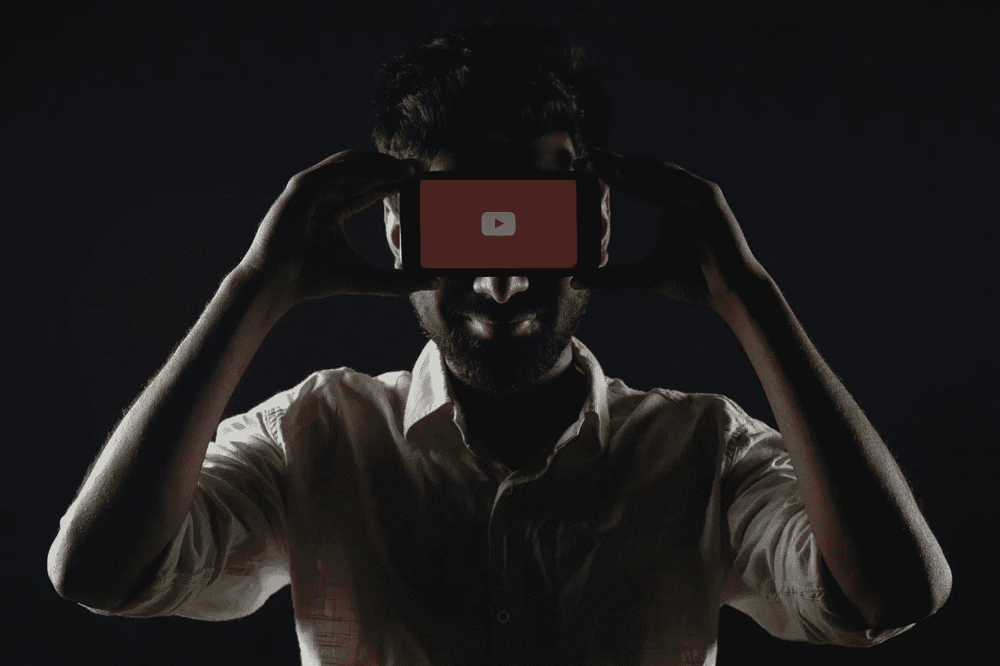

# 5 YouTubers 数据科学家和 ML 工程师应该订阅

> 原文：<https://towardsdatascience.com/5-youtubers-data-scientists-and-ml-engineers-should-subscribe-to-e5bf5e2e9167?source=collection_archive---------4----------------------->

## 1 号莱克斯·弗里德曼

你是一名数据科学家还是一名 ML 从业者，正在寻找有效利用空闲时间的方法？

或许你已经厌倦了在 YouTube 上看没完没了的猫咪视频——现在还有人这么做吗？

*不要再看猫咪视频了！*

相反，你应该订阅我在本文中介绍的与数据科学和机器学习相关的 YouTube 频道。

了解如何有效地导航您的数据科学职业生涯，或者更好的是，在等待培训损失收敛时，扩展您对人类思维和意识起源的直觉。

[摄](https://unsplash.com/@rachitank?utm_source=unsplash&utm_medium=referral&utm_content=creditCopyText) [Unsplash](https://unsplash.com/s/photos/youtube?utm_source=unsplash&utm_medium=referral&utm_content=creditCopyText) 上的坦克

# [1。莱克斯·弗里德曼](https://www.youtube.com/user/lexfridman)

莱克斯·弗里德曼的 Youtube 频道可以说是迄今为止机器学习从业者最有见地的频道。

该频道上的视频是 Lex Fridman 本人与非凡的个人之间的简单对话，这些个人是计算、机器学习、深度学习、人工智能等领域的先驱或顶级研究人员。

**我向数据科学家和机器学习工程师推荐这个频道的主要原因是，Lex Fridman 已经与机器学习和深度学习领域的著名先驱进行了交流。**

大多数深度学习实践者都熟悉我将要列出的一些深度学习先驱，如果不是全部的话。

*   [Ian Goodfellow](https://www.youtube.com/watch?v=Z6rxFNMGdn0) (甘斯的创造者)，
*   [伊利亚·苏斯特克弗](https://www.youtube.com/watch?v=13CZPWmke6A&t=2392s)(Alex net 的共同发明人)
*   [Yann LeCun](https://www.youtube.com/watch?v=SGSOCuByo24) (深度学习先锋)
*   [Yoshua Bengio](https://www.youtube.com/watch?v=azOmzumh0vQ) (深度学习先驱)

除了 Lex 频道的深度学习内容，我最喜欢的视频是与约沙·巴赫的精彩对话[。这次谈话会让你惊叹于乔沙对围绕意识、人类思维和我们的宇宙的问题做出优雅回答的速度。](https://www.youtube.com/watch?v=P-2P3MSZrBM&t=4506s)

不要犹豫，找出为什么这个频道目前拥有约 4500 万的浏览量！

如果你已经是这个频道的订户，请在评论中链接你最喜欢的视频。

 [## 莱克斯·弗里德曼

### 探索人工智能、深度学习、自动驾驶汽车等研究主题的视频。

www.youtube.com](https://www.youtube.com/c/lexfridman/featured) 

# [2。肯吉](https://www.youtube.com/channel/UCiT9RITQ9PW6BhXK0y2jaeg)

YouTube 上最有趣的数据科学人物之一，在数据科学领域有五年的经验。

大多数数据科学家可能已经对 Ken Jee 很熟悉了，也许你已经看过他的一个关于简历和投资组合的视频，或者你已经看过他的[“从零开始的数据科学项目”](https://www.youtube.com/playlist?list=PL2zq7klxX5ASFejJj80ob9ZAnBHdz5O1t)视频系列。

我是肯·吉视频的订户，因为**他采访了数据科学家和机器学习实践者。这些访谈记录了嘉宾在数据科学和相关领域的知识和经验。**

我已经从这个频道的几位采访嘉宾那里获得了大量关于如何在人工智能领域内导航职业生涯的信息。

如果您是数据科学家，以下是您应该订阅该频道的一些原因:

*   信息丰富的视频采访数据科学家已申请 FAANG 公司。
*   对数据科学界知名人士、四次 Kaggle 特级大师 Abhishek Thakur 的深入采访。
*   大多数数据科学从业者都会涉及到的大量内容。Ken 有关于如何有效学习数据科学的视频，[处理冒名顶替综合症](https://www.youtube.com/watch?v=Uf0dO-pgOrk)以及你应该参与哪些项目才能被雇佣。
*   在你等待你的 ML 模型完成训练的时候，观看五分钟的短片。

 [## 肯·吉

### 数据科学和体育分析是我的爱好。我叫 Ken Jee，一直在数据科学领域工作…

www.youtube.com](https://www.youtube.com/channel/UCiT9RITQ9PW6BhXK0y2jaeg) 

# [3。扬尼克·基尔彻](https://www.youtube.com/channel/UCZHmQk67mSJgfCCTn7xBfew)

Yannic Kilcher 的频道是 YouTube 上为数不多的几个频道之一，在那里你可以获得关于涵盖最先进的机器学习技术的研究论文的精彩**解释。**

下面是几个视频，展示了 Yannic 在解释研究论文时所采用的直观而直接的方法。

*   [解释 OpenAI 的 GPT-3 研究论文](https://www.youtube.com/watch?v=SY5PvZrJhLE)
*   [介绍变压器网络的论文说明](https://www.youtube.com/watch?v=iDulhoQ2pro)
*   [机器学习领域经典研究论文视频系列](https://www.youtube.com/watch?v=rFwQDDbYTm4&list=PL1v8zpldgH3qQB5Pz6ZSTTDLu0BjAJYNf&ab_channel=YannicKilcher)

并不是所有的机器学习从业者都有硕士或博士的经历，这使得阅读和理解研究论文所需的开发技能成为可能。

大量数据科学家和 ML 工程师都是自学的，不具备有效分析研究论文所需的学术知识。

这就是为什么 Yannic channel 是我最喜欢的 5 个 YouTube 频道之一，我会推荐数据科学家和 ML 从业者获得传统和现代机器学习模型和技术的深入技术信息。

 [## 扬尼克·基尔彻

### 我制作关于机器学习研究论文、编程以及人工智能社区和更广泛的问题的视频…

www.youtube.com](https://www.youtube.com/channel/UCZHmQk67mSJgfCCTn7xBfew) 

# [4。乔丹·哈罗德](https://www.youtube.com/c/JordanHarrod/featured)

乔丹·哈罗德是麻省理工学院和哈佛大学的毕业生，他创作人工智能相关主题的视频内容。

在 Jordan 的频道上，你可以找到大量解释基于人工智能的技术直接应用于解决现实世界问题的视频。

乔丹频道上的大部分视频都很简洁，长度不到 10 分钟。然而，它们包含了如此多的相关和当前的信息，大多数机器学习实践者将从中受益。

Jordan 的视频从技术角度探索了具有高度兴趣价值的主题，例如[人工智能如何用于预测新冠肺炎](https://www.youtube.com/watch?v=n3xP1Knq7ys)，或者人工智能解决方案中的[种族偏见](https://www.youtube.com/watch?v=X_fnsJIRL2s)。

 [## 乔丹·哈罗德

### 探索我们每天与人工智能、算法和其他新技术互动的方式，为…

www.youtube.com](https://www.youtube.com/c/JordanHarrod/featured) 

# [5。3 蓝色 1 棕色](https://www.youtube.com/channel/UCYO_jab_esuFRV4b17AJtAw)

这个列表中的最后一个 YouTube 频道可能是非 ML 从业者都会遇到的。

这个频道的内容是首屈一指的，我怎么称赞这个频道的创造者格兰特·桑德森都不为过。

对于那些对该频道背后的面孔和个性感到好奇的人，那么看看莱克斯·弗里德曼对格兰特的两次采访吧:[第一轮](https://www.youtube.com/watch?v=U_lKUK2MCsg)，[第二轮](https://www.youtube.com/watch?v=U_6AYX42gkU)。

那些熟悉 3Blue1Brown 的人会同意我的说法，他设法在 15-20 分钟的短视频中教授大学讲师需要花费数小时的主题。

这个频道教我机器学习和神经网络的基础知识，让数学变得简单。

在机器学习中，理解线性代数、微积分和偏微分等主题是必不可少的。研究神经网络时，理解神经网络的基本组件至关重要。

理解一般的[反向传播](https://www.youtube.com/watch?v=Ilg3gGewQ5U&t=635s)、[梯度下降](https://www.youtube.com/watch?v=IHZwWFHWa-w&t=2s&ab_channel=3Blue1Brown)和[神经网络](https://www.youtube.com/watch?v=aircAruvnKk)等概念也是必不可少的。

 [## 3 蓝色 1 棕色

### 格兰特·桑德森的《3Blue1Brown》是数学和娱乐的结合，这取决于你的喜好。目标是…

www.youtube.com](https://www.youtube.com/channel/UCYO_jab_esuFRV4b17AJtAw) 

# 结论

这些 YouTube 视频足够让你在 2020 年的最后几个月以及 2021 年的最初几个月里忙个不停。

本文中包含的 YouTube 频道目前正在频繁地发布新的视频内容。

***你觉得还有其他数据科学/ML YouTube 应该上榜吗？然后我邀请你在评论区与其他读者分享。***

# 我希望这篇文章对你有用。

要联系我或找到更多类似本文的内容，请执行以下操作:

1.  订阅我的 [**邮件列表**](https://richmond-alake.ck.page/c8e63294ee) 获取每周简讯
2.  跟我上 [**中**](https://medium.com/@richmond.alake)
3.  通过 [**LinkedIn**](https://www.linkedin.com/in/richmondalake/) 联系我

 [## 机器学习可以在不到五分钟内检测到新冠肺炎！

### 旨在快速检测冠状病毒的研究进展的信息和收获。

towardsdatascience.com](/machine-learning-can-detect-covid-19-in-less-than-five-minutes-23bba57aeaa3)  [## 我如何使用智能手表传感器来防止面部触摸

### 一个值得追求的想法？

towardsdatascience.com](/how-im-using-smartwatch-sensors-to-limit-covid-19-infection-51abe04f81f9)