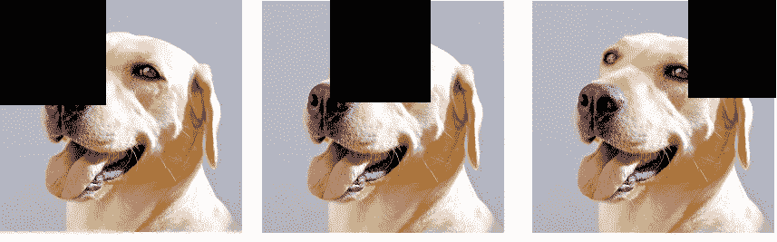

# 25 个深度学习面试问题

> 原文：<https://towardsdatascience.com/50-deep-learning-interview-questions-part-1-2-8bbc8a00ec61?source=collection_archive---------5----------------------->

## 深度学习的实践问题及解决方案

以下是 25 个关于深度学习的问题，可以帮助你测试你的知识，也是面试准备的一个很好的复习资源。

**1。**为什么有必要在神经网络中引入非线性？

**解**:否则我们会有一个线性函数的合成，也是一个线性函数，给出一个线性模型。线性模型的参数数量少得多，因此其建模的复杂性有限。

**2。**描述处理神经网络中消失梯度问题的两种方法。

**解决方案**:

*   使用 ReLU 激活代替乙状结肠。
*   使用 Xavier 初始化。

**3。在图像分类任务中，使用 CNN(卷积神经网络)而不是 DNN(密集神经网络)有什么优势？**

**解决方案**:虽然两种模型都可以捕捉邻近像素之间的关系，但 CNN 具有以下特性:

*   它是平移不变的——像素的确切位置与滤镜无关。
*   它不太可能过度拟合——CNN 的典型参数数量比 DNN 少得多。
*   让我们更好地理解模型——我们可以查看过滤器的权重，并可视化网络“学习”了什么。
*   层次性——通过用简单模式描述复杂模式来学习模式。

**4。**描述在图像分类任务中可视化 CNN 特征的两种方法。

解决方案:

*   输入遮挡-覆盖输入影像的一部分，查看哪一部分对分类的影响最大。例如，给定一个训练好的图像分类模型，给出下面的图像作为输入。例如，如果我们看到第三幅图像以 98%的概率被分类为狗，而第二幅图像只有 65%的准确度，这意味着第二幅图像中覆盖的部分更重要。

*   激活最大化——想法是创建一个人工输入图像，最大化目标响应(梯度上升)。

**5。**尝试以下学习率:0.1，0.2，…，0.5 是优化学习率的好策略吗？

**解决方法:**不可以，建议尝试对数标度，优化学习速率。

**6。**假设您有一个具有 3 层和 ReLU 激活的神经网络。如果我们用相同的值初始化所有的权重会发生什么？如果我们只有一层(即线性/逻辑回归)会怎样？)

**解决方案:**如果我们将所有权重初始化为相同，我们将无法破坏对称性；即，所有梯度将被相同地更新，并且网络将不能学习。然而，在 1 层场景中，成本函数是凸的(线性/sigmoid ),因此权重将总是收敛到最优点，而不管初始值如何(收敛可能较慢)。

**7。**解释 Adam 优化器背后的理念。

**解决方案:** Adam，或称自适应动量，结合了两种思想来提高收敛速度:按参数更新以加快收敛速度，动量有助于避免陷入鞍点。

**8。**比较批量、小批量和随机梯度下降。

解决方案:批量指的是通过获取整个数据来估计数据，小批量指的是通过采样几个数据点来估计数据，而 SGD 指的是在每个时期更新一个数据点的梯度。这里要权衡的是梯度计算的精度和我们可以在内存中保存的批量大小。此外，通过在每个时期添加随机噪声，采用小批量而不是整个批量具有正则化效果。

**9。**什么是数据增强？举例说明。

**解决方案:**数据扩充是通过对原始数据进行操作来增加输入数据的技术。例如在图像中，可以:旋转图像，反射(翻转)图像，添加高斯模糊。

**10。**GANs 背后的理念是什么？

**解:** GANs，或者说生成性对抗网络，由两个网络(D，G)组成，其中 D 是“鉴别者”网络，G 是“生成性”网络。我们的目标是创造数据——例如，与真实图像没有区别的图像。假设我们想创造一个猫的反面例子。网络 G 将生成图像。网络 D 将根据它们是否是猫来对图像进行分类。G 的成本函数将被构造成试图“愚弄”D——总是将其输出分类为 cat。

**11。**使用 Batchnorm 有什么好处？

**解决方案:** Batchnorm 加速训练过程。它也(作为包含一些噪声的副产品)有一个正则化的效果。

12。W 什么是多任务学习？应该在什么时候使用？

**解决方案:**当我们有少量数据用于某项任务时，多任务处理是有用的，我们将受益于在另一项任务的大数据集上训练模型。模型的参数以“硬”方式(即相同的参数)或“软”方式(即成本函数的正则化/惩罚)共享。

13。什么是端到端学习？举几个它的优点。

**解决方案:**端到端学习通常是一种获得原始数据并直接输出期望结果的模型，没有中间任务或特征工程。它有几个优点，其中之一是:不需要手工制作特征，并且它通常导致较低的偏差。

**14。**如果我们使用 ReLU 激活，然后使用 sigmoid 作为最终层，会发生什么情况？

**解决方案:**由于 ReLU 总是输出一个非负的结果，网络将不断地为所有输入预测一个类别！

15。如何解决爆炸渐变问题？

**解决方案:**爆炸梯度问题的一个简单解决方案是梯度裁剪——当梯度的绝对值大于 M 时，将梯度取为 M，其中 M 是某个大数。

**16。**使用批量梯度下降时是否需要对训练数据进行洗牌？

**解决方案:**否，因为梯度是在每个历元使用整个训练数据计算的，所以混洗没有区别。

**17。**使用迷你批量梯度下降时，为什么打乱数据很重要？

**解决方案:**否则，假设我们训练一个 NN 分类器，并且有两个类——A 和 B，并且一个类的所有样本出现在另一个类之前。不对数据进行洗牌会使权重收敛到错误的值。

**18。**描述迁移学习的一些超参数。

**解决方案:**保留多少层，增加多少层，冻结多少层。

**19** 。测试集上是否使用了辍学？

**解决方案**:没有！只在火车布景里。辍学是一种在培训过程中应用的正规化技术。

**20** 。解释为什么神经网络中的漏失会起到正则化的作用。

**解决方案**:关于辍学为什么会起作用，有几种(相关的)解释。这可以被视为模型平均的一种形式——在每一步，我们“关闭”模型的一部分，并对我们得到的模型进行平均。还增加了噪点，自然有规整的效果。这也导致权重更加稀疏，并且实质上阻止了网络中神经元的协同适应。

**21。**举例说明多对一 RNN 架构的适用情况。

**解决方案**:举几个例子:情感分析，语音性别识别。

**22** 。什么时候不能用 BiLSTM？解释必须做出的假设。

**解决方案**:在任何双向模型中，我们都假设在给定的“时间”内可以访问序列的下一个元素。文本数据(即情感分析、翻译等)就是这种情况。)，但时间序列数据并非如此。

**23** 。对/错:将 L2 正则化添加到 RNN 有助于解决渐变消失问题。

**解**:假！添加 L2 正则化将使权重向零收缩，这实际上在某些情况下会使消失梯度变得更糟。

**24** 。假设训练误差/成本很高，并且验证成本/误差几乎等于它。这是什么意思？应该怎么做？

**解决方案**:这表示装配不足。可以添加更多的参数，增加模型的复杂性，或者降低正则化程度。

**25** 。描述 L2 正则化如何解释为一种权重衰减。

**解**:假设我们的代价函数是 C(w)，我们加上一个惩罚 c|w|2。当使用梯度下降时，迭代将看起来像

> w = w-grad(C)(w)-2cw =(1–2c)w-grad(C)(w)

在这个等式中，权重乘以一个< 1 的因子。