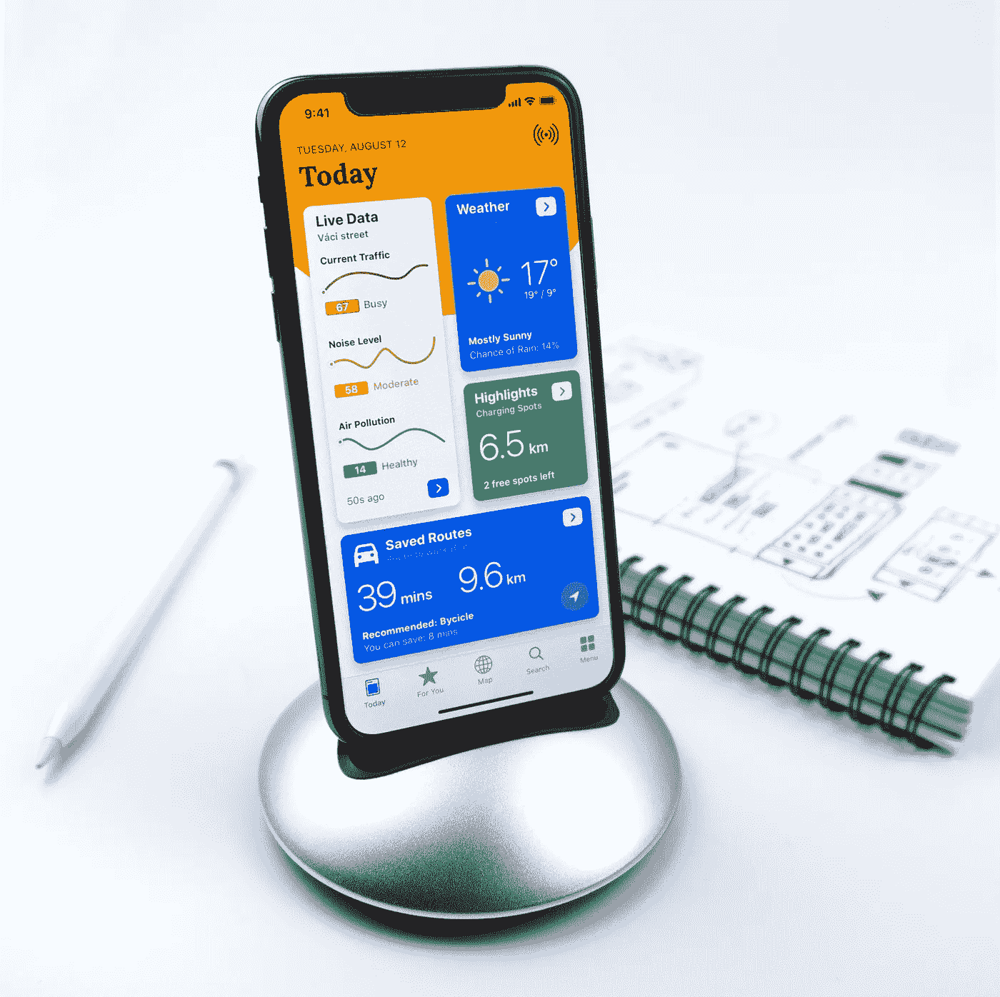
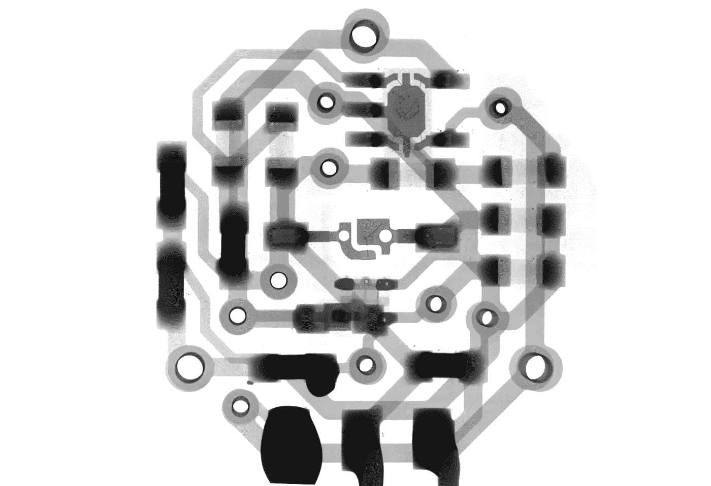

# 5G+AI，设备上的智能(第一部分)

> 原文：<https://towardsdatascience.com/5g-ai-on-device-intelligence-1003f8432086?source=collection_archive---------57----------------------->

## 随着 5G 的推出，人工智能肯定会有超能力。

T2 也许你已经听说过这件事了？近几十年来最具颠覆性的两项技术。你可能会分别听说过它们。

## 让我们合并他们！5G +人工智能

*嗯..这似乎不对。你确定吗？*

照片由 [Balázs Kétyi](https://unsplash.com/@balazsketyi?utm_source=unsplash&utm_medium=referral&utm_content=creditCopyText) 在 [Unsplash](https://unsplash.com/s/photos/iot?utm_source=unsplash&utm_medium=referral&utm_content=creditCopyText) 上拍摄

## [与+1K 人一起加入我的电子邮件列表，获取更多独家内容](https://www.oscargarciaramos.com/newsletter-exclusive-content)

*如果你想了解更多，请访问*[***oscargarciaramos.com***](https://oscargarciaramos.com)

# AI 增强 5G，在网络上，在设备上。

*“5G 是第五代无线通信技术和标准”*。把我们只能说话的第一部手机(1G)、第一条短信(2G)、第一个互联网连接(3G)以及最后的移动带宽(4G)抛在身后。

我们正在谈论更远的东西，其中最重要的进步将来自速度，5G 将允许我们导航到 10GBps，比今天快 10 倍。

**5G 将意味着什么？更大规模的物联网生态系统的扩散，无线网络将满足数千亿互联设备的通信需求，而不会影响它们的速度、延迟和成本。**

***其他优点:***

*   高达 10Gbps 的数据速率->比 4G 和 4.5G 网络高 10 到 100 倍。
*   低功耗物联网设备的电池续航时间达到 10 倍。
*   能耗降低 90%和 100%覆盖率。
*   1 毫秒延迟&每单位面积宽带快 1000 倍。
*   每单位面积最多可多连接 100 台设备(与 4G LTE 网络相比)。

这就是 ***边缘分析*** 概念出现的地方，或者广义地说，是一种“新的”数据分析模型，其中数据流处理发生在系统的非中心点，例如设备或传感器。

正如我们所见，5G 将导致我们周围的传感器激增，每个传感器都为分析数据和创建机器学习模型开辟了新的机会。

## **也就是说，我们可以用那些传感器作为 AI 输入。**

*不仅如此*。我们不再谈论将大量数据从其来源移动到一个集中的存储库，在那里我们可以处理这些数据。

我们正在谈论让处理更接近源头，即设备本身，除了有助于扩展智能之外，还为**提供隐私和可靠性**等至关重要的好处。

照片由[马修·施瓦茨](https://unsplash.com/@cadop?utm_source=unsplash&utm_medium=referral&utm_content=creditCopyText)在 [Unsplash](https://unsplash.com/s/photos/sensors?utm_source=unsplash&utm_medium=referral&utm_content=creditCopyText) 拍摄

# 新挑战，新机遇

更高效的无线连接、更长的电池续航时间，从而带来更好的用户体验。

想象一下，使用 5G 和 AI 来重新创建一个可以与客户实时交互的虚拟人，远程给他建议或只是作为一个伴侣。负责在危急情况下做出决策或需要立即响应的传感器。我们不是简单地谈论在数据源附近处理信息，而是通过高速共享和接收新数据来添加更多的上下文，利用它们之间的低延迟。

如今，当我们向我们的人工智能语音助手提出任何问题时，都需要几秒钟才能做出响应，因为它会去云端处理请求并获得响应。当我们问天气如何时，这种情况会发生，这并不重要。但是，如果您需要在几毫秒内做出响应，比如紧急情况，该怎么办呢？*我们被卖了*。我们最好耐心点。

5G 的低延迟、高容量和可用性还将允许人工智能处理分布在设备或传感器、边缘云和公共中央云之间，从而允许开发比今天创建的解决方案更加灵活的解决方案。

游戏或工业 4 等行业。x 也可以从这些复杂用例的功能中受益，这些复杂用例可以从这种分布式无线处理中受益。

# 一种新范式:无线传感器网络上的分布式学习

**我们已经迈出了第一步**:使用设备上的处理能力来节省能源，并在将数据传递到云中进行更全面的分析之前对其进行提炼。

**下一步更进一步:**我们不会满足于简单地在设备本身上进行推断，而是在那里训练模型，也就是 ***分布式学习。***

理论如下:

1.  中央云向每个设备发送一个模型。
2.  每个设备在设备上收集和存储本地数据样本。
3.  最后，每个设备执行或实施设备上的训练。

我们从**大规模培训**到**“小规模可扩展分布式培训】**。

## 设备上的培训使我们能够:

*   **规模**:将处理扩展到我们想要的任意多的设备，显著降低必要的计算能力。
*   **定制**:本地数据训练，其中模型适应每个设备的诡辩(例如它自己的智能手机)。
*   **隐私**:原始数据永远不会像现在这样离开你自己的设备进行处理。在保护隐私的同时获取价值。

## 那么下一步是什么？

如你所见，一个激动人心的世界向我们敞开了大门。

没有限制，人工智能不仅可以受益于设备外的数据，还可以受益于新的数据，如设备上的数据(日历、消息、应用程序等)。)以及传感器数据(环境光、麦克风、温度、眼睛跟踪、脉搏等等)。

## 让游戏开始吧！

如果你想继续阅读，去看看第二部分:

## [AIoT:要聪明，要有人脉。](https://medium.com/@ogarciaramos/aiot-be-smart-be-connected-aa6bd34816dc?source=friends_link&sk=f35bb5140ae1494db929948d80610d10)

*欢迎发表评论或分享这篇文章。关注* [*me*](https://medium.com/@ogarciaramos) *未来帖子。*

## [与+1K 人一起加入我的电子邮件列表，获取更多独家内容](https://www.oscargarciaramos.com/newsletter-exclusive-content)