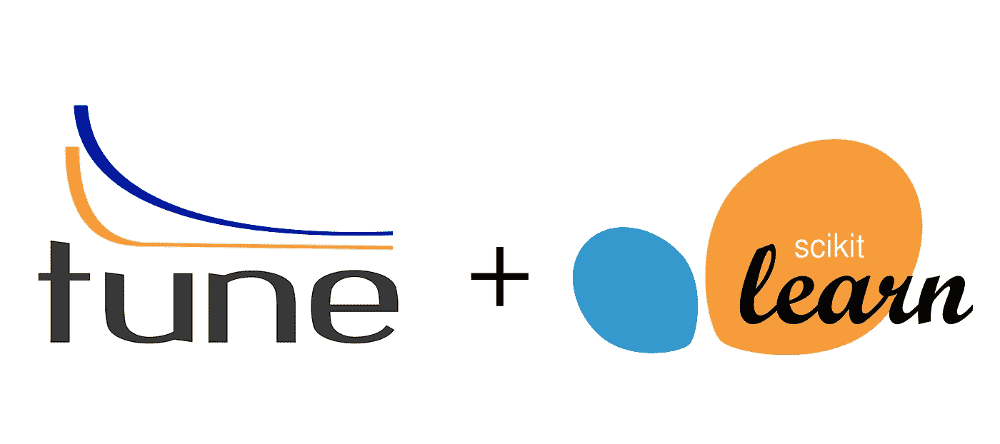
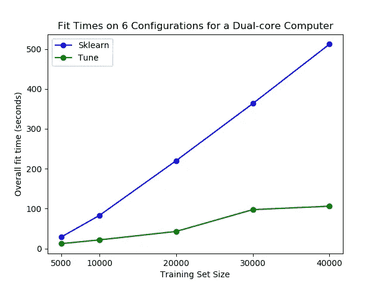
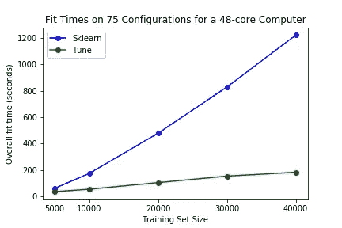
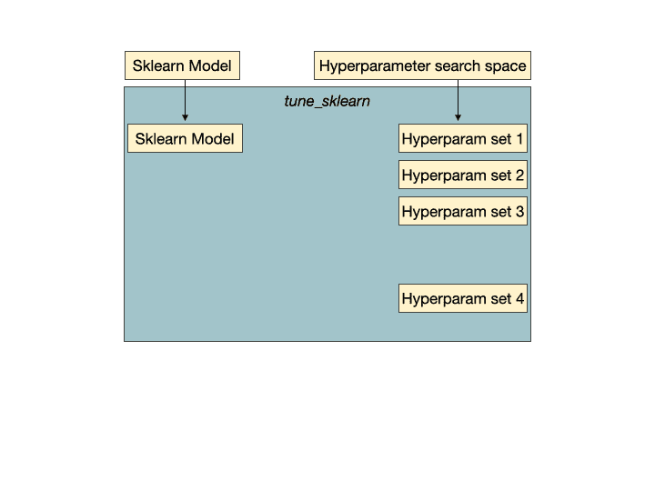

# 速度快 5 倍的 sci kit-在 5 行代码中学习参数调整

> 原文：<https://towardsdatascience.com/5x-faster-scikit-learn-parameter-tuning-in-5-lines-of-code-be6bdd21833c?source=collection_archive---------3----------------------->

## 利用 [Tune-sklearn](https://github.com/ray-project/tune-sklearn) 来增强和扩展 scikit-learn 的 GridSearchCV。

*由* [到*麦洲*](http://mchau.pythonanywhere.com/)*[*安东尼于*](http://anthonyhsyu.com)*[*理查德李奥*](http://people.eecs.berkeley.edu/~rliaw/)**

****

***作者图片***

**每个人都知道 Scikit-Learn——它是数据科学家的主食，提供了几十种易于使用的机器学习算法。它还提供了两种现成的技术来解决超参数调优:网格搜索(GridSearchCV)和随机搜索(RandomizedSearchCV)。**

**这两种技术虽然有效，但都是寻找正确的超参数配置的强力方法，这是一个昂贵且耗时的过程！**

****

***作者图片***

## **如果你想加快这个过程呢？**

**在这篇博文中，我们介绍 [tune-sklearn](https://github.com/ray-project/tune-sklearn) 。 [Tune-sklearn](https://github.com/ray-project/tune-sklearn) 是 Scikit-Learn 的模型选择模块的**替代产品**，采用尖端的超参数调整技术(贝叶斯优化、提前停止、分布式执行)——这些技术提供了比网格搜索和随机搜索显著的加速！**

**以下是 [tune-sklearn](https://github.com/ray-project/tune-sklearn) 提供的内容:**

*   ****与 Scikit-Learn API 的一致性:** [tune-sklearn](https://github.com/ray-project/tune-sklearn) 是 GridSearchCV 和 RandomizedSearchCV 的替代产品，因此您只需在标准 Scikit-Learn 脚本中更改不到 5 行就可以使用该 API。**
*   ****现代超参数调优技术:** [tune-sklearn](https://github.com/ray-project/tune-sklearn) 允许您通过简单切换几个参数，轻松利用贝叶斯优化、HyperBand 和其他优化技术。**
*   ****框架支持:** [tune-sklearn](https://github.com/ray-project/tune-sklearn) 主要用于调优 Scikit-Learn 模型，但它也支持许多其他具有 Scikit-Learn 包装器的框架并提供示例，如 Skorch (Pytorch)、KerasClassifiers (Keras)和 XGBoostClassifiers (XGBoost)。**
*   ****纵向扩展:** [Tune-sklearn](https://github.com/ray-project/tune-sklearn) 利用 [Ray Tune](http://tune.io/) ，一个用于分布式超参数调整的库，在多个内核甚至多个机器上高效、透明地并行化交叉验证。**

****

**[tune-sklearn](https://github.com/ray-project/tune-sklearn) 支持的框架示例。**

**[Tune-sklearn](https://github.com/ray-project/tune-sklearn) 也是**快**。为了看到这一点，我们在标准超参数扫描上用本机 Scikit-Learn 对 [tune-sklearn](https://github.com/ray-project/tune-sklearn) (启用了早期停止)进行了基准测试。在我们的基准测试中，我们可以看到普通笔记本电脑和 48 个 CPU 内核的大型工作站的显著性能差异。**

**对于更大的基准 48 核计算机，Scikit-Learn 花了 20 分钟来搜索超过 75 个超参数集的 40，000 大小的数据集。Tune-sklearn 只用了 3 分半钟——牺牲了最小的准确性。***

******

左图:在个人双核 i5 8GB RAM 笔记本电脑上，使用 6 种配置的参数网格。右图:在使用 75 种配置的参数网格的大型 48 核 250 GB RAM 计算机上。** 

****注意:对于较小的数据集(10，000 或更少的数据点)，在尝试适应早期停止时可能会牺牲准确性。我们预计这不会对用户产生影响，因为该库旨在加速大型数据集的大型训练任务。***

# **简单的 60 秒演练**

**让我们来看看它是如何工作的。**

**运行`pip install tune-sklearn ray[tune]`或`pip install tune-sklearn "ray[tune]"`开始使用下面的示例代码。**

****

**超参数集 2 是一组没有希望的超参数，它们将被 tune 的早期停止机制检测到，并被早期停止以避免浪费训练时间和资源。**

# **TuneGridSearchCV 示例**

**首先，只需修改我们的 import 语句，就可以获得 Tune 的网格搜索交叉验证接口:**

**从那里，我们将像在 Scikit-Learn 的界面中那样继续进行！让我们使用一个“虚拟”自定义分类数据集和一个`SGDClassifier`来对数据进行分类。**

**我们选择`SGDClassifier`是因为它有一个`partial_fit` API，这使它能够停止拟合某个超参数配置的数据。如果估计器不支持提前停止，我们将退回到并行网格搜索。**

**如您所见，这里的设置正是您为 Scikit-Learn 所做的！现在，让我们试着拟合一个模型。**

**请注意我们上面介绍的细微差别:**

1.  **新的`early_stopping`变量，以及**
2.  **`max_iters`参数的说明**

**`early_stopping`决定何时提前停止——MedianStoppingRule 是一个很好的默认设置，但是请参见 Tune 关于调度器的文档[这里](https://docs.ray.io/en/master/tune-schedulers.html)有一个完整的列表可供选择。`max_iters`是给定超参数集*可以运行*的最大迭代次数；如果提前停止，它可能会运行较少的迭代。**

**试着将它与 GridSearchCV 的等价内容进行比较。**

# **TuneSearchCV 贝叶斯优化示例**

**除了网格搜索接口， [tune-sklearn](https://github.com/ray-project/tune-sklearn) 还提供了一个接口 TuneSearchCV，用于从超参数分布中采样。**

**此外，只需修改几行代码，就可以轻松地对 TuneSearchCV 中的分布进行贝叶斯优化。**

**运行`pip install scikit-optimize`来测试这个例子:**

**第 17、18 和 26 行是为了支持贝叶斯优化而修改的唯一几行代码**

**如你所见，将 [tune-sklearn](https://github.com/ray-project/tune-sklearn) 集成到现有代码中非常简单。查看更多详细示例并开始使用 [tune-sklearn 点击](https://github.com/ray-project/tune-sklearn)让我们知道您的想法！还可以看看 Ray 对 joblib 的[替代](/distributed-computing-with-ray/easy-distributed-scikit-learn-training-with-ray-54ff8b643b33)，它允许用户在多个节点上并行训练，而不仅仅是一个节点，从而进一步加快训练速度。**

# **文档和示例**

*   **[文献](https://docs.ray.io/en/master/tune/api_docs/sklearn.html) ***
*   **示例:[带 tune-sklearn 的 sko rch](https://github.com/ray-project/tune-sklearn/blob/master/examples/torch_nn.py)**
*   **示例:[sci kit-Learn Pipelines with tune-sk Learn](https://github.com/ray-project/tune-sklearn/blob/master/examples/sklearn_pipeline.py)**
*   **示例: [XGBoost 带 tune-sklearn](https://github.com/ray-project/tune-sklearn/blob/master/examples/xgbclassifier.py)**
*   **示例:[带 tune-sklearn 的角膜分类器](https://github.com/ray-project/tune-sklearn/blob/master/examples/keras_example.py)**
*   **示例:[带 tune-sklearn 的 LightGBM】](https://github.com/ray-project/tune-sklearn/blob/master/examples/lgbm.py)**

****注:如链接文档所示，从* `*ray.tune*` *导入仅适用于夜间光线控制盘，并将很快在 pip 上提供***