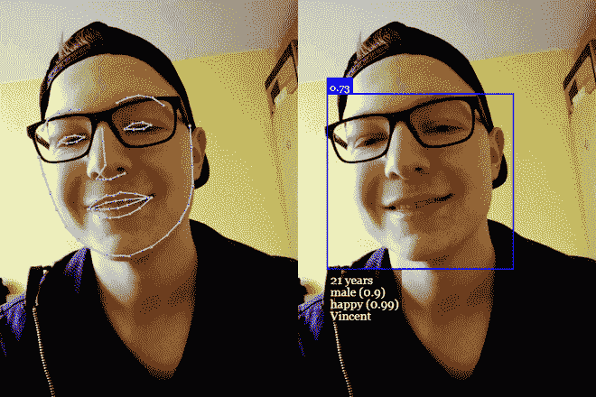
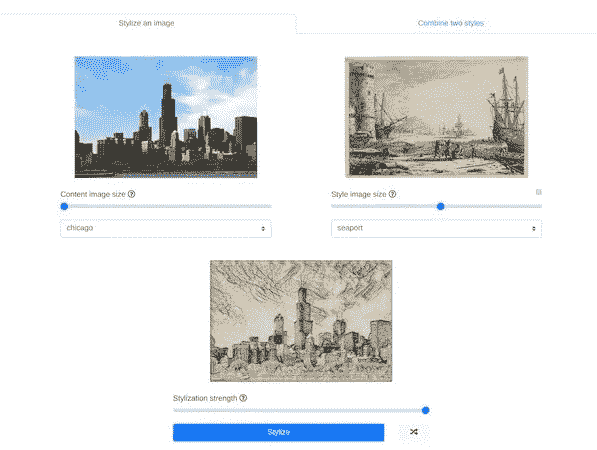
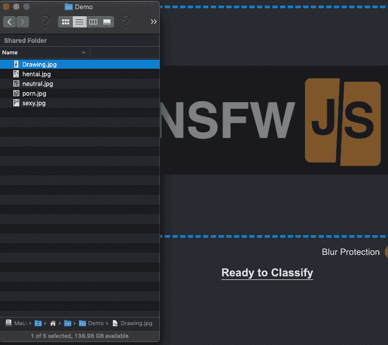
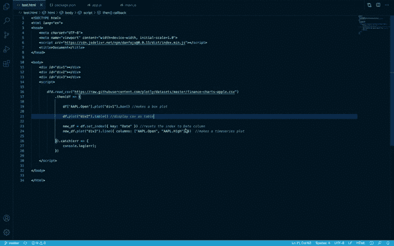

# 6 个惊人的 TensorFlow.js 项目启动了网络机器学习

> 原文：<https://towardsdatascience.com/6-amazing-tensorflow-js-projects-to-kickstart-machine-learning-on-web-3d42dd89398c?source=collection_archive---------10----------------------->

## 进行手部跟踪、风格转换、背景移除等操作


杰瑞米·多洛在 [Unsplash](https://unsplash.com?utm_source=medium&utm_medium=referral) 上的照片

随着机器学习不断加速，越来越多的语言加入了这一行列。JavaScript 曾经一度是网络生态系统的领导者，现在也在慢慢加快机器学习的步伐。

在过去的一年中，已经发布了相当数量的专门用于机器学习的 JavaScript 库。这肯定会推动人工智能驱动的网络浏览器。此外，JavaScript for machine learning 通过利用 web 视图，具有在移动应用程序中快速轻松部署模型的优势。

在 TensorFlow 的核心，我们有一个 Web GL 加速的 TensorFlow.js 库，让您可以直接在浏览器中或使用 Node.js 来训练和运行模型。最棒的是，您不需要成为机器学习专家就可以部署基本模型，因为该库已经提供了一堆用于分类、分段等的预训练模型。

让我们看看几个基于 TensorFlow.js 构建的令人敬畏的库，以激发您的下一个机器学习项目。

# 1.人脸和情感识别

人脸检测一直是 Open-CV 中的经典用例之一，自然地，它也成为机器学习中的常见用例。

[face-api.js](https://github.com/justadudewhohacks/face-api.js/) 是一个基于 TensorFlow.js 实现的 JavaScript 人脸识别库，它可以让你检测和识别人脸和地标，同时还可以确定图像中的情绪和性别。

该库完全抽象了底层实现，为您提供了一个易于使用的高级 API。您所需要做的就是调用相关神经网络模型的方法，并选择调用现成的绘图函数在画布上覆盖特征点。



以下是使用地标和表情检测设置面部检测的基本代码:

```
const detection = await faceapi.detectAllFaces(image)                                     .withFaceLandmarks()                                    .withFaceExpressions();
```

# 2.图像风格转移

风格转移是当今最流行的深度学习任务。从照片编辑应用程序到自定义应用程序中的主题，它的可能性是无穷的。

在一个非常高的层次上，神经风格转移包括将风格从一幅图像传递到另一幅图像。一般来说，你可以使用名画或抽象艺术来为你的输入图像带来新的外观。

[任意样式传输](https://github.com/reiinakano/arbitrary-image-stylization-tfjs)构建在 TensorFlow.js 之上，可以完全在浏览器中工作。

您可以将多种样式组合到一个图像中，还可以设定样式强度密度来控制最终输出中可见的纹理级别。



[来源](https://github.com/reiinakano/arbitrary-image-stylization-tfjs)

# 3.NSFW 分类器

[nsfw.js](https://github.com/infinitered/nsfwjs) 是另一个很酷的库，可以让你在浏览器中对图片或 gif 进行筛选和分类。如果你需要审查不适合孩子的内容，这很方便。

运行该模型将返回 5 个类，根据这些类的概率，您可以选择对输入图像应用模糊或像素化滤镜。

下面的代码展示了加载模型和运行推理是多么容易:

```
const model = await nsfwjs.load()

const predictions = await model.classify(img)
```



[nsfw-filter](https://github.com/nsfw-filter/nsfw-filter) 是上述库的一个很好的扩展，可以阻止 nsfw 图片在你的浏览器中显示。

# 4.人物分割

图像分割帮助我们突出和裁剪出图像中的某些特征。改变图像的背景是最简单的用例。

但是如果你需要做相反的事情呢？很高兴，有一个[很酷的开源项目](https://github.com/jasonmayes/Real-Time-Person-Removal)，可以让你从图像中去除人类。

这个 TensorFlow.js 项目在实时图像处理方面非常有效，当你在网络应用程序中使用视频通话功能时，它非常方便。


[来源](https://github.com/jasonmayes/Real-Time-Person-Removal/blob/master/script.js)

# 5.手跟踪

手部跟踪是另一个有趣的机器学习任务。通过实时跟踪手的位置，你可以构建基于手势的无接触浏览器，并对点击自拍进行动作捕捉。

从用手指书写和绘制涂鸦到不用鼠标或滑动就能滚动屏幕，手部跟踪的用例真的是无限的。

Handtrack.js 正是你在这种时候需要的库。除了提供边界框点，它还允许您在运行模型时设置自定义参数。


[来源](https://github.com/victordibia/handtrack.js/)

# 6.一个类似熊猫的图书馆

Panda 是一个强大的 Python 包，是机器学习中最受欢迎的库之一，用于执行数据操作、清理、可视化和许多其他任务。

尽管 JavaScript 在机器学习方面取得了长足的进步，但它总是缺乏一个像熊猫一样的库来完成预处理任务。但现在不是了。

[Danfo.js](https://github.com/opensource9ja/danfojs) 是一个基于 TensorFlow.js 构建的新的开源 JavaScript 库，它提供了易于使用的数据结构，可以轻松地将数组、JSON、对象、张量和不同索引的数据结构转换为 DataFrame 对象。

这将使处理数据集和执行任务，如合并或分割它们变得更加容易。



[来源](https://github.com/opensource9ja/danfojs)

# 结论

TensorFlow.js 旨在让开发人员完全在其浏览器中训练和运行机器学习模型。对于 JavaScript 开发人员来说，这是进入机器学习世界的一个很好的方式。

最棒的是，与运行在苹果生态系统内的 CoreML 不同，TensorFlow.js 可以运行在 iOS、macOS、Linux、Android 以及任何支持浏览器的平台上。

我希望上面的库和项目能启发你开始构建令人惊叹的基于人工智能的 web 应用程序。

这一次到此为止。感谢阅读。