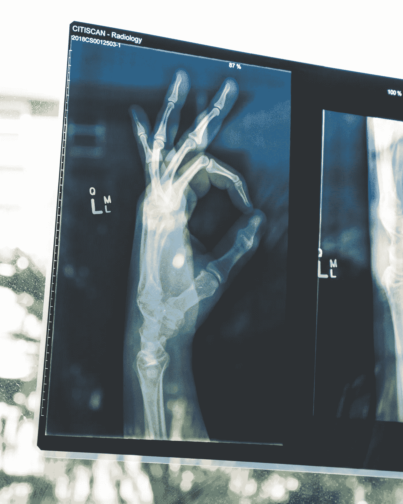

# 人工智能的 6 个最佳创业选择

> 原文：<https://towardsdatascience.com/6-best-startup-choices-with-artificial-intelligence-360260ccf89e?source=collection_archive---------11----------------------->

## 意见

## 想用 AI 创业成功？

来源:Ian Stauffer 在 Unsplash 上拍摄的照片

人工智能是当今发展最快的领域。据[财富](https://fortune.com/2019/12/10/artificial-intelligence-hottest-job/#:~:text=That%20role%2C%20A.I.,past%20four%20years%2C%20LinkedIn%20said.)报道，统计数据显示，人工智能专家的雇佣量在过去 4 年里增长了 74%。人工智能被认为是当代人最热门的工作。对熟练人工智能专家的需求正以前所未有的速度增长。对机器学习、深度学习、计算机视觉、统计学和自然语言处理等人工智能子领域专家的需求和空缺职位每天都在激增。

还有什么更好的时机来创业呢？你可能是一个拥有一些人工智能技能和知识的白手起家的企业家。感谢所有的大肆宣传，这是在人工智能领域建立自己的创业公司的最佳时机。然而，这需要一些事实核查和挖掘。

哪些领域实际上辜负了 AI 的所有加速炒作？为了回答这个问题，我们将不得不探索人工智能的各个领域以及伴随每个主题而来的各种想法。我将讨论各种可能的人工智能创业。然后，我会推荐一些建议，让你从这个特定的创业开始，并进一步详细解释。让我们开始分析 AI 的 6 个最佳创业选择，排名不分先后。

# 1.机器学习初创公司:

**理念和方法—** 解决复杂问题的优化算法、高质量推荐系统、高级垃圾邮件过滤、欺诈检测。

[来源:](https://unsplash.com/photos/GAEvM4qvlBk)丹尼尔·韦德罗在 unsplash 上拍摄的照片

机器学习初创公司提供了广泛的机会。有这么多方向可以选择。对于精通机器学习知识但缺乏深度学习视角或对深度学习不感兴趣的人来说，这也是一个很好的选择。有些人只是喜欢更复杂的数学和机器学习设计。他们真幸运！这是完美的启动选项。各种机器学习模型的设计、战略规划和部署可以根据他们选择的想法来执行，以在他们的商业风险中赚取现金和利润。

# 2.自然语言处理:

**理念和方法—** [面向商业和工业的独特创新聊天机器人](/innovative-chatbot-using-1-dimensional-convolutional-layers-2cab4090b0fc)，关注区域语言、文本到语音和语音到文本任务的机器翻译的序列到序列模型。

[来源:](https://unsplash.com/photos/RrhhzitYizg)Kourosh Qaffari 在 unsplash 上拍摄的照片

你喜欢文本、大量阅读、预处理和用基于文本的数据建立模型吗？答对了。这是规划和建立创业的最佳选择。自然语言处理作为创业选择的可能性是多种多样的。这些包括文本分类、有用数据的分离、高级聊天机器人的构建等等。如果你住在一个地区语言还没有在谷歌翻译中被确认为官方语言的地方，那也是一个很好的商业选择。此外，大多数谷歌翻译在某些语言上效果不佳。你可以即兴创作自己的数据集和想法，从而成功创业。如果你想建立聊天机器人，最好的方法是寻找你的目标受众、公司或企业。制作特定的[聊天机器人](/innovative-chatbot-using-1-dimensional-convolutional-layers-2cab4090b0fc)是理想的，因为你可以极大地提高特定任务的性能。

# 3.计算机视觉:

**思路和方法—** [人脸识别](/smart-face-lock-system-6c5a77aa5d30)、物体检测、人体活动识别、[人体情绪和手势检测](https://medium.com/tag/emotion-gesture-detection/latest)、图像分割、光学字符识别(OCR)。

来源:卡尔·海尔达尔在 unsplash 上拍摄的照片

我个人对计算机视觉项目和计算机视觉相关的初创公司非常感兴趣。这一领域提供了独特和多样的选择，以建立如此多的创新项目。计算机视觉项目旨在解释和可视化周围的图像和物体。一个卓有成效的计算机视觉商业风险可以产生很高的收入。计算机视觉可以跨许多平台使用。可以在智能手机、物联网设备等上执行人脸识别任务。对象检测任务可以用于图像检索、监视、自动车辆和机器检查。[这里](https://medium.com/tag/emotion-gesture-detection/latest)是我举的一个人类情感和手势识别的例子。通过选择你的目标受众和你想执行特定计算机视觉任务的公司来建立你的创业公司。

# 4.基于人工智能的医疗创业公司:

**理念和方法—** 先进的 x 射线扫描，恶意疾病的高级筛查和诊断，视网膜扫描，针对特定情况识别各种症状。

[来源:](https://unsplash.com/photos/DK8jXx1B-1c)照片由欧文·比尔德在 unsplash 上拍摄

人工智能正被广泛应用于医学研究和科学领域。由于预测的精确性和准确性，采用人工智能技术的医疗初创公司正获得极高的人气。开发高质量的模型，尤其是在医学和医学科学领域，是至关重要的。这是因为每个预测都可能危及个人的生命。这是对这些创业公司的需求每天都在上升的主要原因之一。如果你有兴趣在医疗行业帮助人们和创新设备，这是你最好的创业想法。

# 5.具有 AI 的物联网(基于物联网的 AI 创业公司):

**理念和方法—** 基于人工智能的机器人、使用嵌入式系统的安全性、自动驾驶人工智能汽车、[嵌入式设备上的人脸识别](/smart-face-lock-system-6c5a77aa5d30)和情感分析、家庭自动化设置。

[来源:](https://unsplash.com/photos/SYTO3xs06fU)马文·迈耶在 unsplash 上拍摄的照片

这可能是人工智能最酷的创业想法。物联网和人工智能都是当今世界的热门词汇。将人工智能与物联网集成有大量选项可供选择。将人工智能与嵌入式系统结合起来执行各种杂务，如安全、监控、人脸识别和指纹识别等，是非常好的创业选择。机器人和人工智能是最受欢迎的领域之一。要阅读更多关于基于人工智能的机器人梦的内容，请点击这里查看这篇文章。总的来说，对于任何对物联网项目的现实生活和实时计算处理以及人工智能感兴趣的人来说，这是最佳选择。

# 6.虚拟助手:

**思路和方法——**语音识别与用户交互，对话式聊天机器人 AI，自然语言处理，计算机视觉知识。

[来源:](https://unsplash.com/photos/anapPhJFRhM)本斯·波罗斯在 unsplash 上拍摄的照片

虚拟助手需要特别提及他们自己。这是因为更精确和更健壮的虚拟助手构建起来相当复杂。然而，这些虚拟助理创业公司产生的收入可能非常高。掌握一些物联网、自然语言处理、计算机视觉和语音翻译方面的知识非常重要。现有的热门虚拟助手有亚马逊 Alexa，苹果的 Siri，谷歌助手，微软的 Cortana。市场需要更多的虚拟助手。人们喜欢这些虚拟助手提供的选择。然而，像 Alexa 这样的虚拟助手对某些人来说可能会稍微贵一些。这打开了一个惊人的创业想法出售。更便宜性能更好的虚拟助手[和优化的算法](https://towardsdatascience.com/tagged/virtual-assistant-project)可能是一个很大的卖点。在不久的将来，我会做一个关于如何制作你自己的虚拟助手的系列。

[来源:](https://unsplash.com/photos/1Z2niiBPg5A)照片由 V2osk 在 unsplash 上拍摄

# 最终想法:

> 一个人的性格不可能在安逸和平静中发展。只有经历考验和苦难，灵魂才能得到强化，抱负才能得到激发，成功才能实现。
> 
> 海伦·凯勒

在我的经验中，这是 6 个最好的创业想法。如果你觉得我错过了什么，或者你觉得其他创业想法正在兴起，请随时告诉我。在一天结束的时候，自我满足和对你所感知的事物感到快乐是生活中最重要的事情。如果你选择了以下任何一个创业想法，我祝你好运！享受你的创业想法，不要害怕成功或失败。

> 真正的考验不是你是否会避免失败，因为你不会。而是你是否让它变得冷酷无情，或者让你羞愧而无所作为，或者你是否从中吸取教训；你是否选择坚持。巴拉克·奥巴马

确立你的创业想法和具体计划对你的创业成功和成为成功企业家至关重要。我希望所有人都喜欢阅读这篇文章，并能从中学习到一些东西。祝所有打算成为现代人工智能企业家的人好运！祝你有美好的一天，在另一篇文章中再见。