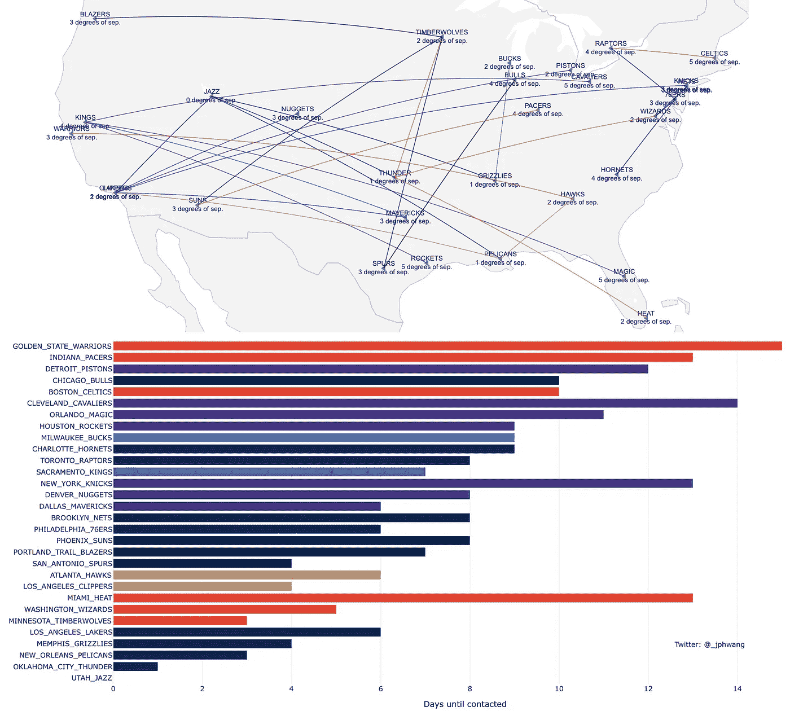
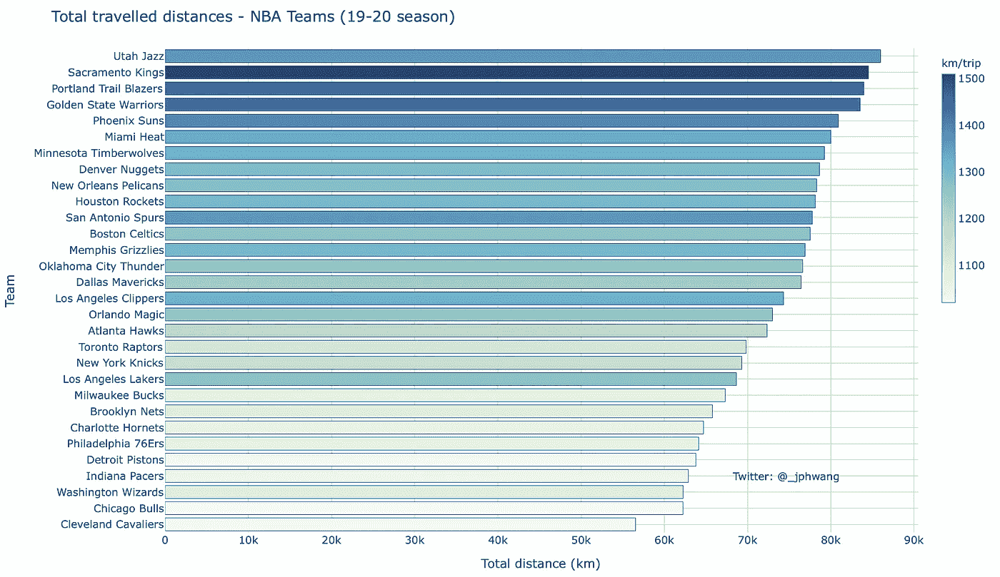
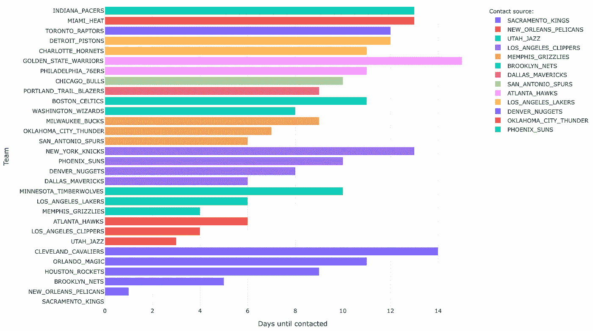
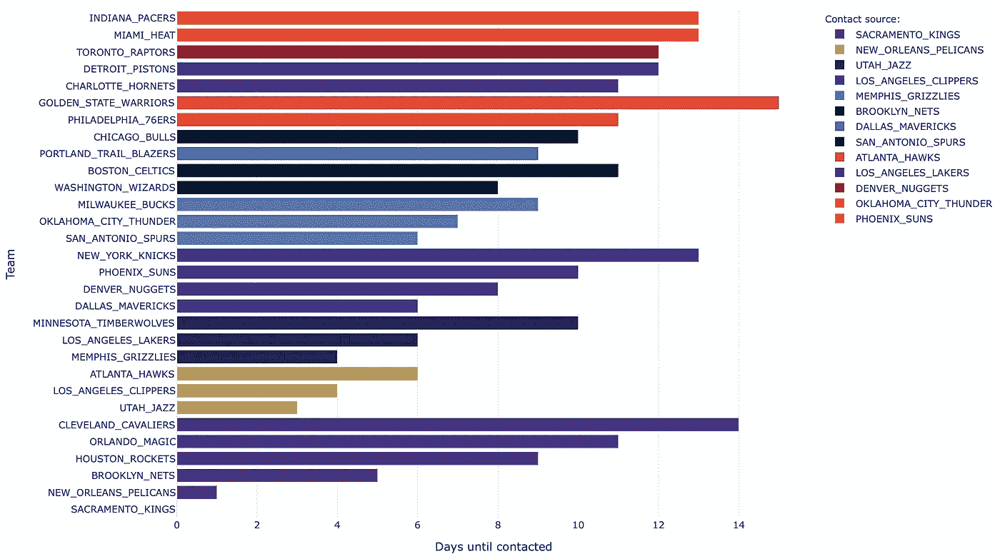
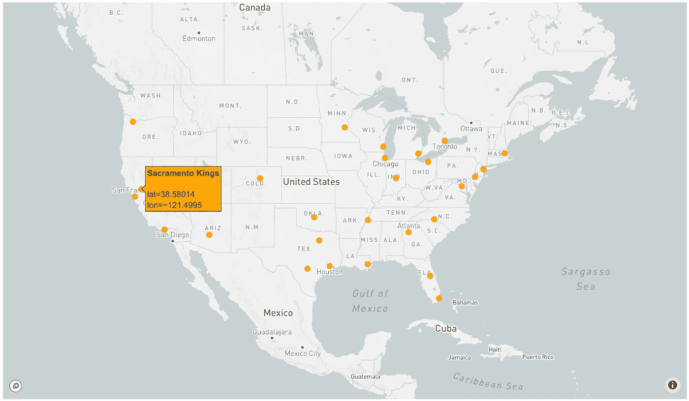
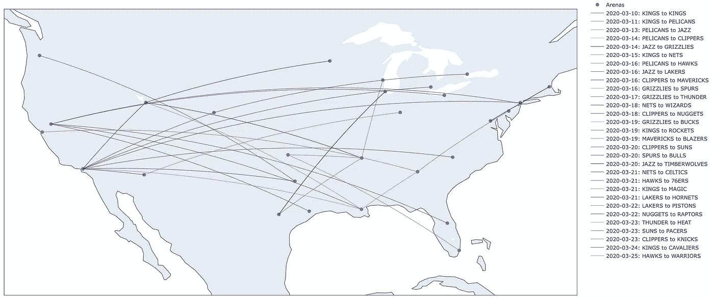
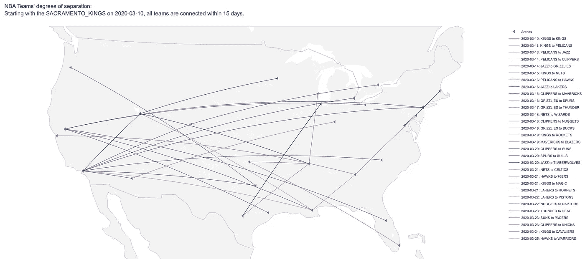
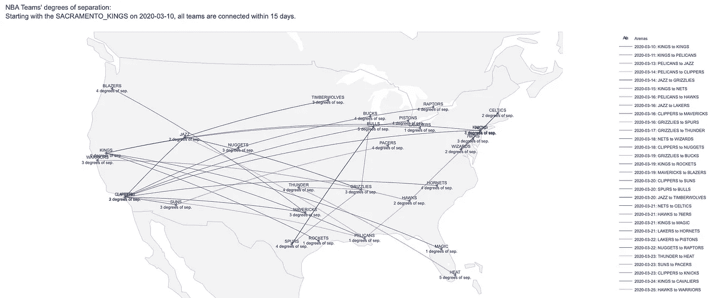

# NBA 的 6 度分离:为什么中止它是不可避免的

> 原文：<https://towardsdatascience.com/6-degrees-of-separation-in-the-nba-why-suspending-it-was-inevitable-9c646db99e4c?source=collection_archive---------24----------------------->

## 用 Python 可视化 NBA 的旅游连接链(带数据和代码)



想象 NBA 中的关系网

截至 3 月 11 日，美国国家篮球协会已经[暂停其赛季](https://edition.cnn.com/2020/03/11/us/nba-season-suspended-spt-trnd/index.html)。这是 2020 年的另一个重大发展，它被各种与新冠肺炎相关的事件所主导，导致整个*城市*完全停滞。

(嗯，可能不是完全的停顿。人类的精神是一种神奇的东西——看看西西里的这个街区。)

(这是没有关系的；我只是想在这个糟糕的时期增加一些有趣的亮点。)

尽管西西里的好人尽可能多地利用手中的牌，但现实是艰难的。我们正在经历一个降低传染风险至关重要的时代，社会隔离和自我隔离等机制正在为此而部署。

虽然看到数百万人最喜爱的娱乐活动如 NBA 被推迟或推迟令人难过，但在这种环境下，这可能也是不可避免的。

事实是，除了暂停体育赛事之外，几乎没有其他理由，尤其是像 NBA 这样的网络。加倍如此，在这种情况下，作为一名球员已测试阳性的病毒。

NBA 赛季涉及大量的旅行——平均每个赛季每支球队将近 40，000 英里，并且一支球队不需要很长时间就可以最终与联盟中的所有其他球队联系起来。



NBA 球队每年走过的路程(摘自我之前写的文章

因此，我想用这篇文章来分析和直观地展示 NBA 是如何相互联系的，考虑到他们繁忙的旅行和比赛日程。

像往常一样，我将使用 Python 进行分析，使用[进行可视化。我希望在这个充满挑战的时代，这是一个有用的、有益的和有趣的喘息。](https://plot.ly)

# 准备

## 数据

我把代码和数据放在我的 [GitLab repo 这里](https://gitlab.com/jphwang/online_articles) ( `sixdegs_leagues`目录)。所以请随意使用它/改进它。

## `Packages`

我假设您熟悉 python。即使你相对较新，这个教程也不应该太难。

你需要`pandas`和`plotly`。用一个简单的`pip install [PACKAGE_NAME]`安装每一个(在你的虚拟环境中)。

# 入门指南

此分析的目标是确定每个团队在从某个特定日期开始与*来源*团队的“联系链”团队连接之前*需要多长时间。*

也就是说，通过一个曾经和另一个队比赛过的队来连接一个队。以此类推，直到他们到达源团队。本质上，我们将玩六度分离/凯文·贝肯，但与 NBA 球队，并可视化我们的结果。

## 加载数据

将日程数据`csv`加载到 Python / pandas 中

```
nba_sch_data = pd.read_csv(‘srcdata/2020_nba_schedule_fulldata.csv’, index_col=0)
```

该数据包含一个“`est_time`”列，该列以字符串格式包含美国东部时间的比赛日期(和开球时间)。这对于操作来说不太方便，所以让我们用`pd.to_datetime`函数创建一个新的包含这些数据的'`datetime`'列。

```
nba_sch_data = nba_sch_data.assign(datetime=pd.to_datetime(nba_sch_data.est_time))
```

加载我们的球队颜色字典，并列出球队名单，包括:

```
with open('srcdata/teamcolor_dict.pickle', 'rb') as f:
    teamcolor_dict = pickle.load(f)
teamcolor_dict = {k.replace(' ', '_').upper(): v for k, v in teamcolor_dict.items()}
teams_list = nba_sch_data.home_team.unique()
```

## 选择“源”团队/日期

让我们选择一个开始日期，和一个源团队。我们可以随机进行；我们就挑 2020 年 3 月 10 日吧，也就是联赛停摆的前一天。

```
# Pick a random/particular "seed" team
seed_date = '2020-03-10'  # YYYY-MM-DD
seed_tm = random.choice(teams_list)
```

在我的例子中，`seed_tm`结果是国王队(可能是他们在一段时间内赢得的唯一一次彩票)。

## 创建新的数据框架

首先，我们将创建一个新的 Pandas 数据框架，捕获每个团队的数据，这些数据与他们如何融入源团队的连接链有关。数据框架将包括:

*   团队名称(`team`)
*   他们是否在联系的团队链上有联系(`contacted`)
*   第一次连接到链上的日期(`date`)
*   将它们连接到链条上的团队(`con_from`)，以及
*   分离的度数(`deg_sep`)。

```
teams_contacted_list = [{'team': tm, 'contacted': False, 'date': None, 'con_from': None, 'deg_sep': None} for tm in teams_list]
teams_contacted_df = pd.DataFrame(teams_contacted_list)
```

## 计算分离度

概括地说，我们的算法将:

*   从`seed_date`开始或之后循环播放日程数据，
*   评估一个游戏是否涉及链上的一个团队和接触链外的一个团队，
*   将“下链”团队记录更改为“上链”,以及
*   记录分离度。

为了开始编写代码，我们为源团队设置了第一行数据:

然后，当一个团队被添加到“联系链”中时，我们可以通过日程数据迭代来查找游戏。请看一下我的实现:

我正在做的是查看游戏中每个团队的状态，首先是是否存在不匹配——如果两个团队都在链上，或者不在链上，则不需要采取任何行动。

然后，我更新联系的状态，然后对于不在链上的团队，数据被更新。联系的日期是基于比赛的日期，而分离的程度是加到对方球队的。

检查结果:

(我相对快速地浏览了一遍，如果您有任何问题，请告诉我)。结果看起来相当合理。让我们开始观想吧！

# 可视化分离度

## 直方图

首先，我们将绘制一个直方图，以查看团队与我们的随机来源团队的分离程度:

```
fig = px.histogram(teams_contacted_df, x='deg_sep', template='plotly_white')
fig.update_layout(bargap=0.5)
fig.show()
```


分离度直方图

有趣的是，它们中的大多数(29 个中的 19 个)只有 3 度或更少的分离度！哇！。

## 分离天数

同样，我们可以看看团队接触的天数。

在这里，我创建了一个名为 days 的`numpy`数组，它是从链的起点开始的天数。

然后，我用 Plotly Express 调用一个横条图。应该比较直截了当。(Plotly.py [条形图文档](https://plot.ly/python/bar-charts/)如果不熟悉的话。)

```
days = (teams_contacted_df.date-min(teams_contacted_df.date)) / np.timedelta64(1, 'D')
teams_contacted_df = teams_contacted_df.assign(days=days)fig = px.bar(
    teams_contacted_df, x='days', y='team',
    orientation='h', template='plotly_white',
    labels={'team': 'Team', 'days': 'Days until contacted.'}
)
fig.update_layout(bargap=0.2)
fig.show()
```


从 2020 年 3 月 10 日起，每支球队与(随机选择的)萨克拉门托国王队分开的天数

在这种情况下，一个团队离源团队最远只有 15 天，大约一半的联盟会在 9 天内联系。

我们可以在这个图中添加更多的细节——还记得我们是如何捕捉到将每个团队添加到链中的团队的吗？让我们添加数据。我们可以通过团队颜色来直观地做到这一点。在 Plotly Express 中，我们只需将列名('`con_from`')传递给参数'【T2 ')。

```
# Days of separation, grouped by source team
fig = px.bar(
    teams_contacted_df, x='days', y='team',
    orientation='h', template='plotly_white', color='con_from',
    labels={'team': 'Team', 'days': 'Days until contacted', 'con_from': 'Contact source:'}
)
fig.update_layout(bargap=0.2)
fig.show()
```



与(随机选择的)国王分离的天数，按之前的链接分组

这就包含了更多的信息——尽管颜色是随意的，令人困惑。举例来说，我可能会认为湖人是被凯尔特人加入进来的(因为绿色)。让我们改变颜色。

有不同的方法可以做到这一点——例如，你可以在`color_discrete_sequence`参数下传递一个颜色列表给`px.bar`函数调用。

我在这里是通过循环遍历`fig`对象下的数据来实现的:

```
for i in range(len(fig['data'])):
    fig['data'][i]['marker']['color'] = teamcolor_dict[fig['data'][i]['name']]
```

再次渲染图形:



与(随机选择的)国王分离的日子，有“真正的”球队颜色。

它并不完美——它确实存在一些球队颜色相似的问题，但我认为它工作得很好，把你的目光吸引到正确的地方。

很有趣，不是吗？可以预见的是，大部分传播是由原始团队(国王)完成的，但实际上只占很小的比例。大部分工作由其“子”节点完成——这就是网络传播的力量。

我们能把这个标在地图上吗？是的，我们去吧。

# 描绘未来

我们首先需要竞技场坐标——在我刚才完成的地方加载这个文件，并创建一个新的'`teamupper`'列，以使球队名称格式与我们的其他数据帧保持一致。

```
arena_df = pd.read_csv('srcdata/arena_data.csv', index_col=0)
arena_df = arena_df.assign(teamupper=arena_df.teamname.str.replace(' ', '_').str.upper())
```

## 竞技场位置

作为第一个练习，让我们简单地标出这些位置来检查:

```
# Load mapbox key
with open('../../tokens/mapbox_tkn.txt', 'r') as f:
    mapbox_key = f.read().strip()

# Plot a simple map
fig = px.scatter_mapbox(arena_df, lat="lat", lon="lon", zoom=3, hover_name='teamname')
fig.update_layout(mapbox_style="light", mapbox_accesstoken=mapbox_key)  # mapbox_style="open-street-map" to use without a token
fig.update_traces(marker=dict(size=10, color='orange'))
fig.show()
```

这段代码使用 Plotly Express 创建了一个新的“散点 _ 地图框”类型的绘图，在每个纬度和经度绘制每一行`arena_df`。我还在这里设置了一个标记的大小和颜色，这是可选的。

值得注意的是，因为这个调用使用了需要 Mapbox 标记的“light”样式。你可以用[地图框](https://www.mapbox.com)得到一个免费的，这是我有的。或者，用`mapbox_style=”open-street-map”`代替，不用钥匙。它会工作得很好，虽然我不认为它看起来很好。(如果你感兴趣的话，[这篇精彩的文档](https://plot.ly/python/mapbox-layers/)会有更详细的介绍。)



NBA 赛场位置

## 映射连接

我们有一个数据框架(`teams_contacted_df`)，它记录了每个团队何时被添加到连接链中，以及由谁添加的。

扩展这些数据，我们将添加出发团队和目的团队的位置。这些数据并不表明团队的旅行，更多的是连接的路径。例如，如果洛杉矶湖人队被圣安东尼奥马刺队加入到链条中，但是比赛在洛杉矶，那么“起源”位置将仍然在圣安东尼奥。

然后，有了这些数据，我们就可以创建一个新的图——在这个图中，从一个团队到另一个团队的每一行都用一条线表示。

同样，有多种方法可以做到这一点。我选择这样做，为每个连接创建一个新的数据序列。(有一种观点认为，应该为每一天或每一个团队创建一个新的系列。我将演示我所做的，但请随意尝试您自己的变化！)

所以我在这里做的是使用经典的情节性(`plotly.graph_objects`)，并且:

*   初始化一个新图形
*   添加第一个轨迹，这是所有的竞技场
*   对于`teams_contacted_df`数据帧的每一行，添加一条连接“起点”团队竞技场和“终点”团队竞技场的新轨迹。
*   每个轨迹都有连接日期的名称，以及“起点”和“终点”团队名称(您可以在图例中看到)



在地图上代表每个团队的联系

你可能已经注意到了一些事情——首先，地图以非常低的缩放级别加载，我们没有显示任何国家边界，也没有标题。让我们解决所有这些问题:

这导致了这个图:



团队在地图上的联系，有更多格式

我认为它信息量很大，但是仍然缺少一些信息。我更愿意看着地图，立即知道是哪个竞技场(我是澳大利亚人，仍然会把休斯顿/达拉斯/圣安东尼奥弄混)，也知道每个城市的分隔程度。

## 点睛之笔-地图上的文字

该图允许我们直接将文本和标记一起添加到地图中。让我们添加文本来显示团队名称，并在下一行显示该团队与我们的源的分离程度。

文本只需要作为列表传递；我们可以通过以下方式构建它:

```
txt_list = list()
for i in range(len(arena_df)):
    teamupper = arena_df.iloc[i].teamupper
    temp_row = teams_contacted_df[teams_contacted_df.team == teamupper]
    temp_txt = (
            temp_row.team.values[0].split('_')[-1]
            + '<BR>' + str(temp_row.deg_sep.values[0]) + ' degrees of sep.'
    )
    txt_list.append(temp_txt)
```

然后，每个团队的文本变成类似于:'【T0]'

基于`D3.js`,像`<BR>`这样的简单 HTML 标签将被呈现在页面上，这很简洁。

所以现在对竞技场的需求可以包括这个列表:

```
fig.add_trace(go.Scattergeo(
    mode="markers+text",
    lon=arena_df['lon'], lat=arena_df['lat'], marker=dict(size=8, color='slategray'),
    hoverinfo='text', **text=txt_list**, name='Arenas'
))
```

还要注意的是，`Scattergeo`调用中的`mode`参数值已经更改为`“markers+text”`。这告诉 Plotly 也在屏幕上呈现文本数据。

最终结果如下所示:



地图上团队的联系，地图上有文字

就这样，我们可以将所有 30 个团队的位置，到“源”的“网络连接”路径，以及连接的详细信息绘制到交互式地图上！

由于源代码在我的 GitLab repo 中，请随意使用不同的日期和团队。当然，它不需要太多的修改就可以应用到不同的联赛，这将是很酷的。(MLB，NFL…EPL 怎么样？)

这是同样的模拟，从犹他爵士开始:


从 2020 年 3 月 10 日开始的与爵士的联系日，期待

和网络图。


从 3 月 10 日起，球队与犹他爵士队的联系

从上面的两个例子可以看出，连接所有三十个团队真的不需要很长时间，或者说不需要那么多跳。

反过来，暂停联盟肯定是显而易见的——在短短几天内，一半的联盟将被连接，并且在*两周*内，所有的球队都将与一个“来源”球队联系。

我将在 Plotly Dash 中创建一个仪表板，允许人们使用不同的输入日期和来源位置，但现在—自己使用数据，让我知道你还发现了什么。我很快就把这些放在一起了，所以我不知道你是否能循环所有可能的日期和团队组合——但我肯定这不会很难。

将这一数据与其他联赛进行比较也很有趣——无论是 MLB，球队打更多的比赛，NFL，不是所有球队都互相比赛，每周只打一场，还是欧洲冠军联赛，欧洲冠军联赛纵横交错。我也很想知道这些数据是什么样的。

不过，对我来说就这样了。正如我提到的，我可能会把它变成一个 Dash 仪表板，然后回来分享它。在那之前——保持安全，互相照顾。帮大家[把曲线](https://www.vox.com/2020/3/10/21171481/coronavirus-us-cases-quarantine-cancellation)拉平！

如果你喜欢这个，比如说👋/关注[推特](https://twitter.com/_jphwang)，或点击此处获取更新。ICYMI:我还写了这篇关于用 Plotly Dash 构建 web 数据仪表板的文章。

[](/build-a-web-data-dashboard-in-just-minutes-with-python-d722076aee2b) [## 使用 Python 在几分钟内构建一个 web 数据仪表板

### 通过将您的数据可视化转换为基于 web 的仪表板，以指数方式提高功能和可访问性…

towardsdatascience.com](/build-a-web-data-dashboard-in-just-minutes-with-python-d722076aee2b) 

这是关于视觉化隐藏的关系:

[](/how-to-visualize-hidden-relationships-in-data-with-python-analysing-nba-assists-e480de59db50) [## 如何用 Python 可视化数据中的隐藏关系 NBA 助攻分析

### 使用交互式快照、气泡图和桑基图操纵和可视化数据，使用 Plotly(代码和数据…

towardsdatascience.com](/how-to-visualize-hidden-relationships-in-data-with-python-analysing-nba-assists-e480de59db50) 

回头见！:)