# 用张量流 2 和张量流概率实现 VAE 的 6 种不同方式

> 原文：<https://towardsdatascience.com/6-different-ways-of-implementing-vae-with-tensorflow-2-and-tensorflow-probability-9fe34a8ab981?source=collection_archive---------4----------------------->


由 [Unsplash](https://unsplash.com?utm_source=medium&utm_medium=referral) 上的 [KAL 视觉](https://unsplash.com/@kalvisuals?utm_source=medium&utm_medium=referral)拍摄的照片

自从在 *2013* 到[本文](https://arxiv.org/pdf/1312.6114.pdf)中引入以来，变分自动编码器(VAE)作为一种生成模型，随着其在广泛领域的应用，已经席卷了贝叶斯深度学习的世界。Kingma 和 Welling 的原始论文被引用超过 1 万次；同时，乍一看，它的构造可能不容易理解，因此有许多很好的文章解释了该模型的直觉、架构和其他不同的组件。

然而，VAE 的实现通常是作为那些文章的补充，代码本身较少被谈论，尤其是在一些特定的深度学习库(TensorFlow，PyTorch 等)下被上下文化。)—这意味着代码只是放在代码块中，没有足够的注释说明一些参数是如何工作的，为什么选择这个函数而不是其他函数，等等。此外，由于这些流行库的灵活性，您可能会发现这些演示 VAE 实现看起来都各不相同。此外，一些版本可能会被错误地实现，即使是 TensorFlow 自己的教程中的[(我将在后面处理这个帖子，主要在我的实现的**版本 a.** 下)，但如果不与其他版本进行比较，这些错误可能不会被发现。最后，遵循一个有效的版本当然很好，但是我几乎没有看到一篇文章比较横向不同的实现方式。所有这些促使我写这篇文章。](https://www.tensorflow.org/guide/keras/custom_layers_and_models#putting_it_all_together_an_end-to-end_example)

我假设读者已经对 VAE 的工作原理有了一定程度的了解，并且想知道更多关于实现方面的东西。

我打算把这篇文章分成两个部分，这两个部分共同构成了标题:

1.  使用 TF *2* 和 TFP**实现一般 VAE**时需要特别注意的事项
2.  如何用不同的方式实现 VAE **，使用 TF *2* 和 TFP**

在开始深入每一部分之前，我想用下面两段话来分享一下我学习这个模型的亲身经历:

在我开始实现它之前，我一直认为我在读了这篇论文之后对这个模型有了很好的理解。当阅读报纸时，通常有太多关于模型的细节，以至于人们很可能会忘记需要额外注意的部分。有时，论文用一个简短的句子描述的模型的一个组成部分可能需要我花几个小时才能完全掌握，并在实现过程中使其工作。在我看来，如果你想很好地理解一个模型是如何工作的，尽管尽可能彻底地阅读这篇文章肯定是好的，但最好还是自己去实现它。

当你开始实现模型时，我会说选择一个社区已经知道模型将如何表现的基准数据集，而不是试图提出你自己的数据集，特别是如果你是第一次实现模型。这一点尤其重要，因为你对结果会是什么样子有一个非常明确的目标——可以说是一个参考。因为仅仅使代码运行无误，并看到成本下降，还远远不能称之为实现工作；我们至少需要看看它是否以其他人已经在特定数据集上观察到的特定方式表现。

# 第 0 部分:阐明实现目标

根据上一节的讨论，我将介绍数据集，以及 VAE 模型要完成的特定任务。在这篇文章中，我使用了手写数字的 MNIST 数据集，以及形状为`(28,28,1)`的图像。我对它进行了预处理，将数据集归一化为介于 *0* 和 *1* 之间，并将值离散化为 *0* 或 *1* ，使用 *0.5* 作为阈值。VAE 模型要在该数据集上完成的任务有:

(a)尽可能接近地重建输入数字图像

**(b)使用来自先验分布的随机样本(而不是来自后验分布的样本，以数据为条件)作为解码器的输入，生成看起来逼真的新数字图像**

****任务 *(a)* 相对容易完成，然而任务 *(b)* 在我看来是指示实现是否工作的任务:它已经从训练数据中学习了不同数字的多模态，并且能够产生新的数字图像作为生成模型。****

****现在我们准备深入这篇文章的每一部分。****

# ****第一部分:实施 VAE 时的主要重点****

****两件事，都与每个实例的损失函数有关:****

*   ****损失函数由两部分组成:反向 KL 散度(潜在变量 *z* 的先验和后验分布之间)，以及期望的负对数似然(待重构数据上的解码器分布；也称为预期重建误差)。将这两部分相加，我们得到负的 ELBO，它将被最小化。对于每个部分的计算，我们需要额外注意我们需要在数据的每个维度上做什么操作(取和 vs .取均值)。****
*   ****损失函数中 KL 散度的权重是一个我们根本不应该忽略的超参数:它调整了 *z* 的先验和后验分布之间的“距离”，对模型的性能起着决定性的作用。****

****这是损失函数:****

****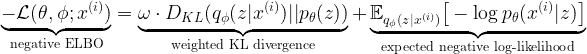****

****这个损失函数的计算可以通过各种方式来完成，并且在实现过程中经常很容易出错，尤其是 w.r.t .第一个要点中提到的:对数据的每个维度的操作。我会在**第二部分**中详细阐述，每种实现方式都会单独介绍。****

****注意，它实际上应该是β-VAE 的损失函数，其中 *ω* 可以取除 *1* 以外的值。这个超参数是至关重要的，特别是对于任务 *(b)* 在**第 0 部分**中提到的时候:这个超参数的作用是决定我们想要惩罚 *z* 的先验分布和后验分布之间的差异的力度。很多时候，图像的重建看起来很完美，而从代码 *z* 采样得到的图像看起来很疯狂。如果 *ω* 设置得太小，我们基本上根本不正则化后验概率，因此训练后它可能与前验概率有很大不同——从某种意义上说，从前验概率采样的 *z* 经常会落入后验概率分布中密度非常低的区域。因此，解码器不知道如何处理这些样本 *z* ，因为它是根据后验分布(注意上面损失函数中负对数似然项的期望下标处的分布)对 *z* 进行训练的。以下是 *ω=0.0001* 时重构生成的数字:****

****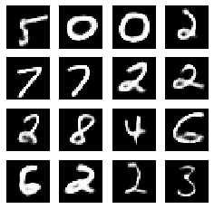****

****重构位数 *ω=1e-4*****

****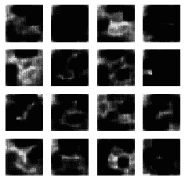****

****生成的数字 *ω=1e-4*****

****注意重构的数字可以清晰的分辨出来(也和它们的标签匹配)，但是生成的数字基本都是深色的，无法识别。这是正则化不足的一个例子。****

****另一方面，如果 *ω* 太大，后验将被拉得太靠近先验，因此无论什么图像被输入到编码器，我们最终都会得到一个 *z* ，就好像它是从先验中随机采样的一样。以下是 *ω=20* 时重构生成的数字:****

****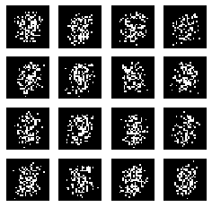****

****重构位数 *ω=20*****

****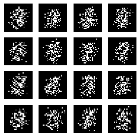****

****生成的数字 *ω=20*****

****请注意，所有数字看起来都一样，不管它是根据输入数字重建的，还是作为新数字生成的。这是过度正规化的一个例子。****

****第三，我们有当 *ω* 被设置为“恰到好处的量”时的场景——在某种意义上，后验与前验足够不同，可以对输入数字数据进行灵活的调节，因此重建看起来很棒；虽然两个分布的高密度区域有足够的重叠，因此来自先验的 *z* 样本对于作为其输入的解码器来说不会看起来太陌生。以下是 *ω=3* 时重构生成的数字:****

****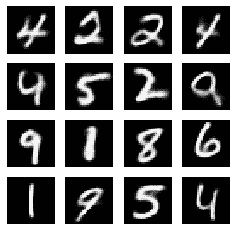****

****重构位数 *ω=3*****

****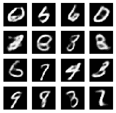****

****生成的数字 *ω=3*****

****请注意，所有重建的和大多数生成的数字看起来都是可识别的，而一些生成的数字看起来不太真实。****

****总之，虽然自动编码器设置对潜在变量 *z* 设置了信息瓶颈，迫使其仅保留在降维后重建 *x* 所需的最基本信息，但是 *ω* 有助于将 *z* 放置在能够使解码器从头生成看起来像真实的 *x、*的新 *x* 的空间，同时保持重建的质量。****

# ****有点题外话:张量流 2 和张量流概率****

****你可能会注意到，虽然我把这两个库放在了我的标题中，但是到目前为止，这篇文章只讨论了 VAE 模型及其在 MNIST 数据集上的应用。我最初想在构建帖子时将 TF *2* 和 TFP 作为第三个组件来写，但后来我决定将它们放在上下文中，即在中讨论它们，而在**第一部分**和**第二部分**中讨论实现细节。然而，如果我没有给出这些库的一点背景知识就直接进入代码，这可能显得太草率了。所以他们来了。****

> ****TF2****

****TensorFlow *2.0.0* 于 2019 年*—*9 月下旬发布，所以距离最初发布还不到一年。目前最新版本是 *2.3.0* ，7 月发布， *2020* 。去年 11 月，我开始从事一个研究项目，这个项目让我选择了 TF *2* ，因此到目前为止，我已经使用了所有四个版本，每个版本都用了一段时间。当时，我充分意识到 PyTorch 已经在研究界获得了很多关注；我选择 TF *2* 主要是因为它是构建项目代码库的库。****

****我对 TF *2* 的第一印象:开发深度学习模型确实比 TF *1* 方便很多。急切执行是其将 TF *2* 与 TF *1* 区分开来的最显著特征之一，我不再需要在看不到任何中间结果的情况下构建整个计算图，这使得调试成为一场灾难，因为没有简单的方法来分解每个步骤并测试其输出。虽然急切执行可能会损害模型训练速度，但装饰器`@tf.function`在某种程度上有助于恢复图形模式下的效率。此外，它与 Keras 的集成带来了一些很好的好处——顺序和功能 API 在堆叠神经网络(NN)层时带来了不同程度的灵活性，就像 PyTorch、`torch.nn.Sequential`和`torch.nn.functional`下的对等物一样；同样作为一个高级 API，它的接口看起来似乎很简单(以至于它会在 VAE 实现过程中造成麻烦——查看我在**第二部分**中的实现**版本 a.** 下的讨论)，好像我正在训练一个 scikit-learn 模型。****

****与此同时，由于它第一次发布才不到一年，它肯定不像我希望的那样稳定。我仍然记得我被一些简单的张量索引程序卡住了:我在多个版本中实现了相同的功能，这都导致了相同的错误消息；然而，这是一个如此简单的步骤，没有人会想到它会导致错误。原来，今年 1 月初发布后将 TF 版本更新为 *2.1.0* 后，模型在不修改任何代码的情况下工作。最近的一个例子是在展平张量后添加一个`Dense`层时，我得到了一个关于维度的错误信息，这也在将 TF 版本从 *2.2.0* 更新到 *2.3.0* 时消失了。****

****此外，它的用户和开发者社区并不像我预期的那样活跃。我在 [Keras Github 问题页面](https://github.com/keras-team/keras/issues)下发布了多个问题，包括[上面提到的那个](https://github.com/keras-team/keras/issues/13676)——最后都是我回答了自己的问题并结束了这个问题。一些问题在几个月后获得了用户的评论，但 TensorFlow/Keras 团队没有解决任何问题。****

****最后，它的一些文档不够简单明了，也不够有条理。我花了很多时间试图弄清楚装饰器`@tf.function`实际上是如何工作的，最终我得出结论，最好的方法就是试图模仿工作示例，而不要太在意目前的基本原理。它的一些教程也显得草率甚至误导(通过给出不正确的实现)——我将在后面给出例子。****

> ****全股骨假体****

****TensorFlow Probability 是在 *2018* 上半年推出的，作为一个专门为概率建模开发的库。它在幕后实现了重新参数化的技巧，这使得训练概率模型的反向传播成为可能。您可以在 VAE 论文和提出了通过反向传播算法的*贝叶斯的[本文](https://arxiv.org/pdf/1505.05424.pdf)中找到重新参数化技巧的很好演示——前者的潜在变量 *z* 的隐藏节点和解码器的输出节点是概率性的，而后者的可学习参数(每个 NN 层的权重和偏差)是概率性的。*****

****有了 TFP，我们不再需要为 *z* 的后验分布显式定义均值和方差参数，也不需要计算 KL 散度，这大大简化了代码。事实上，它可能会使实现过于简单，以至于不了解 VAE 也能实现，因为它的主要组件需要很好地理解模型，基本上都是由 TFP 抽象的。因此，在使用 TFP 实现 VAE 时也很容易出错。****

****我建议你从显式实现重新参数化技巧和定义 KL 术语开始，如果这是你第一次实现 VAE，并且你想很好地了解模型是如何工作的——我将在第二部分的第一个版本中以这种实现方式开始。****

# ****第二部分:实施 VAE 的不同方式****

****在深入每个实现版本的细节之前，我想先在这里列出它们。这份清单绝非详尽无遗，而是代表了我打算提出的观点。****

****实施 VAE 的各种方式是由于我们对以下每个 *3* 模块有不同的选择:****

*   ****编码器的输出层****
*   ****解码器的输出层****
*   ****损失函数(主要是计算预期重建误差的部分)****

****每个模块都有如下选项:****

## ****编码器的输出层****

1.  ****`tfpl.IndependentNormal`****
2.  ****`tfkl.Dense`输出 *z* 的后验分布的(串联)均值和(原始)标准差****

## ****解码器的输出层****

1.  ****`tfpl.IndependentBernoulli`****
2.  ****`tfpl.IndependentBernoulli.mean`****
3.  ****`tfkl.Conv2DTranspose`输出逻辑****

## ****损失函数****

1.  ****`negative_log_likelihood = lambda x, rv_x: -rv_x.log_prob(x)`****
2.  ****`tf.nn.sigmoid_cross_entropy_with_logits`****
3.  ****`tfk.losses.BinaryCrossentropy`****
4.  ****`tf.nn.sigmoid_cross_entropy_with_logits` + `tfkl.Layer.add_loss`****
5.  ****PyTorch 式显式计算，通过`with tf.GradientTape() as tape` + `tf.nn.sigmoid_cross_entropy_with_logits` + `tfkl.Layer.add_loss`****
6.  ****通过`with tf.GradientTape() as tape` + `tf.nn.sigmoid_cross_entropy_with_logits`按历元进行 PyTorch 式显式计算****

*******侧注:*******

****我们有以下模块缩写:****

> ****将 tensorflow 作为 tf 导入
> 将 tensorflow_probability 作为 tfp 导入
> tfd = TFP . distributions
> tfpl = TFP . layers
> tfk = TF . keras
> tfkl = TF . keras . layers****

****还要注意，编码器和解码器的神经网络架构不太重要——我使用与本 TF 教程相同的架构来实现所有版本。****

****有人可能会想，既然 KL 散度的计算可以用不同的方式来完成(解析解 vs. MC 近似)，那么它也应该是一个模块；但由于实现这一术语的方式或多或少取决于解码器输出层的选择，并且将其作为第四个模块添加可能会使演示过于复杂，因此我选择在其中一个实现版本(**版本 a.** )下讨论它。****

****实现只是来自每个 *3* 模块的不同选项的组合:****

****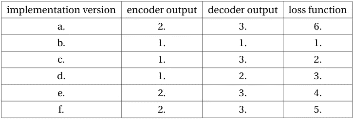****

****不同的 VAE 实现及其模块选项****

****现在让我们深入了解实现的每个版本。****

## ****版本 *a.*****

****这个版本可能是最广泛采用的一个版本——据我所知，我的所有同事都是这样写的:编码器输出节点，这些节点代表潜在变量 *z* 的后验分布的均值和(在ℝ范围内的一些变换)标准差。然后，我们使用重新参数化技巧对 *z* 进行如下采样(来自 VAE 论文的等式 *(10)* ):****

****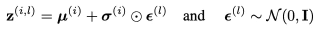****

****从 z 的后验取样的重新参数化技巧****

****其中 ***ϵ*** 从标准多元高斯分布中采样，后验分布 *q* 的均值和标准差从编码器中确定性地输出。获得的 ***z*** 然后被用作解码器的输入。由于预处理后我们的图像数据 ***x*** 是二进制的，很自然地假设一个多变量伯努利分布(其中所有像素彼此独立)，其参数是解码器的输出——这是在 VAE 论文的**附录 C.1 伯努利 MLP 作为解码器**中描述的场景。因此，解码器分布的对数似然具有以下形式(VAE 论文的方程 *(11)* ):****

****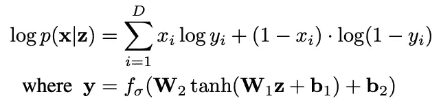****

****以伯努利 MLP 为解码器的图像重建分布的对数似然****

****其中 ***y*** 是解码器输出的每个像素的伯努利参数， *D* 是每个实例的像素数。 ***z*** 这里代表来自编码器的单个样本；由于损失函数中的预期负对数似然项无法解析计算，我们使用如下 MC 近似(来自 VAE 论文的方程 *(10)* ):****

****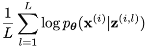****

****z 的 L 个样本下对数似然的 MC 逼近****

****其中 ***z*** 项(与上面的重新参数化技巧等式中的上标形式完全相同)表示第 *i* 个数字图像实例的第 *l* 个 MC 样本。实际上，通常设置 *L=1* 就足够了，即只需要一个 MC 样本。****

****损失函数中的另一项，反向 KL 散度，也可以通过 MC 样本来近似。由于我们假设编码器分布 *q* 为多元高斯分布，我们可以直接将编码器输出的均值和方差代入其密度函数:****

****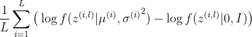****

****反向 KL 散度的 MC 近似****

****其中 *f* 代表多元高斯密度。同样，我们也可以在实践中设置 *L=1* 。****

****此外，如果我们让 *q* 是具有对角协方差矩阵的多元高斯*，则 KL 散度项可以如 VAE 论文的**附录 B** 所示解析计算:*****

****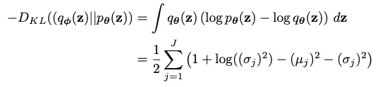****

****负反向 KL 散度的解析解****

****其中 *J* 代表 ***z*** 的维数。****

****在这个版本的实现中，我放了计算小批量图像数据成本的代码(注意， *loss* 函数是在单个实例上计算的；*成本*函数是所有实例的平均损失)到函数`vae_cost`中，并通过函数`train_step`定义每个时期的优化步骤。下面是它们在 TF *2* 中是如何实现的:****

****这里需要解决几个问题:****

*   ****预期重建误差的计算****

****由于伯努利分布的负对数似然性本质上是交叉熵损失的来源(如果你不能马上看到它，[这篇文章](/where-did-the-binary-cross-entropy-loss-function-come-from-ac3de349a715)给出了一个很好的评论)，我们可以使用现有的函数——在这个实现版本中，我选择了`tf.nn.sigmoid_cross_entropy_with_logits`:这个函数将伯努利参数的二进制数据和逻辑作为参数，所以我没有对最后一个解码器层`tfkl.Conv2DTranspose`的输出应用 Sigmoid 激活。****

****注意，该函数保持其输入的原始维度:由于数字图像和解码器输出的每个实例都是形状为`(28,28,1)`，`tf.nn.sigmoid_cross_entropy_with_logit`将输出形状为`(batch_size, 28,28,1)`的张量，每个元素是该特定像素的伯努利分布的负对数似然。由于我们假设每个数字图像实例具有独立的伯努利分布，因此每个实例的负对数似然性是所有像素的负对数似然性之和，因此是上面代码块中的函数`tf.math.reduce_sum(…, axis=[1, 2, 3])`。****

****如果您计划使用 Keras API，这就是需要采取额外预防措施的地方:Keras API 最大的好处之一是它大大简化了训练神经网络的代码，只有三行代码: *(1)* 通过定义网络的输入和输出来构建一个`tfk.Model`对象； *(2)* `compile`通过指定`loss`功能和`optimizer`得到模型； *(3)* 通过调用`fit`方法训练模型，其参数包括输入输出数据、小批量、历元数等。对于步骤 *(2)* ，自变量`loss`取一个正好有两个自变量的函数，并通过取该函数输出的所有 维度 ***的平均值来计算训练期间该批数据的成本，不管它是什么形状。因此，在我们的例子中，你可能很想根据你看过的所有 Keras 教程来编写`loss=tf.nn.sigmoid_cross_entropy_with_logits`,但这是不正确的，因为它对每个实例的所有像素的交叉熵损失取平均值，而不是将它们相加——由此产生的成本将不再拥有任何统计解释。但是不用担心，你仍然可以将`tf.nn.sigmoid_cross_entropy_with_logits`与 Keras API 结合起来——在**c 版本下。**我会详细说明如何做。*******

**还记得在帖子的最开始，我提到了 TensorFlow 自己的教程之一有不正确的 VAE 实现吗？现在是时候仔细看看了:它犯的第一个错误是对预期重建误差的计算。它应用`mse_loss_fn = tfk.losses.MeanSquaredError()`作为损失函数:首先，对我来说，选择均方误差已经是有问题的——不仅它隐含地假设重建分布是具有实值数据的独立高斯分布，而我们预处理后的图像数据是二进制的，这使得独立伯努利分布的假设成为更自然的选择，而且 MSE 计算高斯分布的缩放和偏移的负对数似然，这意味着你将使用贝塔-VAE 损失而没有意识到它；(更)重要的是，`tfk.losses.MeanSquaredError()`没有明确定义自变量`reduction`也会计算所有维度的 MSE *的平均值。同样，我们需要取平均值的唯一维度是实例维度，对于每个实例，我们需要对所有像素取**和**。如果想要应用`tfk.losses`模块，在实施**版本 d 下**，我将演示如何使用`tfk.losses.BinaryCrossentropy`，这是一个更适合我们的情况的选择，用于计算预期的重建误差。***

*   **KL 散度的计算**

**出于与上面类似的原因，需要额外注意:我们需要对数据的每个维度进行操作，特别是取平均值或总和。**

**注意，对于 KL 散度的解析解，我们取所有 *J* 维度上的元素的 *z* 的后验分布的参数之和。然而，在同一个 [TensorFlow 教程](https://www.tensorflow.org/guide/keras/custom_layers_and_models#putting_it_all_together_an_end-to-end_example)中，它的计算方式如下:**

```
kl_loss = -0.5 * tf.reduce_mean(
            z_log_var - tf.square(z_mean) - tf.exp(z_log_var) + 1
        )
```

**这是他们在指南中犯的第二个错误，因为他们在所有维度上取平均值。**

**也可以使用一个 z 样本的 MC 近似来计算 KL 散度——在`analytic_kl=False`时检查代码。如果你想验证你的实现是否正确，你可以用下面的方法来近似 KL 散度，把 *L* 设为某个大整数，比如说 *10，000:***

**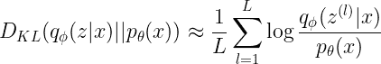**

**其中每个 *z* 被采样通过**

**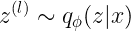**

**看看结果是否和你用解析解得到的结果相似。**

**最后，如果您不想手动计算 KL 散度，您可以使用 TensorFlow 概率库中的函数，该函数直接计算两个分布之间的 KL 散度:**

```
prior_dist = tfd.MultivariateNormalDiag(loc=tf.zeros((batch_size, latent_dim)), scale_diag=tf.ones((batch_size, latent_dim)))
var_post_dist = tfd.MultivariateNormalDiag(loc=mu, scale_diag=sd)
kl_divergence = tfd.kl_divergence(distribution_a=var_post_dist, distribution_b=prior_dist)
```

**既然我们刚刚提到了 TFP，现在是时候进入下一个版本的实现了，这就是关于这个库的。**

## ****版本 b.****

**通过将 TFP 与 TF2 的 Keras API 相结合，代码看起来比**版本 a 中的代码简单得多**这实际上是我最喜欢的版本，并且由于其简单性，将是我将来使用的版本。**

**在这个版本中，编码器和解码器的输出都是来自`tensorflow_probability.distributions`模块的对象，这些对象有许多你期望从概率分布中得到的方法:`mean`、`mode`、`sample`、`prob`、`log_prob`等。为了从编码器和解码器获得这样的输出，你只需要用一个`tensorflow_probability.layers`对象替换它们的输出层。**

**实现如下:**

**就是这样！代码重新格式化后的 62 行代码，包括注释。这种简化的主要原因之一是对 *z* 的采样，因为重新参数化技巧的所有步骤都通过编码器输出 TFP 层`tfpl.IndependentNormal`进行了抽象。此外，KL 散度计算是通过概率编码器输出层中的`activity_regularizer`参数完成的，其中我们指定先验分布为标准多元高斯分布，以及 KL 散度权重 *ω* ，以创建`tfpl.KLDivergenceRegularizer`对象。此外，可以通过简单地调用解码器输出的`log_prob`方法来计算预期的重建误差，该方法是一个`tfp.distributions.Independent`对象——这是它所能得到的最简洁的方法。**

**一个警告是，有人可能认为既然解码器的输入需要是一个张量，但是 *z* 是一个`tfp.distributions.Independent`对象(参见第 *53* 行)，我们需要改为编写`z = encoder(x_input).sample()`来显式采样 *z* 。这样做不仅没有必要，而且不正确:**

*   **不必要，因为我们已经将`convert_to_tensor_fn`设置为`tfd.Distribution.sample`(这实际上是默认值，但我明确地写了出来，以便您可以看到):该参数的作用是，每当该层的输出被视为`tf.Tensor`对象时，就像在我们的情况下，当我们需要来自该分布的样本时——`outputs=decoder(z)`在第 *56* 行，它将调用由`convert_to_tensor_fn`指定的方法，因此它已经在做`outputs=decoder(z.sample())`。**
*   **不正确，因为随着`.sample()`被显式调用，应该由`tfpl.KLDivergenceRegularizer`计算的 KL 散度将不会作为成本的一部分被提取。可能是`.sample()`被调用后，我们在神经网络的计算图中不再有 *z* 作为`tfp.distributions.Independent`对象*，也就是包含`tfpl.KLDivergenceRegularizer`作为其`activity_regularizer`的对象类型。因此，在实现 VAE 的这个版本中对编码器输出进行`.sample()`将会给我们一个仅包含预期重建误差的损失函数——经过训练的 VAE 将不再充当生成模型，而是仅重建其输入的模型。***

**这个版本的实现非常类似于 TensorFlow 的[本教程，它比**版本 a.** 下显示的要好得多——既可以重建现有数字，也可以生成新数字。在这篇文章中，我只想说几件事:](https://medium.com/tensorflow/variational-autoencoders-with-tensorflow-probability-layers-d06c658931b7)**

*   **他们应用`tfpl.MultivariateNormalTriL`而不是`tfpl.IndependentNormal`作为编码器输出概率层，该概率层本质上训练下三角矩阵的非零元素，该下三角矩阵在概念上从正定矩阵的乔莱斯基分解导出。这样的正定矩阵本质上是 *z* 的后验分布的协方差矩阵，可以是任意正定矩阵，而不仅仅是 VAE 论文中假设的对角矩阵。这将给予我们更灵活的后验分布，但也包含更多的参数来训练，并且 KL 散度计算起来更复杂。**
*   **他们在`tfpl.KLDivergenceRegularizer`中将 KL 散度`weight`设置为默认的 *1.0* ，但是就像我在**第一部分**中讨论的那样，这个超参数对于 VAE 实现的成功至关重要，并且通常需要进行显式调整以优化模型性能。**

**最后，对于这个实现版本，我想展示应用 TFP 层作为解码器输出的一个好处:我们能够获得更灵活的预测。对于原始 VAE，解码器输出是确定的，因此在采样 *z* 之后，解码器输出被设置。但是，由于输出是一个分布，我们可以调用`mean`、`mode`或`sample`方法来输出一个`tf.Tensor`对象作为数字图像预测。以下是调用不同方法进行重建和生成时的结果:**

**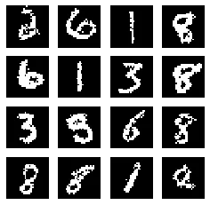**

**用于数字图像重建的解码器分布的一个样本**

**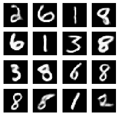**

**数字图像重建中解码器分布的意义**

**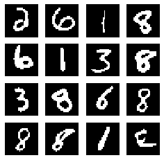**

**数字图像重建的解码器分布模式**

**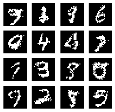**

**用于新数字图像生成的解码器分布的一个样本**

**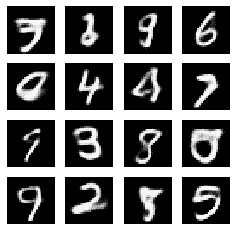**

**用于新数字图像生成的解码器分布的平均值**

****

**用于新数字图像生成的来自解码器分布的模式**

**注意，对于重建和生成，平均值似乎比模式更模糊(或不如模式清晰)，因为伯努利分布的平均值是在 *0* 和 *1* 之间的值，而模式是 *0* (当参数小于 *0.5* 时)或 *1* (否则)；该样本比其他两个样本显示出更多的粒度，同时看起来也很清晰，因为每个像素都是随机样本(与模式不同，模式在训练后基本上知道所有像素作为一个整体将取什么值来形成一个数字)，它也取 *0* 或 *1* 作为其值。这就是概率分布所能提供的灵活性。**

**以下两个版本的实现侧重于在应用 Keras API 简化代码的同时，如何定制损失函数以正确计算期望的重构误差；由于**版本 a.** 中的讨论已经为这两个版本奠定了基础，所以我可以将重点放在演示代码上。**

## **c 版。**

**在**版本 a.** 中，我们讨论了当`compile`对象`tfk.Model`会导致预期重建误差的不正确计算时，如何直接使用`tf.nn.sigmoid_cross_entropy_with_logits`作为`loss`参数；一个快速解决方案是基于`tf.nn.sigmoid_cross_entropy_with_logits`实现一个定制的损失函数，如下所示:**

**其中我们对每个实例取所有像素维度上的交叉熵损失的总和。当编译模型时，我们写道**

```
model.compile(loss=custom_sigmoid_cross_entropy_loss_with_logits, optimizer=tfk.optimizers.Adam(learning_rate))
```

**注意，解码器与**版本 a.** 中的解码器相同，它确定性地输出独立伯努利分布的参数的逻辑值。同时，我们使用`tfpl.IndependentNormal`作为编码器输出层，就像在**版本 b.** 中一样，因此 KL 散度计算由其参数`activity_regularizer`负责。**

**类似地，我们有以下实现版本:**

## **版本 d。**

**我们基于`tfk.losses.BinaryCrossentropy`建立另一个定制损失函数，如下所示:**

**注意，与使用确定性解码器输出层的**版本 c.** 不同，该版本应用了概率层，就像**版本 b.** 中一样；但是，我们需要先取这个分布的平均值(上面代码块的第 *2* 行)，因为`tfk.losses.BinaryCrossentropy`对象的一个参数是伯努利分布的参数，与其平均值相同。还要注意初始化`tfk.losses.BinaryCrossentropy`对象时的参数`reduction`，该参数被设置为`tfk.losses.Reduction.NONE`:这防止程序对与小批量数字图像张量形状相同的结果张量进行进一步操作，该张量的每个元素包含一个特定像素的交叉熵损失。然后，我们对实例级别的维度求和，就像我们在**版本 c.** 中的自定义损失函数中所做的那样**

**值得指出的是，当`compile`模型必须接受两个参数时，我们为`loss`参数定义的任何函数都必须接受两个参数，一个是模型试图预测的数据，另一个是模型输出。因此，每当我们想要应用 Keras API，同时拥有更灵活的损失函数时，我们就会遇到问题。幸运的是，我们在编码器输出 TFP 层中有`activity_regularizer`参数，这有助于将 KL 偏差合并到成本计算中，这给了我们**版本 b .**；但是如果我们没有呢？剩下的两个版本介绍了一种实现更灵活的损失函数的方法，而不仅仅是针对 VAE 的特殊情况——这要归功于`tfkl.Layer`类的`add_loss`方法。**

## **版本 e。**

**我将从直接演示这个版本的代码开始:**

**请注意，当`compile`为`tfk.Model`(行 *70* )时，我使用了与**版本 c.** 完全相同的`loss`功能。通过调用`add_loss`类方法(行 *49* )将加权 KL 散度合并到成本的计算中。以下内容直接引自其[文档](https://www.tensorflow.org/api_docs/python/tf/keras/layers/Layer#add_loss):**

> **这个方法可以用在子类层或模型的`call`函数中，在这种情况下`losses`应该是一个张量或张量列表。**

**除了是“一个张量或一列张量”之外，对格式没有任何要求，我们可以建立一个更加灵活的损失函数。棘手的部分来自这段引文的前半部分，它指定了这个方法应该在哪里被调用:注意，在我的实现中，我在从`tfk.Model`类继承而来的`VAE_MNIST`类的`call`函数中调用了它。这与实现**版本 b.** 不同，后者没有类继承。对于这个版本，我最初也是从编写没有类继承的`VAE_MNIST`类开始，在名为`build_vae_keras_model`的类函数中为`tfk.Model`对象调用`compile`方法，就像我在**版本 b 中所做的一样。`tfk.Model`对象`model`编译后，我直接调用`model.add_loss(self.kl_weight * kl_divergence)`——我的理由是，由于我们模型的输出层，类`tfkl.Conv2DTranspose`的对象，继承自`tfkl.Layer`，我们应该能够进行这样的操作。然而，训练结果是，如果我把 KL 权重调低到大约 *0.01* ，我会得到“更亮”的生成图像；如果我开始增加 KL 的重量，我会得到几乎完全黑暗的图像。总的来说，生成的图像质量很差，而重建的图像看起来很好，但在不同的 KL 权重值下不会有任何变化。只有在我从`tfk.Model`类继承了`VAE_MNIST`，并将调用`add_loss`的类方法的名称改为`call`之后，模型才能正常运行。****

****版本 f.****

**我将这个版本作为最后一个实践版本来实现，想象如果有一天我需要实现一些太复杂而无法使用 Keras API 的模型，这样的框架可能会派上用场。代码如下:**

**我想强调将调用`add_loss`方法的类方法命名为`call`的重要性:注意这个方法最初被命名为`encode_and_decode`(第 *70* 行)——如果我在重命名类方法之前为`train_step`方法添加`@tf.function`装饰器(第 *94* 行)，我会得到**

```
TypeError: An op outside of the function building code is being passed a “Graph” tensor. It is possible to have Graph tensors leak out of the function building context by including a tf.init_scope in your function building code.
```

**在我相应地修改了类方法名之后，错误消失了。拥有`@tf.function`装饰器很重要，因为它显著提高了训练速度:在重命名之前，最后一个历元运行了 *1041* 秒(并且每个历元的时间流逝随着历元的增加而增加；第一个纪元“只”跑了 *139* 秒，这又是一个奇怪的现象)；重命名后，每个历元的运行时间在 *34.7* 秒和 *39.4* 秒之间。**

**此外，在重命名之前，我需要为`add_loss`方法添加`lambda`参数(第 *78* 行)，因为没有`lambda:`我会得到以下错误:**

```
ValueError: Expected a symbolic Tensors or a callable for the loss value. Please wrap your loss computation in a zero argument lambda.
```

**简而言之，当您计划应用`add_loss`方法来实现一个更灵活的损失函数时，一个好的实践是子类化`tfk.Model`类，并在名为`call`的类方法中调用`add_loss`方法。**

# **结论**

**在这篇文章中，我介绍了实现在 MNIST 数据集上训练的 VAE 模型的不同方法，并从实践的角度对 VAE 进行了详细的评述。总的来说，我会推荐一个首次 VAE 实现者从**版本 a.** 开始，然后尝试应用 Keras API 来简化代码，用自定义损失函数来计算期望的重建误差就像**版本 c .****版本 d .**；在对模型有了一个像样的了解后，最好采用**b .**版本，这是最简洁的版本，也是 IMHO 最优雅的版本。如果想为将来实现一个非常灵活的损失函数做准备，版本 e、T29 或版本 f、T31 可能是一个很好的起点。**

# **参考**

**[1] Diederik P. Kingma 和 Max Welling，[自动编码变分贝叶斯](https://arxiv.org/pdf/1312.6114.pdf) ( *2013* )，第 *2* 届国际学习表征会议论文集(ICLR)**

**[2] Charles Blundell，Julien Cornebise，Koray Kavukcuoglu 和金奎大·威斯特拉，[神经网络中的权重不确定性](https://arxiv.org/pdf/1505.05424.pdf) ( *2015* )，第 32 届国际机器学习大会(ICML)会议录**

**[3] [通过子类化](https://www.tensorflow.org/guide/keras/custom_layers_and_models#putting_it_all_together_an_end-to-end_example) ( *2020* )制作新图层&模型，TensorFlow Guide**

**[4] [卷积变分自动编码器](https://www.tensorflow.org/tutorials/generative/cvae) ( *2020* )，TensorFlow 教程**

**[5] Ian Fischer，Alex Alemi，Joshua V. Dillon 和 TFP 团队，[具有张量流概率层的变分自动编码器](https://medium.com/tensorflow/variational-autoencoders-with-tensorflow-probability-layers-d06c658931b7) ( *2019* )，介质上的张量流**