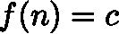
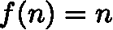
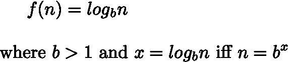
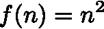
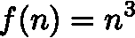
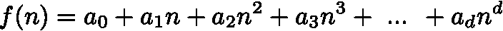
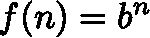

# 6 个用于算法分析的数学函数

> 原文：<https://towardsdatascience.com/6-functions-you-need-for-algorithm-analysis-482a2f69ac0e?source=collection_archive---------24----------------------->

## 理解计算时间复杂度所需的基本函数


unspalsh.com[上](https://unsplash.com/photos/BXOXnQ26B7o)的 [Aron 视觉效果图](https://unsplash.com/@aronvisuals)

设计和实现算法时需要考虑的最重要的因素之一是算法分析期间计算的时间复杂度。

时间复杂度对应于算法在所提供的输入上运行以生成所需输出所需的时间量。在本文中，我们将讨论算法分析中最常用的函数。此外，还提供了一些代码示例，以帮助读者理解这些功能如何与计算机执行的常见操作相关联，作为算法执行的一部分。

# 常值函数

这可能是最简单的函数，对于任何参数 ***n*** *，*常量函数赋值 ***c*** 。



常数函数

当我们需要计算一个算法执行的基本操作的数量时，常量函数是很有用的。一些例子可以是整数加法或减法以及变量赋值或比较。

```
# Examples of basic operationsx = 10
name = 'Andrew'
is_verified = True
```

# 线性函数

另一个在我们的上下文中很重要的简单函数是线性函数，它非常类似于常数函数，但是线性函数不是给函数分配一个常数值，而是简单地分配给它自己的输入。



线性函数

当分析需要在所有 n 个元素上执行的操作时，线性函数非常有用。一个例子是读取未存储在计算机内存中的 n 个元素序列的过程(即，要读取所有元素，我们需要执行 **n** 操作)。

复杂度为 N 的操作示例:

```
my_list = [1, 2, 3, 4, 5]for i in my_list:
    print(i == 2)
```

# 对数函数

对数函数是算法分析中最常用的函数之一。



对数函数

**如何近似对数**

为了计算任何整数的精确对数，我们需要应用微积分。然而，在算法分析的上下文中，我们不一定需要精确的值，因为一个好的近似值就足以满足我们的目的。为了做到这一点，我们通常使用**上限**，即大于或等于对数的最小整数。例如，log16 的 ceil 是 4，因为((((16/2)/2)/2)= 1。同样，log 18 的 ceil 是 5，因为((((((18/2)/2)/2)/2)= 0.5625≤1。

通常，在每次迭代中将问题分成两半的算法对应于时间复杂度的对数级。这样的例子可能是下面显示的流行的二分搜索法算法。

```
def binary_search(numbers, item):
    first_index = 0
    last_index = len(numbers)-1

    while first_index <= last_index:
        mid_index = (first_index + last_index)//2
        if numbers[mid_index] == item:
            return True
        else:
            if item < numbers[mid_index]:
                last_index = mid_index - 1
            else:
                first_index = mid_index + 1

    return False
```

注意:在计算机科学中，我们通常使用以 2 为基数的对数，这是因为计算机的本质是用来存储二进制的。这可能有点令人困惑，因为在数学中“默认”基数是 10，而大多数计算器都假定基数为 10。在算法分析中，当底数被省略时，我们通常用底数等于 2 来解析对数函数。

# 二次函数

另一个在复杂性分析中常见的函数是二次函数，它将输入 ***n*** 的平方指定给自己。



二次函数

在算法分析中，用二次函数来描述**嵌套循环**的复杂度，即执行 n 次的 n 次运算序列。下面提供了一个例子，在给定一个列表的情况下，该算法试图找到并报告重复项。请注意，这绝对不是解决此类问题的最佳方法(就时间复杂性而言)。

```
# Example with n^2 time complexityn = [1, 2, 3, 4, 5]for i in n:
    for j in n:
        if i != j and n[i] == n[j]:
            print(f'{n[i]} is a duplicate')
```

# 立方函数

与二次函数类似的一个函数是三次函数，它给自己分配输入 ***n*** 的立方。



三次函数

三次函数在算法分析中非常罕见，通常表示算法的设计性能很差。

常数、线性、二次和三次函数属于形式为的**多项式函数的更大家族**



多项式函数

其中 **α** 是系数，而 **d** 对应于**多项式的次数。**显然，次数较少的多项式的时间复杂度代表比次数较多的多项式更有效的实现。

# 指数函数

指数函数是衡量算法时间复杂度的另一个有用的函数。



指数函数

该函数由基数 **b** 和指数 **n** 组成，后者被赋予输入值。与对数函数类似，我们假设指数函数的默认基数等于 2。

指数时间复杂度算法的一个非常常见的例子是下面给出的计算斐波那契数的递归函数(即调用自身的函数)

```
def fibonacci(n):
    if n <= 1:
        return n return fibonacci(n-1) + fibonacci(n-2)
```

# 为什么我们需要时间复杂性？

现在让我们说，对于同一个问题，已经实现了许多不同的算法，我们需要决定哪一个更好(至少在时间复杂度方面)。测量每种算法的时间复杂度可以帮助我们决定哪种算法是最有效的，从而在性能方面更好。

下表说明了输入大小和描述算法复杂性的函数对时间复杂性的影响。

```
+---------+-----+-------+---------+-------+-----------+------------+
| input n |  n  | log n | n log n |  n^2  |   n^3     |    2^n     |
+---------+-----+-------+---------+-------+-----------+------------+
| 8       | 8   |   3   |   24    | 64    | 512       | 256        |
| 32      | 32  |   5   |   160   | 1024  | 32768     | 4294967296 |
| 128     | 128 |   7   |   896   | 16384 | 2097152   | 3.4*10^38  |
| 512     | 512 |   9   |   4608  | 262144| 134217728 | 1.34*10^154|
+---------+-----+-------+---------+-------+-----------+------------+
```

现在很清楚，算法的设计应该确保它尽可能高效地完成工作，否则，时间复杂度会迅速增加，从而使实现效率低下，并且在许多情况下不可用。

# 结论

在本文中，我们讨论了在计算算法的时间复杂度时最有用的基本函数。我们引入了许多多项式函数和 Log 函数，并研究了一些与上述每个函数相对应的代码示例。

选择增长率尽可能低的算法很重要。以线性或 n 次登录时间运行的算法被认为是非常高效的，而诸如二次或三次之类的更高多项式阶的算法通常表示具有高增长率的低效算法，即，当它们需要在大型数据集上运行时，它们可能成为噩梦。