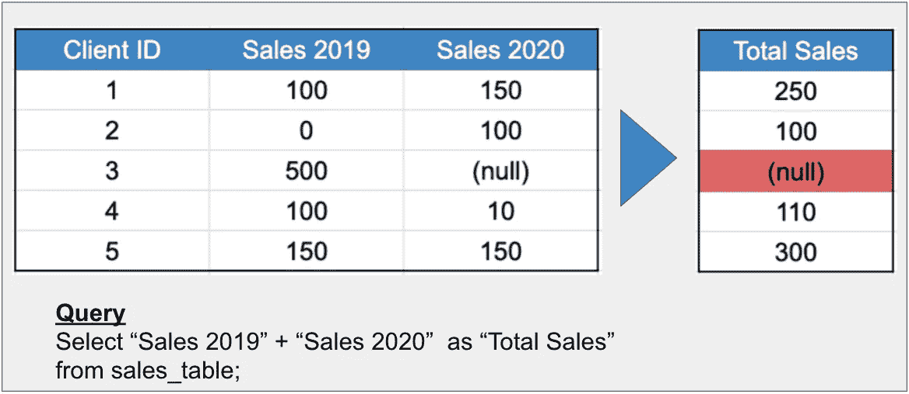
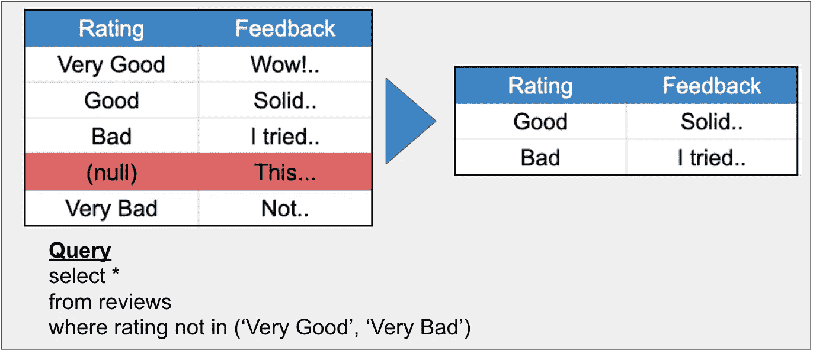
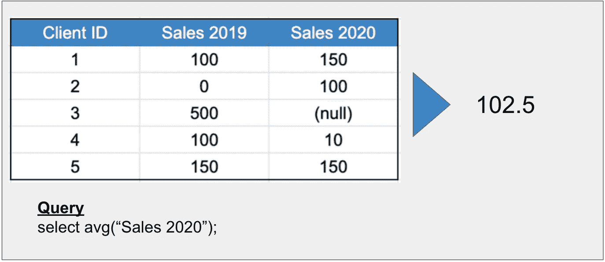
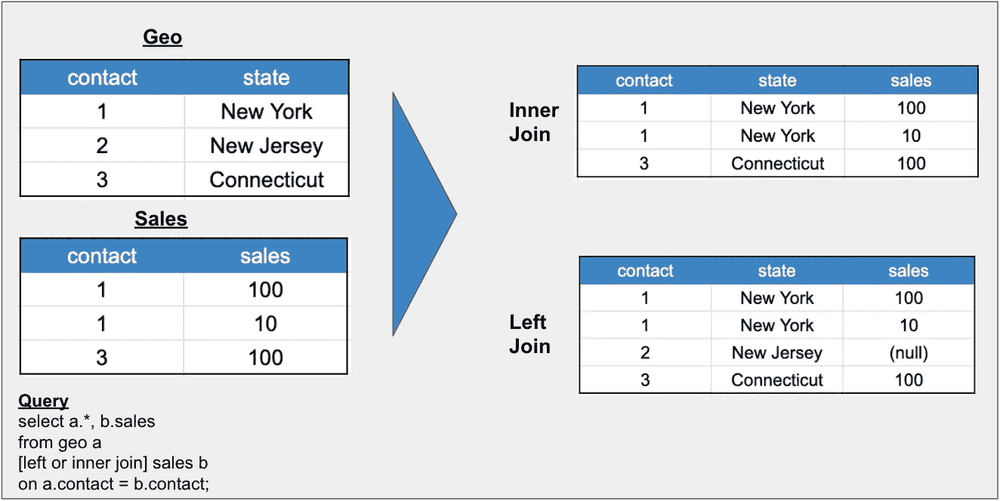
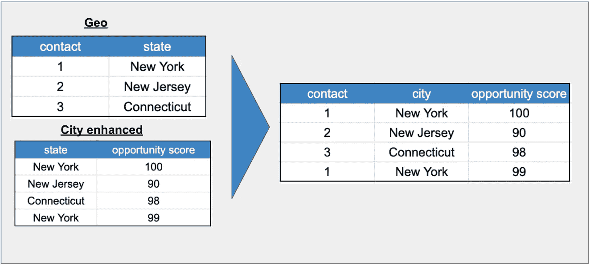
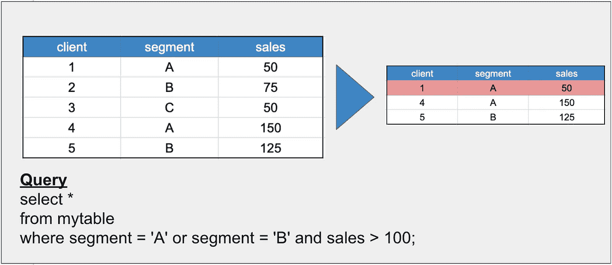
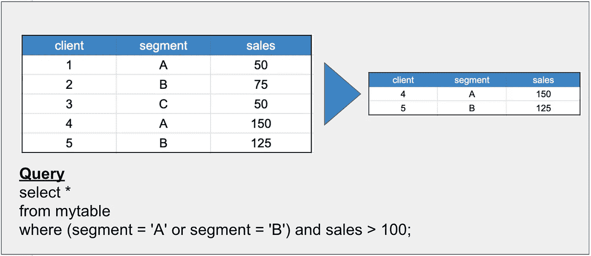
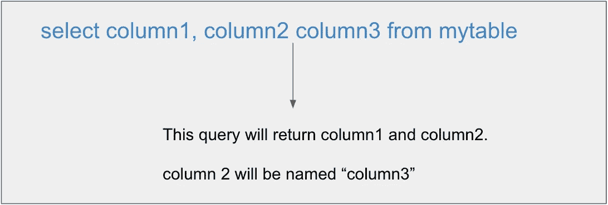

# 要避免的 6 个隐藏的 SQL 错误

> 原文：<https://towardsdatascience.com/6-hidden-sql-mistakes-to-avoid-2e771bed085b?source=collection_archive---------36----------------------->


尤金·希斯蒂科夫在 [Unsplash](https://unsplash.com/s/photos/peek-a-boo?utm_source=unsplash&utm_medium=referral&utm_content=creditCopyText) 上拍摄的照片

## 他们在雷达下飞行，给你带来麻烦

SQL 很棒。它是人类可读和高效的。这很容易掌握。

不幸的是，也很容易犯令人讨厌的 SQL 错误。那些不突出的，不会被你的编辑发现的，会让你头疼的。

在这篇文章中，我将强调一些隐藏的错误，当你浏览数据分析时要注意。

# 1.操作中的空值

SQL 有各种各样的常见和有用的运算符，用于算术(例如，+，-)，比较(例如。>，

Use them, enjoy them, but don’t forget that they won’t do anything with null values. **对空值的操作将返回空值。**

下面是几个例子:

**a .添加列**

假设我们有一个 2019 年销售额的列和一个 2020 年销售额的列。在 2019 年的一行中有一个空值。

当我们把它们加在一起时，我们得到一个空值:



作者图片

这是个坏消息。我们可能知道将空值视为 0，但是 SQL 不知道。

**b .“不在”运算符**

现在，假设我们有一个关于产品的调查结果表。我们只想排除非常差或非常好的评论。

当我们查询评级不在(“非常好”、“非常差”)时，我们得到以下结果:



作者图片

我们可能期望返回空值(毕竟，null 不在我们提供的列表中)，但是 SQL 会将它们排除在结果集中。

***解决方法:*** 每当我们执行操作时，我们都应该确保知道列中的任何空值。如果我们希望它们被视为不同的值，我们可以使用“coalesce”语句轻松实现:

```
coalesce(rating, ‘’) 
```

# 2.聚合中的空值

这是与上一个问题相反的问题。当我们运行聚合函数时，SQL 忽略空值。在许多情况下，这是可取的。

但是如果空值真的是 0 呢？

例如，让我们计算 2020 年的平均销售额:



作者图片

在这种情况下，SQL 排除了空值，并计算出 410 / 4 = 102.5，而不是 410 / 5 = 82。

这很容易被忽略——102.5 听起来是一个真实的、完全合理的值。

***修复:*** 同#1。让我们合并空值，如果它们真的表示 0。

# 3.错误的连接

连接是一个关键的 SQL 功能，它可以帮助我们组合两个表中的数据。

但是当我们使用错误的连接类型时，我们可能会丢失我们需要的数据。

例如，假设我们有一个地理表和一个销售表，我们希望将所有联系人的州和销售额列表发送给我们的营销团队。

左联接为我们提供所有联系人及其销售额，但内联接会删除所有没有任何销售额的联系人:



作者图片

如果我们在这种情况下使用内部连接，我们会丢失可能很重要的数据(也许市场营销想要锁定潜在客户！).

***解决方法:*** 注意我们使用的连接类型。

要了解更多信息，请查看我关于连接数据的介绍文章:

[](/a-beginners-guide-to-joining-data-935c8e579fb7) [## 连接数据的初学者指南

### 左接合。内部联接。外部联接。啊？

towardsdatascience.com](/a-beginners-guide-to-joining-data-935c8e579fb7) 

顺便说一下，如果我们真的执行左连接，我们应该确保将我们的销售列合并为 0，否则，我们可能会遇到上面的问题#1 或#2！

# 4.右表中的重复键

当我们连接数据集并且我们的右表在连接键中有重复项时，我们会得到比开始时更多的记录。

有时候这就是我们想要的。但是其他时候，我们可能会在右边的表中出现令人惊讶的重复数据——这可能是由于数据质量问题(真实世界的数据是混乱的，你没听说过吗？).

例如，假设我们想在一个“增强的”城市表中用更多的信息来丰富我们的联系人/地理表。

如果我们加入 on state，我们会得到重复的联系人:



作者图片

**解决方法:**确保我们知道我们的右连接键列是否不同。一种简单的检查方法是运行计数和非重复计数，并确保它们相同:

```
#these will be equal if there are no duplicates
select count(state), count(distinct state) from mytable;
```

# 5.运算符优先级问题(注意你的 and 和 or！)

当创建复杂的条件语句时，很容易犯操作符优先的错误。

最常见的例子:当我们编写 SQL 查询时，“And”在“Or”之前被处理。

假设我们有一个包含客户销售额和细分市场的表，我们希望返回细分市场 A 或 B 中销售额也必须大于 100 的客户。

如果我们在编写查询时不注意优先级，我们会得到:



作者图片

请注意，即使 client 1 记录的销售额低于 100，它也会被返回。这是因为查询首先解析“and”语句。

当我们在适当的位置添加括号时，我们得到了我们想要的:



作者图片

***解决方法:*** 当我们使用多个操作符时，总是使用括号。它防止错误，使我们的代码更具可读性。

# 6.删除逗号

这可能会因我们使用的数据库管理系统而异。

对于 Postgres，我们在命名列时不需要包含“as”关键字。

这意味着，如果我们从查询中删除一个逗号，SQL 将使用列后面的列名重命名逗号前面的列:



作者图片

这是一个双重打击——我们不仅丢失了我们要寻找的一个列，而且我们的一个列也留下了不正确的名称。

***修复:*** 在运行之前仔细检查我们的 select 语句，确保我们没有遗漏任何逗号。

# 结束语

在这篇文章中，我们介绍了运行 SQL 查询时需要注意的几个场景。当有疑问时，放慢速度，进行测试，并确保你没有成为这些常见错误的受害者总是有帮助的。

***P.S. →如果你想了解更多关于 SQL、Python、数据科学的知识，订阅我的*** [***免费邮件列表***](https://subscribe.to/everythingdata) ***。***