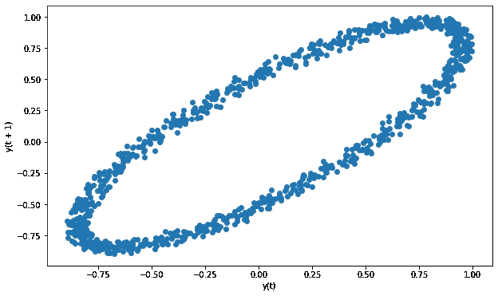
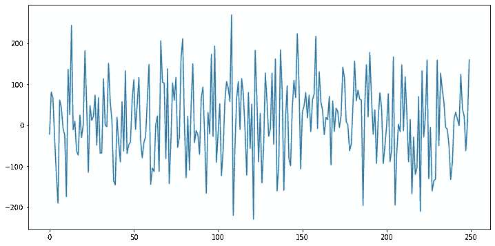

# 6 个鲜为人知的熊猫绘图工具

> 原文：<https://towardsdatascience.com/6-lesser-known-pandas-plotting-tools-fda5adb232ef?source=collection_archive---------25----------------------->

## 使用这些绘图工具加快您的 EDA 进程


艾萨克·史密斯在 [Unsplash](https://unsplash.com/s/photos/graph?utm_source=unsplash&utm_medium=referral&utm_content=creditCopyText) 上拍摄的照片

Pandas 是数据分析和操作的首选 Python 库。它提供了许多加快数据分析过程的功能和方法。

说到数据可视化，pandas 并不是主要的选择，因为已经有了很好的可视化库，比如 matplotlib、seaborn 和 plotly。

话虽如此，我们不能忽视熊猫的绘图工具。它们有助于发现数据帧或序列中的关系，语法非常简单。只用一行代码就可以创建非常丰富的图表。

在本帖中，我们将介绍 pandas 的 6 种绘图工具，它们无疑为探索性数据分析过程增加了价值。

> 创建一个伟大的机器学习模型的第一步是探索和理解数据中的结构和关系。

这 6 个绘图工具将帮助您更好地理解数据:

*   **散点图**
*   **密度图**
*   **安德鲁斯曲线**
*   **平行坐标**
*   **滞后图**
*   **自相关图**

我将使用 kaggle 上可用的[糖尿病数据集](https://www.kaggle.com/uciml/pima-indians-diabetes-database)。让我们首先将数据集读入熊猫数据帧。

```
import pandas as pd
import numpy as npimport matplotlib.pyplot as plt
%matplotlib inlinedf = pd.read_csv("/content/diabetes.csv")
print(df.shape)
df.head()
```


该数据集包含 8 个数字特征和一个指示该人是否患有糖尿病的目标变量。

# **1。散布矩阵图**

散点图通常用于探索两个变量(或特征)之间的相关性。使用笛卡尔坐标显示数据点的值。

散点图矩阵只用一行代码就能生成散点图网格。

```
from pandas.plotting import scatter_matrixsubset = df[['Glucose','BloodPressure','Insulin','Age']]scatter_matrix(subset, figsize=(10,10), diagonal='hist')
```


出于演示目的，我选择了具有 4 个功能的数据框架子集。对角线显示每个变量的直方图，但是我们可以通过将**对角线**参数设置为“ **kde** ”来改变它以显示 kde 图。

# **2。密度图**

我们可以在序列或数据帧上使用 **kde()** 函数生成密度图。

```
subset = df[['Glucose','BloodPressure','BMI']]subset.plot.kde(figsize=(12,6), alpha=1)
```


我们能够用一行代码看到特性的分布。 **Alpha** 参数用于调整线条的暗度。

# **3。安德鲁斯曲线**

安德鲁斯曲线以统计学家大卫·f·安德鲁斯命名，是一种用大量曲线绘制多元数据的工具。使用样本的属性(特征)作为傅立叶级数的系数来创建曲线。

我们通过对属于每一类的曲线进行不同的着色来得到不同类的聚类的概述。

```
from pandas.plotting import andrews_curvesplt.figure(figsize=(12,8))subset = df[['Glucose','BloodPressure','BMI', 'Outcome']]andrews_curves(subset, 'Outcome', colormap='Paired')
```


我们需要传递保存类信息的变量的数据帧和名称。 **Colormap** 参数是可选的。基于子集中的特征，两个类别之间似乎有明显的区别(有一些例外)。

# **4。平行坐标**

平行坐标是绘制多元数据的另一种工具。我们先来创造剧情，再来说说它告诉我们什么。

```
from pandas.plotting import parallel_coordinatescols = ['Glucose','BloodPressure','BMI', 'Age']plt.figure(figsize=(12,8))parallel_coordinates(df,'Outcome',color=['Blue','Gray'],cols=cols)
```

我们首先从熊猫绘图工具中导入**平行坐标**。然后创建要使用的列的列表。然后创建 matplotlib 图形。最后一行创建平行坐标图。我们传递一个数据帧和类变量的名称。**颜色**参数是可选的，用于确定每个类别的颜色。最后，使用 **cols** 参数选择要在绘图中使用的列。如果未指定，则使用所有列。


每列用一条垂直线表示。水平线代表数据点(数据帧中的行)。我们大致了解了如何根据特性来划分类。“葡萄糖”变量似乎是区分这两个类别的良好预测指标。另一方面，不同类别的线在“血压”上重叠，这表明它在分离类别方面表现不佳。

# **5。滞后图**

滞后图用于检查数据集或时间序列的随机性。如果一个结构显示在滞后图上，我们可以断定数据不是随机的。

```
from pandas.plotting import lag_plotplt.figure(figsize=(10,6))lag_plot(df)
```


我们的数据集中没有表明随机性的结构。

让我们看一个非随机数据的例子。我将在熊猫文档页面使用合成样本。

```
spacing = np.linspace(-99 * np.pi, 99 * np.pi, num=1000)data = pd.Series(0.1 * np.random.rand(1000) + 0.9 * np.sin(spacing))plt.figure(figsize=(10,6))lag_plot(data)
```



我们可以清楚地看到滞后图上的结构，所以数据不是随机的。

# **6。自相关图**

自相关图用于检查时间序列的随机性。它们是通过计算不同时间滞后的数据值的自相关而产生的。

滞后就是时差。如果所有时滞的自相关都非常接近于零，那么时间序列就是随机的。

如果我们观察到一个或多个显著的非零自相关，那么我们可以得出结论，时间序列不是随机的。

让我们先创建一个随机时间序列，看看自相关图。

```
noise = pd.Series(np.random.randn(250)*100)noise.plot(figsize=(12,6))
```



这个时间序列显然是随机的。该时间序列的自相关图:

```
from pandas.plotting import autocorrelation_plotplt.figure(figsize=(12,6))autocorrelation_plot(noise)
```


正如所料，所有的自相关值都非常接近于零。

我们来做一个非随机时间序列的例子。下图显示了一个非常简单的上升趋势。

```
upward = pd.Series(np.arange(100))upward.plot(figsize=(10,6))plt.grid()
```


该时间序列的自相关图:

```
plt.figure(figsize=(12,6))autocorrelation_plot(upward)
```


这种自相关清楚地表明一个非随机的时间序列，因为有许多明显的非零值。

直观地检查简单的上升和下降趋势的非随机性是非常容易的。然而，在现实生活的数据集中，我们很可能会看到高度复杂的时间序列。我们可能看不到这些系列的趋势或季节性。在这种情况下，自相关图对于时间序列分析非常有帮助。

熊猫又提供了两个绘图工具，分别是[bootsap plot](https://pandas.pydata.org/pandas-docs/stable/user_guide/visualization.html#bootstrap-plot)和 [RadViz](https://pandas.pydata.org/pandas-docs/stable/user_guide/visualization.html#radviz) 。它们也可以用于探索性的数据分析过程。

感谢您的阅读。如果您有任何反馈，请告诉我。