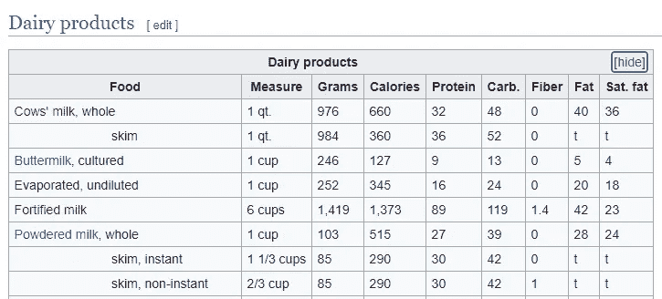
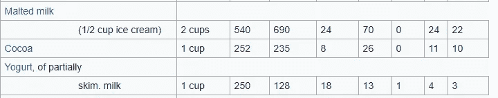
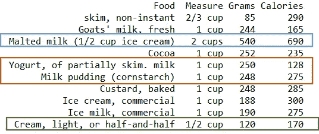
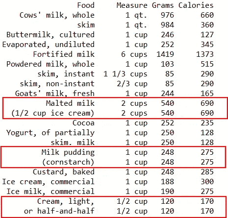
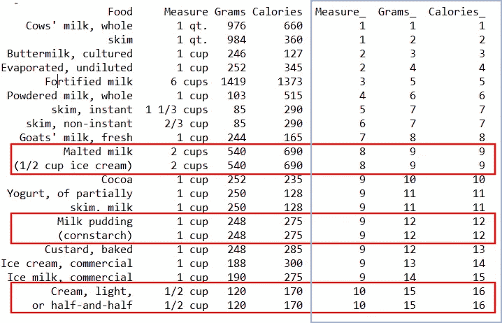
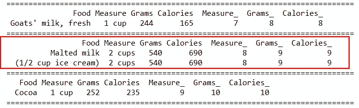

# 熊猫的 6 个鲜为人知却令人敬畏的把戏

> 原文：<https://towardsdatascience.com/6-lesser-nown-yet-awesome-tricks-in-pandas-32236f3785c8?source=collection_archive---------26----------------------->

图片来源: [Unsplash](https://unsplash.com/photos/vpOeXr5wmR4)

## 我希望我能早点知道的技巧，以便从熊猫身上获得更多的价值

作为最流行的用于分析的 Python 库，Pandas 是一个提供各种数据操作和处理能力的大项目。毫不夸张地说，包括我在内的数据科学家在我们的日常工作中都会用到熊猫。

这个博客是我致力于分享熊猫十大鲜为人知但最受欢迎的特征的迷你系列的第一部分。希望您可以带着一些灵感离开，使您自己的代码更加健壮和高效。

这个迷你系列的数据集来自[食物营养成分表](https://en.wikipedia.org/wiki/Table_of_food_nutrients)，这是一个维基百科页面，包含 16 个按食物类型分类的基本食物及其营养成分的列表。在这个演示中，我们将使用**乳制品表**的一个子集，如下所示。

来源:[维基百科](https://en.wikipedia.org/wiki/Table_of_food_nutrients)

**1。用** `**read_html(match)**`从 HTML 中抓取表格

说到 Python 中的 web 抓取，我的首选库曾经是`BeautifulSoup`，直到我发现了熊猫中的`read_html()`。没有解析 HTML 页面的麻烦，我们可以直接提取存储为 HTML 表的数据，

注意到参数。`match = ‘Fortified milk’`在码？它仅用于选择包含指定字符串或正则表达式的表，在我们的例子中，就是 dairy 表。`match` arg。当我们的 HTML 页面变大时将会非常方便。

然而，查看输出显示，我们意识到相当多的行和列被截断了！

**2。自动加载定制的**`**options**`

**和熊猫一起工作一段时间，你可能知道它允许用户在它的[选项系统](https://pandas.pydata.org/pandas-docs/stable/user_guide/options.html)中配置显示相关的选项。例如，设置`pd.options.display.max_rows = 1000`解决了上面的显示问题，这简直让我回到了第一次学习熊猫的时候！**

**然而，我的挫折越积越多，因为我不得不重写相同的配置。选项，每次我开始一个新的 IPython 会话。我不知道这些选项可以编译到 IPython 启动文件中，**

**然后我们只需设置`PYTHONSTARTUP`环境变量指向这个启动文件，所有方便的设置都会在 Python 启动时自动加载。这是启动文件执行后的打印输出，**

****** * *更新 2022:加入我们的 YouTube 社区🎦*** [***【数据说话带吉】***](https://www.youtube.com/channel/UCbGx9Om38Ywlqi0x8RljNdw) ***😄*****

****3。从** `**.iterrows()**` **切换到** `**.itertuples()**`**

**正如我们刚刚看到的，由于“Food”列中的子类别，该数据包含缺失值，**

****

**来源:[维基百科](https://en.wikipedia.org/wiki/Table_of_food_nutrients)**

**直觉上，我们的下一步是通过删除带有 *NA* s 的行或者用所需的值填充它们来删除丢失的值。不管我们决定使用哪一个选项，我们首先需要连接“Food”列，因为它们都包含唯一的信息。众所周知，这可以通过用`.iterrows()`方法循环遍历行来实现。**

**然而，一个更好的循环熊猫的方法是`.itertuples()`，顾名思义，它返回一个元组而不是一个 pd。系列如`.iterrows()`所示。**

**我经常发现`.itertuples()`比`.iterrows()`运行得快，因为前者消除了调用`.iterrows()`方法的一些开销，例如检查数据类型。更多细节可以在这里[找到](http://Since this is beyond the scope of this blog, I will not discuss it here, however, more details regarding how to (create ODBC or JDBC connections) can be found here.)如果你有兴趣的话。**

**现在，让我们探索如何将我们的“食物”价值观与`.itertuples()`联系起来，**

**该语法中的技巧包括(1)初始化两个全局变量以存储当前的“Food”值和行索引，该行索引恰好是“row”元组中的第一个元素；(2)通过分配回新的串联“食物”值来修改原始的 dairy 表。**

**这里显示了我们预想的输出，**

****

****4。用** `**.fillna(method)**`输入缺失值**

**正如我们简要提到的，处理缺失值的另一种方法是用所需的值填充它们，在我们的例子中，这些值是下一个连续行中的值。现在`fillna()`函数派上了用场，**

**只用一行代码，我们丢失的值就被估算出来了，**

****

**这里我们指定参数。`method = ‘bfill’`:反向填充，反向传播第一个非空值。另一个选项是 **'ffill'** :向前填充，在时序数据中特别有用。关于该参数及其多值选项的更多详细信息，请点击链接[。](https://pandas.pydata.org/pandas-docs/stable/reference/api/pandas.DataFrame.fillna.html)**

**事实上，当我第一次学习`.fillna()`时，我非常喜欢它，因为它允许我估算 *NA* s，而无需首先用 *NA* s 对行进行子集化。`method`这个功能很快成为我最喜欢的熊猫功能之一。**

****5。用**和`**cumsum()**`处理布尔值**

**随着 NA 被填充，现在我们采取不同的方法来连接“食物”值怎么样？第一步，让我们创建一些关键变量来指示**哪些行将被合并**，即，两个连续的行在除“食物”之外的变量上具有相同的值，**

**这里有两个技巧:(1)使用`shift(1)`选择前一行，然后与当前行进行比较；(2)调用`cumsum()`对于转换成整数向量的布尔值(即 1 =真，0 =假)如果两行不同时进行“计算”。**

**因为我们比较了数据集中的所有 3 列，所以从`cumsum()`创建了 3 个额外的关键变量(例如，Measure_)。一旦我们将它们与 dairy 表合并，我们将看到下面的输出，对于要合并的行，所有 3 个关键变量保持不变，**

****

****6。用** `**.get_group()**`自省 `**GroupBy**` **对象****

**有了关键变量，我们可以继续使用另一个有利的技巧连接“Food”值:`.groupby() + .apply()`，下面的代码返回与第 3 项相同的输出，**

**类似于 SQL 中的 GROUPBY 操作，Pandas 中的`.groupby()`将我们的数据分成由关键变量定义的组。但是它到底是如何工作的呢？为了自省对象`.DataFrameGroupBy`，我们可以利用较少使用的`.groups`和`.get_group()`，**

**从下面的部分打印输出中，我们可以看到，每个组都是由原始数据集拼接而成的**微小数据帧，当我们调用`apply()`时，相同的操作(例如，在我们的例子中是 join)将迭代通过单个**组**，直到到达末尾。****

****

**因此，显式可视化`GroupBy`对象非常有助于确保我们对正确的子数据集应用操作。**

**你有它！提高熊猫编程水平的 6 个不常用技巧，我希望这个主题对你有所帮助。在这个迷你系列的第二部分，我将分享我最喜欢的熊猫的另外四个特征，所以请密切关注🙂一如既往，所有代码都可以在我的 [Github repo 这里找到](https://github.com/YiLi225/Pandas_Tricks)，快乐学习！**

*****想要更多数据科学和编程技巧？使用*** [***我的链接***](https://yilistats.medium.com/membership) ***注册 Medium，获得我所有内容的全部访问权限。*****

*****还订阅我新创建的 YouTube 频道*** [***【数据与 Kat 会谈】***](https://www.youtube.com/channel/UCbGx9Om38Ywlqi0x8RljNdw)**

# ***更多有趣的数据科学博客:***

*** [## 每个数据科学家都应该知道的 6 个 SQL 技巧

### 提高分析效率的 SQL 技巧

towardsdatascience.com](/6-sql-tricks-every-data-scientist-should-know-f84be499aea5)  [## SQL、R 和 Python 中的数据整形

### 从 Python vs. R 到 Python & R

towardsdatascience.com](/data-reshaping-in-sql-r-and-python-d44ca19e71b8)***