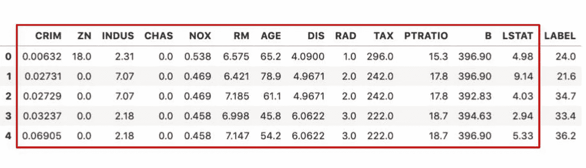
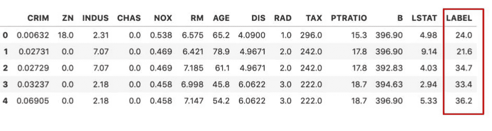

# 面向初学者的 6 个机器学习概念

> 原文：<https://towardsdatascience.com/6-machine-learning-concepts-for-beginners-f3edb9bae17f?source=collection_archive---------23----------------------->

照片由 [Gia Oris](https://unsplash.com/@giabyte?utm_source=unsplash&utm_medium=referral&utm_content=creditCopyText) 在 [Unsplash](https://unsplash.com/s/photos/start-here?utm_source=unsplash&utm_medium=referral&utm_content=creditCopyText) 上拍摄

## 机器学习新手？从这里开始…

机器学习是一种将传统数学与现代强大的计算处理相结合的技术，以学习数据集中固有的模式。在机器学习中，目标是产生一种算法，可以使用这些模式来执行一些指定的任务。

在监督机器学习的情况下，目标可能是开发一个模型，该模型可以识别一组输入属于哪个类别或类，或者预测连续值，例如房屋的价格。

在这篇文章中，我将介绍机器学习中的一些关键概念。如果你是机器学习的新手，这会让你很好地理解这个领域中使用的一些术语和技术。

## 1.特征

在机器学习中，我们上面谈到的输入被称为特征。特征是分配给数据点的一组属性。

下面的示例数据集是一个著名的数据集，通常用于被称为“波士顿房价”的机器学习实践问题。它由一组与房屋相关的特征(下图中以红色突出显示)组成，如年龄、平均房间数、财产税值以及相应的房价。

为了使机器学习模型成功执行其任务，至少需要在这些特征中的一些和房屋价格之间存在统计关系。

波士顿房价数据集-要素高亮显示为红色

## 2.特征选择和工程

开发机器学习模型的一个重要步骤是优化。我们开发的模型需要以最佳状态运行，确保这一点的一种方法是使用最佳功能来训练模型。

包含每个特性并不总是有用的。一些特征可能与我们试图预测的变量没有有意义的统计关系，而另一些特征可能彼此密切相关。这两种情况都会在训练阶段引入噪声，从而降低模型性能。特征选择是选择最佳特征以包括在训练阶段的过程。

类似地，原始形式的特征可能无法提供足够有意义的数据来训练性能模型。此外，有些功能根本不能以原始形式使用，基于日期/时间的功能就是一个很好的例子。机器学习模型不能使用日期或时间戳作为特征，我们需要首先从日期中导出有意义的特征，以便能够包含这些信息。我们可以使用整数形式的部分日期，如月、日或周数，或者计算两个日期之间的差异，以提供算法可以理解的模式。这就是所谓的特征工程。

## 3.标签

受监督的机器学习需要被称为标签数据的东西。这意味着数据中的每组要素都有相应的标签。这些标签可以是类别或类型，如猫或狗，或者是连续值，如波士顿房价数据集中的标签是价格的情况。

在开发机器学习模型时，这些特征通常被称为 **X** ，标签被称为 **y** 。

波士顿房价数据集-标注高亮显示为红色

## **4。培训**

监督机器学习需要带标签的数据，因为算法使用这些示例特征值及其相应的标签来“学习”模式，如果成功，将使模型能够准确预测新的无标签数据上的标签。

在机器学习过程中，这个学习阶段被称为训练阶段。在这个阶段的最后，您有了一个模型，可以用来预测新的未标记数据的标签或值。训练阶段通常被称为拟合模型。

## 5.调谐

在这篇文章的前面，当我描述特性选择的时候，我曾经讨论过一个优化过程。该过程的另一部分称为调整，包括优化算法的参数，以找到特定数据集的最佳组合。

所有机器学习模型都包含具有各种选项的参数。例如，[随机森林](https://en.wikipedia.org/wiki/Random_forest)模型有许多可调参数。一个例子是确定森林中树木数量的 n_estimators。通常情况下，树的数量越多，结果越好，但是在某一点上(这取决于数据集)，随着添加更多的树，改进会减少。为数据集找到最佳的树数是调整随机森林算法参数的一种方法。

每个算法都有许多可调参数，并且每个参数都有潜在的大量选项。幸运的是，有自动的方法找到这些参数的最佳组合，这就是所谓的[超参数优化](https://en.wikipedia.org/wiki/Hyperparameter_optimization)。

## 6.确认

一旦模型建立起来，我们需要确定它执行给定任务的能力。在我们的示例数据中，我们希望了解模型预测房屋价格的准确性。在机器学习中，建立最佳性能指标是很重要的，这将根据我们正在解决的问题而变化。

通常，当开始一个机器学习项目时，我们会首先将我们正在处理的数据集分成两部分。一个用于训练模型，另一个用于测试阶段。

机器学习中的测试通常被称为验证。我们使用该模型对保留的测试数据集进行预测，并测量所选的性能指标，以确定该模型执行给定任务的能力。

本文概述了讨论机器学习时使用的一些最常见的术语和概念。如果你刚刚开始学习，它应该有助于你理解机器学习教程中使用的一些术语。如果你想用 python 创建你的第一个模型，你可以阅读我的教程“如何创建你的第一个机器学习模型”[这里](/how-to-create-your-first-machine-learning-model-4c8f745e4b8c)。

感谢阅读！

[**我每月发一份简讯，如果你想加入请通过这个链接注册。期待成为您学习旅程的一部分！**](https://mailchi.mp/ce8ccd91d6d5/datacademy-signup)