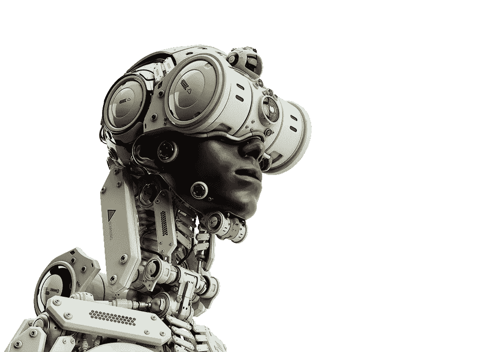
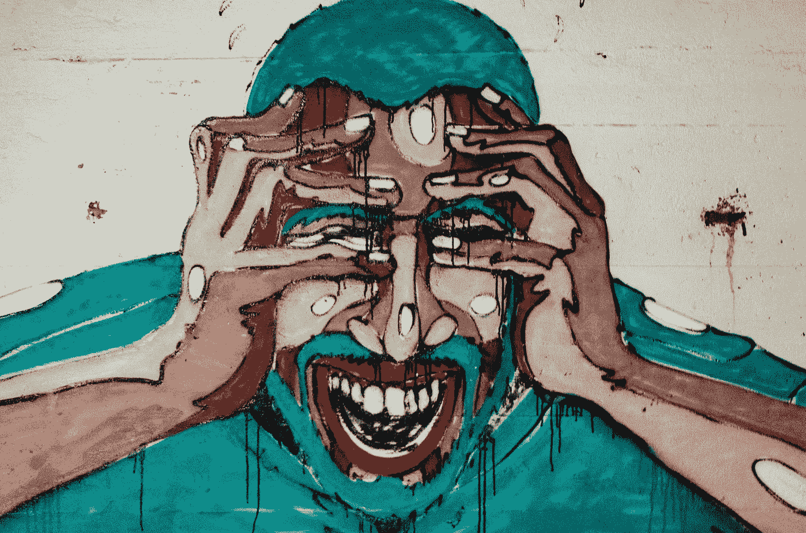
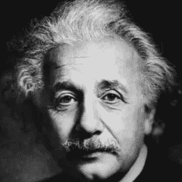
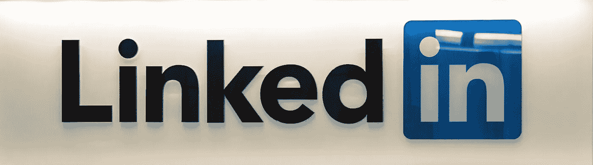
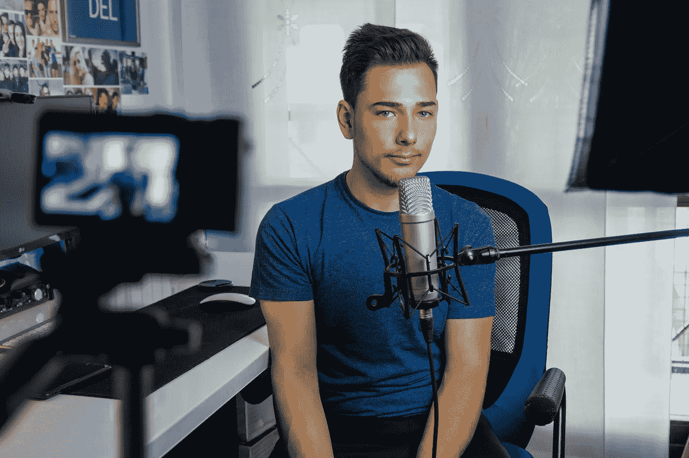
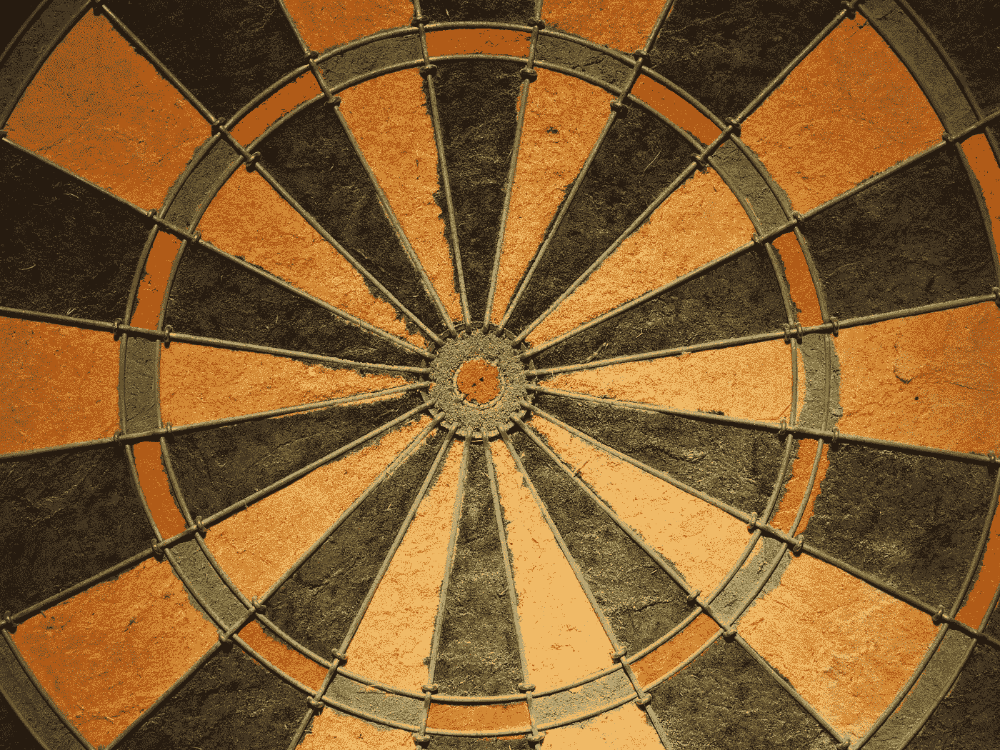

# 6 个月的机器学习/计算机视觉工程师

> 原文：<https://towardsdatascience.com/6-months-as-a-machine-learning-computer-vision-engineer-c05978592368?source=collection_archive---------18----------------------->

Clem Onojeghuo 在 [Unsplash](https://unsplash.com/s/photos/number-six?utm_source=unsplash&utm_medium=referral&utm_content=creditCopyText) 拍摄的照片

## 经验

## 在一个我几年前都没有涉足的领域呆上半年是什么感觉

# 介绍

我不敢相信已经六个月了，我已经写了一篇文章，详细描述了我在目前职位的第一天。

时间过得真快。

再次欢迎来到我作为计算机视觉工程师的在线日志。

在这篇文章中，你可以期待一个在创业公司工作的计算机视觉工程师的日常活动的许多细节。也期待回忆我犯过的一些错误和我庆祝过的成就。

## 对于你来说，这篇文章将介绍当你在一家初创公司中担任机器学习/计算机视觉角色时会有什么期望，以及当前机器学习从业者的典型角色和职责。

我认为这是一个足够好的介绍。

让我们直入主题，用 4000 字或更少的篇幅总结六个月的经历。

# 机器学习/计算机视觉/深度学习

Vladyslav Ociacia 的混血儿。(作者持有图像许可)

让我们从我的角色分解开始，同时附上工作角色描述。

在这一部分，我还将向您展示对计算机视觉工程师的确切期望。

> **机器学习**简单来说就是开发能够从数据中学习和改进的系统。
> 
> **计算机视觉**是机器或系统通过调用一个或多个作用于所提供信息的算法来生成对视觉信息的理解的过程。这种理解被转化为决策、分类、模式观察等等。
> 
> **深度学习**是利用深度卷积神经网络来解决计算机视觉任务，如图像分类、姿态估计、语义分割等。

我的主要职责是研究和实施计算机视觉技术，如姿势估计、语义分割、手势识别和面部特征检测。所有列出的技术都在移动设备上实现。

## 技术

以下是我在过去六个月中使用深度学习解决方案实现的各种计算机视觉技术。

在某些情况下，我包括了我使用过的模型:

*   **姿态估计**:这是对图像或视频中呈现的人体内关键关节位置的估计。我通过利用研究设计的解决方案来实现姿态估计，例如[堆叠沙漏](https://arxiv.org/abs/1603.06937)、[卷积姿态机器(CPM)](https://arxiv.org/abs/1602.00134) 和 [Posenet](https://www.tensorflow.org/lite/models/pose_estimation/overview) 。
*   **手势识别**:对一个人所采取的动作的分类可以称为活动或手势识别。我实现这一技术的过程是通过迁移学习利用 [MobileNetV2](https://arxiv.org/abs/1801.04381) 网络(在 imagenet 上训练),并使用定制的分类头对图像中的手势进行适当的分类。
*   **手部检测/跟踪:**这是一个简单的计算机视觉任务，主要关注图像或视频中手部的检测和定位。
*   **语义分割:**这可以被认为是在像素级别上进行的粒度分类，因为我们正在将图像中的每个像素分类为一个对象。实现这一点很有趣，它涉及到 TensorFlow 的 [DeepLabV3](https://arxiv.org/abs/1706.05587) 分段示例的逆向工程。
*   **人脸检测/跟踪:**这是一个可以跟踪和定位图像或视频中人脸位置的系统的实现。

## 工具

如果你是一个机器学习实践者，你可能知道下面提到的一些工具。对于那些刚刚进入人工智能领域的人来说，列出的工具被数据科学家、ML 研究人员和 ML 工程师等使用。

这些是我日常使用的工具。

*   [***tensor flow***](https://www.tensorflow.org/)*:机器学习模型的实现、训练、部署的开源平台。*
*   [***Keras***](https://keras.io/)*:一个开源库，用于实现运行在 CPU 和 GPU 上的神经网络架构。*
*   [***tensor flow Lite***](https://www.tensorflow.org/lite)*:开源框架，旨在智能手机等边缘设备上部署机器学习模型。*

其他值得注意的工具:

[***Jupyter Lab***](https://jupyter.org/)，[***Anaconda***](https://anaconda.org/anaconda/python)***，***[***CoreML***](https://developer.apple.com/machine-learning/core-ml/)***，*** [***视觉框架***](https://developer.apple.com/documentation/vision) ***，***

> **小贴士:**不要执着于工具、技术和流程。关注你快速学习和适应新环境的能力。

# 软件工程

凯文·Ku 在 [Unsplash](https://unsplash.com/s/photos/coding?utm_source=unsplash&utm_medium=referral&utm_content=creditCopyText) 上拍摄的照片

以前我认为软件工程是一种技能，但是随着我职业生涯的发展，我已经接受了软件工程更像是一种实践的事实。

软件工程不是一项你可以在三个月内获得的技能，而是一种你通过多年的软件应用开发经验而形成的方法。

所以，作为一名机器学习工程师，我每天都在实践软件工程。更具体地说，我将[软件工程原则](https://www.vikingcodeschool.com/software-engineering-basics/basic-principles-of-software-engineering)的各个方面融入到我的开发[工作流程和过程](/10-stages-of-a-machine-learning-project-in-2020-and-where-you-fit-cb73ad4726cb)中。

大多数现代机器学习工程师都精通 3+编程语言。这可能看起来很多，但是用集成的学习系统和 ML 技术构建现代应用程序需要各种平台和工具之间的协同作用——所有这些都利用不同的编程语言来编写可执行指令。

以下是我在过去六个月中使用的主要编程语言:

*   [**Swift**](https://developer.apple.com/swift/) :用于 iOS 应用开发
*   [**Python**](https://www.python.org/) :用于 ML 模型的实现、训练和评估
*   [**JavaScript**](https://developer.mozilla.org/en-US/docs/Web/JavaScript) :用于 ML 模型的实现，也写自定义脚本。

我也有 HTML，CSS，SQL，Kotlin，NodeJS，Flask 等实用知识。所有这些工具和语言都是在三年的通用软件工程中发展起来的。

> **提示:**学习 OOP(面向对象编程)的基本原理。面向对象的知识在广泛使用的编程语言中是可应用和可转移的。
> 
> 如果你理解 OOP，学习编程语言就是熟悉特定于语言的语法。

# 冠状病毒

[engin akyurt](https://unsplash.com/@enginakyurt?utm_source=unsplash&utm_medium=referral&utm_content=creditCopyText) 在 [Unsplash](https://unsplash.com/s/photos/coronavirus?utm_source=unsplash&utm_medium=referral&utm_content=creditCopyText) 上拍摄的照片

没人能预测到 2020 年全球疫情会让世界各国陷入瘫痪。卫生纸在西方国家成为一种商品；肘式问候取代了握手，远程工作现在成为了大多数科技行业的新常态。

当疫情号抵达英国时，我担任目前的角色才一个月，然后我们就进入了封锁状态。

远程工作并没有改变初创公司的目标、团队动力和我完成工作的雄心。作为一名计算机视觉工程师，一个高度科技化的角色意味着我可以在任何有网络连接的地方工作。

有助于远程工作的事情:

*   [**买台灯**](https://www.amazon.co.uk/TaoTronics-Eye-caring-Dimmable-Charging-Brightness/dp/B00VX17VWK) :这是我最近买的，很满意。我读了很多书，深夜的编码/写作会议变得越来越频繁。所以有一个好的人造光光源对阅读时的能见度和整体生产力非常有帮助。
*   [**缩放**](https://zoom.us/) :这可能是 2020 年最受关注的视频会议工具了。Zoom 创造了一个无缝的虚拟延伸，这是它的对手所没有的。我的一天以与同事的 zoom 会议开始，以与朋友的 zoom 会议结束。
*   [**TeamViewer**](https://www.teamviewer.com/en/) :当我不在家时，TeamViewer 让我可以从我的 GPU 机器上访问计算资源。
*   [我遇到的任何问题都只是一个远离解决方案的松弛信息。](https://slack.com/intl/en-gb/)

有人说远程工作将成为员工的永久选择。很明显，公司自己在办公空间上节省了大量资金，并且公司团队提供的生产力或结果也没有明显的缺乏。

> **提示**:在你的家里有一个指定的工作区域。
> 
> 此外，如果你需要改变环境，附近的合作空间或咖啡馆也是一个选择

# 五金器具

当我写我作为计算机视觉工程师的第一个月[时，我包括了分配给我的一个具体任务，那就是购买一个 GPU 工作站。](/my-first-month-as-a-computer-vision-engineer-5813574d394a)

经过艰苦的研究和与美国和英国的 GPU 供应商公司的一些来回，我终于购买了一个。

在过去的五个月里，我连续几天利用 GPU 计算资源来训练定制模型。由于工作站拥有 14 个 CPU 内核，我还执行了并发运行的脚本，没有出现任何问题。

> **提示**:确保你购买了一个带有多个 GPU 插槽的 GPU 工作站，即使你可能只购买了一个真正的 GPU。在可预见的未来，你可能需要扩展你的 GPU 能力，所以最好做好准备。

我对 GPU 的历史以及它们是如何产生的有点兴趣。作为深度学习实践者，你我都知道，随着 AlexNet 的引入和深度卷积神经网络的出现，用 GPU 训练 CNN 变得流行起来。

我可能会写一篇关于 GPU 的历史和其他关于它们的使用和专长的很酷的事实的文章。

# 学习/研究

与 Raj 在 [Unsplash](https://unsplash.com/s/photos/learning?utm_source=unsplash&utm_medium=referral&utm_content=creditCopyText) 上的[公路旅行照片](https://unsplash.com/@roadtripwithraj?utm_source=unsplash&utm_medium=referral&utm_content=creditCopyText)

在与 ML 相关的职业生涯中学习永远不会结束。人工智能领域本身正在以一种速度前进，总是有新的发展需要了解( [*目前是 GPT-3*](https://openai.com/blog/openai-api/) 的发布)或新的技术需要实现。

回想过去的六个月，我真的感觉自己又回到了大学时代。完成“朝九晚五”的工作后，我回到家里阅读研究论文、写论文和实现 ML 模型。

对于那些希望进入人工智能职业的人来说，你必须意识到有一个不言而喻的期望，在那里你应该被告知最新的人工智能发展。大多数人期望你比一般人更了解新的人工智能应用程序发布。

目前，我正在获取尽可能多的实践和理论知识，然后才能着手实施我的神经网络体系结构或修改 DCNNs 的子组件。

无论我要实施什么样的简历技巧，我都不是 100%了解。在我考虑任何形式的实现之前，通常会有一个广泛的研究阶段。对于我正在研究或实施的每项新技术，大约 70%的内容对我来说都是新的。

学习从未停止。

> 提示:不要害怕后退一步，以确保你正在建立一个坚实的学习基础。最近，与深入阅读最新的神经网络架构相反，我回到了深度学习早期发表的研究论文。
> 
> 我这样做是为了深入了解这个领域本身的发展。我在这里、[这里](/understanding-and-implementing-lenet-5-cnn-architecture-deep-learning-a2d531ebc342)和[这里](/understanding-parameter-sharing-or-weights-replication-within-convolutional-neural-networks-cc26db7b645a)记录了我的一些发现。

# 害怕

aaron Blanco Tejedor 在 [Unsplash](https://unsplash.com/s/photos/fear?utm_source=unsplash&utm_medium=referral&utm_content=creditCopyText) 上拍摄的照片

如果我告诉你在过去的六个月里我没有质疑过自己的能力，那我就是在撒谎。

这是我第一个与 ML 相关的角色，更可怕的是，我是公司第一个机器学习雇员。

你听说过冒名顶替综合症吗？

这是一种无能和不足的感觉，即使你做得很好。它是自我怀疑、缺乏自信和虚假的智力欺诈的混合物，从你的成功和成就中偷走。

在过去的六个月里，我发现自己问了以下问题:

我走得够快吗？我够好吗？我够聪明吗？我知道的足够多吗？够好吗？如果我失败了呢？如果我错了呢？

这是关于冒名顶替综合症的事情；它可以是一件消极或积极的事情，这完全取决于你采取的行动和你选择如何解决你的自我怀疑。

我用我的冒名顶替综合征的感觉来确保我在我的游戏中处于领先地位，我不会被它削弱，也不会被它削弱。

冒名顶替综合症比你想象的更普遍；即使是最伟大的人也深受其害。

阿尔伯特·爱因斯坦，图片来自[biography.com](https://www.biography.com/scientist/albert-einstein)

> “我一生的工作被过分推崇，这让我很不自在。我觉得把自己想象成一个无意识的骗子是完整的。”——阿尔伯特·爱因斯坦

> **提示:**你够了！

# ML 社区

安妮·斯普拉特在 [Unsplash](https://unsplash.com/s/photos/group-of-people?utm_source=unsplash&utm_medium=referral&utm_content=creditCopyText) 上拍摄的照片

我在工作之外所做的和我在工作中所做的一样重要。

在过去的六个月里，我意外地开始在 AI 社区内建立个人品牌。通过几个不同的在线平台，我每天可以接触到成百上千的人。

我认为你可以，也应该这样做。

下面是我用来在 ML 社区中建立存在的平台的总结。

## 中等

图片来自[媒体设计](https://medium.design/logos-and-brand-guidelines-f1a01a733592)

在我的学术研究和现在的职业生涯中，Medium 上与人工智能相关的内容一直是一个很好的信息来源。

我看过文章，简化复杂的神经网络架构的研究论文；和文章，就如何在人工智能行业内进行工作选择或薪资谈判提供了有用的建议。

2019 年夏天，我决定不仅要成为 Medium 上内容的消费者，还要成为创作者。我不知道该期待什么，但我心中有一个目标。

我的目标是将媒体作为一种工具来强化我通过学习和项目获得的知识和信息。对我来说，媒介是一种知识保留的形式。

现在，媒体对我来说是一个平台，使我能够每天接触到成千上万的人。我已经写了 70 多篇人工智能和人工智能相关的文章，我可以看到很多人受到了我的写作的启发，并且正在学习和学习一个可行的项目。

由于某种原因，我(*)被认为是人工智能、技术和教育领域的顶尖作家之一。事实上，这是一项荣誉，我希望尽可能长久地保持下去。*

> ***提示**:在你的学习过程中融入媒体。就你目前正在学习的概念和想法写文章。这有助于知识的保留，还有提供在线作品集的额外好处。*

## *商务化人际关系网*

**

*照片由[格雷格·布拉](https://unsplash.com/@gregbulla?utm_source=unsplash&utm_medium=referral&utm_content=creditCopyText)在 [Unsplash](https://unsplash.com/s/photos/linkedin?utm_source=unsplash&utm_medium=referral&utm_content=creditCopyText) 上拍摄*

*我不记得我第一次创建 LinkedIn 账户是什么时候，但我可以说的是，与其他任何年份相比，我在 2020 年使用 LinkedIn 的次数都要多。*

*相当多的人阅读我的作品，一些读者对我文章的内容有疑问。LinkedIn 是联系我的传统方式之一。*

*我非常乐意回答任何问题，并就我技术专长范围内的话题给出任何建议。迄今为止，我已经回答了大约 50 多个通过 LinkedIn 联系我的人提出的问题。我还抽出一些时间与个人进行视频电话会议。我收到的一些问题需要更详细的答案。*

*我被问到的大多数问题都围绕着学习机器学习的最佳方法，或者走哪条职业道路。虽然我不是专家，但我很乐意分享我通过学习、研究和经历获得的一点点经验。*

*如果你想给我发信息或者讨论与 ML 有关的事情，我可以在这里找到。*

## *咨询公司*

*在过去的六个月里，我和一些寻求项目建议的人坐在一起，在一些情况下，我的时间和专业知识得到了回报。现在，我得到的报酬不会改变我的生活，我也不会很快成为一名全职顾问。但事实上，个人只看重我的专业技能，这对我来说仍然是疯狂的。*

*除了咨询工作之外，我最近还受邀成为一本计算机视觉书籍的技术作者，这本书将在未来发行。再说一次，这个机会似乎好得不像是真的，但是今天我在这里，这本书还没发行几章。*

*除了我的学习和职业生涯，我无法预测我可能会遇到什么机会。每个月都不一样。*

## *油管（国外视频网站）*

**

*由 [Gianandrea Villa](https://unsplash.com/@gianviphotos?utm_source=unsplash&utm_medium=referral&utm_content=creditCopyText) 在 [Unsplash](https://unsplash.com/s/photos/youtube?utm_source=unsplash&utm_medium=referral&utm_content=creditCopyText) 上拍摄的照片*

*我很欣赏 AI/ML YouTube 频道，那里的主持人教授机器学习相关主题，或者解释和实现研究论文中提出的技术。*

*当然，我是亚历克斯·弗里德曼的[播客](https://lexfridman.com/ai/)和 [YouTube 频道](https://www.youtube.com/user/lexfridman)的粉丝。*

*在 YouTube 上，我是一个消费者，我关注 ML 相关频道如[两分钟论文](https://www.youtube.com/channel/UCbfYPyITQ-7l4upoX8nvctg)、[丹尼尔·伯克](https://www.youtube.com/channel/UCr8O8l5cCX85Oem1d18EezQ)、[森德克](https://www.youtube.com/user/sentdex)、[深蜥蜴](https://www.youtube.com/channel/UC4UJ26WkceqONNF5S26OiVw)、 [3Blue1Brown](https://www.youtube.com/channel/UCYO_jab_esuFRV4b17AJtAw) 、[扬尼克·基尔彻](https://www.youtube.com/channel/UCZHmQk67mSJgfCCTn7xBfew)、[阿布舍克·塔库尔](https://www.youtube.com/channel/UCBPRJjIWfyNG4X-CRbnv78A)等。*

*我已经决定开始在 YouTube 平台上构建。很快，我将发布我认为对那些开始学习机器/深度学习的人有用的内容。*

*随意订阅我的频道[这里](https://www.youtube.com/channel/UCNNYpuGCrihz_YsEpZjo8TA?view_as=subscriber) ( *不要脸塞*)。*

> ***提示**:不要害怕拓展你的触角。让世界知道你的存在。*

# *我犯过的错误*

**

*来自[iemoji.com](https://www.iemoji.com/view/emoji/108/smileys-people/eyes)的眼睛表情符号*

*在过去的六个月里，我犯了数不清的错误。*

*下面是几个“不太”尴尬的错误。*

*   *没有推进我的 git 回购，失去了两个星期的工作。*
*   *对我的工作没有耐心，这导致了很多错误和错误。*
*   *在我真正需要帮助的时候没有寻求帮助。*
*   *将水洒满了团队放有电子设备的桌子。*
*   *在周五投入生产。然后花了一个周末修复漏洞。*
*   *我在网上开会迟到了，尽管我在家工作(*这个错误需要一定的技巧 lol* )。*

*每个人都会犯错；错误不可避免。重要的是你从你犯的错误中学习，记住你的错误并不能定义你。*

*我确信在接下来的六个月里我会犯更多的错误。*

# *年度愿景*

**

*由 [Unsplash](https://unsplash.com/s/photos/target?utm_source=unsplash&utm_medium=referral&utm_content=creditCopyText) 上的 [Pablò](https://unsplash.com/@armoredsaint?utm_source=unsplash&utm_medium=referral&utm_content=creditCopyText) 拍摄*

*简单来说，就是六个月。*

*作为六个月的总结，在今年剩下的时间里，我将与你分享我为自己设定的目标。*

*这些目标主要是让我在职业生涯、个人和学术发展上保持正轨。一些列出的目标是模糊的，我很可能会在以后完善它们。*

*   *在年底前阅读 10 篇研究论文*
*   *在线发布两个基于人工智能的应用*
*   *在边缘设备上实施更多计算机视觉技术*
*   *在 ML 社区中建立更强大的存在*
*   *建立稳固的个人品牌*
*   *获得人人都在谈论的[张量流证书](https://www.tensorflow.org/certificate)*

> ***提示** : [关注我](https://medium.com/@richmond.alake)了解更多 AI/ML 相关内容*

* [## AI 里有黑人吗？

### 我们仍然是人工智能中代表最少的种族之一，然而我们可能会因为它的利用和滥用而遭受最大的痛苦。

towardsdatascience.com](/are-there-black-people-in-ai-fb6928166d73)  [## 根据吴恩达的观点，如何在机器学习的职业生涯中导航

### 了解如何在机器学习领域取得成功

towardsdatascience.com](/how-to-navigate-a-career-in-machine-learning-according-to-andrew-ng-stanford-lectures-9e10f09047f0)*