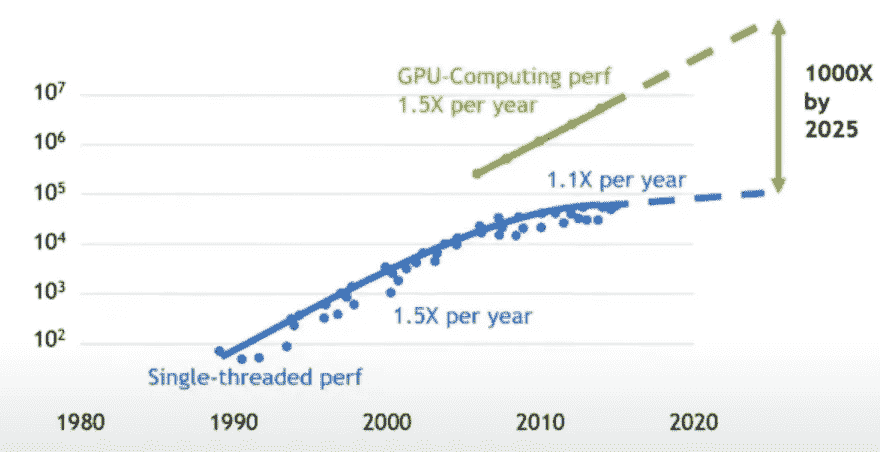

# 作为一名数据科学家，我在 6 个月里学到了什么

> 原文：<https://towardsdatascience.com/6-months-data-science-e875e69aab0a?source=collection_archive---------15----------------------->

## 我从训练营开始，然后找到了我梦想中的机器学习工作。以下是一些关键要点。

[arXiv](#a30f) | [播客](#3022) | [GitHub 问题](#93ab) | [算法&硬件](#4934) | [社会科学](#9703) | [商业成果](#9071) |图片由 [Artem Beliaikin](https://unsplash.com/photos/8AsKha7aIvk) 在 [Unsplash](https://unsplash.com/photos/8AsKha7aIvk)

自从六个月前我的头衔从顾问变成了数据科学家，我体验到了比我想象的更高的工作满意度。为了庆祝我在这个引人入胜的领域的第一个半年，这里是我一路上收集的六个教训。

## #1 —阅读 arXiv 白皮书

您可能已经意识到，回顾 arXiv 是一个好主意。这是非凡想法和最先进进步的源泉。

不过，我在平台上遇到的大量可操作的建议让我感到惊喜。例如，我可能无法获得 [16 个 TPU 和 7k 美元来从头开始训练 BERT](https://syncedreview.com/2019/06/27/the-staggering-cost-of-training-sota-ai-models/)，但是 Google Brain 团队推荐的超参数设置是开始微调的好地方([查看附录 A.3](https://arxiv.org/abs/1810.04805) )。

希望您最喜欢的新包能够在 arXiv 上有启发性的阅读，为它的文档增添色彩。例如，我学会了在 ktrain 上使用非常可读和非常有用的[文章来部署 BERT，ktrain【】是一个位于 Keras 之上的库，为文本、图像和图形应用程序提供了一个简化的机器学习接口。](https://arxiv.org/abs/2004.10703)

## # 2——听播客，获得巨大的情境意识

播客不会提高你的编码技能，但会提高你对机器学习的最新发展、流行的包和工具、该领域未回答的问题、解决老问题的新方法、整个行业普遍存在的潜在心理不安全感等的理解。

我每天收听的播客让我感受到了数据科学领域日新月异的发展。

以下是我现在最喜欢的播客

 [## 2020 年增强数据科学学习的资源

### 通过这个有用的期刊、视频和讲座的集合，推进你对机器学习的理解。

towardsdatascience.com](/supercharge-data-science-5bb7376d8572) 

*最近我特别兴奋地了解到***的进展，跟踪了* [*在 GPU*](https://soundcloud.com/theaipodcast/ai-jonah-alben)*和* [*云计算*](https://www.thecloudcast.net/2020/07/2020-in-review-midyear-edition.html) *，并对人工神经网络和神经生物学的进展之间的* [*潜在共生*](https://braininspired.co/podcast/79/) *提出了质疑。**

## *#3 —阅读 GitHub 问题*

*根据我在巨大的智慧金枪鱼投诉海洋中的经验，这里有三个潜在的胜利:*

1.  *我经常从其他人使用和/或误用包的方式中获得灵感*
2.  *了解在什么样的情况下一个包会破裂也是很有用的，这样可以培养你对自己工作中潜在故障点的意识*
3.  *由于您正处于设置环境和进行[模型选择](https://medium.com/atlas-research/model-selection-d190fb8bbdda)的前期工作阶段，在将开源工具添加到您的管道之前，您最好考虑一下开发人员和社区的反应*

## *#4 —理解算法与硬件的联系*

**最近半年做了很多 NLP，再来说说 BERT。**

*2018 年 10 月，[伯特](https://arxiv.org/abs/1810.04805)崭露头角，震撼世界。有点像超人一跃跃上高楼后(*最初推出时疯狂认为超人不会飞！*)*

*BERT 代表了机器学习处理文本处理任务能力的一个阶跃变化。它最先进的成果是基于在谷歌的 TPU 计算机芯片上运行的[变压器架构](http://jalammar.github.io/illustrated-transformer/)的并行性。*

*第一次在 GPU 上训练的感觉。通过 [GIPHY](https://giphy.com/gifs/superman-vintage-cartoon-10bKPDUM5H7m7u/links)*

*理解 TPU 和[基于 GPU 的机器学习](https://www.youtube.com/watch?v=6eBpjEdgSm0)的含义对于提升你作为数据科学家的能力非常重要。这也是加深你对[机器学习软件](https://medium.com/@karpathy/software-2-0-a64152b37c35)和运行它的硬件的物理约束之间不可分割的联系的直觉的关键一步。*

*随着摩尔定律在 2010 年左右逐渐消失，将需要越来越多的创新方法来克服数据科学领域的限制，并继续朝着真正智能的系统前进。*

**

*来自 [Nvidia 展示的图表](https://youtu.be/EBCtwWbbamw)显示了每年每平方毫米的晶体管数量。这凸显了 2010 年左右晶体管数量的停滞和基于 GPU 的计算的崛起。*

**我看好* [*ML 模型的兴起——计算硬件协同设计*](https://twimlai.com/twiml-talk-391-the-case-for-hardware-ml-model-co-designwith-diana-marculescu/) *，对* [*稀疏性的依赖增加和修剪*](https://arxiv.org/abs/2002.00585) *，甚至* [*“非专用硬件”机器学习*](https://www.youtube.com/watch?v=zmbCZhlN1xk) *，看起来要颠覆当前以 GPU 为中心的范式的统治地位。**

## *#5 —从社会科学中学习*

**我们年轻的领域可以从 2010 年代中期发生的社会科学可复制性危机中学到很多东西(在某种程度上，这种危机仍在发生)**

**

*数据科学家的“p 值黑客”。xkcd 的兰德尔·门罗的漫画*

*2011 年，一项[学术众包合作](https://osf.io/ezcuj/wiki/home/)旨在复制 100 项已发表的实验和相关心理学研究。但它失败了——只有 36%的复制报告了有统计学意义的结果，相比之下，97%的原件报告了有统计学意义的结果。*

*心理学的再现性危机揭示了将“科学”与不可靠的方法联系在一起的危险和责任。*

*数据科学需要可测试、可复制的方法来解决问题。为了消除 p-hacking，数据科学家需要限制他们如何调查数据的预测特征，以及他们为评估指标而运行的测试的数量。*

*有许多工具可以帮助实验管理。我有处理 [ML 流程](https://mlflow.org/)—[Ian Xiao](https://medium.com/u/a0eb4622a0ca?source=post_page-----e875e69aab0a--------------------------------)的这篇优秀文章提到了另外六个领域，以及机器学习工作流的其他四个领域的建议。*

**我们还可以从近年来数据科学领域的大量失误和算法弊端中吸取许多教训:**

*例如，利益相关方只需看看加深现状的社会工程推荐引擎、歧视性信用算法和刑事司法系统。我已经写了一些关于这些社会弊病以及如何用有效的以人为中心的设计来避免它们。*

*好消息是，有许多聪明且积极的从业者正在努力应对这些挑战，并防止未来违背公众信任。查看[谷歌的一对](https://ai.google/responsibilities/responsible-ai-practices/)、[哥伦比亚的 FairTest](https://github.com/columbia/fairtest) 和 [IBM 的 explability 360](https://www.ibm.com/blogs/research/2019/08/ai-explainability-360/)。与社会科学家研究人员的合作可以产生丰硕的成果，比如这个关于审计歧视的算法的项目。*

*当然，我们还可以从社会科学中学到很多其他的东西，比如如何进行有效的演讲*

*研究社会科学以理解人类关于数据推断的直觉可能会失败是至关重要的。人类非常擅长在特定情况下从数据中得出结论。我们推理的方式是高度系统化和可预测的。*

*我们对人类心理这一方面的许多理解都在丹尼尔·卡内曼的优秀作品《T21 思考的快慢》中得到了体现。这本书应该是任何对决策科学感兴趣的人必读的。*

*卡尼曼研究中可能与你的工作直接相关的一个元素是他对锚定效应的处理，这种效应“发生在人们考虑未知量的特定值时。”*

*传达建模结果时(即代表准确度、精确度、召回率、f-1 等的数字)。)，数据科学家需要特别注意管理预期。在“我们仍在解决这个问题，这些指标可能会改变”到“这是最终产品，这是关于我们期望我们的 ML 解决方案如何在野外执行”的尺度上提供一定程度的手动波动可能是有用的*

*如果你展示的是中间结果，Kahneman 建议为每个指标提供一个数值范围，而不是具体的数字。例如，“f-1 分数代表了本表中其他指标(精确度和召回率)的调和平均值，大约在 80–85%之间。这表明还有改进的余地。”这种“手动波动”的沟通策略降低了听众将*锚定*在你分享的特定价值上的风险，而不是获得关于结果的方向正确的信息。*

## *#6 —将数据与业务成果联系起来*

*在你开始工作之前，确保你正在解决的问题值得去解决。*

**你的组织并没有付钱给你去建立一个 90%准确的模型，给他们写一份报告，在 Jupyter 笔记本上闲逛，或者甚至在* [*图形数据库*](/you-should-really-learn-about-graph-databases-heres-why-d03c9d706a3) *上启发你自己和其他人。**

*您的职责是将数据与业务成果联系起来。*

*我希望这些建议至少对你有所帮助——在评论中留言，让我知道你是如何使用它们的。当然，如果你喜欢这篇文章，请在 [Medium](https://medium.com/@nicolejaneway) 、 [LinkedIn](http://www.linkedin.com/in/nicole-janeway-bills) 和 [Twitter](https://twitter.com/Nicole_Janeway) 上关注我。*

****免责声明*** *:我正在为书籍推荐添加附属链接。通过这个链接在亚马逊上购买有助于支持我的数据科学写作——提前感谢。**

## *为您的数据科学之旅撰写更多文章*

* [## 图论、中心性测量和网络简介

### 图论是对图形的研究，图形是用来模拟对象之间成对关系的数学结构…

towardsdatascience.com](/an-intro-to-graph-theory-centrality-measurements-and-networkx-1c2e580adf37)  [## 你从未听说过的最好的数据科学认证

### 数据策略最有价值培训实用指南。

towardsdatascience.com](/best-data-science-certification-4f221ac3dbe3)  [## 像我五岁一样解释计算机科学

### 了解互联网，编程，机器学习和其他计算机科学的基础知识，通过清晰和…

medium.com](https://medium.com/coderbyte/eli5-computer-science-f8dfd7910311)  [## 型号选择综合指南

### 选择正确算法的系统方法。

medium.com](https://medium.com/atlas-research/model-selection-d190fb8bbdda)  [## 面向临床文本的命名实体识别

### 使用 pandas 将 2011 i2b2 数据集重新格式化为用于自然语言处理(NLP)的 CoNLL 格式

medium.com](https://medium.com/atlas-research/ner-for-clinical-text-7c73caddd180)*