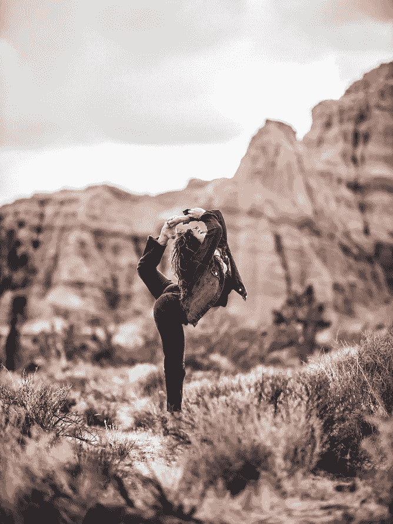

# 鲁棒目标检测的 6 个障碍

> 原文：<https://towardsdatascience.com/6-obstacles-to-robust-object-detection-6802140302ef?source=collection_archive---------15----------------------->

## 您的探测器有多耐用？

> 你的物体探测器能探测到下图中的人和马吗？

[保罗·强伯斯](https://unsplash.com/@ummmmpaul?utm_source=unsplash&utm_medium=referral&utm_content=creditCopyText)在 [Unsplash](https://unsplash.com/?utm_source=unsplash&utm_medium=referral&utm_content=creditCopyText) 上拍照

> 同样的图像旋转 90 度会怎么样？它能探测到人和马吗？

[保罗·强伯斯](https://unsplash.com/@ummmmpaul?utm_source=unsplash&utm_medium=referral&utm_content=creditCopyText)在 [Unsplash](https://unsplash.com/?utm_source=unsplash&utm_medium=referral&utm_content=creditCopyText) 上拍照

> 或者这些图像中的猫？

最左侧(照片由[埃里克-扬·勒辛克](https://unsplash.com/@ejleusink?utm_source=unsplash&utm_medium=referral&utm_content=creditCopyText)在 [Unsplash](https://unsplash.com/?utm_source=unsplash&utm_medium=referral&utm_content=creditCopyText) 上拍摄)、中间(照片由[克里斯塔·曼古松](https://unsplash.com/@krista?utm_source=unsplash&utm_medium=referral&utm_content=creditCopyText)在 [Unsplash](https://unsplash.com/?utm_source=unsplash&utm_medium=referral&utm_content=creditCopyText) 上拍摄)、最右侧(照片由[鲁德梅乌拉·费尔南德斯](https://unsplash.com/@ludemeula?utm_source=unsplash&utm_medium=referral&utm_content=creditCopyText)在 [Unsplash](https://unsplash.com/?utm_source=unsplash&utm_medium=referral&utm_content=creditCopyText) 上拍摄)

我们在计算机视觉的进步方面已经走了很长的路。使用人工智能的物体检测算法在某些任务中已经超过了人类。但是，为什么如果图像旋转 90 度，检测一个人，如果一只猫躺在一个不常见的位置，或者如果只有一部分是可见的，检测一个物体仍然是一个挑战。

自 2012 年 AlexNet 以来，已经为对象检测和分类创建了很多模型，它们在准确性和效率方面越来越好。然而，大多数模型都是在理想的场景中训练和测试的。但是在现实中，使用这些模型的场景并不总是理想的:背景可能是杂乱的，对象可能是变形的，或者可能是被遮挡的。以下面的猫的图片为例。任何被训练来检测猫的物体检测器将会无故障地检测到左边图像中的猫。但对于右边的图像，大多数检测器可能无法检测到猫。

左(在 [Unsplash](https://unsplash.com/?utm_source=unsplash&utm_medium=referral&utm_content=creditCopyText) 上由 [Edgar Edgar](https://unsplash.com/@edgaredgar?utm_source=unsplash&utm_medium=referral&utm_content=creditCopyText) 拍摄)、右(在 [Unsplash](https://unsplash.com/?utm_source=unsplash&utm_medium=referral&utm_content=creditCopyText) 上由 [Krista Mangulsone](https://unsplash.com/@krista?utm_source=unsplash&utm_medium=referral&utm_content=creditCopyText) 拍摄)

对于人类来说被认为是琐碎的任务在计算机视觉中无疑是一个挑战。我们人类很容易识别一个人，无论是任何方位的图像还是不同姿势的猫，或者从任何角度看的杯子。

让我们来看看 6 个这样的障碍，以稳健地检测对象。

## 1.视点变化

一个物体从不同的角度看可能会完全不同。以一个简单的杯子为例(参见下图)，第一个图像显示了一个装有黑咖啡的杯子的俯视图，与第二个图像(装有卡布奇诺的杯子的侧视图和俯视图)和第三个图像(杯子的侧视图)完全不同。

不同视角的杯子。左(在 [Unsplash](https://unsplash.com/?utm_source=unsplash&utm_medium=referral&utm_content=creditCopyText) 上[杰克·卡特](https://unsplash.com/@carterjack?utm_source=unsplash&utm_medium=referral&utm_content=creditCopyText)拍照)、中(在 [Unsplash](https://unsplash.com/?utm_source=unsplash&utm_medium=referral&utm_content=creditCopyText) 上 [Pablo Merchán Montes](https://unsplash.com/@pablomerchanm?utm_source=unsplash&utm_medium=referral&utm_content=creditCopyText) 拍照)、右(在 [Unsplash](https://unsplash.com/?utm_source=unsplash&utm_medium=referral&utm_content=creditCopyText) 上[诺德伍德主题](https://unsplash.com/@nordwood?utm_source=unsplash&utm_medium=referral&utm_content=creditCopyText)拍照)

这是对象检测的挑战之一，因为大多数检测器仅使用来自特定视点的图像进行训练。

## 2.变形

许多感兴趣的物体不是刚体，并且可以以极端的方式变形。举个例子，让我们看看下面瑜伽练习者不同姿势的图片。如果对象检测器被训练来检测具有仅包括坐着、站着或行走的人的训练的人，则它可能不能检测这些图像中的人，因为这些图像中的特征可能与它在训练期间学习到的关于人的特征不匹配。

左(照片由[阿维·理查兹](https://unsplash.com/@avirichards?utm_source=unsplash&utm_medium=referral&utm_content=creditCopyText)在 [Unsplash](https://unsplash.com/?utm_source=unsplash&utm_medium=referral&utm_content=creditCopyText) 上拍摄)、右(照片由[凯西·PHAM](https://unsplash.com/@cathypham243?utm_source=unsplash&utm_medium=referral&utm_content=creditCopyText)在 [Unsplash](https://unsplash.com/?utm_source=unsplash&utm_medium=referral&utm_content=creditCopyText) 上拍摄)

左(由 [GMB 猴子](https://unsplash.com/@gmb?utm_source=unsplash&utm_medium=referral&utm_content=creditCopyText)在[上](https://unsplash.com/?utm_source=unsplash&utm_medium=referral&utm_content=creditCopyText)拍照)，右(由在[上](https://unsplash.com/?utm_source=unsplash&utm_medium=referral&utm_content=creditCopyText)拍照)

## 3.闭塞

感兴趣的对象可以被遮挡。有时只能看到物体的一小部分，少到只有几个像素。

拿着杯子的女人(照片由[亚里沙·安东](https://unsplash.com/@alisaanton?utm_source=unsplash&utm_medium=referral&utm_content=creditCopyText)在 [Unsplash](https://unsplash.com/s/photos/mug?utm_source=unsplash&utm_medium=referral&utm_content=creditCopyText) 上拍摄)

例如，在上面的图像中，物体(杯子)被拿着杯子的人挡住了。当我们只看到一个物体的一部分时，在大多数情况下，我们可以立即识别它是什么。然而，对象检测器并不执行相同的操作。

遮挡的另一个例子是一个人拿着移动电话的图像。在这些图像中检测手机是一项挑战:

人们拿着手机。左(照片由[梅根·舍里克](https://unsplash.com/@meghanschiereck?utm_source=unsplash&utm_medium=referral&utm_content=creditCopyText)拍摄于 [Unsplash](https://unsplash.com/?utm_source=unsplash&utm_medium=referral&utm_content=creditCopyText) )，中(照片由[威廉·艾文](https://unsplash.com/@firmbee?utm_source=unsplash&utm_medium=referral&utm_content=creditCopyText)拍摄于 [Unsplash](https://unsplash.com/?utm_source=unsplash&utm_medium=referral&utm_content=creditCopyText) )，右(照片由[普里西拉·杜·普里兹](https://unsplash.com/@priscilladupreez?utm_source=unsplash&utm_medium=referral&utm_content=creditCopyText)拍摄于 [Unsplash](https://unsplash.com/?utm_source=unsplash&utm_medium=referral&utm_content=creditCopyText) )

## 4.照明条件

照明对像素级别的影响非常大。物体在不同的光照条件下呈现不同的颜色。例如，室外监控摄像机整天暴露在不同的光照条件下，包括明亮的日光、傍晚和夜间光线。在这些不同的照明下，行人的图像看起来是不同的。这影响了检测机稳健检测物体的能力。

不同光照条件下的小巷。左(由[色谱仪](https://unsplash.com/@chromatograph?utm_source=unsplash&utm_medium=referral&utm_content=creditCopyText)在 [Unsplash](https://unsplash.com/?utm_source=unsplash&utm_medium=referral&utm_content=creditCopyText) 上拍照)、中(由[奥米德阿明](https://unsplash.com/@omidarmin?utm_source=unsplash&utm_medium=referral&utm_content=creditCopyText)在 [Unsplash](https://unsplash.com/?utm_source=unsplash&utm_medium=referral&utm_content=creditCopyText) 上拍照)、右(由[斯拉万 V](https://unsplash.com/@sravan_v?utm_source=unsplash&utm_medium=referral&utm_content=creditCopyText) 在 [Unsplash](https://unsplash.com/?utm_source=unsplash&utm_medium=referral&utm_content=creditCopyText) 上拍照)

## 5.杂乱或纹理背景

感兴趣的物体可能*融入*背景中，使它们难以识别。例如，下图中的猫和狗用它们坐着/躺着的地毯伪装起来。在这些情况下，物体检测器将面临检测猫和狗的挑战。

左([源](https://www.boredpanda.com/camouflaged-cats/?utm_source=google&utm_medium=organic&utm_campaign=organic))，中([源](https://i.dailymail.co.uk/i/pix/2013/04/29/article-2316538-198ADCBE000005DC-997_634x475.jpg))，右([源](https://www.thesun.co.uk/wp-content/uploads/2016/12/nintchdbpict000289445305.jpg?w=576))

左([源](https://www.dailymail.co.uk/femail/article-6898173/Adorable-fluffy-feline-plays-trick-owner-one-rug-laying-still.html))，中([源](https://www.dailymail.co.uk/femail/article-6898173/Adorable-fluffy-feline-plays-trick-owner-one-rug-laying-still.html))，右([源](https://www.dailymail.co.uk/femail/article-6898173/Adorable-fluffy-feline-plays-trick-owner-one-rug-laying-still.html)

## 6.类内变异

感兴趣的对象通常可以是相对宽泛的，例如房子。这些物体有许多不同的类型，每一种都有自己的外观。下面所有的图片都是不同类型的房子。

房子。左(由[杰西·罗伯特](https://unsplash.com/@jesseroberts?utm_source=unsplash&utm_medium=referral&utm_content=creditCopyText)在 [Unsplash](https://unsplash.com/?utm_source=unsplash&utm_medium=referral&utm_content=creditCopyText) 上拍照)、中(由[拉尔夫·凯登](https://unsplash.com/@ralphkayden?utm_source=unsplash&utm_medium=referral&utm_content=creditCopyText)在 [Unsplash](https://unsplash.com/?utm_source=unsplash&utm_medium=referral&utm_content=creditCopyText) 上拍照)、右(由[大卫·维克斯列尔](https://unsplash.com/@davidveksler?utm_source=unsplash&utm_medium=referral&utm_content=creditCopyText)在 [Unsplash](https://unsplash.com/?utm_source=unsplash&utm_medium=referral&utm_content=creditCopyText) 上拍照)

房子。左(由[伊恩·基夫](https://unsplash.com/@iankeefe?utm_source=unsplash&utm_medium=referral&utm_content=creditCopyText)在 [Unsplash](https://unsplash.com/?utm_source=unsplash&utm_medium=referral&utm_content=creditCopyText) 上拍照)、中(由[皮克斯夸](https://unsplash.com/@pixasquare?utm_source=unsplash&utm_medium=referral&utm_content=creditCopyText)在 [Unsplash](https://unsplash.com/?utm_source=unsplash&utm_medium=referral&utm_content=creditCopyText) 上拍照)、右(由[斯蒂芬·贝彻](https://unsplash.com/@steve4c?utm_source=unsplash&utm_medium=referral&utm_content=creditCopyText)在 [Unsplash](https://unsplash.com/?utm_source=unsplash&utm_medium=referral&utm_content=creditCopyText) 上拍照)

一个好的检测器必须足够健壮，以检测所有这些变化的叉积，同时还保持对类间变化的灵敏度。

# 解决方法

为了创建鲁棒的对象检测器，确保对于不同的视点、照明条件和不同背景中的对象，训练数据有良好的变化。如果您无法找到所有变化的真实世界训练数据，请使用数据扩充技术来合成您需要的数据。

***您使用了哪些技术来增强物体检测器的鲁棒性？*** *在下面留下你的想法作为评论。*

原载于*[【www.xailient.com/blog】](https://www.xailient.com/post/obstacle-to-robust-object-detection)**。***

*希望在树莓派上实现实时人脸检测？看看这个[帖子](https://www.xailient.com/post/real-time-face-detection-on-raspberry-pi)。*

**更多故事:**

*[*在你的 App 上集成人脸检测*](https://www.xailient.com/post/integrate-face-detection-in-your-app)*

*[*在计算受限的设备上运行深度学习计算机视觉的挑战*](https://www.xailient.com/post/challenges-of-running-deep-learning-computer-vision-on-computationally-limited-devices)*

*[*在树莓上挣扎的奔跑物体检测*](https://www.xailient.com/post/struggles-of-running-object-detection-on-a-raspberry-pi)*

*[*您现在就需要从云计算转向边缘计算！*](https://www.xailient.com/post/cloud-computing-to-edge-computing)*

****关于作者****

**Sabina Pokhrel 在 Xailient 工作，这是一家计算机视觉初创公司，已经建立了世界上最快的边缘优化物体探测器。**

****参考文献:****

* [## COMPSCI 697L 深度学习

### 这是一个介绍性的讲座，旨在向人们介绍计算机视觉以外的图像…

compsci697l.github.io](https://compsci697l.github.io/notes/classification/)  [## 了解图像识别及其用途

### 说到识别图像，我们人类可以清楚地识别和区分物体的不同特征…

www.einfochips.com](https://www.einfochips.com/blog/understanding-image-recognition-and-its-uses/) 

Pahuja，a .，Majumder，a .，Chakraborty，a .，和 Venkatesh Babu，R. (2019 年)。通过注意力增强显著对象分割。 *arXiv 预印本 arXiv:1905.11522* 。

迈尔，w .，埃谢，m .，，施泰因巴赫，E. (2011 年 9 月)。镜面环境中变化光照下基于图像的目标检测。在 *2011 年第 18 届 IEEE 国际图像处理会议*(第 1389–1392 页)。IEEE。

蔡，杨，杜，丁，张，文，王，吴，杨，刘(2019)。无人机目标探测和计数的引导注意力网络。 *arXiv 预印本 arXiv:1909.11307* 。

萧，e .，，赫伯特，M. (2014)。任意视点下目标检测的遮挡推理。 *IEEE 模式分析与机器智能汇刊*， *36* (9)，1803–1815。*