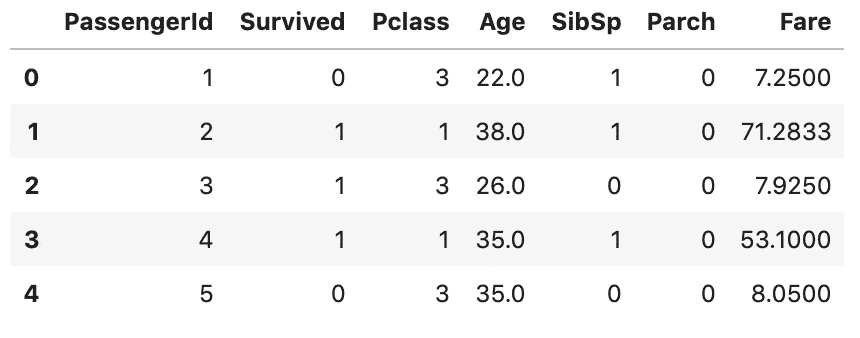
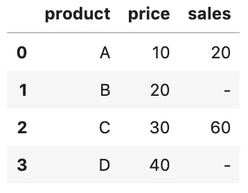
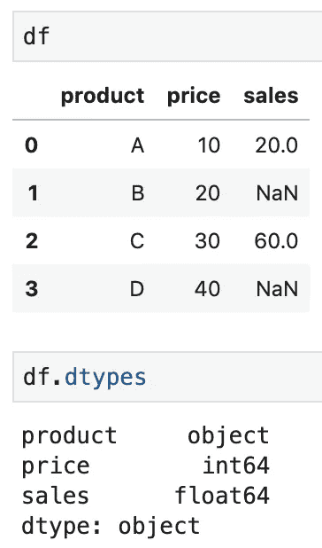
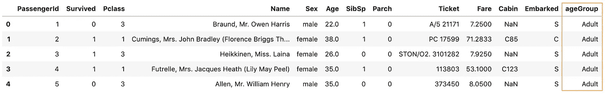
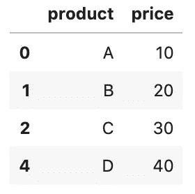
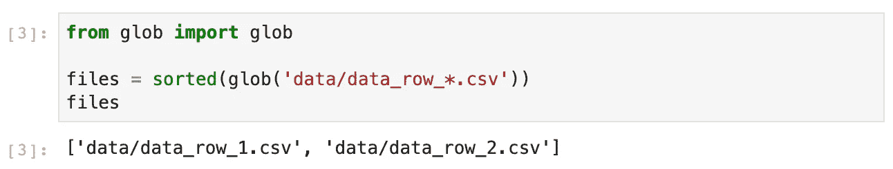
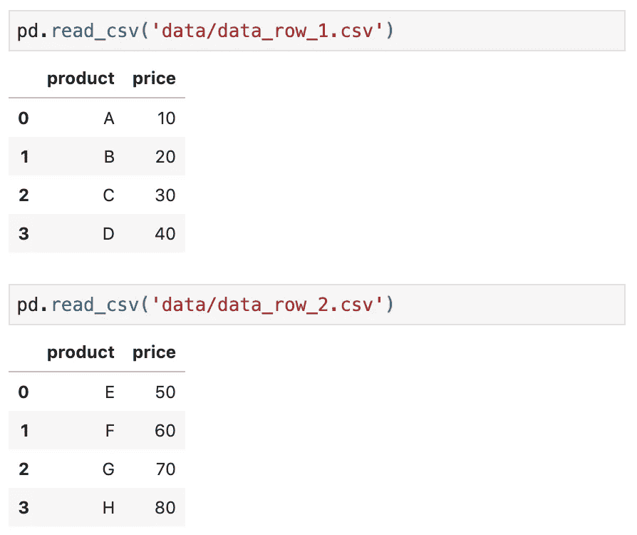
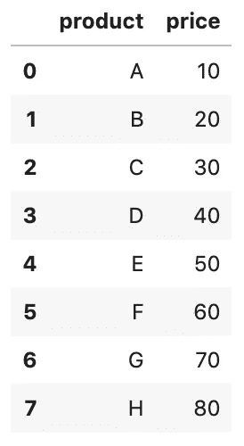
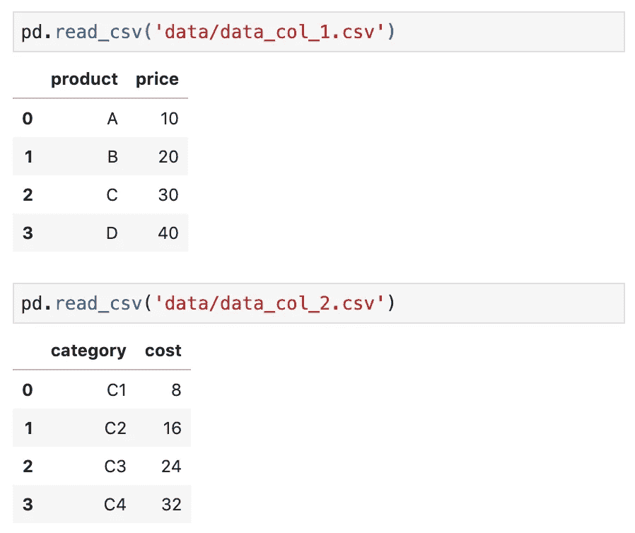
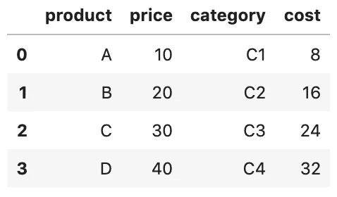

# 你应该知道的 6 个熊猫技巧来加速你的数据分析

> 原文：<https://towardsdatascience.com/6-pandas-tricks-you-should-know-to-speed-up-your-data-analysis-d3dec7c29e5?source=collection_archive---------10----------------------->

## 一些最有用的熊猫把戏


阿尔瓦罗·雷耶斯在 [Unsplash](https://unsplash.com/s/photos/programming-python?utm_source=unsplash&utm_medium=referral&utm_content=creditCopyText) 上拍摄的照片

在这篇文章中，你将学习一些最有用的熊猫技巧来加速你的数据分析。

1.  按数据类型选择列
2.  将字符串转换为数字
3.  检测和处理缺失值
4.  将连续数字特征转换为分类特征
5.  从剪贴板创建数据帧
6.  从多个文件构建数据框架

源代码请查看我的 [Github repo](https://github.com/BindiChen/machine-learning/blob/master/data-analysis/005-6-pandas-tricks/6-pandas-tricks.ipynb) 。

# 1.按数据类型选择列

以下是泰坦尼克号数据帧的数据类型

```
df.dtypesPassengerId      int64
Survived         int64
Pclass           int64
Name            object
Sex             object
Age            float64
SibSp            int64
Parch            int64
Ticket          object
Fare           float64
Cabin           object
Embarked        object
dtype: object
```

假设您需要选择数字列。

```
df.select_dtypes(**include='number'**).head()
```



这包括 int 和 float 列。您还可以使用此方法来

*   仅选择对象列
*   选择多种数据类型
*   排除某些数据类型

```
# select just object columns
df.select_dtypes(**include='object'**)# select multiple data types
df.select_dtypes(**include=['int', 'datetime', 'object']**)# exclude certain data types
df.select_dtypes(**exclude='int'**)
```

# 2.将字符串转换为数字

在 Pandas 中有两种方法将字符串转换成数字:

*   `astype()`法
*   `to_numeric()`方法

让我们创建一个示例数据帧来看看区别。

```
df = pd.DataFrame({ 'product': ['A','B','C','D'], 
                   'price': ['10','20','30','40'],
                   'sales': ['20','-','60','-']
                  })
```



***价格*** 和 ***销售*** 列存储为字符串，因此产生对象列:

```
df.dtypesproduct    object
**price      object
sales      object**
dtype: object
```

我们可以使用第一种方法`astype()`对 ***价格*** 列进行如下转换

```
# Use Python type
df['price'] = df['price']**.astype(int)**# alternatively, pass { col: dtype }
df = df.**astype({'price': 'int'})**
```

但是，如果我们试图在 ***sales*** 列中使用它，就会导致错误。为了解决这个问题，我们可以使用带有参数`errors='coerce'`的`to_numeric()`

```
df['sales'] = **pd.to_numeric(df['sales'], errors='coerce')**
```

现在，无效值`-`被转换为`NaN`，数据类型为 **float** 。



# 3.检测和处理缺失值

检测缺失值的一种方法是使用`info()`方法并查看列 ***非空计数*** 。

```
df.info()RangeIndex: **891 entries**, 0 to 890
Data columns (total 12 columns):
 #   Column       Non-Null Count  Dtype  
---  ------       --------------  -----  
 0   PassengerId  891 non-null    int64  
 1   Survived     891 non-null    int64  
 2   Pclass       891 non-null    int64  
 3   Name         891 non-null    object 
 4   Sex          891 non-null    object 
 **5   Age          714 non-null**    float64
 6   SibSp        891 non-null    int64  
 7   Parch        891 non-null    int64  
 8   Ticket       891 non-null    object 
 9   Fare         891 non-null    float64
 **10  Cabin        204 non-null**    object 
 **11  Embarked     889 non-null**    object 
dtypes: float64(2), int64(5), object(5)
memory usage: 83.7+ KB
```

当数据集很大时，我们可以计算缺失值的数量。`df.isnull().sum()`返回每列缺失值的数量

```
df.**isnull().sum()**PassengerId      0
Survived         0
Pclass           0
Name             0
Sex              0
Age            177
SibSp            0
Parch            0
Ticket           0
Fare             0
Cabin          687
Embarked         2
dtype: int64
```

`df.isnull().sum().sum()`返回缺失值的总数。

```
df.**isnull().sum().sum()**886
```

此外，我们还可以通过运行`df.isna().mean()`找出缺失值的百分比

```
ufo.isna().mean()PassengerId    0.000000
Survived       0.000000
Pclass         0.000000
Name           0.000000
Sex            0.000000
Age            0.198653
SibSp          0.000000
Parch          0.000000
Ticket         0.000000
Fare           0.000000
Cabin          0.771044
Embarked       0.002245
dtype: float64
```

## 删除丢失的值

如果存在任何 NaN 值，则删除行

```
df.dropna(**axis = 0**)
```

如果存在任何 NaN 值，则删除列

```
df.dropna(**axis = 1**)
```

删除缺少 10%以上值的列

```
df.dropna(**thresh=len(df)*0.9**, **axis=1**)
```

## 替换丢失的值

用标量替换所有 NaN 值

```
df.fillna(**value=10**)
```

用前一行中的值替换 NaN 值。

```
df.fillna(**axis=0**, **method='ffill'**)
```

用前一列中的值替换 NaN 值。

```
df.fillna(**axis=1**, **method='ffill'**)
```

同样，您也可以用下一行或下一列中的值替换 NaN 值。

```
# Replace with the values in the next row
df.fillna(**axis=0**, **method='bfill'**)# Replace with the values in the next column
df.fillna(**axis=1**, **method='bfill'**)
```

另一种常见的替换是用平均值替换 NaN 值。例如，用平均值替换列 Age 中的 NaN 值。

```
df[**'Age'**].fillna(value=**df['Age'].mean()**, inplace=True)
```

有关 Pandas 中缺失值的更多信息，请查看使用 Pandas 中缺失值的。

# 4.将连续数字特征转换为分类特征

在数据准备的步骤中，组合或转换现有要素以创建更有用的要素是很常见的。最流行的方法之一是从连续的数字特征创建分类特征。

让我们看看泰坦尼克号数据集中的 ***年龄*** 列

```
df['Age'].head(8)0    22.0
1    38.0
2    26.0
3    35.0
4    35.0
5     NaN
6    54.0
7     2.0
Name: Age, dtype: float64
```

***年龄*** 是一个连续的数字属性，但是如果要将其转换为分类属性，比如将年龄转换为年龄范围的组:≤12，青少年(≤18)，成年(≤60)，老年(> 60)怎么办

最好的方法是使用 Pandas `cut()`功能:

```
import sysdf['ageGroup']=pd.cut(
    **df['Age'],** 
    **bins=[0, 13, 19, 61, sys.maxsize],** 
    **labels=['<12', 'Teen', 'Adult', 'Older']**
)
```



并且在 ***年龄组*** 栏上调用`head()`也应该显示该栏信息。

```
df['ageGroup'].head(8)0    Adult
1    Adult
2    Adult
3    Adult
4    Adult
5      NaN
6    Adult
7      <12
**Name: ageGroup, dtype: category**
**Categories (4, object): [<12 < Teen < Adult < Older]**
```

# 5.从剪贴板创建数据帧

Pandas `read_clipboard()`函数是一种非常方便的方法，可以尽快将数据转换成数据帧。

假设我们有以下数据，并希望根据这些数据创建一个数据框:

```
 product   price
0    A         10
1    B         20
2    C         30
4    D         40
```

我们只需要选择数据并将其复制到剪贴板。然后，我们可以使用函数将它读入数据帧。

```
df = **pd.read_clipboard()**
df
```



# 6.从多个文件构建数据框架

数据集可能分布在多个文件中，但您希望将数据集读入单个数据帧中。

一种方法是将每个文件读入其自己的数据帧，将它们组合在一起，然后删除原始的数据帧，但这将是内存低效的。

更好的解决方案是使用内置的`glob`模块(感谢[数据学校熊猫诡计](https://www.youtube.com/watch?list=PL5-da3qGB5ICCsgW1MxlZ0Hq8LL5U3u9y&time_continue=821&v=RlIiVeig3hc&feature=emb_logo))。



在这种情况下，`glob()`在*数据*目录中查找以单词“ **data_row_** ”开头的所有 CSV 文件。`glob()`以任意顺序返回文件名，这就是为什么我们使用`sort()`函数对列表进行排序。

## 对于行方式的数据

假设我们的数据集按行分布在两个文件中，***data _ row _ 1 . CSV***和***data _ row _ 2 . CSV***



从这两个文件创建一个数据帧。

```
files = sorted(glob('**data/data_row_*.csv**'))
pd.concat((pd.read_csv(file) for file in files), **ignore_index=True**)
```

`sorted(glob('**data/data_row_*.csv'**))`返回文件名。之后，我们使用`read_csv()`读取每个文件，并将结果传递给`concat()`函数，该函数将这些行连接成一个数据帧。此外，为了避免索引中的重复值，我们告诉`concat()`忽略索引(`**ignore_index=True**`)，而使用默认的整数索引。



## 对于按列排列的数据

假设我们的数据集以列方式分布在两个文件中，***data _ col _ 1 . CSV***和***data _ col _ 2 . CSV***。



从这两个文件创建一个数据帧。

```
files = sorted(glob('data/data_col_*.csv'))
pd.concat((pd.read_csv(file) for file in files), **axis=1**)
```

这一次，我们告诉`concat()`函数沿着列轴连接。



# 好了

感谢阅读。

请在我的 Github 上查看[笔记本的源代码。](https://github.com/BindiChen/machine-learning)

如果你对机器学习的实用方面感兴趣，请继续关注。