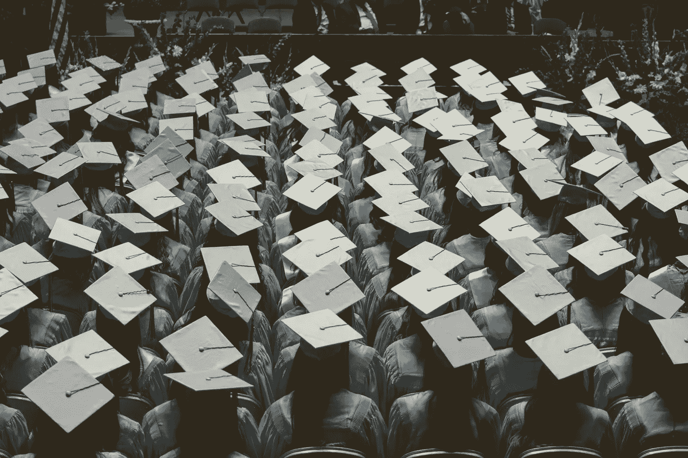

# 机器学习爱好者提出的 6 个问题

> 原文：<https://towardsdatascience.com/6-questions-asked-by-machine-learning-enthusiasts-d2931eabeeee?source=collection_archive---------29----------------------->

## 我提供的答案

在我的人工智能学习之旅的开始，我希望我有一些导师可以指引我正确的方向。

我在学习机器学习的方法上需要指导，尤其是当我购买的第一本学习机器学习的书是一个相当强大的敌人的时候。

两年时间和大量的 model.fit()之后，我现在是一名专业的 ML/计算机视觉工程师。

开始人工智能之旅或只是寻求建议的个人可以通过 LinkedIn 联系我并提出问题。我知道尝试在人工智能的世界中导航有多难，所以我总是尽力回答通过 LinkedIn 或电子邮件发给我的所有问题。

## 这篇文章包含六个机器学习相关的问题，涵盖了机器学习的学术、职业和技术方面。

也许你想问一些问题。看看下面的问题，也许你会找到一些指导。

如果我提供的答案没有一个对你有用，那么向下滚动到结论部分，找出如何直接问我你的问题。

由 [Unsplash 上的](https://unsplash.com/s/photos/coder?utm_source=unsplash&utm_medium=referral&utm_content=creditCopyText)制作者 [NESA 拍摄](https://unsplash.com/@nesabymakers?utm_source=unsplash&utm_medium=referral&utm_content=creditCopyText)

说到这里，让我们开始吧。

# 学术问题

Joshua Hoehne 在 [Unsplash](https://unsplash.com/s/photos/graduation?utm_source=unsplash&utm_medium=referral&utm_content=creditCopyText) 上拍摄的照片

## **问题#1** :

**你会推荐数据科学硕士(大多数大学都提供)或某个专业领域的硕士吗？请从各自领域工作机会的角度给出建议。**

## **回答**:

如果你确信自己只对数据科学领域的就业机会感兴趣，我建议你获得数据科学硕士学位。

尽管当前的疫情和一些行业正在经历的困难，对数据科学家的需求似乎仍然很高。

与此同时，数据科学家的供应也在增加，这意味着更多的角色竞争。

处于行业顶端的杰出数据科学家能够非常迅速地找到角色。

然而，如果你知道自己的兴趣和热情所在，你可能会想在更专业的领域攻读硕士学位。

如果你对计算机视觉、自然语言处理或机器人等领域感兴趣，那么攻读更专业的理学硕士学位似乎是一个合理的选择。

由于它们更具技术性和专业性，当比较数据科学领域的职位时，工作职位的竞争可能不会那么激烈。

另一个关键点是，你从计算机视觉或 NLP 专业学位获得的一些技能可以转移到一般的数据科学职位上。因此，你可以拥有计算机视觉等技术领域的硕士学位，同时还拥有数据科学家的相关技能。

以我为例，即使我学习了机器学习和计算机视觉的硕士学位，我仍然拥有申请数据科学工作所必需的技能。

在我得到计算机视觉工程师的工作之前，我的前几次面试是为了数据科学的职位。

## **问题 2:**

**学习自主领域有哪些相关课程和见解？**

## 回答:

我在自主领域的经验和知识非常有限。

尽管如此，我还是会提供一些我通过网上研究和直觉找到的有用信息。

自主领域将与自主车辆和机器人相一致。自动驾驶汽车的主要领域将是传感器和基于视觉的方法，自动驾驶汽车使用这些方法来获得对环境的感知和理解。

自动驾驶汽车研究的其他领域是导航系统和地图规划。

因此，以下是一些需要考虑进一步探索的领域:

*   自动驾驶汽车中的深度学习
*   自主车辆和机器人中的激光雷达传感器
*   机器人或车辆中的导航和路径规划。

作为起点，看一看这个[课程](https://www.edx.org/course/autonomous-mobile-robots)，看看它是否符合你的学习要求。

自主机器人和车辆在人类的技术未来中占有一席之地。

看看挤满了自主机器人的亚马逊仓库。在未来 5-10 年内，一些运输系统将采用自动导航机器人。

特斯拉最近刚刚发布了他们全自动驾驶系统的测试版，甚至计划将其扩展到更多的城市。

我住在英国，我看到一些公司在繁忙的城市地区测试送货机器人。

# 职业问题

安妮·斯普拉特在 [Unsplash](https://unsplash.com/s/photos/working?utm_source=unsplash&utm_medium=referral&utm_content=creditCopyText) 上的照片

## 问题 3:

**你能告诉我申请深度学习/计算机视觉工程师的工作需要什么条件吗？**

## 回答:

大多数 ML/CV 工程角色需要精通至少两种编程语言的人，而 Python 是业界最受欢迎的。

此外，使用云计算服务提供商的经验，如 [GCP](https://cloud.google.com/) 、 [AWS](https://aws.amazon.com/) 、 [Azure](https://azure.microsoft.com/en-gb/overview/what-is-azure/) 也很受欢迎，但他们往往是一个可取的要求。

拥有使用 PyTorch、TensorFlow 或 Keras 等机器学习库的经验是大多数(如果不是全部)ML 工程师职位广告的标准要求。

**以下是深度学习/计算机视觉角色的一般要求:**

*   编程语言知识(Python，JavaScript，Java，C 等。).
*   软件工程经验。
*   了解深度学习架构，如 CNN、RNN 和 DNN。
*   使用 PyTorch、Keras 或 TensorFlow 等机器学习库的经验。
*   拥有 GCP 和 AWS 等云服务的经验。
*   经验建设应用程序，以解决常见的计算机视觉任务，如对象检测，姿态估计，人脸检测等。

# 技术问题

布莱克·康纳利在 [Unsplash](https://unsplash.com/s/photos/code?utm_source=unsplash&utm_medium=referral&utm_content=creditCopyText) 上拍摄的照片

## 问题 4:

人工智能目前对视频的分析有多好，人工智能视频分析的未来是什么样的？

## 回答:

直接回答你的问题，深度学习技术一般可以很好地分析视频。

深度学习技术已经足够好，能够描述视频的内容和背景。

例如，人工智能非常擅长在连续的视频帧中跟踪多个个体，还可以对视频进行面部识别，而人类可能甚至无法做到这一点。

姿势估计的深度学习解决方案能够从视频数据中实时检测人体关节的位置。

人工智能视频分析的前景非常光明。在未来，我们可能会看到视频分析应用于大多数形式的现场娱乐，如足球比赛、流媒体音乐会等等。

对我来说，这似乎是合乎逻辑的一步。

描绘一个场景，目前，当我们看足球或任何运动时，我们听人类评论员。我相信在未来的十年或二十年内，我们会看到人工智能评论员的出现。

看看这个[视频](https://www.youtube.com/watch?v=YCur6ir6wmw&ab_channel=TwoMinutePapers)总结了分析真人打网球视频的研究工作，然后生成令人印象深刻的网球比赛游戏。

## 问题 5:

**在计算机视觉和人工智能领域，线性代数和微积分有多重要？作为一名初学者，我应该在这些数学分支领域中涵盖哪些主题？**

## 回答:

从学术角度来看，理解线性代数对于深入了解计算机视觉和深度学习中的特定主题至关重要。

在深度学习和卷积神经网络出现之前，许多计算机视觉技术利用了大量严重依赖数学的启发式直觉和算法。

一个简单的例子是使用数学函数将图像数据从一种状态转换到另一种状态的典型转换或增强算法。

如果我们转向计算机视觉中更高级的主题，如深度学习，那么理解微积分对于理解神经网络如何学习的一些基本概念是必不可少的。

反向传播和优化算法的主题是基于数学的。

从学术角度来看，理解与机器学习相关的所有数学领域将为你的研究提供优势。

## 问题 6:

你是否利用了许多预先训练好的模型/库，等等。？

## 回答

在专业环境中，你倾向于利用许多预先训练好的模型。

简单来说，你很少会从零开始开发算法或神经网络(除非你在 ML research 工作)。

[迁移学习](https://en.wikipedia.org/wiki/Transfer_learning#:~:text=Transfer%20learning%20(TL)%20is%20a,when%20trying%20to%20recognize%20trucks.)和[微调](https://en.wikipedia.org/wiki/Fine-tuning#:~:text=In%20theoretical%20physics%2C%20fine%2Dtuning,to%20fit%20with%20certain%20observations.)是应用 AI 和实用机器学习相当可观的方面。

在看实用的 AI 时，更强调软件工程和 ML 模型集成。

库方面， [TensorFlow](https://www.tensorflow.org/) 在实际用例中使用，特别是配合 [TFlite 库](https://www.tensorflow.org/lite/api_docs)。TensorFlow Lite 专注于边缘设备上的 ML 配置。PyTorch 和 Keras 也是行业标准。

不太需要开发新的算法或技术来解决已经解决的问题。

一些标准的机器学习库已经有性能良好的 ML 和深度学习架构方法和类可用。

# 结论

作为一名学者或专业人士，试图掌握人工智能是相当具有挑战性的。

对我们来说幸运的是，一般的人工智能和数据科学社区在某种程度上是有帮助的，并且愿意帮助那些刚开始使用 CUDA 或者似乎无法修复 CUDA 内存不足错误的人！

**如果本文包含的问题没有一个适用于你，或者你想问我更多与机器学习相关的问题，那么请在本文的评论部分随意提问。**

我会尽我所能回应。或者其他读者可能有你想问的问题的答案。

正如我所说的，我们有一个反应灵敏、乐于助人的人工智能社区。

# 我希望这篇文章对你有用。

要联系我或找到更多类似本文的内容，请执行以下操作:

1.  订阅我的 [**邮件列表**](https://richmond-alake.ck.page/c8e63294ee) 获取每周简讯
2.  跟着我上 [**中**](https://medium.com/@richmond.alake)
3.  通过 [**LinkedIn**](https://www.linkedin.com/in/richmondalake/) 联系我

 [## 我如何使用智能手表传感器来防止面部触摸

### 一个值得追求的想法？

towardsdatascience.com](/how-im-using-smartwatch-sensors-to-limit-covid-19-infection-51abe04f81f9)  [## 专注于技术深度学习的文章

### 发现解释卷积神经网络，算法，计算机视觉的内部工作的文章…

towardsdatascience.com](/technical-deep-learning-focused-articles-7ad3b0fe3b5a)