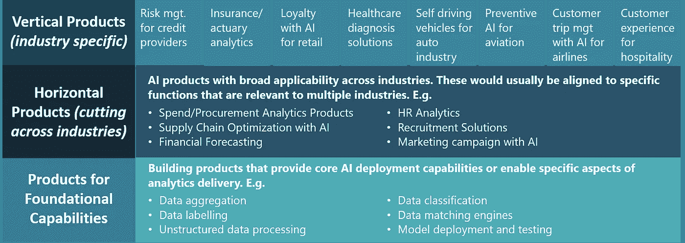

# 加入人工智能创业公司之前，你需要问的 6 个问题

> 原文：<https://towardsdatascience.com/6-questions-you-need-to-ask-before-joining-an-ai-startup-44ac1a8d3dc4?source=collection_archive---------38----------------------->

## 意见

## 评估人工智能工作真正由一家初创公司完成的程度

克拉克·斯坦利(来源:维基共享)

克拉克·斯坦利，也被称为“响尾蛇之王”，是 19 世纪末的一位著名企业家。斯坦利从牛仔变成了医生，他是第一个开始销售“蛇油”作为治疗多种疾病的灵丹妙药的商人。在芝加哥一次研讨会上的一次臭名昭著的演示中，斯坦利拿了一条活响尾蛇，把它切开，放入沸水中，撇去浮在表面的脂肪，以显示他的蛇油的真实性。公众欣然接受。他的蛇油大受欢迎。

但是有一些问题。大的。

1)史丹利的蛇油并没有做到它宣称的那样。它没有声称的治疗疾病的功效。

2)此外，与所有营销噱头一样，你看到的并不总是你得到的。在卖了 20 多年“斯坦利的蛇油”后，当局终于检查了他的神奇药水。他们在里面发现了矿物油、牛肉脂肪、辣椒和松节油！没有发现任何蛇油的迹象。

这场欺诈是斯坦利精心策划的，持续时间如此之长，以至于直到今天,“蛇油推销员”这个委婉的说法都是指欺诈性的推销和与事实相去甚远的说法。

那么为什么我在 AI 的背景下谈论蛇油推销员呢？

> 有人说过一句名言，“数据是新的石油”。确实如此。但你知道新的“蛇油”是什么吗？人工智能！

请允许我解释。今天，无论你看向哪里，都有人在做某事(或许多事！)用人工智能。AI 无处不在。到处都是。虽然在很多方面都是如此——我们确实在生活的很多很多方面使用人工智能——但问题在于这个术语的解释有多松散。就像闪光的不都是金子，计算机做的一切都不是人工智能。非常简单地说，人工智能指的是机器变得智能，以复制人类的行动和/或决策来实现既定目标。*(更多详情还可以在这里* *)阅读我关于解码 AI* [*的文章。*](/decoding-ai-47b3e6840f9d)

这种欺骗性的人工智能主导的营销对初创公司生态系统的影响是深远的。

全球各地的初创公司都在吹捧许多事情是由人工智能驱动的，但实际上几乎没有真正的人工智能。由于大多数人几乎不理解人工智能到底是什么，他们没有自己的过错，他们陷入了所有的噱头。2019 年进行的一项[调查](https://www.cnbc.com/2019/03/06/40-percent-of-ai-start-ups-in-europe-not-related-to-ai-mmc-report.html)发现，在欧洲近 2900 家人工智能初创公司中，有 40%没有以任何实质性的形式使用人工智能。

人工智能和机器学习等术语已经成为全球风投的诱饵，这一事实无助于这项事业。投资者排队购买任何远称人工智能邻近的东西。事实上，上面引用的同一项调查得出结论，声称从事人工智能工作的初创公司比其他软件公司吸引的资金多 15%至 50%。因此，初创公司有一个几乎合理的理由试图不择手段地在人工智能生态系统中定位自己。

如果有一个利益相关者群体为初创公司快速松散地使用人工智能术语付出了沉重的代价，那就是潜在的员工。有成千上万的年轻专业人士，有些刚刚大学毕业，正在寻找在新兴的数据科学和人工智能领域工作的梦想。他们被打造下一个人工智能独角兽的承诺以及获得解决最前沿分析问题的机会所吸引。然而现实可能与此相去甚远，这将导致全面的失望和遗憾。员工感觉被欺骗了，公司不得不处理高员工流动率的问题，这需要知识转移，甚至重新启动开发工作(这总是一个昂贵的提议！).

因此，作为一家人工智能创业公司的潜在员工，你必须提出正确的问题，并评估该公司正在做或计划做的事情的深度。作为一家人工智能或人工智能初创公司的创始人，你最好提前告诉潜在的团队成员，数据科学团队应该做什么。

在过去 15 年多的时间里，我一直在数据科学、人工智能和机器学习领域工作，我遇到了许多幻想破灭的年轻人，他们以为自己注册了一份光荣的职业，但却发现他们的大部分时间都花在了清理或标记数据集上。以下是我一直建议他们在面试人工智能初创公司的工作时应该问的问题。这不仅有助于潜在员工更好地理解他/她正在从事的工作，也向创始人表明你理解其中的细微差别。

## 1.服务还是产品？

这是一个重要的区别。一个人在人工智能服务公司所做的工作将与在产品公司非常不同。虽然服务通常会提供更多的多样性，但是构建一个产品会更深入。

## 2.如果是服务，那么是什么样的服务？

在大多数情况下，服务工作类似于咨询，即向客户提供人工智能解决方案或模型，以解决特定的问题陈述。因此，重要的是要问清楚，初创公司为其客户处理的是什么样的问题陈述？问题陈述是否有很大的差异，或者它们是否有一个定义明确的集合？

此外，您希望参与服务交付的哪一部分—数据聚合/清理、模型构建、手动训练集创建等。？重要的是要意识到*总会有*繁重的工作要做，但是要对实际模型开发、技术研究等所花费的时间比例有所了解。总是有帮助的。

## 3.如果是产品，那么是什么样的产品？

绝大多数人工智能初创公司都会落入产品类别。但并不是所有的产品都一样。能够更多地了解初创公司正在构建的产品类型，可以提供对可能涉及的数据科学或机器学习工作的深入了解。下面是创业公司通常会涉及的产品类型的大致指南。

图 1:人工智能产品类型

一旦你理解了正在构建的人工智能产品的类型，深入挖掘，找出你将参与产品开发的哪个具体方面？理解中长期产品愿景也很有帮助——初创公司的创始人通常会(希望如此！)对他们如何设想他们的产品的发展有一个公平的想法。

## 4.正在使用的技术堆栈是什么？

这个问题很重要，原因有二。首先，它将帮助你对产品愿景有所了解。其次，如果你加入这家公司，它还会帮助你评估是否有你可能需要学习或温习的特定技能或语言。

## 5.他们通常会使用什么类型的数据来构建和测试模型？

这个问题之所以重要，是因为它有助于区分小麦和谷壳。深度致力于人工智能优先战略的初创公司将非常了解他们用于产品开发的数据。例如，一家公司希望开发一种产品，该产品使用计算机视觉技术，让机器通过分析 ct 扫描图像来预测癌症的发生，该公司需要访问大型图像库来训练和建立模型。

如果你得到了这个问题的可靠答案，你通常可以放心，这家初创公司的基础相对来说是比较牢固的。

## 6.创始团队的背景？

你可能不需要明确地问这个问题，相反，你可以自己做研究来找出答案。这个问题很重要，因为人工智能在很大程度上是一个技术领域。这也是一个动态的、快速发展的领域。拥有人工智能领域经验的创始人(或创始团队的一部分)对于确保更高的成功概率至关重要，因为他们非常了解挑战，能够指导团队，引导初创公司朝着正确的方向发展。

人工智能和数据科学领域无疑是当今最令人兴奋的领域之一。我们集体刚刚开始触及一切可能的表面——视野是无限的。人工智能的扩散将对世界产生的影响，预计将比工业革命更具戏剧性。

因此，任何足够早进入这个领域的人，随着这个领域的进一步发展，都会有巨大的机会。做出明智的选择，做出明智的选择。当全球各地存在无数真实而令人兴奋的创业机会时，不要陷入白日梦。