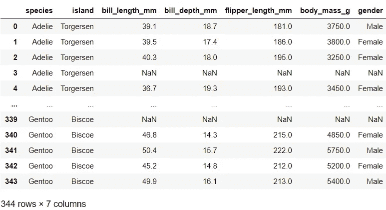
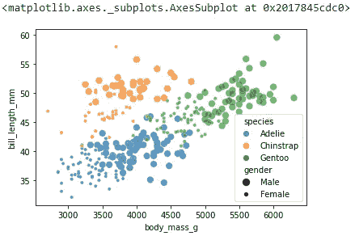
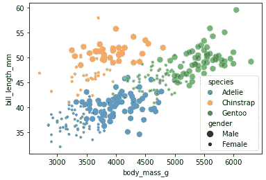
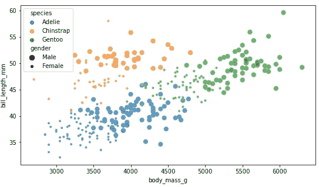
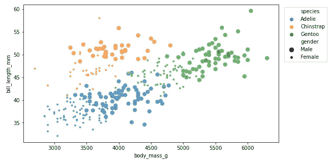
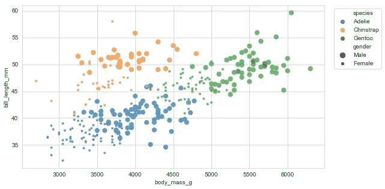
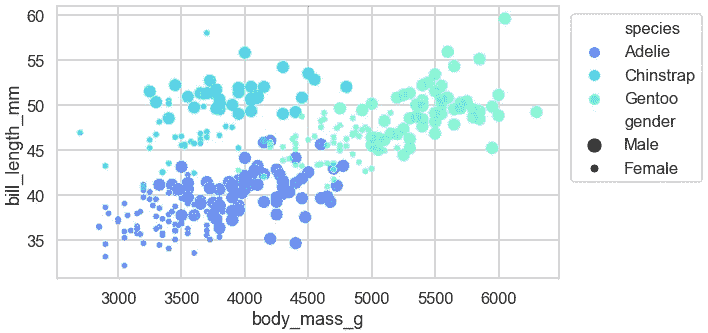
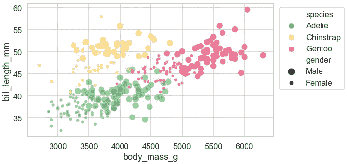
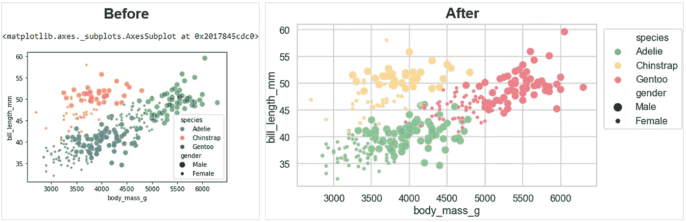

# Seaborn (Python)中更漂亮和定制的情节的 6 个简单技巧

> 原文：<https://towardsdatascience.com/6-simple-tips-for-prettier-and-customised-plots-in-seaborn-python-22f02ecc2393?source=collection_archive---------8----------------------->

## 数据可视化

## 初学者指南，轻松个性化您的情节

在本帖中，我们将看看一些简单的方法来定制你的情节，使它们在美学上更令人愉悦。希望这些简单的小技巧能帮你得到更好看的剧情，节省你调整个别剧情的时间。


由 [Kelli Tungay](https://unsplash.com/@kellitungay?utm_source=medium&utm_medium=referral) 在 [Unsplash](https://unsplash.com?utm_source=medium&utm_medium=referral) 上拍摄的照片

# 基线图📊

*本帖中的脚本是在 Jupyter Notebook 的 Python 3.8.3 中测试的。*

让我们使用 Seaborn 内置的企鹅数据集作为样本数据:

```
# Import packages
import matplotlib.pyplot as plt
import seaborn as sns# Import data
df = sns.load_dataset('penguins').rename(columns={'sex': 'gender'})
df
```



我们将使用默认图表设置构建一个标准散点图，并将其用作基线:

```
# Plot
sns.scatterplot(data=df, x='body_mass_g', y='bill_length_mm', 
                alpha=0.7, hue='species', size='gender')
```



我们将会看到这个情节是如何随着每个提示而改变的。

# 技巧🌟

您将看到前两个提示是针对单个图的，而剩下的四个提示是针对所有图表的默认设置的。

## 📍技巧 1:分号

您注意到上一个图中图表正上方的文本输出了吗？抑制该文本输出的一个简单方法是在绘图结束时使用`;`。

```
# Plot
sns.scatterplot(data=df, x='body_mass_g', y='bill_length_mm', 
                alpha=0.7, hue='species', size='gender');
```



通过在代码末尾添加`;`,我们得到了更清晰的输出。

## 📍技巧 2: plt.figure()

调整大小通常有利于绘图。如果我们想调整大小，我们可以这样做:

```
# Plot
plt.figure(figsize=(9, 5))
sns.scatterplot(data=df, x='body_mass_g', y='bill_length_mm', 
                alpha=0.7, hue='species', size='gender');
```



当我们调整大小时，图例移到了左上角。让我们将图例移到图表之外，这样它就不会意外覆盖数据点:

```
# Plot
plt.figure(figsize=(9, 5))
sns.scatterplot(data=df, x='body_mass_g', y='bill_length_mm', 
                alpha=0.7, hue='species', size='gender')
plt.legend(loc='upper right', bbox_to_anchor=(1.2, 1));
```



如果你想知道如何知道对`figsize()`或`bbox_to_anchor()`使用什么数字组合，你需要反复试验哪个数字最适合这个图。

## 📍技巧 3: sns.set_style()

如果我们不喜欢默认样式，此功能有助于更改绘图的整体样式。这包括轴线颜色和背景的美感。让我们将样式更改为*白色网格*并查看绘图外观如何变化:

```
# Change default style
sns.set_style('whitegrid')# Plot
plt.figure(figsize=(9, 5))
sns.scatterplot(data=df, x='body_mass_g', y='bill_length_mm', 
                alpha=0.7, hue='species', size='gender')
plt.legend(loc='upper right', bbox_to_anchor=(1.2, 1));
```



这里有更多的其他选项可以尝试:`'darkgrid'`、`'dark'`和`'ticks'`来找到你更喜欢的一个。

## 📍技巧 4: sns.set_context()

在前面的图中，标签尺寸看起来很小。使用`sns.set_context()`，如果我们不喜欢默认设置，我们可以更改上下文参数。我使用这个函数主要是为了控制图中标签的默认字体大小。通过更改默认值，我们可以节省时间，因为不必为各个图的不同元素(如轴标签、标题、图例)调整字体大小。我们把上下文换成`'talk'`再看剧情:

```
# Change default context
sns.set_context('talk')# Plot
plt.figure(figsize=(9, 5))
sns.scatterplot(data=df, x='body_mass_g', y='bill_length_mm', 
                alpha=0.7, hue='species', size='gender')
plt.legend(loc='upper right', bbox_to_anchor=(1.3, 1));
```


它更容易辨认，不是吗？另一个可以尝试的选项是:`'poster'`，这将进一步增加默认大小。

## 📍技巧 5: sns.set_palette()

如果你想将默认调色板定制成你喜欢的颜色组合，这个功能很方便。我们可以使用 Matplotlib 中的颜色图。[这里](https://matplotlib.org/tutorials/colors/colormaps.html)是可供选择的 Matplotlib 颜色图列表。我们把调色盘换成`'rainbow'`再看剧情:

```
# Change default palette
sns.set_palette('rainbow')# Plot
plt.figure(figsize=(9, 5))
sns.scatterplot(data=df, x='body_mass_g', y='bill_length_mm', 
                alpha=0.7, hue='species', size='gender')
plt.legend(loc='upper right', bbox_to_anchor=(1.3, 1));
```



如果你找不到你喜欢的 Matplotlib 颜色图，你可以手工选择颜色来创建你自己独特的调色板。🎨创建自己调色板的一种方法是将颜色名称列表传递给函数，如下例所示。[这里](https://matplotlib.org/3.1.0/gallery/color/named_colors.html)是颜色名称列表。

```
# Change default palette
sns.set_palette(['green', 'purple', 'red'])# Plot
plt.figure(figsize=(9, 5))
sns.scatterplot(data=df, x='body_mass_g', y='bill_length_mm', 
                alpha=0.7, hue='species', size='gender')
plt.legend(loc='upper right', bbox_to_anchor=(1.3, 1));
```


如果颜色名称不能很好地表达您的需求，您可以使用十六进制颜色构建自己的调色板，以获得更广泛的选项(超过 1600 万种颜色！).这里是我最喜欢的查找十六进制自定义调色板的资源。让我们看一个例子:

```
# Change default palette
sns.set_palette(['#62C370', '#FFD166', '#EF476F'])# Plot
plt.figure(figsize=(9, 5))
sns.scatterplot(data=df, x='body_mass_g', y='bill_length_mm', 
                alpha=0.7, hue='species', size='gender')
plt.legend(loc='upper right', bbox_to_anchor=(1.3, 1));
```



## 📍技巧 6: sns.set()

根据前面的三个技巧，我希望你能找到你最喜欢的组合(在某些情况下，可以保持默认设置不变)。如果我们要更新图表的默认设置，最好是在导入可视化软件包之后进行。这意味着我们在脚本的开头会有这样一个片段:

```
# Import packages
import matplotlib.pyplot as plt
import seaborn as sns# Change defaults
sns.set_style('whitegrid')
sns.set_context('talk')
sns.set_palette('rainbow')
```

使用`sns.set()`可以更简洁地更新多个默认值。下面是相同代码的简洁版本:

```
# Import packages
import matplotlib.pyplot as plt
import seaborn as sns# Change defaults
sns.set(style='whitegrid', context='talk', palette='rainbow')
```

Voila❕:这是六条建议。以下是调整前后的曲线图对比:



*您想访问更多这样的内容吗？媒体会员可以无限制地访问媒体上的任何文章。如果您使用* [*我的推荐链接*](https://zluvsand.medium.com/membership) ，*成为会员，您的一部分会费将直接用于支持我。*

我希望你学会了一些简单的方法来调整你的情节，而不必花太多时间。我希望这篇文章已经给了你一些开始个性化你的情节的想法，并使它们在视觉上更令人愉悦。如果你感兴趣，这里有我的一些帖子的链接:

◼️[python 中的探索性文本分析](/exploratory-text-analysis-in-python-8cf42b758d9e)
◼️️ [给熊猫用户的 5 个提示](/5-tips-for-pandas-users-e73681d16d17)
◼️️ [熊猫中数据聚合的 5 个提示](/writing-5-common-sql-queries-in-pandas-90b52f17ad76)
◼️️ [在熊猫中编写 5 个常用 SQL 查询](/writing-5-common-sql-queries-in-pandas-90b52f17ad76)
◼️️ [在熊猫中编写高级 SQL 查询](/writing-advanced-sql-queries-in-pandas-1dc494a17afe)

再见🏃💨