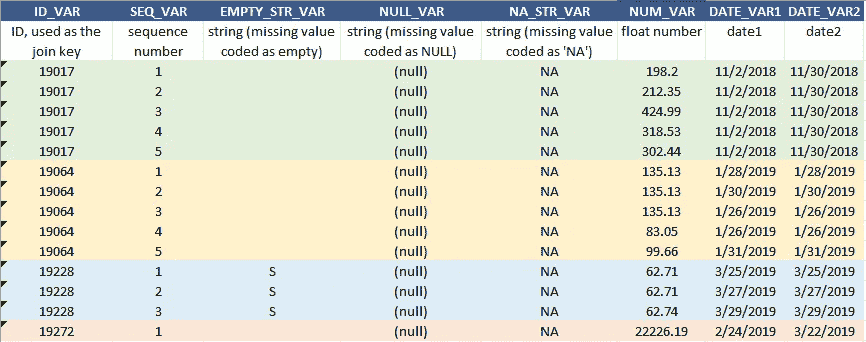
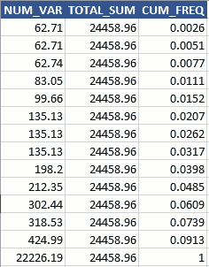
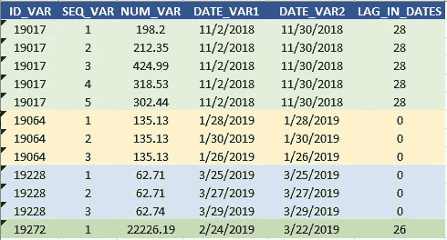
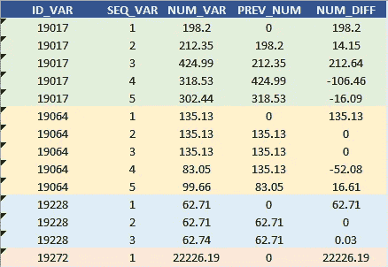

# 每个数据科学家都应该知道的 6 个 SQL 技巧

> 原文：<https://towardsdatascience.com/6-sql-tricks-every-data-scientist-should-know-f84be499aea5?source=collection_archive---------1----------------------->

## 提高分析效率的 SQL 技巧的第 1 部分

数据科学家/分析师应该了解 SQL，事实上，所有从事数据和分析工作的专业人士都应该了解 SQL。在某种程度上，SQL 是一种被低估的数据科学技能，因为它被认为是从数据库中提取数据的必要而不酷的方式，以提供给 pandas 和{tidyverse} —争论数据的更好的方式。


[照片来源](https://webflow-blog.periscopedata.com/blog/why-were-launching-r-and-python-support)

然而，随着行业中每天收集和产生大量数据，只要数据驻留在符合 SQL 的数据库中，SQL 仍然是帮助您调查、过滤和聚合以彻底了解您的数据的最熟练的工具。通过对 SQL 进行切分，分析人员可以识别出值得进一步研究的模式，这常常会导致重新定义分析群体和变量，使之比初始范围小得多。

因此，分析的第一步不是将庞大的数据集转移到 Python 或 R 中，而是使用 SQL 从我们的数据中获得信息性的见解。

在现实世界的关系数据库中，SQL 不仅仅是 SELECT、JOIN、ORDER BY 语句。在这篇博客中，我将讨论 6 个技巧(和一个额外的技巧),让你的 SQL 分析工作更有效，并与 Python 和 r 等其他编程语言集成。

在本练习中，我们将使用 Oracle SQL 处理下面的玩具数据表，该数据表包含多种类型的数据元素，



玩具数据表(带有变量定义)

1.  **COALESCE()记录空/缺失数据**

当谈到重新编码丢失的值时，COALESCE()函数是我们的秘密武器，在这种情况下，它将 NULL 值重新编码为第二个参数中指定的任何值。对于我们的例子，我们可以将 NULL_VAR 重新编码为一个字符值‘MISSING’，

这段代码片段返回，


COALESCE()记录空值

然而，一个重要的注意事项是，在数据库中， ***缺失值*** 可以用除 NULL 之外的各种方式编码。例如，它们可以是空字符串/空格(例如，我们表中的 EMPTY_STR_VAR)，或者字符串“NA”(例如，我们表中的 NA_STR_VAR)。在这些情况下，COALESCE()不起作用，但是可以用 CASE WHEN 语句来处理它们，

何时对空或 NA 重新编码


以下情况下的输出

******更新 2022:你也可以在我的频道这里看这个博客的视频版，***

**2。计算运行总频率和累计频率**

当我们对给定点的总和(而不是单个值)感兴趣时，运行总计对于潜在分析人群细分和异常值识别非常有用。

下面展示了如何计算变量 NUM_VAR 的累计和累计频率，



累积频率的输出

这是我们的输出(在左边)。

这里有两个技巧，(1)SUM over[ROWS UNBOUNDED previous](https://docs.oracle.com/cd/E11882_01/server.112/e41084/functions004.htm#SQLRF06174)将计算到该点的所有先前值的总和；(2)创建一个 JOIN_ID 来计算总和。

我们使用[窗口函数](https://en.wikipedia.org/wiki/SQL_window_function)进行计算，根据累积频率，不难发现最后一条记录是异常值。

**3。查找没有自连接的极值记录**

所以我们的任务是返回每个惟一 ID 的 NUM_VAR 值最大的行。直观的查询是首先使用 group by 找到每个 ID 的最大值，然后对 ID 和最大值进行自连接。然而一种更简洁的方式是，

具有最大值的记录

这个查询应该给出下面的输出，显示具有按 ID 分组的最大数量变量的行，


具有最大 NUM_VAR 值的记录输出

**4。条件 WHERE 子句**

大家都知道 SQL 中用于 subsetting 的 WHERE 子句。事实上，我发现自己更经常地使用条件 WHERE 子句。例如，对于玩具表，我们只想保持满足以下逻辑的行，

—如果 SEQ 变量 in (1，2，3) & diff(日期变量 2，日期变量 1)≥ 0

— elif SEQ 变量 in (4，5，6) & diff(日期变量 2，日期变量 1) ≥1

— else diff(DATE_VAR2，DATE_VAR1) ≥2

现在条件 WHERE 子句就派上用场了，

条件 where 子句



条件 where 子句的输出

前面提到的逻辑应该消除 ID = 19064 的序列 4，5，因为 date2 和 date1 之间的差= 0，这正是上面查询返回的结果。

**5。Lag()和 Lead()处理连续行**

Lag(查看前一行)和 Lead(查看下一行)可能是我日常工作中最常用的两个分析函数[。简而言之，这两个函数允许用户一次查询多行，而无需自连接。更详细的解释可以在](https://oracle-base.com/articles/misc/analytic-functions#using_analytic_functions)[这里](https://www.techonthenet.com/oracle/functions/lag.php)找到。

假设，我们想要计算两个连续行(按序列排序)之间的 NUM_VAR 差异，

LAG()函数返回前一行，如果没有(即每个 ID 的第一行)，PREV_NUM 被编码为 0，以计算如下所示的 NUM_DIFF 之差，



滞后的输出( )

**6。将 SQL 查询与 Python 和 R 集成**

将 SQL 查询集成到 Python 和 R 中的先决条件是通过 ODBC 或 JDBC 建立数据库连接。由于这超出了本博客的范围，我将不在这里讨论它，然而，关于如何(创建 ODBC 或 JDBC 连接)的更多细节可以在[这里](https://www.progress.com/blogs/complete-guide-to-r-for-datadirect-odbc-jdbc)找到。

现在，假设我们已经将 Python 和 R 连接到我们的数据库，那么在 Python 中使用 query 的最直接的方法就是将它复制并粘贴为一个字符串，然后调用 pandas.read_sql()，

```
my_query = "SELECT * FROM CURRENT_TABLE"
sql_data = pandas.read_sql(my_query, connection)
```

好吧，只要我们的查询是简短的，并且没有进一步的修改，这种方法工作得很好。但是，如果我们的查询有 1000 行，或者我们需要不断地更新它，该怎么办呢？对于这些场景，我们会希望阅读*。sql* 文件直接导入 Python 或者 R .下面演示如何用 Python 实现一个 getSQL 函数，R 中的思路也是一样的，

这里，第一个 arg sql_query 包含一个独立的*。容易维护的 sql* 文件，像这样，

“ID_LIST”是我们将要放入的值的占位符字符串，可以使用下面的代码调用 getSQL()。

**额外提示，SQL 中的正则表达式**

尽管我并不总是在 SQL 中使用正则表达式，但它有时对于文本提取来说很方便。例如，下面的代码展示了如何使用 REGEXP_INSTR()查找和提取数字的简单示例(更多细节请参见[，](https://www.techonthenet.com/oracle/functions/regexp_instr.php#:~:text=)

我希望这篇博客对你有所帮助，完整的代码和玩具数据集可以在我的 [github](https://github.com/YiLi225/SQL_Python_R) 中找到。😀

***想要更多数据科学和编程技巧？使用*** [***我的链接***](https://yilistats.medium.com/membership) ***注册 Medium，获得我所有内容的全部访问权限。***

***还订阅我新创建的 YouTube 频道*** [***【数据与 Kat 对话】***](https://www.youtube.com/channel/UCbGx9Om38Ywlqi0x8RljNdw)

*此外，请阅读本迷你系列的第 2 部分，了解更多 SQL 分析技巧。*

*[](/extra-4-sql-tricks-every-data-scientist-should-know-d3ed7cd7bc6c) [## 每个数据科学家都应该知道的额外 4 个 SQL 技巧

### 充分利用 SQL 加快您的分析工作

towardsdatascience.com](/extra-4-sql-tricks-every-data-scientist-should-know-d3ed7cd7bc6c)*